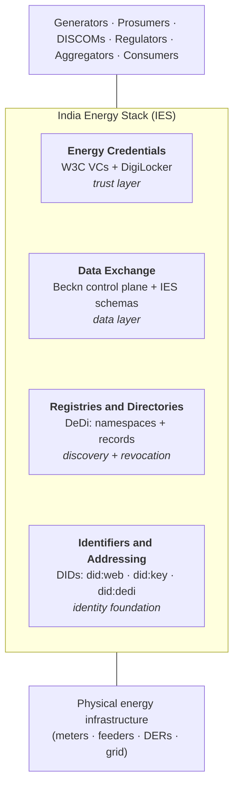

# India Energy Stack — Accelerator

**India Energy Stack (IES)** is an open digital infrastructure layer for India's power sector — protocols and shared registries that let [DISCOMs](glossary.md#discom), [AMISPs](glossary.md#amisp), regulators, and consumers exchange data and trust each other's claims, without anyone owning the network.

This **Accelerator** is the developer hub for building on it. Four core sections:

| Section | What it does |
|---|---|
| [IES Identifiers and Addressing](./identifiers/README.md) | [DIDs](glossary.md#did) and addressing grammar for DISCOMs, regulators, consumers, assets, meters, credentials, and datasets |
| [IES Registries and Directories](./registries/README.md) | [DeDi](glossary.md#dedi)-based public registries — namespaces, the IES reference registries, [Beckn](glossary.md#beckn) subscriber registries, revocation, public-keys |
| [IES Energy Credentials](./energy-credentials/README.md) | Issue, hold, and verify cryptographically signed digital credentials for energy assets and consumers |
| [IES Data Exchange](./data-exchange/README.md) | Discover and contract dataset exchanges over Beckn — telemetry, regulatory filings, tariff policies. Payload rides **inline** for small / simple datasets, or Beckn delivers an **access method** (signed URL / SFTP / Kafka / MQTT / OpenADR endpoint) when an established channel already moves the bytes |

---

## Where to Start

- **New to IES?** Read [Getting Started](./getting-started.md) for a five-minute orientation.
- **Onboarding as a DISCOM, regulator, or [NP](glossary.md#np)?** Go to the [Required Registries onboarding checklist](./registries/required-registries.md#end-to-end-onboarding-checklist).
- **Integrating Energy Credentials?** Go to the [Energy Credentials onboarding guide](./energy-credentials/onboarding.md).
- **Building a data exchange application?** Go to the [Data Exchange quick start](./data-exchange/quick-start.md).
- **Need a term defined?** Check the always-visible [Glossary](./glossary.md).

---

## Why IES?

The Indian power sector runs on data that is siloed, bespoke, and hard to trust — regulatory filings arrive as PDFs, telemetry lives inside proprietary [MDMS](glossary.md#mdms) systems, subsidy eligibility is verified manually, and credentials of ownership or identity have no standard form. IES provides a **shared digital infrastructure layer** — open standards, verifiable data, and interoperable protocols — so that every actor in the ecosystem can transact on common ground.

---

## Key Standards and Protocols

| Standard | Role in IES |
|---|---|
| [W3C Verifiable Credentials](https://www.w3.org/TR/vc-data-model/) | Data model for signed, machine-verifiable credentials |
| [W3C Decentralized Identifiers (DIDs)](https://www.w3.org/TR/did-core/) | Cryptographic identity for issuers, holders, and verifiers |
| [Beckn Protocol v2.0](https://becknprotocol.io) | Peer-to-peer protocol for dataset discovery, contracting, consent, and audit. Carries payload inline for small / simple cases, or hands off an access method for established channels (signed URL, Kafka, MQTT, SFTP, OpenADR) |
| [DLMS-COSEM / IS 15959](https://en.wikipedia.org/wiki/IEC_62056) | Smart-meter wire protocol used in RDSS AMI deployments |
| [IEC 61968 / CIM / MultiSpeak](https://en.wikipedia.org/wiki/IEC_61968) | HES↔MDMS interoperability standards named in CEA AMI interoperability guidance |
| [OpenADR 3.1.0](https://www.openadr.org) | DR / DER event and flexibility-reporting protocol (not generic interval reads) |
| [DigiLocker](https://digilocker.gov.in) | India's national digital document wallet — consumer-facing credential store |

---

## Related Repositories

- [ies-docs](https://github.com/India-Energy-Stack/ies-docs) — IES architecture primitives and implementation guides
- [Digital Energy Grid (DEG)](https://github.com/Beckn-One/DEG) — upstream open protocol specification
- [DDM](https://github.com/beckn/DDM) — Dataset Descriptor Model (`DatasetItem` schema)
