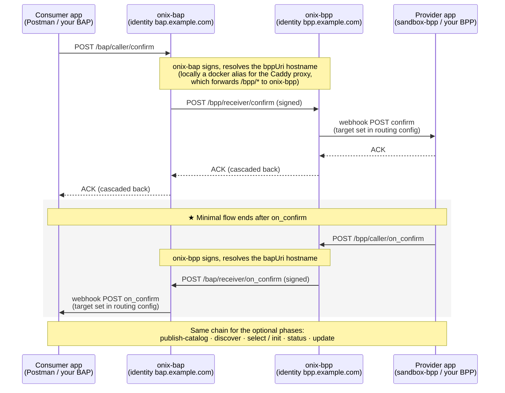

# Appendix — Data Exchange Reference

Reference detail backing [Core Concepts](./concepts.md). Nothing here is required reading before the [Quick Start](./quick-start.md) — come back when you need the specifics.

---

## Context invariants

Two `context` rules govern message correlation across the network. These are protocol expectations from the Beckn v2.0 spec — every implementation that participates in the network is expected to honour them so that participants and audit trails can stitch related messages together:

- **`transactionId` is constant** across every message in one exchange. From the first `discover`/`select`/`confirm` to the final `on_status`/`on_update`, the same UUID flows through. It is how all parties (and registry-level audit trails) link the conversation.
- **`messageId` is the same on a request and its paired callback.** `confirm` and the matching `on_confirm` share one `messageId`; a subsequent `status` gets a *new* `messageId`, which its `on_status` reuses. Treat the pair as one logical message with two hops.

Authoritative reference: [beckn/protocol-specifications-v2 — `api/v2.0.0`](https://github.com/beckn/protocol-specifications-v2/tree/main/api/v2.0.0).

---

## Identity resolution, step by step

When a message arrives, ONIX:

1. Reads the sender identifier from the message context (`bapId` on a forward request, `bppId` on a callback).
2. Looks the sender up in the **[DeDi](../glossary.md#dedi) registry** at a URL of the form:
   ```
   https://fabric.nfh.global/registry/dedi/lookup/<subscriber_id>/subscribers.beckn.one/<record_id>
   ```
   The lookup response carries the sender's published callback URL, signing public key, **parent namespaces** they belong to, and the **network memberships** they hold.
3. Cross-checks those network memberships against this ONIX's `allowedNetworkIDs` config. A sender that doesn't belong to any of the configured networks is treated as outside the boundary of trust.
4. Verifies the signature on the inbound message using the sender's published public key.

Two participants registered on different (or non-overlapping) networks cannot reach each other through their ONIX adapters.

The DeDi → ONIX config field mapping (`subscriber_id` → `networkParticipant`, `record_id` → `keyId`, Ed25519 keypair) lives in one place: [Registry Setup § Configure ONIX with your real identity](./registry-setup.md#configure-onix-with-your-real-identity).

---

## Schema validation reference

The dispatch is purely URL-driven. When ONIX sees a self-describing object (`resourceAttributes`, `commitmentAttributes`, `performanceAttributes`, or the inner `dataPayload`), it:

1. Takes the object's `@context` URL and swaps the filename for the sibling `attributes.yaml` — `…/DatasetItem/v1.1/context.jsonld` → `…/DatasetItem/v1.1/attributes.yaml`. By convention, every IES (and broader Beckn) schema family keeps an OpenAPI 3.x schema file next to its JSON-LD context.
2. Fetches and caches that `attributes.yaml`.
3. Validates the object against the `components.schemas` entry whose name **matches the `@type` value exactly** — `DatasetItem`, `MeterData`, `ArrFiling`, `Organization`, `PriceSpecification`, etc. If validation fails, the message is rejected.

### Failure modes

- `no schema found for @type: XYZ` — the `attributes.yaml` doesn't define a schema with that name. Either the `@type` is wrong, or the schema file at the resolved URL doesn't include it.
- Schema validation error — the object is missing a required field, has the wrong type, or otherwise doesn't match the OpenAPI definition. ONIX includes the JSON path of the failure in the error.

### Domain allow-list

ONIX restricts which hosts it will fetch `@context` URLs from, via the `extendedSchema` plugin config. Out of the box that includes `raw.githubusercontent.com` and `schema.beckn.io`. To validate payloads using a context hosted elsewhere (your own schema repo, for instance), add the host to the allow-list in your ONIX config.

### Publishing your own schema

If you want ONIX to validate a custom dataset shape:

1. Author an OpenAPI 3.x `attributes.yaml` with your schemas in `components.schemas`.
2. Author a JSON-LD `context.jsonld` mapping your field names to URIs.
3. Host both at a URL ONIX is allowed to reach — they must sit at the same path (`<base>/context.jsonld` and `<base>/attributes.yaml`).
4. In your payload, set `@context` to the context URL and `@type` to the matching schema name.

ONIX then validates exactly as it does for `MeterData` or `DatasetItem` — no code change; the dispatch is purely URL-driven. The families under [schemas/](../schemas/README.md) and [beckn/DDM](https://github.com/beckn/DDM/tree/main/specification/schema/DatasetItem/v1.1) are working references for how to lay out the pair.

---

## The four ONIX endpoints

A single ONIX adapter can expose up to four module endpoints — a `caller`/`receiver` pair per role:

| Endpoint | Role | Direction | Who calls it |
|---|---|---|---|
| `/bap/caller` | BAP | outbound | **Your consumer app** hands ONIX a request (`confirm`, `discover`, …) to sign and dispatch |
| `/bap/receiver` | BAP | inbound | **The network** (the counterparty's ONIX) delivers `on_*` callbacks here; ONIX verifies and forwards them to your app's webhook |
| `/bpp/caller` | BPP | outbound | **Your provider app** hands ONIX an `on_*` response to sign and dispatch |
| `/bpp/receiver` | BPP | inbound | **The network** delivers requests (`confirm`, `status`, …) here; ONIX verifies and forwards them to your provider's webhook |

`caller` is your own side's entrance into ONIX; `receiver` is the network's entrance. The role split is **configuration, not software** — one ONIX deployment can host any combination of these modules under one identity, so a participant that both consumes and provides data runs all four endpoints on a single adapter. The devkit runs two ONIX containers only because it simulates two *participants*: identity `bap.example.com` configured with the BAP module pair ([config/local-simple-bap.yaml](https://github.com/beckn/DEG/blob/main/devkits/data-exchange/config/local-simple-bap.yaml)) and identity `bpp.example.com` with the BPP pair (`local-simple-bpp.yaml`).

### Where ONIX delivers — the routing configs

What happens after a `receiver` verifies a message is defined in the routing configs ([config/local-simple-routing-*.yaml](https://github.com/beckn/DEG/tree/main/devkits/data-exchange/config)):

| Routing config | Applies to | Devkit target |
|---|---|---|
| `…-BAPReceiver.yaml` | inbound `on_*` callbacks | webhook `http://sandbox-bap:3001/api/bap-webhook` |
| `…-BPPReceiver.yaml` | inbound requests | webhook `http://sandbox-bpp:3002/api/webhook` |
| `…-BAPCaller.yaml` / `…-BPPCaller.yaml` | outbound dispatch | the counterparty (`targetType: bpp`/`bap` — resolve from the message context / registry) |

This webhook hop is how the sandbox apps are wired in — and how **your** app gets wired in too ([Quick Start § Phase C](./quick-start.md#phase-c--make-the-sandbox-your-own)): you change the receiver's webhook URL to your service; you never need to touch `bapUri`/`bppUri`, which always point at ONIX receivers.

---

## Generic Beckn flow

Every request is answered by an `ACK` and, later, an asynchronous `on_*` callback. The `ACK` is **not generated by the adapters**: it originates at the receiving application's webhook and cascades back hop-by-hop as each HTTP response, ending as the synchronous reply the original caller sees. The full chain for the minimal `confirm` → `on_confirm` exchange, as the devkit runs it:



Note what is **not** a participant in this diagram: `beckn-router`. It is a plain Caddy reverse proxy — the only container with a foot in both docker networks — that routes purely by path (`/bap/*` → `onix-bap:8081`, `/bpp/*` → `onix-bpp:8082`). It is not a Beckn network entity, just deployment plumbing. Locally it also stands in for the public internet: the dummy participant hostnames are docker aliases that resolve to it. In production those aliases are replaced by your publicly accessible URL (`https://<your-host>/bap/receiver`, `…/bpp/receiver`), and the same proxy pattern remains useful at the receiver's end — Caddy (or any reverse proxy, with TLS in front) routes the incoming `/bap/*` / `/bpp/*` calls to the right ONIX endpoint.

---

## Hostnames and endpoints — sandbox vs production

The hostnames in `bapUri` / `bppUri` represent **participant identities**. In production they are your real public URLs, published in your DeDi subscriber record. In the devkit they are **dummy aliases that only resolve inside the docker network**: the compose file attaches `bap.example.com` and `bpp.example.com` as aliases of `beckn-router`, so when one ONIX dispatches to the counterparty's hostname, DNS lands on the Caddy proxy, which path-routes to the right ONIX `receiver`. (Multi-participant devkits extend the same idea with one hostname per identity — e.g. `buyerapp.example.com:9000`, `sellerapp.example.com:9000` in the P2P trading devkit.)

That gives two kinds of URL, living at different layers:

| Concern | Devkit sandbox | Real network |
|---|---|---|
| **HTTP target** — where your client (Postman, your app) POSTs `confirm`, `discover`, etc. | `http://localhost:8081/bap/caller` *(port-mapped to `onix-bap`)* | Your ONIX deployment URL behind TLS |
| **HTTP target** — where your provider POSTs `on_confirm` / `on_status` | `http://localhost:8082/bpp/caller` *(port-mapped to `onix-bpp`)* | Your ONIX deployment URL behind TLS |
| **Payload hostnames** — `bapUri` / `bppUri` in each message's `context`; resolved by the *sending* ONIX to reach the counterparty's `receiver` | `http://beckn-router:9000/{bap,bpp}/receiver` (or the `bap.example.com` / `bpp.example.com` aliases — both resolve to the proxy) | Your public callback URLs published in your DeDi subscriber record |
| `networkId`, `bapId`/`bppId`, `allowedNetworkIDs` | placeholder values shipped in `config/` | See [Registry Setup](./registry-setup.md) |

Your Postman client never connects to `beckn-router` or the dummy aliases — they are docker-internal names. It POSTs to the port-mapped `caller` endpoints (`:8081` / `:8082`); the payload variables substitute the docker-resolvable hostnames into the message body for ONIX to use. When transacting **over the internet** (ngrok or a hosted deployment), the dummy aliases are no longer reachable by the counterparty — that's why [Quick Start § Phase B](./quick-start.md#phase-b--go-over-the-public-internet-ngrok) has you replace them with your tunnel or hosted URL.

ONIX configuration lives in [config/local-simple-{bap,bpp}.yaml](https://github.com/beckn/DEG/tree/main/devkits/data-exchange/config). The DeDi → ONIX field mapping is on [Registry Setup](./registry-setup.md#configure-onix-with-your-real-identity).

---

## Further reading

- [Devkit README — stack topology, hosting patterns, ngrok, multi-network ONIX, TLS](https://github.com/beckn/DEG/blob/main/devkits/README.md)
- [Beckn ONIX](https://github.com/beckn/beckn-onix) — the protocol adapter
- [Beckn protocol spec v2.0.0](https://github.com/beckn/protocol-specifications-v2/tree/main/api/v2.0.0)
- [docs.nfh.global/beckn](https://docs.nfh.global/beckn) — network and registry primitives
