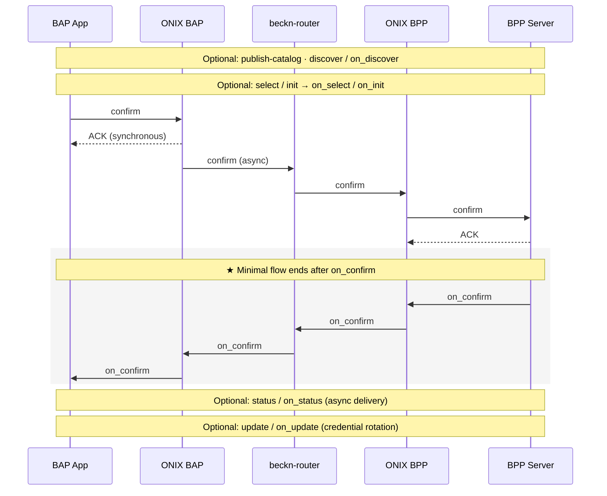

# Appendix — Data Exchange Reference

Reference detail backing [Core Concepts](./concepts.md). Nothing here is required reading before the [Quick Start](./quick-start.md) — come back when you need the specifics.

---

## Context invariants

Two `context` rules govern message correlation across the network. These are protocol expectations from the Beckn v2.0 spec — every implementation that participates in the network is expected to honour them so that participants and audit trails can stitch related messages together:

- **`transactionId` is constant** across every message in one exchange. From the first `discover`/`select`/`confirm` to the final `on_status`/`on_update`, the same UUID flows through. It is how all parties (and registry-level audit trails) link the conversation.
- **`messageId` is the same on a request and its paired callback.** `confirm` and the matching `on_confirm` share one `messageId`; a subsequent `status` gets a *new* `messageId`, which its `on_status` reuses. Treat the pair as one logical message with two hops.

Authoritative reference: [beckn/protocol-specifications-v2 — `api/v2.0.0`](https://github.com/beckn/protocol-specifications-v2/tree/main/api/v2.0.0).

---

## Identity resolution, step by step

When a message arrives, ONIX:

1. Reads the sender identifier from the message context (`bapId` on a forward request, `bppId` on a callback).
2. Looks the sender up in the **[DeDi](../glossary.md#dedi) registry** at a URL of the form:
   ```
   https://fabric.nfh.global/registry/dedi/lookup/<subscriber_id>/subscribers.beckn.one/<record_id>
   ```
   The lookup response carries the sender's published callback URL, signing public key, **parent namespaces** they belong to, and the **network memberships** they hold.
3. Cross-checks those network memberships against this ONIX's `allowedNetworkIDs` config. A sender that doesn't belong to any of the configured networks is treated as outside the boundary of trust.
4. Verifies the signature on the inbound message using the sender's published public key.

Two participants registered on different (or non-overlapping) networks cannot reach each other through their ONIX adapters.

The DeDi → ONIX config field mapping (`subscriber_id` → `networkParticipant`, `record_id` → `keyId`, Ed25519 keypair) lives in one place: [Registry Setup § Configure ONIX with your real identity](./registry-setup.md#configure-onix-with-your-real-identity).

---

## Schema validation reference

The dispatch is purely URL-driven. When ONIX sees a self-describing object (`resourceAttributes`, `commitmentAttributes`, `performanceAttributes`, or the inner `dataPayload`), it:

1. Takes the object's `@context` URL and swaps the filename for the sibling `attributes.yaml` — `…/DatasetItem/v1.1/context.jsonld` → `…/DatasetItem/v1.1/attributes.yaml`. By convention, every IES (and broader Beckn) schema family keeps an OpenAPI 3.x schema file next to its JSON-LD context.
2. Fetches and caches that `attributes.yaml`.
3. Validates the object against the `components.schemas` entry whose name **matches the `@type` value exactly** — `DatasetItem`, `MeterData`, `ArrFiling`, `Organization`, `PriceSpecification`, etc. If validation fails, the message is rejected.

### Failure modes

- `no schema found for @type: XYZ` — the `attributes.yaml` doesn't define a schema with that name. Either the `@type` is wrong, or the schema file at the resolved URL doesn't include it.
- Schema validation error — the object is missing a required field, has the wrong type, or otherwise doesn't match the OpenAPI definition. ONIX includes the JSON path of the failure in the error.

### Domain allow-list

ONIX restricts which hosts it will fetch `@context` URLs from, via the `extendedSchema` plugin config. Out of the box that includes `raw.githubusercontent.com` and `schema.beckn.io`. To validate payloads using a context hosted elsewhere (your own schema repo, for instance), add the host to the allow-list in your ONIX config.

### Publishing your own schema

If you want ONIX to validate a custom dataset shape:

1. Author an OpenAPI 3.x `attributes.yaml` with your schemas in `components.schemas`.
2. Author a JSON-LD `context.jsonld` mapping your field names to URIs.
3. Host both at a URL ONIX is allowed to reach — they must sit at the same path (`<base>/context.jsonld` and `<base>/attributes.yaml`).
4. In your payload, set `@context` to the context URL and `@type` to the matching schema name.

ONIX then validates exactly as it does for `MeterData` or `DatasetItem` — no code change; the dispatch is purely URL-driven. The families under [schemas/](../schemas/README.md) and [beckn/DDM](https://github.com/beckn/DDM/tree/main/specification/schema/DatasetItem/v1.1) are working references for how to lay out the pair.

---

## Generic Beckn flow

Every action is a separate HTTP POST that returns an immediate `ACK`; the paired `on_*` callback arrives asynchronously at the caller's webhook. Which steps you actually run depends on the use case:



---

## Endpoints — sandbox vs production

Two different kinds of URL show up in a Beckn flow, and they live at different layers. Keep them separate:

| Concern | Devkit sandbox | Real network |
|---|---|---|
| **HTTP target** — where your client (Postman, your app) POSTs `confirm`, `discover`, etc. to the BAP adapter | `http://localhost:8081/bap/caller` *(port-mapped to the `onix-bap` container)* | Your BAP ONIX deployment URL behind TLS |
| **HTTP target** — where the BPP's client POSTs `on_confirm` / `on_status` to the BPP adapter | `http://localhost:8082/bpp/caller` *(port-mapped to the `onix-bpp` container)* | Your BPP ONIX deployment URL behind TLS |
| **Payload hostnames** — values for `bapUri` / `bppUri` inside each message's `context`, used by the receiving ONIX (which sits inside docker) to find the other side | `http://beckn-router:9000/{bap,bpp}/receiver` | Your public callback URLs published in your DeDi subscriber record |
| `networkId`, `bapId`/`bppId`, `allowedNetworkIDs` | placeholder values shipped in `config/` | See [Registry Setup](./registry-setup.md) |

The split matters because **`beckn-router` is a docker-network hostname**: it's resolved by ONIX (which runs inside docker on the `bap_side`/`bpp_side` networks), not by your Postman client. Your client connects to the port-mapped adapter ports directly — `:8081` for BAP, `:8082` for BPP. The shipped Postman collections reflect this: requests POST to `localhost:8081|8082`; payload variables substitute `http://beckn-router:9000` into the message body.

ONIX configuration lives in [config/local-simple-{bap,bpp}.yaml](https://github.com/beckn/DEG/tree/main/devkits/data-exchange/config). The DeDi → ONIX field mapping is on [Registry Setup](./registry-setup.md#configure-onix-with-your-real-identity).

---

## Further reading

- [Devkit README — stack topology, hosting patterns, ngrok, multi-network ONIX, TLS](https://github.com/beckn/DEG/blob/main/devkits/README.md)
- [Beckn ONIX](https://github.com/beckn/beckn-onix) — the protocol adapter
- [Beckn protocol spec v2.0.0](https://github.com/beckn/protocol-specifications-v2/tree/main/api/v2.0.0)
- [docs.nfh.global/beckn](https://docs.nfh.global/beckn) — network and registry primitives
