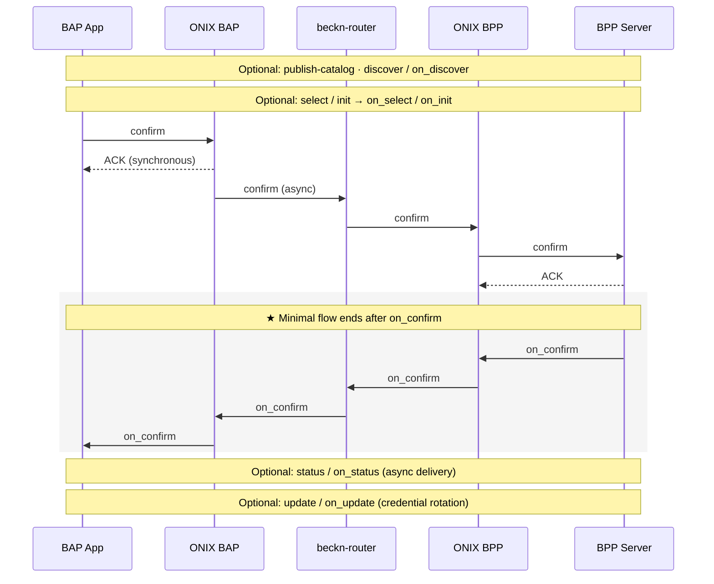

# Architecture — Data Exchange

A minimum-viable picture of how a data exchange runs end-to-end. For the authoritative stack reference (hosting patterns, ngrok over the public internet, multi-network ONIX, TLS), see the [devkit README](https://github.com/beckn/DEG/blob/main/devkits/README.md).

---

## Stack topology

Each side (BAP and BPP) is a self-contained set of containers. The only bridge between them is a Caddy router on `:9000`. The same image runs unchanged whether you're hitting it locally or through a public tunnel.

```
                    beckn-router :9000   (Caddy — the only bridge)
                    /                  \
        /bap/*    <                      >    /bpp/*
                  /                      \
   ─── bap_side ──┘                        └── bpp_side ───
   onix-bap     :8081                       onix-bpp     :8082
   sandbox-bap  :3001                       sandbox-bpp  :3002
   redis                                    redis
```

| Component | Role |
|---|---|
| `onix-bap` / `onix-bpp` | Beckn protocol adapter — signs, verifies, routes, validates `dataPayload` against the declared schema, manages async callbacks |
| `sandbox-bap` | BAP webhook receiver. Logs every `on_*` callback so you can inspect responses |
| `sandbox-bpp` | Reference BPP — auto-responds with the example payloads in `uc{1,2}-*/examples/` |
| `beckn-router` | Caddy bridging the two side networks; the public entrypoint when deployed |
| `redis` | Per-side message cache used by ONIX |

---

## Generic Beckn flow

Every action is a separate HTTP POST that returns an immediate `ACK`; the paired `on_*` callback arrives asynchronously at the caller's webhook. Which steps you actually run depends on the use case:



The minimal-flow framing, the optional phases, and the `transactionId` / `messageId` correlation rules all live in [Concepts § Beckn Protocol Lifecycle](./concepts.md#beckn-protocol-lifecycle).

---

## Endpoints — sandbox vs production

Two different kinds of URL show up in a Beckn flow, and they live at different layers. Keep them separate:

| Concern | Devkit sandbox | Real network |
|---|---|---|
| **HTTP target** — where your client (Postman, your app) POSTs `confirm`, `discover`, etc. to the BAP adapter | `http://localhost:8081/bap/caller` *(port-mapped to the `onix-bap` container)* | Your BAP ONIX deployment URL behind TLS |
| **HTTP target** — where the BPP's client POSTs `on_confirm` / `on_status` to the BPP adapter | `http://localhost:8082/bpp/caller` *(port-mapped to the `onix-bpp` container)* | Your BPP ONIX deployment URL behind TLS |
| **Payload hostnames** — values for `bapUri` / `bppUri` inside each message's `context`, used by the receiving ONIX (which sits inside docker) to find the other side | `http://beckn-router:9000/{bap,bpp}/receiver` | Your public callback URLs published in your DeDi subscriber record |
| `networkId`, `bapId`/`bppId`, `allowedNetworkIDs` | placeholder values shipped in `config/` | See [Registry Setup](./registry-setup.md) |

The split matters because **`beckn-router` is a docker-network hostname**: it's resolved by ONIX (which runs inside docker on the `bap_side`/`bpp_side` networks), not by your Postman client. Your client connects to the port-mapped adapter ports directly — `:8081` for BAP, `:8082` for BPP. The router's `:9000` only needs to be reachable from inside the docker network where ONIX-BAP and ONIX-BPP forward callbacks to each other. The shipped Postman collections reflect this: requests POST to `localhost:8081|8082`; payload variables substitute `http://beckn-router:9000` into the message body.

ONIX configuration lives in [config/local-simple-{bap,bpp}.yaml](https://github.com/beckn/DEG/tree/main/devkits/data-exchange/config). The DeDi → ONIX field mapping is on [Registry Setup](./registry-setup.md).

---

## Further reading

- [Devkit README — stack topology, hosting, multi-network](https://github.com/beckn/DEG/blob/main/devkits/README.md)
- [Beckn ONIX](https://github.com/beckn/beckn-onix) — the protocol adapter
- [Beckn protocol spec v2.0.0](https://github.com/beckn/protocol-specifications-v2/tree/main/api/v2.0.0)
- [docs.nfh.global/beckn](https://docs.nfh.global/beckn) — network and registry primitives
