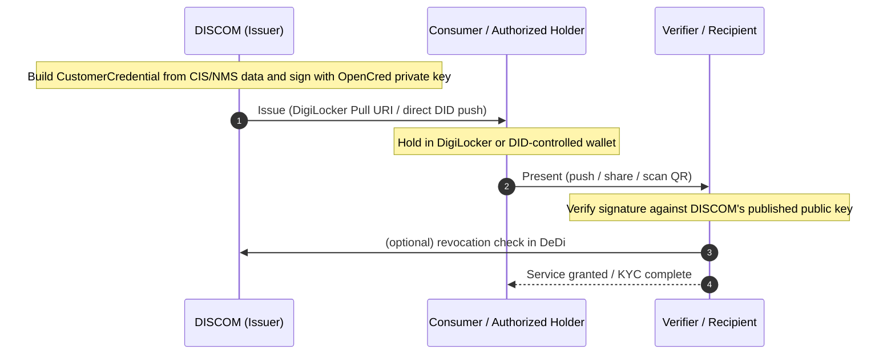

# Energy Credentials for DISCOMs


**v1 scope.** [DISCOMs](../glossary.md#discom) are the sole **issuer** of energy credentials about consumers, meters, and assets. **Holders** are consumers (or authorized actors acting on their behalf). **Verifiers / recipients** are third parties depending on the use case — banks, marketplaces, regulators, fintechs. Other issuer roles (SERCs, DER OEMs, government bodies) are architecturally supported but out of scope for v1.


This chapter is a complete, self-contained guide for a DISCOM tech team to start **issuing electricity credentials to consumers**. It walks from first principles through running the credential service, signing your first credential, and delivering it to consumers via [DigiLocker](../glossary.md#digilocker) or directly.

You do not need any prior knowledge of [Verifiable Credentials](../glossary.md#verifiable-credential-vc). Every concept used downstream is explained in [Core Concepts](./concepts.md).

### Credential lifecycle at a glance



---

## What an Electricity Credential Is

An **Electricity Credential** is a cryptographically signed digital attestation a DISCOM makes about a consumer's meter and the assets behind it. It follows the [W3C Verifiable Credentials Data Model 2.0](https://www.w3.org/TR/vc-data-model-2.0/) and the IES `ElectricityCredential` schema family — mirrored from Beckn DEG into this repo under [`/schemas/ElectricityCredential/v1.0/`](../schemas/ElectricityCredential/v1.0/README.md).

A credential is a JSON document with three things inside it:

1. **An issuer block** — your DISCOM's [DID](../glossary.md#did), legal name, and an `idRef` pointing at your regulatory registration, so any verifier can prove the credential came from you.
2. **A credentialSubject block** — the consumer's DID and the specific facts you are attesting (customer profile, address, consumption, generation assets, storage assets).
3. **A proof block** — an Ed25519 / ECDSA signature over the credential body, produced by your DISCOM's private key.

Because the signature covers a **canonical** byte-for-byte form of the credential — same input always serialises the same way regardless of which library produced it — anyone holding the credential can independently verify it without re-asking the DISCOM. No callback, no shared database, no central registry lookup. Revocation is the only thing that needs a fresh check, and even that runs against a public hash registry rather than a DISCOM API.

---

## What You Can Issue

The IES Electricity Credential family currently spans three credential types — all issued by the DISCOM, all signed by the same OpenCred service, all verified the same way:

| Credential | Purpose | Issued |
|---|---|---|
| [`CustomerCredential`](./schemas.md) | DISCOM-side attestation about a meter and its assets | Once at onboarding; re-issued on material change |
| [`ConsumerEnergyPassport`](./consumer-energy-passport.md) (draft) | Wallet-shareable composite credential binding consumer identity to connection, meter, sanctioned load, and DER/storage assets — for presentation to banks, marketplaces, regulators, societies | Once at onboarding; re-issued on material change |
| [`ConsumerMeterDigest`](./consumer-meter-digest.md) (draft) | On-demand snapshot of the consumer's meter readings (raw or summary) the consumer holds in their wallet and shares with any third party | On consumer demand, freshly each time, with a short `validUntil` |

The use-case framing for the two consumer-facing credentials lives under [Use Cases → Consumer Energy Passport](../use-cases/consumer-energy-passport/README.md) and [Use Cases → Consumer Meter Digest](../use-cases/consumer-meter-digest/README.md).

The rest of this chapter is written from the DISCOM-as-issuer perspective and uses `CustomerCredential` as the running example. The two consumer-facing credentials reuse the same envelope, the same OpenCred deployment, and the same DigiLocker delivery path — only the schema and the trigger differ.

### `CustomerCredential` sub-profiles

You issue **one `CustomerCredential` per meter**. That single credential carries five equal-level sub-profiles inside its `credentialSubject` — only `customerProfile` is required; the others appear when the relevant facts exist for that meter:

| Sub-profile | What it attests | Required? |
|---|---|---|
| `customerProfile` | Customer number, meter number, meter type, optional `idRef` to a government ID | ✓ Always |
| `customerDetails` | Full name, installation address, service connection date | Whenever you have it |
| `consumptionProfiles[]` | Premises type, connection type, sanctioned load, tariff category — one entry per meter / tariff category | When applicable |
| `generationProfiles[]` | DER assets — generation type (Solar / Wind / MicroHydro), capacity, commissioning date — one entry per asset | When DERs are commissioned |
| `storageProfiles[]` | Battery storage — capacity (kWh), power rating (kW), storage technology — one entry per battery | When batteries are commissioned |

When facts change (new tariff, new DER, decommissioning), you **re-issue and revoke the previous credential** — see [Issuance lifecycle patterns](./issuance.md#lifecycle-patterns). Field-level requirements and worked JSON examples are in [Schemas](./schemas.md).

---

## The DISCOM Issuance Flow

```
   Consumer system            DISCOM service             Consumer wallet
  (CIS, NMS, MDM)        (OpenCred + your integration)  (DigiLocker / DID)
        │                          │                            │
        │  consumer/asset data     │                            │
        │ ───────────────────────> │                            │
        │                          │ 1. Build credentialSubject │
        │                          │ 2. POST /v1/credentials/   │
        │                          │       issue (OpenCred)     │
        │                          │ 3. OpenCred signs locally  │
        │                          │    using your private key  │
        │                          │ 4. Package as JSON+PDF+QR  │
        │                          │ ─────────────────────────> │
        │                          │                            │
        │                          │       revocation (later)   │
        │                          │ POST /v1/credentials/      │
        │                          │       revoke               │
```

You run **two pieces of software**:

1. **OpenCred server** — an open-source Docker image (`ghcr.io/nfh-trust-labs/opencred/opencred-server`) that holds your signing key and exposes an HTTP API for `issue`, `verify`, `revoke`, etc. Your private key never leaves this container.
2. **A thin integration service you write** — pulls consumer or asset facts from your CIS / NMS, calls OpenCred's `issue` endpoint, injects the full `issuer` object (name + `idRef`), and delivers the result to the consumer (DigiLocker Pull URI, email, app push, or DID-to-DID).

The "thin integration service" is the only custom code on your side. OpenCred handles every cryptographic operation, packaging, and DID resolution.

---

## What You Will Need

Before you start, gather:

- A Linux host (any cloud or on-prem) that can run a Docker container with outbound HTTPS — **or Docker Desktop on Windows / macOS** for dev evaluation. The published image is multi-arch (amd64 + arm64); no `--platform` flag needed on Apple Silicon.
- A signing key — either an ECDSA P-256 PEM you generate (recommended for dev / first deploy), an existing Digital Signature Certificate (PFX/PEM), or an HSM / cloud KMS key for production
- A **DeDi namespace** — base URL of the DeDi instance plus an API key (or bearer credentials) and a namespace ID. DeDi is part of the OpenCred + DeDi combo from the first run; it serves both the revocation registry and (optionally) the `did:web` discovery fallback. If you do not have a namespace yet, contact your DeDi operator before the bootcamp.
- (For production) a domain you control for `did:web`, e.g. `ies.tpddl.in`. If you would prefer DeDi to host your DID document instead, set `OPENCRED_DEDI_HOST_DID_DOC=true` on the OpenCred container and skip the `.well-known/did.json` hosting step.
- Read access to your CIS / billing / meter database for consumer lookups
- (For DigiLocker delivery) an issuer account on [API Setu](https://apisetu.gov.in)

That is the entire prerequisite list. No PKI vendor contracts, no central IES gateway to integrate with.

---

## Recommended Reading Order

Follow these pages in sequence. Each one builds on the last; together they form a linear bootcamp-style narrative.

| # | Page | What you learn |
|---|---|---|
| 1 | [Core Concepts](./concepts.md) | W3C VCs, DIDs, signing keys, trust chains, DeDi revocation, the `keyStatus` rotation flag, and the CORD anchor proof block surfaced by `/v1/keys/resolve`. Read once, refer back as needed. |
| 2 | [Schemas](./schemas.md) | The unified `CustomerCredential`, its five sub-profiles, validation rules, the Beckn-canonical `electricity/v1` `$id`, and the three gotchas first-time issuers hit (`country` shape, `serviceConnectionDate` format, `meterType` enum). |
| 3 | [Deployment](./onboarding.md) | Stand up OpenCred + DeDi as a single combo: Docker, environment variables (including `OPENCRED_DEDI_*` from the first run), KMS, multi-replica scale, health checks. |
| 4 | [Issuing Credentials](./issuance.md) | Call `POST /v1/credentials/issue` with validated payloads; verify immediately after issue; revoke with a `reason` and re-issue when facts change; batch operations via the streaming CSV parser. |
| 5 | [Verification](./verification.md) | The four verification surfaces (Desktop, Docker, CLI, `@opencred/verify` SDK), PDF verify input, tamper test, advisory `keyRotation` / `registryAnchor` checks, and the silent-skip-on-revocation warning verifier partners must know about. |
| 6 | [DigiLocker Integration](./digilocker-integration.md) | Build the Pull URI endpoint that lets consumers find your credential in DigiLocker. (Not part of the bootcamp happy path; pick up after steps 1–5 work end to end.) |

By the end of page 5 you will have signed real credentials, verified them locally, revoked one through DeDi, and re-verified-as-revoked. Page 6 is the DigiLocker-specific add-on for DISCOMs delivering credentials to consumer wallets.

---

## How OpenCred Fits In

[OpenCred](https://opencred.gitbook.io/docs) is the open-source W3C VC platform that powers IES Electricity Credentials. The full reference docs live on the OpenCred GitBook; this chapter cites them at every step but you do not need to read them end-to-end.

Important properties of OpenCred that matter for DISCOMs:

- **Local-first signing** — issuer private keys never leave the container you run. There is no shared cloud signing service.
- **Stateless server** — restart at will; no database to back up. Revocation state lives in DeDi. (For multi-replica or queue-driven batch issuance, OpenCred v1.5.0+ adds an optional Redis-backed jobs store — see [Deployment](./onboarding.md#multi-replica-and-batch-worker-fleet).)
- **Standard W3C VC outputs** — every credential is interoperable with any W3C VC verifier; you are not locked into IES tooling.
- **Multiple proof formats** — `vc-jwt` (recommended default — works for every bundled schema including `electricity/v1`), `data-integrity` (JSON-LD; use against schemas you register yourself with a clean context), and `sd-jwt-vc` for selective disclosure.
- **DeDi-first** — DeDi is part of the default OpenCred deployment, not optional. It is both the revocation registry (hash-based, network-light) and a `did:web` discovery fallback (since OpenCred v1.4.0): an issuer that publishes to DeDi can let verifiers resolve the DID document through DeDi when the canonical `.well-known/did.json` is unreachable.
- **Multi-arch image** (OpenCred v1.2.0+) — `docker pull` works on linux/amd64, linux/arm64, Apple Silicon, AWS Graviton, and Raspberry Pi without `--platform` flags.

> **For IES bootcamp attendees.** Read this chapter in order — [Core Concepts](./concepts.md) → [Schemas](./schemas.md) → [Deployment](./onboarding.md) → [Issuing Credentials](./issuance.md) → [Verification](./verification.md). The OpenCred + DeDi combo is wired in from the start; you will end the sequence with a signed `electricity/v1` VC, a working DeDi-backed revoke loop, and a verifier that returns `REVOKED` after revocation. The canonical upstream `electricity/v1` worked example lives in OpenCred's bootcamp guide [§6d](https://opencred.gitbook.io/docs/bootcamp/local-docker#6d-try-a-different-built-in-schema-electricityv1); this chapter wraps it in the IES-specific issuer-object + DigiLocker delivery shape.

---

## References

- [OpenCred documentation (GitBook)](https://opencred.gitbook.io/docs) — comprehensive reference for the credential service
- [OpenCred bootcamp — Local Docker track](https://opencred.gitbook.io/docs/bootcamp/local-docker) — the canonical OpenCred + DeDi hands-on guide; this IES chapter mirrors its structure with `electricity/v1` as the running schema
- [OpenCred API reference](https://opencred.gitbook.io/docs/docker-image/api-reference) — every HTTP endpoint with request/response schemas
- IES `ElectricityCredential` schemas — canonical field definitions at [`/schemas/ElectricityCredential/v1.0/`](../schemas/ElectricityCredential/v1.0/README.md) (repo root: [`India-Energy-Stack/ies-accelerator`](https://github.com/India-Energy-Stack/ies-accelerator))
- [Beckn `ElectricityCredential` canonical schema](https://schema.beckn.io/ElectricityCredential/1.0/schema.json) — the `$id` URL serialised into every issued credential's `credentialSchema.id` (OpenCred v1.5.0+)
- [Beckn DEG `ElectricityCredential` (upstream repo)](https://github.com/beckn/DEG/tree/main/specification/schema/ElectricityCredential)
- [W3C Verifiable Credentials Data Model 2.0](https://www.w3.org/TR/vc-data-model-2.0/)
- [W3C Decentralized Identifiers](https://www.w3.org/TR/did-core/)
- [DeDi — Decentralised Data Infrastructure](https://dedi.global)
