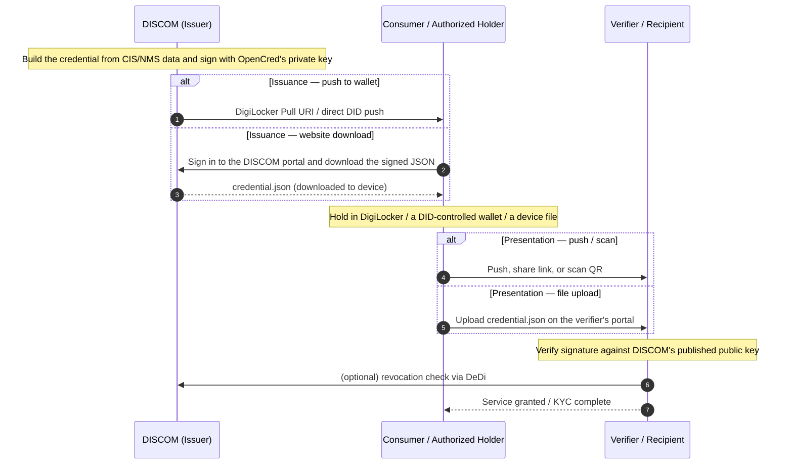

# Energy Credentials

This page is the single home for everything IES has to say about issuing, verifying, and revoking energy credentials. The first three sections take you from a fresh deployment to your first signed credential. The appendices cover trust theory, batch / production patterns, and core concepts.

> **About the walkthrough.** The concrete commands below use **[OpenCred](../glossary.md#opencred)** — see the glossary for what it is, its W3C compliance, its DeDi integration, and release links. Any W3C-compliant signing pipeline that publishes the same `did.json` and VC-2.0 proofs is a drop-in replacement.

---

## Why credentials

When a DISCOM hands a consumer a digital electricity attestation, or shares meter readings with a regulator or a marketplace, the receiver needs to answer one question on their own: *"Is this really from TPDDL, intact, and still valid?"* If they have to call you, the system does not scale and is not really verifiable.

A **Verifiable Credential** is a small JSON object you sign with the private key behind your `did:web`. Anyone — a wallet, another DISCOM, a bank, a regulator — can fetch your `did.json` over HTTPS, check the signature, and consult a public revocation list. No callback to you required.

Three credentials cover almost everything IES does:

| Credential | What it attests | Who signs | Typical receiver |
|---|---|---|---|
| **[ElectricityCredential v1.2](../schemas/ElectricityCredential/v1.2/README.md)** | A service connection — customer number, sanctioned load, tariff, meter info, energy resources (rooftop solar, BESS, EV chargers) | DISCOM | The consumer's wallet, or a verifier (bank, marketplace, regulator) the consumer shares it with |
| **[MeterDataCredential v0.6](../schemas/MeterDataCredential/v0.6/README.md)** | A signed meter-reading payload (raw `MeterData` profiles or derived summaries) for a specified period | AMISP, MDM, or DISCOM | DISCOM (B2B telemetry) or the consumer (their own readings) |
| **[MeterDataRequestCredential v0.1](../schemas/MeterDataRequestCredential/v0.1/README.md)** | A signed request for meter data — proves the requester has the right to ask | Seeker (typically a DISCOM) | Provider (typically an AMISP) at Beckn `confirm` time |

### Lifecycle at a glance



## Pick your role

| If you are… | Read | Then |
|---|---|---|
| **A DISCOM / issuer** (you sign and emit credentials) | [Prerequisites](#prerequisites) → [Issue your first credential](#issue-your-first-credential) → [Checklist](#checklist) | [Credential variants](#credential-variants), [Appendix B — Operational notes](#appendix-b--operational-notes) |
| **An AMISP / MDM / aggregator** (you sign telemetry) | [Prerequisites](#prerequisites) → [Issue your first credential](#issue-your-first-credential) using `MeterDataCredential` | [Smart Meter Data Exchange use case](../use-cases/smart-meter-data-exchange/README.md) |
| **A holder / wallet** (you hold credentials on behalf of a consumer) | [Holder binding](#holder-binding) → [DigiLocker delivery](#digilocker-delivery) | [Identifiers — Appendix F](../identifiers/README.md#appendix-f--binding-the-credential-to-a-holder-identity) for binding patterns |
| **A verifier** (you receive and check credentials) | [Verify](#3-verify), [Revocation check](#4-revoke) → [Appendix A — Trust model](#appendix-a--trust-model) | [Registries — Verifying a credential](../registries/README.md#appendix-b--verifying-a-credential-end-to-end) for the resolution walk |

---

## Prerequisites

Before you can issue, get these in place. Each link takes you to the section that walks through the step:

1. **Your `did:web` is published** at `https://<your-domain>/.well-known/did.json`. See [Identifiers — Publish your did:web](../identifiers/README.md#step-by-step-publish-your-didweb-and-run-opencred-locally).
2. **A DeDi namespace** under your verified domain. See [Registries — Step-by-step](../registries/README.md#step-by-step-claim-your-dedi-namespace-and-create-registries). OpenCred will auto-create the four registries it needs (`vc-revocation-registry`, `opencred-key-registry`, `schema_registry`, `context_registry`) on first boot.
3. **OpenCred running** with `OPENCRED_DEDI_*` env vars set (or an equivalent W3C-compliant signing pipeline of your choice).
4. *(Optional, recommended for licensed utilities)* **A regulator's licensing pointer** to quote in `issuer.idRef` — the regulator's `did:web` and the regulator-issued licence identifier for your DISCOM. Omit for pilots / non-regulated issuers.
5. **A signed payload schema in mind.** Default: [ElectricityCredential v1.2](../schemas/ElectricityCredential/v1.2/README.md). For telemetry, [MeterDataCredential v0.6](../schemas/MeterDataCredential/v0.6/README.md).

> **No IES-side DISCOM-registry entry is required to issue credentials.** That registry is the inter-DISCOM data exchange network's trust boundary, not a credential prerequisite. See [Registries — IES networks today](../registries/README.md#ies-networks-and-registries-today) for when you'd need it.

---

## Issue your first credential

This is the bootcamp-aligned step-by-step. Five steps from a running OpenCred to a signed, revocable ElectricityCredential v1.2.

### 1. Confirm the issuer DID OpenCred reports

```bash
export OPENCRED_API_KEY="…"   # from your secret manager
export ISSUER_DID="$(curl -s http://localhost:3100/v1/keys \
  -H "Authorization: Bearer $OPENCRED_API_KEY" | jq -r '.keys[0].id | split("#")[0]')"
echo "$ISSUER_DID"
# did:web:ies.tpddl.in
```

If you ran the container in `did:key` mode (for early dev), this prints `did:key:z…` instead — the rest of the flow is identical, only the issuer string changes.

### 2. Issue

Default: **bearer-style** (no `credentialSubject.id`). This mirrors the [OpenCred bootcamp](https://opencred.gitbook.io/docs/bootcamp/local-docker). For consumer-facing flows where the presenter must be the legitimate subject, bind to a holder identifier — see [Holder binding](#holder-binding).

```bash
curl -s http://localhost:3100/v1/credentials/issue \
  -H "Authorization: Bearer $OPENCRED_API_KEY" \
  -H "Content-Type: application/json" \
  -d "{
    \"schemaId\":    \"ElectricityCredential/v1.2\",
    \"issuerDid\":   \"$ISSUER_DID\",
    \"proofFormat\": \"vc-jwt\",
    \"validFrom\":   \"2026-04-01T00:00:00+05:30\",
    \"validUntil\":  \"2031-04-01T00:00:00+05:30\",
    \"credentialSubject\": {
      \"customerProfile\": {
        \"customerNumber\": \"TPDDL-2025-00987654\",
        \"energyResources\": [{
          \"id\":   \"did:web:ies.tpddl.in:assets:meter:MET-IMPORT-001\",
          \"type\": \"METER\",
          \"attributes\": {\"meterCapability\": \"AMI\", \"energyDirection\": \"Forward\"}
        }],
        \"consumptionProfiles\": [{
          \"meterId\":            \"did:web:ies.tpddl.in:assets:meter:MET-IMPORT-001\",
          \"sanctionedLoad\":     {\"value\": 10, \"unit\": \"kW\"},
          \"tariffCategoryCode\": \"DS-I\",
          \"premisesType\":       \"Residential\",
          \"connectionType\":     \"Single-phase\"
        }]
      },
      \"customerDetails\": {
        \"fullName\":              \"Arjun Mehra\",
        \"serviceConnectionDate\": \"2018-07-15T00:00:00+05:30\"
      }
    }
  }" | tee credential.json | jq .credential
```

Three things worth noting:

- **Asset IDs are `did:web` under your own domain**, with colon-path segments (`did:web:ies.tpddl.in:assets:meter:<slno>`). Same pattern for transformers, feeders, substations — see [Identifiers — Asset patterns](../identifiers/README.md#appendix-c--identifying-assets-meters-connections-datasets). No per-asset `did.json` hosting required for the pragmatic case.
- **`issuer.idRef` is optional.** OpenCred fills `issuer` with the DID string only. Your integration service appends `name` and (if you have a regulator to cite) `idRef` on egress, then re-signs if your flow requires a single signed artefact.
- **`credentialSubject.id` is absent here.** That's the bearer-style default. Set it to a wallet `did:key` or `tel:+91...` URI for holder-bound issuance — full guidance in [Identifiers — Holder binding](../identifiers/README.md#appendix-f--binding-the-credential-to-a-holder-identity).

### 3. Verify

```bash
jq -n --arg c "$(jq -r '.credential.proof.jwt' credential.json)" '{credential: $c}' | \
  curl -s http://localhost:3100/v1/credentials/verify \
    -H "Authorization: Bearer $OPENCRED_API_KEY" \
    -H "Content-Type: application/json" \
    -d @- | jq
# expect "valid": true
```

For `vc-jwt`, the verify endpoint takes the compact JWS string (`.credential.proof.jwt`), not the JSON envelope. For `data-integrity` proofs, send the full credential JSON. The full verification flow — checking the issuer's signature, the regulator's licensing assertion (if cited), and revocation status — is detailed in [Appendix A](#appendix-a--trust-model).

### 4. Revoke

OpenCred publishes revocation as a hash entry into your DeDi revocation registry. The credential format does not change; the verifier reads `credentialStatus` and looks up the hash.

```bash
# Compute the revocation hash
HASH=$(jq '{credential: .credential}' credential.json | \
  curl -s http://localhost:3100/v1/credentials/revocation-hash \
    -H "Authorization: Bearer $OPENCRED_API_KEY" \
    -H "Content-Type: application/json" -d @- | jq -r .revocationHash)

# Revoke
curl -s http://localhost:3100/v1/credentials/revoke \
  -H "Authorization: Bearer $OPENCRED_API_KEY" \
  -H "Content-Type: application/json" \
  -d "{\"hash\": \"$HASH\", \"reason\": \"connection-terminated\"}" | jq

# Check status
curl -s http://localhost:3100/v1/credentials/revocation-status \
  -H "Authorization: Bearer $OPENCRED_API_KEY" \
  -H "Content-Type: application/json" \
  -d "{\"hash\": \"$HASH\"}" | jq
```

Revocation requires the relevant `OPENCRED_DEDI_*` env vars on the container (`OPENCRED_DEDI_BASE_URL`, `OPENCRED_DEDI_AUTH_TYPE`, `OPENCRED_DEDI_API_KEY`, `OPENCRED_DEDI_NAMESPACE`). See [OpenCred Revocation](https://opencred.gitbook.io/docs/concepts/revocation) for the conceptual model.

### 5. Smoke test

A passing integration test should:

1. Issue a credential.
2. Resolve `issuer.id` (`did.json` over HTTPS) and confirm the public key matches the one that signed `proof`.
3. *(If `issuer.idRef` is present)* Resolve `issuer.idRef.issuedBy` and confirm the regulator vouches for your DISCOM.
4. `POST /v1/credentials/verify` — expect `valid: true`.
5. Check `revocation-status` — expect not revoked.
6. Revoke.
7. Re-check `revocation-status` — expect revoked.

Run on every release. It exercises every leg of the trust chain.

---

## Credential variants

The same schemas cover several use cases. **No new VC `type` values are introduced** — the variants are issuance configurations over the existing schemas.

### ElectricityCredential v1.2 — the default

A DISCOM-signed attestation about a service connection. Carries `customerProfile` (non-PII: customer number, energy resources, consumption profile), `customerDetails` (optional PII: name, address, service-connection date), and the issuer block.

Two common shapes:

**Bearer / counter-issued** (no `credentialSubject.id`). Anyone holding the JSON is treated as the subject. Used for paper-style attestations, demos, or in-person verification. This is what the bootcamp walkthrough above produces.

**Holder-bound, consumer-presentable** — the **Consumer Energy Passport** pattern. Same schema, but:
- `credentialSubject.id` = the consumer's wallet `did:key` (or `did:jwk`).
- `customerProfile.idRef` carries a verifiable government-ID reference (Aadhaar offline KYC, DigiLocker pull, etc.) — **the reference**, never the raw number.
- At presentation time, the verifier issues a challenge, the wallet signs a Verifiable Presentation, and the verifier confirms the presenter holds the matching private key. See [Identifiers — Pattern 1](../identifiers/README.md#pattern-1--wallet-did-cryptographic-recommended-where-a-wallet-exists).

The Consumer Energy Passport use case ([use-cases/consumer-energy-passport/](../use-cases/consumer-energy-passport/README.md)) is about *who*, *when*, and *why* the holder-bound shape is issued; the credential itself is an ElectricityCredential v1.2.

### MeterDataCredential v0.6 — telemetry signing

A signed VC wrapping a `MeterData` v0.6 payload (raw `INTERVAL`/`DAILY`/`MONTHLY` profiles or derived summaries) for a specified period. Issued by the AMISP or MDM, typically B2B to a DISCOM. Same `POST /v1/credentials/issue` flow as above, with `schemaId` set to `MeterDataCredential/v0.6` and the `credentialSubject` shaped per its schema.

Two common shapes:

**B2B**, typically without `credentialSubject.id`. The AMISP signs; the DISCOM consumes the payload at Beckn `on_status`.

**Holder-bound, consumer-presentable** — the **Consumer Meter Digest** pattern. `credentialSubject.id` = the consumer's wallet DID, `validUntil` is short (hours to days), and the readings or summary cover a period the consumer asked for. The credential is delivered into the consumer's wallet / DigiLocker; verifiers (banks, marketplaces) check it without phoning the DISCOM. Use case page: [use-cases/consumer-meter-digest/](../use-cases/consumer-meter-digest/README.md).

### MeterDataRequestCredential v0.1 — proof of right-to-ask

A signed VC carried at Beckn `confirm` time by a seeker (typically a DISCOM) when an AMISP's offer policy requires it. Proves the seeker has been authorised to request the data they're confirming. Schema: [MeterDataRequestCredential v0.1](../schemas/MeterDataRequestCredential/v0.1/README.md).

### Summary

| Pattern | Schema | `credentialSubject.id` | `validUntil` | Issued by |
|---|---|---|---|---|
| Bearer ElectricityCredential | `ElectricityCredential/v1.2` | absent | years | DISCOM |
| Consumer Energy Passport | `ElectricityCredential/v1.2` | wallet `did:key` (+ `customerProfile.idRef`) | years | DISCOM |
| B2B MeterDataCredential | `MeterDataCredential/v0.6` | absent | hours to days | AMISP / MDM |
| Consumer Meter Digest | `MeterDataCredential/v0.6` | wallet `did:key` | hours to days | DISCOM (on consumer demand) |
| Meter-data request | `MeterDataRequestCredential/v0.1` | absent | minutes (per Beckn message) | Seeker (typically DISCOM) |

---

## Holder binding

Holder binding turns a credential from a bearer token into something only the consumer's wallet can present. Choose a pattern (wallet DID, `tel:+91...` URI, or DigiLocker-mediated) based on the consumer's situation. **Identity-proofing at issuance is mandatory** — you must verify the consumer controls the identifier before embedding it.

Full guidance: [Identifiers — Appendix F](../identifiers/README.md#appendix-f--binding-the-credential-to-a-holder-identity).

---

## DigiLocker delivery

DigiLocker is the dominant consumer wallet in India. Once issued, an ElectricityCredential or MeterDataCredential can be delivered into a consumer's DigiLocker via a Pull URI, and any verifier reading from DigiLocker inherits DigiLocker's Aadhaar-mediated identity binding.

Walkthrough (Pull URI shape, callback flow, signature pinning, common failure modes): [digilocker.md](./digilocker.md).

---

## Checklist

The full zero-to-issuance sequence — foundations, issue / verify / revoke, variant selection, production hardening, and optional data-exchange onboarding — lives on a separate sub-page so it stays printable and trackable: **[Energy Credentials — Checklist](../checklists/energy-credentials-checklist.md)**.

---

## Appendix A — Trust model

A credential's trust chain has at most two legs:

1. **Mandatory** — the issuer's `did:web` signature. A verifier resolves `issuer.id` over HTTPS to `did.json`, extracts the public key, and verifies `proof`. If this fails, stop — the credential is forged or corrupted.
2. **Optional** — the regulator's licensing assertion in `issuer.idRef`. When present, the verifier resolves `issuer.idRef.issuedBy` (the regulator's `did:web`) and confirms the regulator vouches for the DISCOM under the cited `subjectId`. When absent (pilots, non-regulated issuers), the verifier falls back to whatever out-of-band recognition they have of your `did:web`.

Plus a freshness check:

3. **Revocation status.** GET the URL in `credentialStatus.id` (typically `https://api.dedi.global/dedi/lookup/<discom>/vc-revocation-registry/<credential-id>`). Not-found / `not_revoked` ⇒ valid; `revoked` ⇒ reject.

And a validity-window check:

4. **`validFrom <= now <= validUntil`.**

The Consumer Energy Passport and Consumer Meter Digest variants add a fifth check at presentation time:

5. **Holder-binding proof.** The wallet signs a Verifiable Presentation with the private key matching `credentialSubject.id`, embedding a fresh `challenge` and `domain`. The verifier verifies the VP signature against the public key in `credentialSubject.id`. See [Identifiers — Pattern 1](../identifiers/README.md#pattern-1--wallet-did-cryptographic-recommended-where-a-wallet-exists).

No IES-curated registry sits between the credential and the verifier. The IES DISCOMs Reference Registry is the **inter-DISCOM data exchange network**'s trust boundary (Beckn-side); it is not a credential prerequisite — see [Identifiers — Two identities](../identifiers/README.md#two-identities-youll-set-up-and-why).

### Signing-key sources

OpenCred loads exactly one signing key from one of:

| Source | Env var | When to use |
|---|---|---|
| Software file (PEM, JWK, PKCS#8, PFX) | `OPENCRED_KEY_PATH` | Dev, small DISCOMs |
| AWS KMS | `OPENCRED_KMS_PROVIDER=aws`, `OPENCRED_KMS_KEY_ARN` | Production on AWS |
| Azure Key Vault | `OPENCRED_KMS_PROVIDER=azure`, `OPENCRED_AZURE_*` | Production on Azure |
| GCP Cloud KMS | `OPENCRED_KMS_PROVIDER=gcp`, `OPENCRED_GCP_KMS_KEY_NAME` | Production on GCP |

The private key never leaves the container; in KMS modes it never leaves the HSM at all. There is no shared signing service and no key escrow.

### Proof formats

| Format | When to choose | Where it shines |
|---|---|---|
| `vc-jwt` (default) | Most flows | Compact wire form, easy to embed in headers, fast to verify |
| `data-integrity` | Custom-registered clean-context schemas | Linked-data-friendly, supports selective disclosure variants |
| `sd-jwt-vc` | Selective disclosure | The holder presents only chosen fields to each verifier |

---

## Appendix B — Operational notes

The bare minimum to run OpenCred in production.

### Key rotation

1. Generate a new signing key in your KMS.
2. Publish the new key in `did.json` (keep the old key listed for a transition window).
3. Restart OpenCred pointing at the new key.
4. After the transition window, remove the old key from `did.json`.

Existing credentials signed by the old key keep verifying as long as the old key remains in `did.json`. Once you drop it, those credentials stop validating — schedule re-issuance before dropping.

### Schema validation

Validate the body of every `POST /v1/credentials/issue` against the schema **before** sending it. OpenCred validates server-side too, but a client-side check catches integration bugs earlier and avoids logging PII into OpenCred's error trail. Use the JSON Schema at `schemas/ElectricityCredential/v1.2/schema.json` (or the matching version).

### Batch issuance

For high-volume flows (annual re-issue, bulk Passport rollout):

- Process in batches of 100–1000; respect `Retry-After` if OpenCred returns 429.
- Sign in-process; do not externalise to a queue that buffers credentials in the clear.
- Persist `(credentialId, customerNumber, status)` after each successful issue so retries are idempotent.
- Run integration tests against `test-` networks before flipping the prod flag.

OpenCred's [API reference](https://opencred.gitbook.io/docs/docker-image/api-reference) covers concurrency, rate limits, and error shapes for production scale.

### Reverse proxy + TLS

Never expose OpenCred's `:3100` directly. Terminate TLS at nginx / Envoy / your existing edge; forward to OpenCred over an internal network. The `OPENCRED_API_KEY` is the only auth — leaking it gives the bearer full issuance powers.

### Troubleshooting

| Symptom | Likely cause | Action |
|---|---|---|
| `/v1/health` returns `signingKeyLoaded: false` | Key path wrong, key file permission denied, or KMS creds missing | Check the container logs; verify the mount and the env vars |
| `POST /v1/credentials/issue` returns `400 schema_validation_error` | Body doesn't match the schema for the declared `schemaId` | Diff against `schemas/<Credential>/<version>/schema.json` |
| `POST /v1/credentials/verify` returns `valid: false` for a freshly issued credential | You sent the JSON envelope instead of the compact JWS for a `vc-jwt` proof | Send `.credential.proof.jwt`, not the whole envelope |
| `/v1/keys/publish` fails with a validation error | A pre-existing DeDi registry has an incompatible schema | Either let OpenCred recreate, or align the registry schema; see [OpenCred Deployment](https://opencred.gitbook.io/docs/docker-image/deployment) |
| `revoke` succeeds but verifiers still see `not_revoked` | DeDi cache; OpenCred's local cache | Wait 5–10 minutes; verify the registry directly via `curl https://api.dedi.global/dedi/lookup/<ns>/vc-revocation-registry/<hash>` |

---

## Appendix C — Core concepts

For readers new to verifiable credentials. Skip if you're mid-deployment.

### What's a Verifiable Credential

A **Verifiable Credential (VC)** is a JSON object with three properties:

- Who made the statement (`issuer`).
- The statement itself (`credentialSubject`).
- A cryptographic proof (`proof`) so anyone can verify the issuer signed it.

The IES profile uses the [W3C VC Data Model 2.0](https://www.w3.org/TR/vc-data-model-2.0/). Required top-level fields: `@context`, `id`, `type`, `issuer`, `validFrom`, `credentialSubject`. Optional: `validUntil`, `credentialStatus`, `evidence`, `name`, `description`. The `proof` is added by the signing step.

### What's a DID

A **Decentralized Identifier (DID)** is a globally unique string that resolves to a DID document — a small JSON object listing the subject's current public keys. IES uses three standard W3C methods:

- `did:web` — backed by an HTTPS-hosted `did.json` on the issuer's domain (used for DISCOMs, regulators, AMISPs).
- `did:key` — the public key is encoded in the DID string itself (offline-resolvable; used for consumer wallets).
- `did:jwk` — same idea as `did:key`, JWK-encoded.

There is no `did:dedi` method; DeDi is a key-discovery and registry layer over `did:web`. Full treatment: [Identifiers — Appendix A](../identifiers/README.md#appendix-a--how-dids-work-and-the-three-methods-ies-uses).

### Identifier vs. record

A DID is a stable identifier that resolves to a record (the DID document, or in DeDi's case any registry record). Records change — keys rotate, addresses update — without the identifier changing. See [Identifiers — Appendix D](../identifiers/README.md#appendix-d--identifier-vs-record) for the licence-plate analogy and concrete IES scenarios.

### Credential lifecycle

```
Issued ─► Held / presented ─► Verified ─► (eventually) Revoked or expired
```

- **Issued**: the issuer signs and emits the credential JSON.
- **Held**: a wallet or DigiLocker stores it.
- **Presented**: the holder shares it (raw or in a Verifiable Presentation) with a verifier.
- **Verified**: the verifier checks the issuer's signature, the regulator's `idRef` if present, revocation status, and the validity window.
- **Revoked**: the issuer publishes a hash in the DeDi revocation registry. Verifiers reject revoked credentials.
- **Expired**: `validUntil` passes. Verifiers reject expired credentials. Issue a fresh one on material change (rate revision, meter swap, ownership transfer) rather than relying on long expiry windows.

---

## References

- [Identifiers and Addressing](../identifiers/README.md) — `did:web` setup, asset IDs, holder binding
- [Registries and Directories](../registries/README.md) — DeDi namespace, revocation registry, IES networks
- [Schemas](../schemas/README.md) — canonical schema mirrors for ElectricityCredential, MeterData(Credential), MeterDataRequest(Credential)
- [DigiLocker delivery](./digilocker.md) — Pull URI, callback, signature pinning
- [Use cases — Consumer Energy Passport](../use-cases/consumer-energy-passport/README.md)
- [Use cases — Consumer Meter Digest](../use-cases/consumer-meter-digest/README.md)
- [Use cases — Smart Meter Data Exchange](../use-cases/smart-meter-data-exchange/README.md)
- [OpenCred upstream documentation](https://opencred.gitbook.io/docs)
