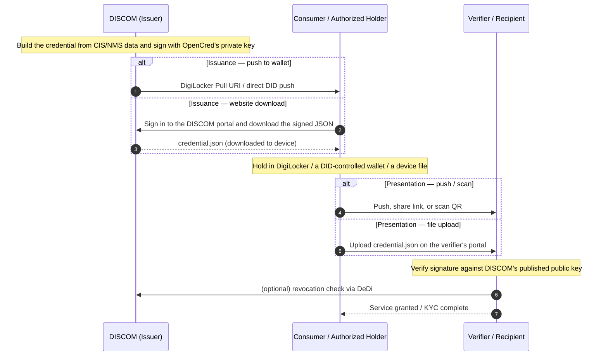

# Energy Credentials

The trust layer. W3C Verifiable Credentials, signed by a DISCOM's `did:web`, delivered through wallets (DigiLocker or DID-aware), a web portal, or any channel the issuer already runs. Credential flows stand on their own — issuing, holding and verifying a credential requires **no Beckn network**. This page is the **reference** for the credential lifecycle, the variants IES uses, and the trust model. The operational commands — run OpenCred, issue, verify, revoke — are in **[Issue Credentials](../issue-credentials.md)**; identity prerequisites are in **[Setup Register](../setup-register.md)**.

---

## Why credentials

When a DISCOM hands a consumer a digital electricity attestation, or shares meter readings with a regulator or a marketplace, the receiver needs to answer one question on their own: *"Is this really from the DISCOM, intact, and still valid?"* If they have to call you, the system does not scale and is not really verifiable.

A **Verifiable Credential** is a small JSON object you sign with the private key behind your `did:web`. Anyone — a wallet, another DISCOM, a bank, a regulator — can fetch your `did.json` over HTTPS, check the signature, and consult a public revocation list. No callback to you required. That is what makes this the **B2C rail**: the verifier can be *anyone*, known to you or not, and the credential can travel over *any* channel — DigiLocker, a portal download, email, SMS, chat — because the trust is inside the object, not the pipe.

Three credentials cover almost everything IES does:

| Credential | What it attests | Who signs | Typical receiver |
|---|---|---|---|
| **[ElectricityCredential v1.2](https://india-energy-stack.gitbook.io/docs/schemas/electricitycredential/v1.2)** | A service connection — customer number, sanctioned load, tariff, meter info, energy resources (rooftop solar, BESS, EV chargers) | DISCOM | The consumer's wallet, or a verifier (bank, marketplace, regulator) the consumer shares it with |
| **[MeterDataCredential v0.6](https://india-energy-stack.gitbook.io/docs/schemas/meterdatacredential/v0.6)** | A signed meter-reading payload (raw `MeterData` profiles or derived summaries) for a specified period | AMISP, MDM, or DISCOM | DISCOM (B2B telemetry) or the consumer (their own readings) |
| **[MeterDataRequestCredential v0.1](https://india-energy-stack.gitbook.io/docs/schemas/meterdatarequestcredential/v0.1)** | A signed request for meter data — proves the requester has the right to ask | Seeker (typically a DISCOM) | Provider (typically an AMISP) at Beckn `confirm` time |

### Lifecycle at a glance



```
Issued ─► Held / presented ─► Verified ─► (eventually) Revoked or expired
```

- **Issued**: the issuer signs and emits the credential JSON.
- **Held**: a wallet or DigiLocker stores it.
- **Presented**: the holder shares it (raw or in a Verifiable Presentation) with a verifier.
- **Verified**: the verifier checks the issuer's signature, the regulator's `idRef` if present, revocation status, and the validity window.
- **Revoked**: the issuer publishes a hash in the DeDi revocation registry. Verifiers reject revoked credentials.
- **Expired**: `validUntil` passes. Issue a fresh credential on material change (rate revision, meter swap, ownership transfer) rather than relying on long expiry windows.

## Pick your role

| If you are… | Read | Then |
|---|---|---|
| **A DISCOM / issuer** (you sign and emit credentials) | [Setup Register §1.1–1.4](../setup-register.md) → [Issue Credentials](../issue-credentials.md) | [Credential variants](#credential-variants) below, [Build your Internal-facing Adapter](../build-adapter.md) |
| **An AMISP / MDM / aggregator** (you sign telemetry) | Same, issuing `MeterDataCredential` | [Smart Meter Data Exchange use case](../../use-cases/smart-meter-data-exchange/README.md) |
| **A holder / wallet** (you hold credentials on behalf of a consumer) | [Holder binding](#holder-binding) → [DigiLocker delivery](digilocker.md) | [Issue Credentials — Holder binding](../issue-credentials.md#appendix-binding-the-credential-to-a-holder-identity) for binding patterns |
| **A verifier** (you receive and check credentials) | [Trust model](#trust-model) below | [Issue Credentials — Verify a credential you received](../issue-credentials.md#verify-a-credential-you-received-the-verifiers-walkthrough) for the step-by-step |

---

## Credential variants

The same schemas cover several use cases. **No new VC `type` values are introduced** — the variants are issuance configurations over the existing schemas. The issuance commands for each are in [Issue Credentials](../issue-credentials.md#issue-the-credential-variants).

### ElectricityCredential v1.2 — the default

A DISCOM-signed attestation about a service connection. Carries `customerProfile` (non-PII: customer number, energy resources, consumption profile), `customerDetails` (optional PII: name, address, service-connection date), and the issuer block. Two common shapes:

- **Bearer / counter-issued** (no `credentialSubject.id`). Anyone holding the JSON is treated as the subject. Used for paper-style attestations, demos, or in-person verification.
- **Holder-bound, consumer-presentable** — the **Consumer Energy Passport** pattern. Same schema, but `credentialSubject.id` is the consumer's wallet `did:key` (or `did:jwk`), `customerProfile.idRef` carries a verifiable government-ID *reference* (never the raw number), and at presentation time the wallet proves control of the key via a challenge-signed Verifiable Presentation. The [Consumer Energy Passport use case](../../use-cases/consumer-energy-passport/README.md) is about *who*, *when*, and *why* this shape is issued; the credential itself is an ElectricityCredential v1.2.

### MeterDataCredential v0.6 — telemetry signing

A signed VC wrapping a [MeterData v0.6](https://india-energy-stack.gitbook.io/docs/schemas/meterdata/v0.6) payload (raw `INTERVAL`/`DAILY`/`MONTHLY` profiles or derived summaries) for a specified period. Two common shapes:

- **B2B**, typically without `credentialSubject.id`. The AMISP signs; the DISCOM consumes the payload.
- **Holder-bound, consumer-presentable** — the **Consumer Meter Digest** pattern. `credentialSubject.id` is the consumer's wallet DID, `validUntil` is short (hours to days), and the readings cover a period the consumer asked for. Delivered into the consumer's wallet / DigiLocker; verifiers (banks, marketplaces) check it without phoning the DISCOM. Use case: [Consumer Meter Digest](../../use-cases/consumer-meter-digest/README.md).

### MeterDataRequestCredential v0.1 — proof of right-to-ask

A signed VC carried at Beckn `confirm` time by a seeker (typically a DISCOM) when an AMISP's offer policy requires it — the one credential that rides *inside* a Beckn message. Proves the seeker has been authorised to request the data they're confirming. Schema: [MeterDataRequestCredential v0.1](https://india-energy-stack.gitbook.io/docs/schemas/meterdatarequestcredential/v0.1); ready-to-send `confirm` payloads live in the [DEG data-exchange devkit](https://github.com/beckn/DEG/tree/main/devkits/data-exchange/uc1-meter-data).

### Summary

| Pattern | Schema | `credentialSubject.id` | `validUntil` | Issued by |
|---|---|---|---|---|
| Bearer ElectricityCredential | `ElectricityCredential/v1.2` | absent | years | DISCOM |
| Consumer Energy Passport | `ElectricityCredential/v1.2` | wallet `did:key` (+ `customerProfile.idRef`) | years | DISCOM |
| B2B MeterDataCredential | `MeterDataCredential/v0.6` | absent | hours to days | AMISP / MDM |
| Consumer Meter Digest | `MeterDataCredential/v0.6` | wallet `did:key` | hours to days | DISCOM (on consumer demand) |
| Meter-data request | `MeterDataRequestCredential/v0.1` | absent | minutes (per Beckn message) | Seeker (typically DISCOM) |

---

## Holder binding

Holder binding turns a credential from a bearer token into something only the consumer's wallet can present. Choose a pattern (wallet DID, `tel:+91...` URI, or DigiLocker-mediated) based on the consumer's situation. **Identity-proofing at issuance is mandatory** — you must verify the consumer controls the identifier before embedding it.

Full patterns, presentation-time flows, and the adopter checklist: **[Issue Credentials — Binding the credential to a holder identity](../issue-credentials.md#appendix-binding-the-credential-to-a-holder-identity)**.

---

## DigiLocker delivery

DigiLocker is the dominant consumer wallet in India. Once issued, an ElectricityCredential or MeterDataCredential can be delivered into a consumer's DigiLocker via a Pull URI, and any verifier reading from DigiLocker inherits DigiLocker's Aadhaar-mediated identity binding.

Walkthrough (Pull URI shape, callback flow, signature pinning, common failure modes): **[DigiLocker delivery](digilocker.md)**.

---

## Trust model

A credential's trust chain has at most two legs, plus two freshness checks:

1. **Mandatory** — the issuer's `did:web` signature. A verifier resolves `issuer.id` over HTTPS to `did.json`, extracts the public key, and verifies `proof`. If this fails, stop — the credential is forged or corrupted.
2. **Optional** — the regulator's licensing assertion in `issuer.idRef`. When present, the verifier resolves `issuer.idRef.issuedBy` (the regulator's `did:web`) and confirms the regulator vouches for the DISCOM under the cited `subjectId`. When absent (pilots, non-regulated issuers), the verifier falls back to whatever out-of-band recognition they have of your `did:web`.
3. **Revocation status** — the URL in `credentialStatus.id`, resolved against the issuer's DeDi revocation registry.
4. **Validity window** — `validFrom <= now <= validUntil`.

Holder-bound variants add a fifth check at presentation time: the wallet signs a Verifiable Presentation with the key matching `credentialSubject.id`, embedding a fresh `challenge` and `domain`.

The verifier's step-by-step (with URLs and expected responses) is in [Issue Credentials — Verify a credential you received](../issue-credentials.md#verify-a-credential-you-received-the-verifiers-walkthrough). No IES-curated registry sits between the credential and the verifier — the IES network registries are the Beckn-side (B2B) trust boundary only; see [Register — Two identities](../../what-ies-provides/register.md#two-identities-youll-set-up-and-why).

### Proof formats

| Format | When to choose | Where it shines |
|---|---|---|
| `vc-jwt` (default) | Most flows | Compact wire form, easy to embed in headers, fast to verify |
| `data-integrity` | Custom-registered clean-context schemas | Linked-data-friendly, supports selective disclosure variants |
| `sd-jwt-vc` | Selective disclosure | The holder presents only chosen fields to each verifier |

---

## Core concepts

For readers new to verifiable credentials. Skip if you're mid-deployment.

### What's a Verifiable Credential

A **Verifiable Credential (VC)** is a JSON object with three properties:

- Who made the statement (`issuer`).
- The statement itself (`credentialSubject`).
- A cryptographic proof (`proof`) so anyone can verify the issuer signed it.

The IES profile uses the [W3C VC Data Model 2.0](https://www.w3.org/TR/vc-data-model-2.0/). Required top-level fields: `@context`, `id`, `type`, `issuer`, `validFrom`, `credentialSubject`. Optional: `validUntil`, `credentialStatus`, `evidence`, `name`, `description`. The `proof` is added by the signing step.

### What's a DID

A **Decentralized Identifier (DID)** is a globally unique string that resolves to a DID document — a small JSON object listing the subject's current public keys. IES uses three standard W3C methods (`did:web` for institutions, `did:key` / `did:jwk` for consumer wallets); there is no `did:dedi` method — DeDi is a key-discovery and registry layer over `did:web`. Full treatment: [Register — The DID methods IES uses](../../what-ies-provides/register.md#the-did-methods-ies-uses).

---

## References

- [Register](../../what-ies-provides/register.md) — DIDs, identifier patterns, DeDi, holder identifiers
- [Issue Credentials](../issue-credentials.md) — the operational walkthrough: run OpenCred, issue, verify, revoke
- [Schemas](../../schemas/README.md) — canonical schema mirrors for ElectricityCredential, MeterData(Credential), MeterDataRequest(Credential)
- [DigiLocker delivery](digilocker.md) — Pull URI, callback, signature pinning
- [Use cases — Consumer Energy Passport](../../use-cases/consumer-energy-passport/README.md), [Consumer Meter Digest](../../use-cases/consumer-meter-digest/README.md), [Smart Meter Data Exchange](../../use-cases/smart-meter-data-exchange/README.md)
- [OpenCred upstream documentation](https://opencred.gitbook.io/docs)
