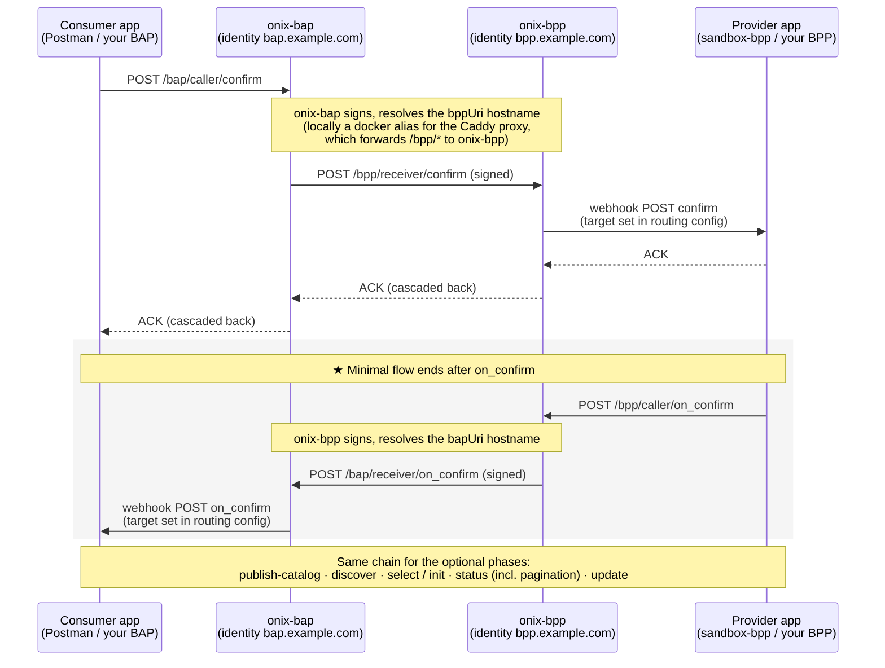

# Setup Discovery

> **Step 3 of the implementation path — set up.** Stand up the [Beckn](../glossary.md#beckn) adapter — the ready-made "ONIX" reference software — run a local end-to-end exchange, then swap in your real identity and go live on the IES network. This is the **B2B rail**: structured datasets moving between registered organisations over a trust-bounded open network. About 1–2 days.

The concepts — why Beckn, what the network provides, the protocol lifecycle — are in **[What IES Provides → Discover](../what-ies-provides/discover.md)**. This page is the do-guide; the wire-level reference (message envelope, pagination, architecture) is in the [appendices](#appendices) below.

> **About the walkthrough.** The commands use the [DEG Data Exchange devkit](https://github.com/beckn/DEG/tree/main/devkits/data-exchange) — a ready-to-run Docker stack that bundles the **[ONIX](../glossary.md#onix)** Beckn protocol adapter (signing, verification, registry lookup), a sandbox BAP/BPP pair, and a Caddy router. ONIX is the recommended adapter for IES; if you already run one, swap it in — the wire format and registry contracts are the same.

---

## What you'll have at the end

- A running ONIX container that speaks Beckn (`confirm` / `status` / `discover` / `on_*`).
- A verified local `confirm` → `on_confirm` round-trip, then the same over the public internet.
- ONIX configured with your own subscriber identity and network boundary (`allowedNetworkIDs`).
- A clear picture of the two places your own application plugs in.

After this you can issue and respond to requests on the IES network. You still need **[Build your Internal-facing Adapter](build-adapter.md)** before you can return real data from your internal systems.

## Before you start

From **[Setup Register](setup-register.md)** you need, for the real-network sections (§3.3 onward; the local sandbox §3.1–3.2 needs none of it):

- A verified DeDi namespace (§1.4).
- Your Ed25519 keypair (§1.5), published subscriber record with its **record ID** (§1.6), and the IES network reference written by the Secretariat (§1.7).

On this machine:

- **Docker 24+**, **Docker Compose**, **Git**, **Python 3**, and **Postman** *(or `curl`)*. ~2 GB free disk.

**Domains to whitelist** — if your organisation restricts outbound traffic, allow these before starting:

| Purpose | Domain |
|---|---|
| Devkit and related repos | `https://github.com/beckn` |
| Discovery service (DS) — where ONIX routes `discover` | `https://34.93.165.42.sslip.io` |
| Catalog service (CS) + DeDi registry lookups | `https://fabric.nfh.global` |
| DeDi publishing | `https://publish.dedi.global` |
| Schema contexts | `https://schema.beckn.io`, `https://schema.nfh.global`, `https://raw.githubusercontent.com` |
| IES docs and hosted schemas | `https://india-energy-stack.gitbook.io/docs`, `https://india-energy-stack.github.io` |

The devkit ships pre-configured sandbox identities (`bap.example.com` / `bpp.example.com`) — no real credentials needed for the local walkthrough.

---

## 3.1 — Deploy the local sandbox

```bash
git clone https://github.com/beckn/DEG.git
cd DEG/devkits/data-exchange/install
docker compose up -d
```

This brings up two ONIX adapters (`onix-bap`, `onix-bpp`), two sandbox stand-in apps (`sandbox-bap`, `sandbox-bpp`), a Caddy router, and Redis — pre-wired with placeholder identities so you can test end-to-end on your laptop before plugging in your own. What each container does is in [Appendix C — Architecture](#appendix-c-architecture-at-a-glance).

Verify the services:

```bash
docker compose ps
curl -s http://localhost:8081/health
curl -s http://localhost:8082/health
curl -s http://localhost:9000/
```

Expected: `docker compose ps` shows all 7 containers running (redis/sandbox: healthy); the two `/health` endpoints return `{"status":"ok"}` (onix-bap on 8081, onix-bpp on 8082); port 9000 returns `beckn-router ok`.

If checks fail, give ONIX ~15 s after `docker compose up` to initialise, then re-curl. Persistent `connection refused` usually means a container isn't running — `docker compose logs onix-bap` / `onix-bpp` shows why.

## 3.2 — Run your first exchange

**Import the Postman collection** for your use case. Each use case ships matching BAP and BPP collections; import the **BAP** one:

```
devkits/data-exchange/uc1-meter-data/postman/data-exchange-uc1-meter-data.BAP-DEG.postman_collection.json
devkits/data-exchange/uc2-regulatory-data/postman/data-exchange-uc2-regulatory-data.BAP-DEG.postman_collection.json
devkits/data-exchange/uc3-tariff-policy/postman/data-exchange-uc3-tariff-policy.BAP-DEG.postman_collection.json
```

Defaults are correct for local runs — don't change `beckn_adapter_url` (`http://localhost:8081/bap/caller`) or the `bap_host_root` / `bpp_host_root` docker hostnames. The two layers of URL are explained in [Appendix E — Hostnames](#appendix-e-hostnames-sandbox-vs-production).

**Send `confirm`.** Open the `confirm` request in Postman and click **Send**.

Expected: the synchronous response is the **ACK envelope** — `{"message":{"status":"ACK","messageId":<id>}}` — meaning *"accepted, async callback pending"*. The ACK originates at the provider's webhook and cascades back through the adapters to Postman.

**Watch `on_confirm` land.** Tail the BAP sandbox logs:

```bash
docker logs sandbox-bap 2>&1 | grep on_confirm | tail -5
```

Expected: an `on_confirm` entry. Its body carries the dataset (inline) or a handle pointing to a later `on_status`. Either way, seeing `on_confirm` in `sandbox-bap` is your end-to-end signal.

If nothing arrives: (a) check `bap_host_root` / `bpp_host_root` are still the docker hostnames, (b) `docker logs onix-bap | grep -i error` and the same for `onix-bpp`, (c) host-alias DNS — see [beckn/DEG#319](https://github.com/beckn/DEG/issues/319).

**BPP path.** Same sanity check in reverse — import the **BPP** collection, trigger `on_confirm`, and tail `docker logs sandbox-bpp 2>&1 | grep -E 'confirm|status' | tail -5`. To replace the sandbox with your own provider, see [§3.6](#id-3.6-make-the-sandbox-your-own).

**Stop the stack** when done:

```bash
docker compose down
```

## 3.3 — Swap in your real identity

**Prerequisite:** Setup Register §1.5–1.7 — your Ed25519 keypair, subscriber record + record ID, and network reference.

The walkthrough so far ran on the shipped sandbox identities. To join the IES networks, replace them with yours in [`config/local-simple-bap.yaml`](https://github.com/beckn/DEG/blob/main/devkits/data-exchange/config/local-simple-bap.yaml) (and the matching `local-simple-bpp.yaml`):

```yaml
modules:
  - name: bapTxnReceiver
    handler:
      plugins:
        registry:
          id: dediregistry
          config:
            url: "https://fabric.nfh.global/registry/dedi"
            allowedNetworkIDs: "indiaenergystack.in/test-ies-data-sharing-network"
            timeout: 30
            retry_max: 3
        keyManager:
          config:
            networkParticipant: your.subscriber.id
            keyId: <recordId-from-DeDi>
            signingPrivateKey: <base64-ed25519-private>
            signingPublicKey:  <base64-ed25519-public>
```

| Value from Setup Register | ONIX YAML path |
|---|---|
| Your `subscriber_id` (§1.6) | `plugins.keyManager.config.networkParticipant` |
| Your record ID (§1.6) | `plugins.keyManager.config.keyId` |
| Your Ed25519 **private** key (§1.5) | `plugins.keyManager.config.signingPrivateKey` *(Base64, 32-byte seed)* |
| Your Ed25519 **public** key (§1.5) | `plugins.keyManager.config.signingPublicKey` *(matches what you published in DeDi)* |
| Network you were referenced into (§1.7) | `plugins.registry.config.allowedNetworkIDs` *(comma-separated string)* |

**`allowedNetworkIDs` is your trust boundary.** A subscriber record on DeDi carries a `network_memberships[]` field listing every network the subscriber has been referenced into. On each inbound message, ONIX's [`dediregistry`](https://github.com/beckn/beckn-onix/tree/main/pkg/plugin/implementation/dediregistry) plugin looks the sender up and intersects their memberships with this list — a sender outside it is rejected with `registry entry with subscriber_id '...' does not belong to any configured networks`. Rules of thumb:

- **Use full network IDs**, not bare registry names — `indiaenergystack.in/ies-data-sharing-network`, not `ies-data-sharing-network`.
- **Leaving `allowedNetworkIDs` unset accepts everything.** Useful for a discovery / catalogue node; never the right setting for a transactional BAP / BPP.
- **One ONIX instance per environment** — see [§3.5](#id-3.5-two-registries-two-onix-deployments). Configure the prod instance with prod-network IDs and the test instance with `test-` IDs only.
- The older config key `allowedParentNamespaces` is **deprecated**; the plugin errors until you migrate to `allowedNetworkIDs`.

After the config swap, restart the stack and re-import the same Postman collection — only the identity ONIX signs with and the network it claims change. Use the same network ID in every payload's `context.networkId`: ONIX rejects messages whose `networkId` isn't in its `allowedNetworkIDs`. Stay on the **test network** (`indiaenergystack.in/test-ies-data-sharing-network`) until certified — see [Conformance](conformance.md).

## 3.4 — Go over the public internet (ngrok)

Once the local exchange is green, prove the same stack interoperates through a real public tunnel — typically with another participant's laptop or a cloud host:

1. Create a free [ngrok](https://ngrok.com) account; copy the devkit's tunnel config and add your authtoken:

   ```bash
   cd DEG/devkits/data-exchange/install
   cp ngrok.yml.example ngrok.yml
   ngrok start --all --config ngrok.yml
   ```

   (Edit `ngrok.yml` to paste your authtoken before starting.)

2. In Postman, set `bap_host_root` / `bpp_host_root` to the HTTPS URL ngrok prints (e.g. `https://abc123.ngrok-free.dev`) — docker-only dummy hostnames aren't reachable from outside, so the payload URIs must carry your public tunnel URL.
3. Fire `confirm` again; watch the hops in the ngrok inspector at [http://localhost:4040](http://localhost:4040).
4. For two-party interop, each side runs its own tunnel and points `bpp_host_root` (or `bap_host_root`) at the *other side's* URL. Revert the host variables to `http://beckn-router:9000` to return to local-only.

Full recipe: [devkit README — Over-the-internet notes](https://github.com/beckn/DEG/blob/main/devkits/README.md#over-the-internet-notes).

## 3.5 — Two registries, two ONIX deployments

The recommended production pattern — keep test and prod cleanly separated:

1. **Run two ONIX deployments — test and prod — on separate hostnames** (e.g. `test.example-np.com` and `beckn.example-np.com`). Each has its own TLS cert, its own keypair, its own DeDi subscriber record under your namespace, in two separate subscriber registries (`subscribers-test` / `subscribers-prod` from [Setup Register §1.6](setup-register.md#id-1.6-beckn-participants-publish-your-beckn-subscriber-record)) so they cannot be confused.
2. **`allowedNetworkIDs` is set narrowly on each side.** Test ONIX accepts only `indiaenergystack.in/test-ies-data-sharing-network`; prod ONIX accepts only `indiaenergystack.in/ies-data-sharing-network`. Cross-network traffic is rejected at the adapter — no stray test message can reach a prod counterparty.
3. **Phased onboarding:** start in test → certification ([Conformance](conformance.md)) → IES references your *prod* subscriber DeDi URL into the prod network → from that moment your prod ONIX is allowed to transact with production NPs. Test stays useful for staging upgrades and certifying new use cases.

To run two devkit stacks side-by-side on the same host: copy `install/` to `install-prod/`, edit the published ports (`8081→8181`, `8082→8182`, `9000→9100`), adjust the `Caddyfile` listener, and use separate compose project names:

```bash
docker compose -p ies-test -f install/docker-compose.yml      up -d
docker compose -p ies-prod -f install-prod/docker-compose.yml up -d
```

In real production each stack would typically run on a separate host or VM with its own TLS termination. See [devkit README — Hosting the site](https://github.com/beckn/DEG/blob/main/devkits/README.md#hosting-the-site-beyond-the-devkit) for the patterns.

## 3.6 — Make the sandbox your own

When you outgrow the sandbox, your app connects to ONIX in exactly two places — `bapUri` / `bppUri` are *not* one of them (those always point at ONIX receivers):

- **Inbound** — after verifying a message, ONIX forwards it to the **webhook URL set in the routing config** ([`config/local-simple-routing-BAPReceiver.yaml`](https://github.com/beckn/DEG/blob/main/devkits/data-exchange/config/local-simple-routing-BAPReceiver.yaml) / `…-BPPReceiver.yaml`). Take over that URL and you've replaced the sandbox.
- **Outbound** — your app POSTs messages to ONIX's `caller` endpoint.

**BAP.** Stand up a service with a webhook endpoint for the `on_*` callbacks your flow needs, reachable from `onix-bap`. Change `target.url` in `local-simple-routing-BAPReceiver.yaml` from `http://sandbox-bap:3001/api/bap-webhook` to your service, restart `onix-bap`, then stop `sandbox-bap`.

**BPP.** Your provider receives requests (`confirm`, `status`, …) on the webhook set in `local-simple-routing-BPPReceiver.yaml` (devkit default: `http://sandbox-bpp:3002/api/webhook`). Acknowledge each with the ACK envelope, then respond asynchronously by POSTing the matching callback to `http://onix-bpp:8082/bpp/caller/on_<action>` — copy the wire shape from `uc*/examples/on-*-response*.json` and swap in your real data.

You can also build the bundled [beckn/sandbox](https://github.com/beckn/sandbox) image yourself, modify the canned fixtures and handlers in `src/`, and use `sandbox-2.0:local` as a stepping stone before swapping in your own service.

This is where **[Build your Internal-facing Adapter](build-adapter.md)** picks up — the webhook service you wire in here is the Part-2 mapping you build there.

## 3.7 — Test the end-to-end loop

With your real identity configured, run a `discover` (or `confirm`) from your BAP to a sandbox BPP or a peer's BPP on the test network. Verify:

- Your message signature is accepted (your Ed25519 key resolves through DeDi).
- The counterparty's response signature verifies (their key resolves through DeDi).
- Discovery returns a catalogue / `on_confirm` returns data.
- ONIX's network-membership check passes (both subscribers are referenced into the same IES network registry).

If all four pass, Setup Discovery is done.

---

## Checklist

- [ ] Local sandbox up; `confirm` → `on_confirm` round-trip observed in `sandbox-bap` logs
- [ ] Same round-trip over a public tunnel (ngrok) with a second party
- [ ] ONIX configured with your subscriber ID, record ID, Ed25519 keypair, and `allowedNetworkIDs`
- [ ] End-to-end loop on the **test** network succeeds against a counterparty (all four §3.7 checks)
- [ ] Test/prod separation planned: two ONIX deployments, two subscriber registries, narrow `allowedNetworkIDs` each

When all five are ticked, move on to **[Build your Internal-facing Adapter](build-adapter.md)**.

---

# Appendices

Wire-level reference for implementers. Skip on first read; come back when you're building the adapter or debugging.

## Appendix A — Message envelope and correlation rules

Every Beckn message shares the same envelope (v2.0 wire format, camelCase):

```json
{
  "context": {
    "networkId": "indiaenergystack.in/test-ies-data-sharing-network",
    "version": "2.0.0",
    "action": "confirm",
    "bapId": "bap.example.com",
    "bapUri": "https://bap.example.com/bap/receiver",
    "bppId": "bpp.example.com",
    "bppUri": "https://bpp.example.com/bpp/receiver",
    "transactionId": "b2c3d4e5-f6a7-8901-bcde-f12345678901",
    "messageId": "1e2f3a4b-5c6d-7890-4567-890123456789",
    "timestamp": "2026-04-01T09:25:00Z",
    "schemaContext": ["https://schema.beckn.io/DatasetItem/v1.1/context.jsonld"]
  },
  "message": { /* action-specific payload */ }
}
```

Two correlation rules from the Beckn v2.0 spec — every implementation honours them so participants and audit trails can stitch related messages together:

- **`transactionId` is constant** across every message in one exchange. From the first `discover` / `select` / `confirm` to the final `on_status` / `on_update`, the same UUID flows through.
- **`messageId` is shared** by a request and its paired `on_*` callback; each new request gets a new one. Treat the pair as one logical message with two hops.

Authoritative reference: [beckn/protocol-specifications-v2 — `api/v2.0.0`](https://github.com/beckn/protocol-specifications-v2/tree/main/api/v2.0.0).

### `DatasetItem` and `accessMethod`

The resource a data exchange agrees on is a **dataset**. **`DatasetItem`** (from [DDM](../glossary.md#ddm), Beckn's Decentralized Data Marketplace schema family) is the per-dataset record shape that rides inside `message.contract.commitments[].resources[]`, qualified by `resourceAttributes`:

```json
"resources": [{
  "id": "ds-ami-meter-data-blr-zone-a-q1-2026",
  "descriptor": { "name": "IntelliGrid AMI Meter Data — Bengaluru Zone A — Q1 2026" },
  "resourceAttributes": {
    "@context": "https://schema.beckn.io/DatasetItem/v1.1/context.jsonld",
    "@type": "DatasetItem",
    "accessMethod": "INLINE",
    "dataPayload": { /* inline MeterData, ArrFiling, ... */ }
  }
}]
```

`accessMethod` values:

| Mode | Description |
|---|---|
| `INLINE` | Embedded in the Beckn callback message (typically `on_confirm` or paged `on_status`) |
| `DOWNLOAD` | BPP provides a signed download URL + checksum |
| `MQTT` / `KAFKA` / `API` / `DATA_LAKE` | Streaming transports — connection credentials in `on_confirm.performance[].performanceAttributes` |
| `DATA_ENCLAVE` | Data accessible only within a secure compute environment |
| `OFF_CHANNEL` | Delivery through an agreed out-of-band channel |

IES Data Exchange today primarily uses `INLINE` (often paged via [Appendix B](#appendix-b-pagination-large-datasets-across-multiple-status-on_status-messages)) — data arrives as part of the protocol message, making the exchange end-to-end verifiable.

## Appendix B — Pagination: large datasets across multiple `status` / `on_status` messages

When a dataset is too large to fit in a single `on_confirm` (e.g. a quarter of AMI interval reads for a 500-meter feeder), the BAP and BPP exchange the payload across multiple `on_status` messages — one **page** per message. Two complementary patterns are in active use in the devkit:

### BAP-PULL — the BAP drives the cadence

1. **First page.** The BAP sends `status` **without** a `pageCursor` (or omits the `pagination` tag entirely). The BPP treats a missing cursor as page 0.
2. **Subsequent pages.** The BPP's `on_status` carries `pageInfo.nextCursor` (and `pageInfo.isLast: false`). The BAP issues a new `status` with that cursor.
3. **Done.** The BAP keeps pulling until `pageInfo.nextCursor` is null **and** `pageInfo.isLast` is `true`. It then assembles all `dataPayload` slices and runs downstream processing.

**Where the cursor lives on the request.** Beckn v2 `Contract` is a closed schema and cannot host tags directly; `context.tags` is reserved for routing / transaction state. The pagination cursor therefore rides on `message.tags`:

```json
{
  "context": {"action": "status", "transactionId": "...", "messageId": "...", "timestamp": "..."},
  "message": {
    "tags": [{
      "descriptor": {"code": "pagination"},
      "list": [
        {"descriptor": {"code": "pageCursor"},   "value": "ami-meter-blr-zone-a-q1-p2"},
        {"descriptor": {"code": "collectionId"}, "value": "ami-meter-blr-zone-a-q1-2026"}
      ]
    }],
    "contract": { "id": "<contract-id>" }
  }
}
```

**Where `pageInfo` lives on the response.** The BPP's `on_status` carries the slice in `message.contract.performance[].performanceAttributes`, alongside a `pageInfo` block:

```json
"performanceAttributes": {
  "@context":  "https://schema.beckn.io/DatasetItem/v1.1/context.jsonld",
  "@type":     "DatasetItem",
  "dataPayload": [ /* this page's slice of CustomerProfile / IntervalProfile entries */ ],
  "pageInfo": {
    "@type":        "PageInfo",
    "sequence":     1,
    "pageSize":     167,
    "total":        500,
    "isLast":       false,
    "cursor":       "ami-meter-blr-zone-a-q1-p2",
    "nextCursor":   "ami-meter-blr-zone-a-q1-p3",
    "collectionId": "ami-meter-blr-zone-a-q1-2026"
  }
}
```

The cursor is **opaque** to the BAP — it's the BPP's internal identifier for the next slice. Echo it back unchanged.

### BPP-PUSH — the BPP drives the cadence

1. **The BPP fires several back-to-back `on_status` messages**, each with its own slice of `dataPayload` and a `pageInfo` carrying `sequence`, `isLast`, and `collectionId`. The BAP accumulates entries across all messages with the same `(transactionId, collectionId)`.
2. **Done.** The BAP only triggers downstream processing once it sees `pageInfo.isLast: true`.

`pageInfo.cursor` / `nextCursor` are unused in push mode (the BAP isn't requesting anything); `sequence` and `isLast` are what matter.

### Worked examples in the devkit

The on-the-wire payloads (with sample interval reads and the full `pageInfo` block) live next to each use case:

- BAP-PULL: [`uc1-meter-data/.../status-request-paged-pull.json`](https://github.com/beckn/DEG/tree/main/devkits/data-exchange/uc1-meter-data) + matching `on-status-response-paged-pull.json`.
- BPP-PUSH: `on-status-response-paged-push-p1.json`, `…-p2.json`, `…-p3.json` (with `isLast: true` on the last one).

Both patterns share the same `transactionId` across every message in the exchange — see [Appendix A](#appendix-a-message-envelope-and-correlation-rules).

## Appendix C — Architecture at a glance

Your application never speaks Beckn directly — it talks to **ONIX**, which exposes a `caller` endpoint (where your app hands it outbound messages to sign and dispatch) and a `receiver` endpoint (where the network delivers inbound messages, which ONIX verifies and forwards to your app's webhook). One caller / receiver pair per role — `/bap/caller`, `/bap/receiver`, `/bpp/caller`, `/bpp/receiver` — and one ONIX deployment can host any combination under one identity. **Roles are configuration, not separate software.**

The devkit simulates **two participants** (`bap.example.com` and `bpp.example.com`), so it runs two ONIX containers on mutually isolated docker networks:

```
                    beckn-router :9000   (Caddy reverse proxy — stands in for
                    /                  \    the internet + public hostnames)
        /bap/*    <                      >    /bpp/*
                  /                      \
   ─── bap_side ──┘                        └── bpp_side ───
   onix-bap     :8081                       onix-bpp     :8082
   sandbox-bap  :3001                       sandbox-bpp  :3002
   redis                                    redis
```

| Component | Role |
|---|---|
| `onix-bap` / `onix-bpp` | Beckn protocol adapter — signs, verifies, validates `dataPayload`, dispatches, forwards inbound to the app webhook |
| `sandbox-bap` | Consumer-side stand-in app — receives `on_*` callbacks on its webhook and logs them |
| `sandbox-bpp` | Provider-side stand-in app — receives requests on its webhook and auto-responds with example payloads via `/bpp/caller` |
| `beckn-router` | Plain Caddy reverse proxy — routes by path (`/bap/*` → `onix-bap`, `/bpp/*` → `onix-bpp`) and carries the dummy participant hostnames as docker aliases. **Not a Beckn entity** — deployment plumbing |
| `redis` | Per-side message cache used by ONIX |

### The four ONIX endpoints

| Endpoint | Role | Direction | Who calls it |
|---|---|---|---|
| `/bap/caller` | BAP | outbound | **Your consumer app** hands ONIX a request (`confirm`, `discover`, …) to sign and dispatch |
| `/bap/receiver` | BAP | inbound | **The network** (the counterparty's ONIX) delivers `on_*` callbacks here; ONIX verifies and forwards them to your app's webhook |
| `/bpp/caller` | BPP | outbound | **Your provider app** hands ONIX an `on_*` response to sign and dispatch |
| `/bpp/receiver` | BPP | inbound | **The network** delivers requests (`confirm`, `status`, …) here; ONIX verifies and forwards them to your provider's webhook |

What happens after a `receiver` verifies a message is defined in the [routing configs](https://github.com/beckn/DEG/tree/main/devkits/data-exchange/config) (`local-simple-routing-{BAPReceiver,BPPReceiver,BAPCaller,BPPCaller}.yaml`). The receiver routing config controls the webhook URL inbound messages are forwarded to — that's where you wire in your own app (§3.6).

### Identity resolution

When a message arrives, ONIX:

1. Reads the sender from the message context (`bapId` on a forward request, `bppId` on a callback).
2. Looks the sender up in the **[DeDi](../glossary.md#dedi) registry**: `GET https://fabric.nfh.global/registry/dedi/lookup/<subscriber_id>/subscribers.beckn.one/<record_id>`. The response carries the sender's callback URL, signing public key, and network memberships.
3. Cross-checks those memberships against the local `allowedNetworkIDs` config (§3.3). A sender outside the boundary of trust is rejected.
4. Verifies the signature.

Two participants on different (or non-overlapping) networks cannot reach each other through their ONIX adapters.

## Appendix D — Schema validation on the wire

The wire envelope accepts arbitrary JSON inside `dataPayload`; validation is **opt-in per object**, driven by JSON-LD self-description:

- **Payload declares `@context` + `@type` → ONIX validates it.** ONIX fetches the OpenAPI 3.x **`attributes.yaml` that sits next to the `context.jsonld`** named in `@context` (same URL, different filename — every IES / Beckn schema family publishes the pair side by side), and validates the object against the `components.schemas` entry whose name matches `@type` exactly (`DatasetItem`, `MeterData`, `ArrFiling`, …). A failed validation rejects the message.
- **Payload omits `@context` → ONIX passes it through.** Useful for prototyping a new dataset shape.

ONIX only fetches `@context` URLs from **allow-listed hosts** (default: `raw.githubusercontent.com`, `schema.beckn.io`). To validate payloads from your own schema repo, add the host to `extendedSchema` in your ONIX config.

### Failure modes

- `no schema found for @type: XYZ` — the `attributes.yaml` doesn't define a schema with that name. Either `@type` is wrong, or the schema file at the resolved URL doesn't include it.
- Schema validation error — the object is missing a required field, has the wrong type, or otherwise doesn't match the OpenAPI definition. ONIX includes the JSON path of the failure in the error.

### Publishing your own schema for ONIX to validate

1. Author an OpenAPI 3.x `attributes.yaml` with your schemas in `components.schemas`.
2. Author a JSON-LD `context.jsonld` mapping your field names to URIs.
3. Host both at a URL ONIX is allowed to reach — they must sit at the same path (`<base>/context.jsonld` and `<base>/attributes.yaml`).
4. In your payload, set `@context` to the context URL and `@type` to the matching schema name.

No code change in ONIX — the dispatch is purely URL-driven. The families under [Taxonomy](../schemas/README.md) and [beckn/DDM](https://github.com/beckn/DDM/tree/main/specification/schema/DatasetItem/v1.1) are working references for how to lay out the pair.

## Appendix E — Hostnames: sandbox vs production

The hostnames in `bapUri` / `bppUri` represent **participant identities**. In production they are your real public URLs, published in your DeDi subscriber record. In the devkit they are **dummy aliases that only resolve inside the docker network**: compose attaches `bap.example.com` and `bpp.example.com` as aliases of `beckn-router`, so dispatch lands on the Caddy proxy, which path-routes to the right ONIX `receiver`.

That gives two kinds of URL at different layers:

| Concern | Devkit sandbox | Real network |
|---|---|---|
| **HTTP target** — where your client (Postman, your app) POSTs `confirm`, `discover`, etc. | `http://localhost:8081/bap/caller` *(port-mapped to `onix-bap`)* | Your ONIX deployment URL behind TLS |
| **HTTP target** — where your provider POSTs `on_confirm` / `on_status` | `http://localhost:8082/bpp/caller` *(port-mapped to `onix-bpp`)* | Your ONIX deployment URL behind TLS |
| **Payload hostnames** — `bapUri` / `bppUri` in each message's `context`; resolved by the *sending* ONIX to reach the counterparty's `receiver` | `http://beckn-router:9000/{bap,bpp}/receiver` (or the docker aliases — both resolve to the proxy) | Your public callback URLs (matching what you published in your DeDi subscriber record) |
| `networkId`, `bapId` / `bppId`, `allowedNetworkIDs` | placeholder values shipped in `config/` | Your values (§3.3) |

Your Postman client never connects to `beckn-router` — it POSTs to the port-mapped `caller` endpoints (`:8081` / `:8082`); the payload variables substitute the docker-resolvable hostnames into the message body for ONIX to use.

## Appendix F — Generic Beckn flow (sequence diagram)



`beckn-router` is intentionally not a participant in this diagram — it's a path-only Caddy reverse proxy, not a Beckn entity. In production it's replaced by your own TLS-terminating reverse proxy.

---

## References

- [DEG Data Exchange devkit](https://github.com/beckn/DEG/tree/main/devkits/data-exchange) — the source for the walkthrough above (Postman collections, fixtures, configs)
- [Beckn ONIX](https://github.com/beckn/beckn-onix) — the protocol adapter; [`install/generate-ed25519-keys.go`](https://github.com/beckn/beckn-onix/blob/main/install/generate-ed25519-keys.go) for the Ed25519 keypair
- [Beckn Protocol v2.0.0 spec](https://github.com/beckn/protocol-specifications-v2/tree/main/api/v2.0.0)
- [Discover](../what-ies-provides/discover.md) — the concepts this page implements
- [Use cases](../use-cases/README.md) — end-to-end flows that exercise this protocol
