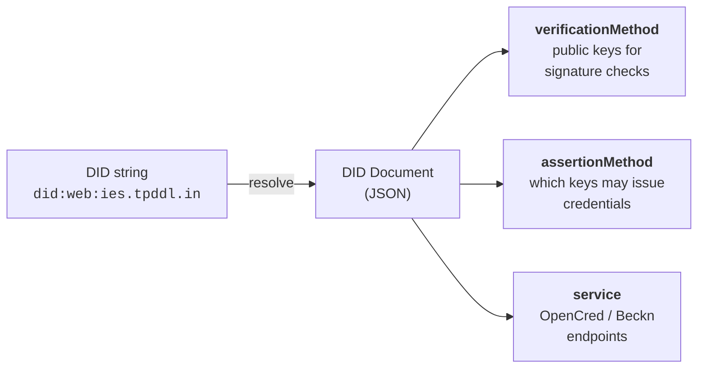

# Identifiers and Addressing

This page is the single home for everything IES has to say about identifiers. Read the first three sections and you will have enough to claim your DISCOM's identity on the network and issue your first credential. The appendices are there when you want more depth, want to issue at scale, or need to identify assets, meters, and datasets too.

> **About the walkthroughs.** The concrete commands below use [OpenCred](https://opencred.gitbook.io/docs) — an open-source SDK that packages DID generation, credential issuance, and revocation into a single Docker container, so you can get to a working issuer in an afternoon rather than wiring everything yourself. OpenCred is one option among many; any W3C-compliant issuer that signs with the same key and publishes the same `did.json` will produce credentials that verify identically on the network. If you already have an in-house signing pipeline, swap OpenCred for it and the rest of this page still applies. For deeper theory on DID methods and revocation, the [OpenCred concept pages](https://opencred.gitbook.io/docs/concepts/dids) are a good reference. This page focuses on the IES-specific framing — which method to pick when, what each identifier means inside an [ElectricityCredential v1.2](../schemas/ElectricityCredential/v1.2/README.md), and how internal numbering survives the wrapping.

---

## Why this matters

When your DISCOM hands a consumer a digital electricity credential, or shares meter data with a regulator, the recipient needs to answer one question on their own: *"Is this really from TPDDL?"* If they have to call you, email your IT team, or trust a screenshot, the system does not scale and it is not really verifiable.

The way digital-public-infrastructure stacks solve this is with **Decentralized Identifiers (DIDs)**. You publish a small JSON file on a web address you control. That file lists the public key you sign things with. Anyone — a wallet, another DISCOM, a regulator — can fetch that file over plain HTTPS and check signatures on their own. No central authority, no API key, no special middleware.

You need two things: **a domain you own** and **a key your IT team can generate**. The rest of this page shows what to put where.

---

## Two identities you'll set up (and why)

A DISCOM on IES needs **two** identifier setups, and they exist for different reasons. They use **different keys**, generated by different procedures (the credential-issuance key is an EC P-256 key generated as part of your OpenCred / signing-service setup; the Beckn network key is an Ed25519 keypair generated per the [NFH onboarding procedure](https://docs.nfh.global/beckn/creating-an-open-network/onboarding-network-participants#step-4-publish-your-subscriber-record)), and they live in different registries. They share only the organisational root — your domain — and serve different verifiers.

### (a) Org identity — for credentials and data-exchange payloads

This is your DISCOM's `did:web`. It is the issuer string on every ElectricityCredential you sign, and the root that **all the IDs you reference inside payloads** — meter DIDs, transformer DIDs, connection DIDs — extend by adding path segments. Verifiers of a credential resolve only this one DID to check your signature; the asset DIDs ride inside the signed payload as stable references.

| Who | Identifier method | What it looks like |
|---|---|---|
| **Your DISCOM (the issuer)** | `did:web` on a domain you own | `did:web:ies.tpddl.in` |
| **A regulator** | Same — `did:web` on their own domain | `did:web:ies.derc.gov.in` |
| **A consumer holding a credential** *(optional)* | A holder identifier — `did:key` (wallet) or `tel:+91...` ([RFC 3966](https://datatracker.ietf.org/doc/html/rfc3966)) — set when you want presentation-time proof of subject. See [Appendix F](#appendix-f--binding-the-credential-to-a-holder-identity). | `did:key:z6Mkj...` or `tel:+919876543210` |
| **Your meter / transformer / feeder** | `did:web` under your domain | `did:web:ies.tpddl.in:assets:meter:MET-001` |

Two steps get you here:

1. **Pick a domain or subdomain** you control (covered in the next section).
2. **Generate a key pair** and **publish a small `did.json` file** declaring the public key (Steps 1–6 of [Publish your `did:web`](#step-by-step-publish-your-didweb-and-run-opencred-locally)).

That is everything credential issuance requires. **You do not need to be listed in any IES-side DISCOM registry to issue credentials.** Verifiers fetch your `did.json` for the key and check the signature; that is the only mandatory leg of the trust chain. If you also have a regulator (DERC / KERC / etc.) who can vouch for your licence, set `issuer.idRef` to point at them — verifiers will resolve the regulator and treat the credential as licence-anchored. `issuer.idRef` is optional in both the [v1.2 schema](../schemas/ElectricityCredential/v1.2/README.md) and the [W3C VC Data Model 2.0](https://www.w3.org/TR/vc-data-model-2.0/#issuer); only `issuer.id` and `issuer.name` are required. The IES DISCOMs reference registry is a separate, **Beckn-side** concern — see (b) below.

Internal consumer numbers, meter SLNOs, and asset codes do **not** need to change — they ride inside the credentials you sign with this DID. The simplest first credential is **bearer-style** (no holder identifier) — anyone holding the JSON is treated as the subject, which is fine for paper or counter-issued credentials. When you want presentation-time proof that the presenter is the legitimate subject (typical for consumer-facing flows), bind the credential to a holder identifier — a wallet DID or a phone-number URI — per [Appendix F](#appendix-f--binding-the-credential-to-a-holder-identity).

### (b) Beckn network identity — for participating on a Beckn network

To send and receive Beckn messages (search, select, init, confirm, on_status…), your `did:web` is not enough on its own. Beckn is a **trust-bounded network**: the Network Facilitator Organisation (NFO) curates who is on the network, and counterparties verify each message against that membership boundary. Two registries enforce this boundary:

- **Your own Beckn subscriber registry** under your verified DeDi namespace — declares your callback URL, your role (BAP / BPP), and your Ed25519 signing public key. Other nodes look this up to verify your message signatures and route to you.
- **The NFO's network reference registry** — a curated allow-list of which subscribers belong to the network. For IES, this is also where a "DISCOM" is recognised as a network participant. The NFO writes a reference entry pointing at your subscriber record; counterparties then know your record is in-network.

Different key (Ed25519, not P-256), different registries (a Beckn subscriber registry under your DeDi namespace, plus an NFO-side reference; not `.well-known/did.json`), different consumer (other Beckn nodes, not credential verifiers). The setup is independent from the credential-issuance flow.

The end-to-end practical flow is in [Appendix E — Joining a Beckn network](#appendix-e--joining-a-beckn-network-subscriber-registry-on-the-beckn-fabric).

---

## Step-by-step: publish your `did:web` (and run OpenCred locally)

The practical setup is one JSON file on a web server you already run, plus a process that signs credentials with the matching private key. The walkthrough below uses the [OpenCred Docker image](https://opencred.gitbook.io/docs/bootcamp/local-docker) as the recommended signing process — it's an open SDK that handles the key-format plumbing for you so you can be issuing in an afternoon. OpenCred is the recommended issuer for IES but not mandatory: if you'd rather wire up signing in your own service, the published `did.json` and the credential format are unchanged; only Steps 1 and 3 (pull the image, run the container) become "use your existing signing service".

### What you'll need

- **A domain or subdomain you control.** Either works. Most DISCOMs pick a dedicated subdomain (e.g. `ies.tpddl.in`) so the credential-issuing identity is cleanly separated from the marketing site, but a bare apex domain (`tpddl.in`) is equally valid. The host you pick becomes the host portion of your `did:web`, and you will publish one small JSON file under it — `did.json` — that declares your DISCOM's public key. Verifiers fetch that file to check signatures. See [Appendix A — What's in a DID document](#whats-in-a-did-document) for the file's anatomy.

  > **About path segments.** `did:web` lets you encode a sub-path with colons. If you don't want to host at `.well-known/`, you can host the document at any path and reflect it in the DID via the colon hierarchy. Examples:
  > | DID string | DID document URL |
  > |---|---|
  > | `did:web:ies.tpddl.in` | `https://ies.tpddl.in/.well-known/did.json` |
  > | `did:web:tpddl.in:ies` | `https://tpddl.in/ies/did.json` |
  > | `did:web:tpddl.in:ies:issuer` | `https://tpddl.in/ies/issuer/did.json` |
  > | `did:web:tpddl.in%3A8443` | `https://tpddl.in:8443/.well-known/did.json` (port encoded as `%3A`) |
  >
  > Same identifier system covers your DISCOM's own identity *and* every asset ID you reference inside payloads (meters, transformers, datasets) — see [Appendix C](#appendix-c--identifying-assets-meters-connections-datasets).

- A static-file host serving HTTPS — any nginx, S3-with-CloudFront, GitHub Pages, or your existing web server is fine.
- Docker 24+, `curl`, `jq`, `openssl`, and ~2 GB free disk. The OpenCred container ships ready to issue.

### 1. Pull the OpenCred image

```bash
docker pull ghcr.io/nfh-trust-labs/opencred/opencred-server:latest
docker tag  ghcr.io/nfh-trust-labs/opencred/opencred-server:latest opencred:bootcamp
```

### 2. Generate a signing key and API token

The same EC P-256 key works for both `did:web` and `did:key`; the difference is just which DID method OpenCred presents it as.

```bash
mkdir -p ~/opencred/keys
cd ~/opencred

openssl genpkey -algorithm EC -pkeyopt ec_paramgen_curve:P-256 \
  -out keys/issuer-key.pem
chmod 600 keys/issuer-key.pem

export OPENCRED_API_KEY="$(openssl rand -base64 32)"
echo "Save this: $OPENCRED_API_KEY"
```

Keep `issuer-key.pem` in your KMS in production. Treat it like a TLS private key.

### 3. Run OpenCred in `did:web` mode

```bash
docker run -d \
  --name opencred \
  -p 3100:3100 \
  -e OPENCRED_API_KEY="$OPENCRED_API_KEY" \
  -e OPENCRED_KEY_PATH=/secrets/issuer-key.pem \
  -e OPENCRED_ISSUER_DID_METHOD=web \
  -e OPENCRED_ISSUER_DOMAIN=ies.tpddl.in \
  -v "$HOME/opencred/keys/issuer-key.pem:/secrets/issuer-key.pem:ro" \
  --read-only --cap-drop ALL \
  opencred:bootcamp

curl -s http://localhost:3100/v1/health | jq
# expect "signingKeyLoaded": true
```

> **Want offline-verifiable identity instead?** Drop `OPENCRED_ISSUER_DID_METHOD` and `OPENCRED_ISSUER_DOMAIN` and OpenCred runs in `did:key` mode by default. The same key, the same API — only the `did:` string the container reports changes. This is the right choice for first-deploy testing, demos, and consumer wallets. See [`did:key` in Appendix A](#didkey--what-wallets-give-consumers).

### 4. Assemble your `did.json` from the container

OpenCred publishes the JWK form of your public key on its keys endpoint. Fetch it, drop it into the standard DID document template, and publish.

```bash
curl -s http://localhost:3100/v1/keys \
  -H "Authorization: Bearer $OPENCRED_API_KEY" | jq '.keys[0]'
```

Use the JWK from that response in this template:

```json
{
  "@context": [
    "https://www.w3.org/ns/did/v1",
    "https://w3id.org/security/suites/jws-2020/v1"
  ],
  "id": "did:web:ies.tpddl.in",
  "verificationMethod": [{
    "id": "did:web:ies.tpddl.in#key-0",
    "type": "JsonWebKey",
    "controller": "did:web:ies.tpddl.in",
    "publicKeyJwk": { "kty": "EC", "crv": "P-256", "x": "...", "y": "..." }
  }],
  "authentication":  ["did:web:ies.tpddl.in#key-0"],
  "assertionMethod": ["did:web:ies.tpddl.in#key-0"]
}
```

Three things matter, and you can ignore the rest until later:

- **`verificationMethod`** is the public key. Verifiers use it to check your signatures.
- **`assertionMethod`** says which key is allowed to issue credentials.
- **`authentication`** says which key can sign requests on behalf of the DID.

You can add a `service` array later when your Beckn BPP and OpenCred endpoints are publicly addressable; the DID is valid without it.

### 5. Publish the file

Upload it so this URL returns the JSON:

```
https://ies.tpddl.in/.well-known/did.json
```

The `.well-known/` path is a standard convention; verifiers know to look there. A normal TLS cert is enough — the same one that already terminates your subdomain — and there must be no redirect.

### 6. Verify it from the outside

```bash
curl -s https://ies.tpddl.in/.well-known/did.json | jq .id
# "did:web:ies.tpddl.in"
```

If that command prints your DID, you're done — any participant on the network can now resolve `did:web:ies.tpddl.in` to your public key and verify any credential you sign.

That's all you need to start signing credentials. Everything below is optional reading.

> **Note on the IES-side DISCOM registry.** Registering your DISCOM in the IES DISCOMs Reference Registry is **not** a prerequisite for credential issuance — credential trust flows from your `did:web` signature, with an optional second leg from the regulator's licensing assertion in `issuer.idRef` when you have a regulator to cite. The IES-side registry is the trust boundary for the **inter-DISCOM data exchange network** (the NFO's curated allow-list of participants on that network) and is covered in [Appendix E](#appendix-e--joining-a-beckn-network-subscriber-registry-on-the-beckn-fabric).

---

## ID patterns you'll use day one

You only need two or three identifier shapes to start issuing credentials. They're collected here in one table.

| Subject | Identifier | Example |
|---|---|---|
| Your DISCOM (issuer) | `did:web:<your-domain>` | `did:web:ies.tpddl.in` |
| A regulator | `did:web:<their-domain>` | `did:web:ies.derc.gov.in` |
| A consumer (holder identifier, optional) | `did:key:...` (wallet) **or** `tel:+91XXXXXXXXXX` ([RFC 3966](https://datatracker.ietf.org/doc/html/rfc3966)) | `did:key:z6MkjVQ8r4f3rPuY...` |
| The consumer's existing CIS account number | Plain string, kept as-is | `TPDDL-2025-00987654` |

A few things worth knowing before you start:

- **Your CIS consumer numbers stay exactly as they are.** They go into `customerProfile.customerNumber` in the credential, in the same human-readable form your call centre and billing letters use today.
- **The holder identifier is optional and you can defer it.** The simplest first credential is bearer-style (no `credentialSubject.id`) — anyone presenting the JSON is treated as the subject. When you are ready for presentation-time proof-of-subject — either a wallet DID the consumer controls or a phone-number challenge — see [Appendix F](#appendix-f--binding-the-credential-to-a-holder-identity).
- **You do not assign wallet DIDs.** If you opt for the wallet-DID pattern, the consumer's wallet (or DigiLocker) generates the `did:key` and sends it to you. You verify the consumer controls it (Appendix F explains how), then include it verbatim in `credentialSubject.id`. You never store the consumer's private key.

For identifiers covering assets (meters, transformers, feeders), service connections, and datasets, see [Appendix C](#appendix-c-identifying-assets-meters-connections-datasets) — these are not needed for your first credential.

---

## Where each ID goes in a credential

Here is one filled-in ElectricityCredential v1.2 showing every identifier in one place. Everything in **bold** is something you control.

```json
{
  "@context": [
    "https://www.w3.org/ns/credentials/v2",
    "https://schema.beckn.io/ElectricityCredential/v1.2/context.jsonld"
  ],
  "id": "urn:uuid:b2c3d4e5-0000-0000-0000-aabbccdd0001",
  "type": ["VerifiableCredential", "ElectricityCredential"],

  "issuer": {
    "id":   "did:web:ies.tpddl.in",
    "name": "Tata Power Delhi Distribution Limited",
    "idRef": {
      "_comment":  "optional — include only when citing a regulator",
      "issuedBy":  "did:web:ies.derc.gov.in",
      "subjectId": "derc.delhi.gov.in:TPDDL-REG-0042"
    }
  },

  "validFrom":  "2025-03-01T00:00:00+05:30",
  "validUntil": "2026-03-01T00:00:00+05:30",

  "credentialSubject": {
    "customerProfile": {
      "customerNumber": "TPDDL-2025-00987654",
      "energyResources": [{
        "id":   "did:web:ies.tpddl.in:assets:meter:MET-IMPORT-001",
        "type": "METER",
        "attributes": {"meterCapability": "AMI", "energyDirection": "Forward"}
      }]
    },
    "customerDetails": {
      "fullName": "Arjun Mehra"
    }
  },

  "proof": {
    "type": "Ed25519Signature2020",
    "verificationMethod": "did:web:ies.tpddl.in#key-1",
    "proofPurpose": "assertionMethod",
    "proofValue": "z58DAdFfa9SkqZMVPxAQpic7ndTaXoT..."
  }
}
```

| Field | What it carries | Set by |
|---|---|---|
| `issuer.id` | Your `did:web` | You |
| `issuer.idRef` *(optional)* | A pointer the regulator gave you that confirms you are a licensed DISCOM in their service area. Include when you have a regulator to cite; omit otherwise — `issuer.idRef` is optional per both the v1.2 schema and W3C VC 2.0. | Regulator + you |
| `customerProfile.customerNumber` | Your existing CIS number, unchanged | You |
| `energyResources[].id` | A `did:web` for each meter / asset, built from your domain plus a path segment | You |
| `proof.verificationMethod` | A pointer back into your `did.json` saying which key did the signing | OpenCred / your signing pipeline |
| `credentialSubject.id` *(optional)* | A holder identifier — a wallet `did:key` or a `tel:` URI — set when you want presentation-time proof that the presenter is the legitimate subject | Set by you, after verifying the consumer controls it. See [Appendix F](#appendix-f--binding-the-credential-to-a-holder-identity). |

Notice what is *not* required there: no central registry of consumers, no national ID, no separate identifier system that competes with your CIS. Everything cross-references your DID document plus the regulator's, both of which are just static files on websites you control.

---

## Appendix A — How DIDs work, and the three methods IES uses

This appendix exists so that if a colleague asks "but how does this actually work?" you can answer. Skip it if you are mid-deployment.

### What's in a DID document

A DID string by itself is just a name. The useful part is the **DID document** it resolves to — the small JSON object you published in the step above. That document carries the public keys a verifier needs, and optionally the service endpoints where the network can reach you.



Two rules cover most confusion in DID systems:

- **An identifier is just a name.** Never parse it to extract meaning ("if the string contains `tpddl`, treat it as a TPDDL credential" is a bug waiting to happen). Resolve it first; read the document; decide from that.
- **The identifier and the record it resolves to are different things.** The DID is what travels in a credential or a Beckn message. The record is what a verifier fetches to make a trust decision.

### The three DID methods IES uses

IES uses three standard W3C DID methods. All three are listed in the [W3C DID Spec Registries](https://www.w3.org/TR/did-spec-registries/), so any standards-compliant verifier already knows how to resolve them. **There is no separate `did:dedi` method.** When you see DeDi mentioned, it is acting as a key-discovery layer for `did:web` (or `did:key`), not as a new DID method.

For the underlying theory — when each method is appropriate, what they buy you, what they cost — [OpenCred → DIDs](https://opencred.gitbook.io/docs/concepts/dids) is a good reference. This section is the IES-flavoured summary.

#### `did:web` — the one your DISCOM will use

The DID is a URL in disguise. `did:web:ies.tpddl.in` resolves to `https://ies.tpddl.in/.well-known/did.json`. Path segments after the host become URL path segments:

```
did:web:example.com:students
→  https://example.com/students/did.json
```

A port becomes `%3A` (so `did:web:localhost%3A8443` is `https://localhost:8443/.well-known/did.json`).

There are two ways `did:web` shows up in IES:

- **Self-hosted by the institution.** You serve `did.json` on your own domain, as Step 3 above shows. Any verifier in the world can resolve it. This is the default and the right starting point for every DISCOM, regulator, and aggregator with a public web presence.
- **Anchored on DeDi.** The identifier is still your DISCOM's own `did:web:<your-domain>`. The difference is that, in addition to (or instead of) hosting `did.json` yourself, you publish your public key — and optionally a frozen `did.json` snapshot — into DeDi's key registry, under a namespace tied to your verified identity. DeDi-aware verifiers can then fetch your key from DeDi via its API. This is useful as a fallback when your domain is unreachable, or where the network wants a curated allow-list of registered DISCOMs. The method is still `did:web`; DeDi is just a second discovery path for the same key. Note that a DeDi-only document is not served at `.well-known/did.json`, so a plain W3C `did:web` resolver will not see it — only DeDi-aware tooling will.

The strengths of `did:web` for an institutional issuer:

- Trust roots in your existing TLS certificate, which public CAs already validate.
- Key rotation is one file replace.
- No new infrastructure beyond a static-file host.

The main limitation is that domain hijack would mean identity hijack of the issuer key. If you cite a regulator in `issuer.idRef`, credential-level mitigation comes from that **licensing assertion**: a verifier resolves the regulator's DID and confirms the regulator vouches for this DISCOM. Even if a domain is hijacked, the attacker cannot forge the regulator's vouching record without also compromising the regulator's key. When `issuer.idRef` is omitted (e.g. for a pilot or non-regulated issuer), this leg of the mitigation isn't available — verifiers fall back to whatever out-of-band recognition they have of your `did:web`. For the inter-DISCOM data exchange network, the NFO's curated network reference registry adds a separate mitigation by gating which subscribers are on the network.

#### `did:key` — what wallets give consumers

For `did:key`, the public key *is* the identifier. The verifier decodes the string directly — no network call, no website needed. That is exactly what you want for consumers, who do not own domains:

```
did:key:z6MkjVQ8r4f3rPuY7CG2D6Lf8WJxJBs5sjkR8d3v2Bv4nP4Z
```

IES uses `did:key` for:

- Consumer holder DIDs, generated client-side by a wallet or DigiLocker.
- DISCOM dev/test deployments before a real subdomain is provisioned.
- Demos and field deployments where there is no domain.

The price you pay is that you cannot rotate the key — rotating means a new DID. So `did:key` is fine for short-lived or device-bound identities, but inappropriate for long-lived institutional issuers (which is why DISCOMs use `did:web`).

#### `did:jwk` — same shape as `did:key`, JWK-encoded

`did:jwk` encodes the public key as a JSON Web Key inside the DID string. Functionally similar to `did:key` (offline-resolvable, no rotation, no service endpoints), but interoperates with JWK-based tooling — useful for RSA keys, for example, where `did:key` is awkward. IES accepts `did:jwk` for holders. If you don't have a specific reason to use it, default to `did:key`.

### Quick reference

| Subject | Method | Why |
|---|---|---|
| DISCOM (issuer) | `did:web` | Domain anchors the key, regulator's registry anchors trust |
| Regulator | `did:web` | Same |
| Consumer (holder) | `did:key` or `did:jwk` | Wallet-generated, no domain needed, verifies offline |

---

## Appendix B — Issuing and revoking an ElectricityCredential v1.2

This appendix walks end-to-end through issuing and revoking an [ElectricityCredential v1.2](../schemas/ElectricityCredential/v1.2/README.md). The commands use the [OpenCred](https://opencred.gitbook.io/docs) container you started in [Step 3](#3-run-opencred-in-didweb-mode) because it's an open SDK that gets you to a working issuer fastest; any W3C-compliant signing pipeline that consumes the same key and emits the same credential shape will work just as well.

### Prerequisites

- The OpenCred container from Step 3 is running, with `$OPENCRED_API_KEY` exported in your shell.
- `https://ies.tpddl.in/.well-known/did.json` is serving your DID document (Steps 4–5).
- *(Optional — include only if you have a regulator to cite)* The regulator (e.g. DERC) has issued a licensing pointer you can quote in `issuer.idRef` (`issuedBy` = regulator's `did:web`, `subjectId` = regulator-issued licence ID). `issuer.idRef` is optional per the schema and the W3C spec — omit it for pilots, non-regulated issuers, or before your regulator's DID is set up. Credential issuance does **not** require any IES-side DISCOM-registry entry either way.

### 1. Confirm the issuer DID OpenCred reports

```bash
export ISSUER_DID="$(curl -s http://localhost:3100/v1/keys \
  -H "Authorization: Bearer $OPENCRED_API_KEY" | jq -r '.keys[0].id | split("#")[0]')"
echo "$ISSUER_DID"
# did:web:ies.tpddl.in
```

If you ran the container in `did:key` mode, this prints `did:key:z…` instead — the rest of the flow is identical, only the issuer string changes.

### 2. Issue the credential

A new-connection ElectricityCredential carries the consumer's CIS number and one `energyResources[]` entry per meter. The payload below mirrors the [OpenCred bootcamp](https://opencred.gitbook.io/docs/bootcamp/local-docker) — domain-specific fields in `credentialSubject`, no holder identifier (bearer style). For holder-binding patterns (wallet DID or `tel:` URI), see [Appendix F](#appendix-f--binding-the-credential-to-a-holder-identity). POST to `/v1/credentials/issue`:

```bash
curl -s http://localhost:3100/v1/credentials/issue \
  -H "Authorization: Bearer $OPENCRED_API_KEY" \
  -H "Content-Type: application/json" \
  -d "{
    \"schemaId\":    \"ElectricityCredential/v1.2\",
    \"issuerDid\":   \"$ISSUER_DID\",
    \"proofFormat\": \"vc-jwt\",
    \"validFrom\":   \"2026-04-01T00:00:00+05:30\",
    \"validUntil\":  \"2031-04-01T00:00:00+05:30\",
    \"credentialSubject\": {
      \"customerProfile\": {
        \"customerNumber\": \"TPDDL-2025-00987654\",
        \"energyResources\": [{
          \"id\":   \"did:web:ies.tpddl.in:assets:meter:MET-IMPORT-001\",
          \"type\": \"METER\",
          \"attributes\": {\"meterCapability\": \"AMI\", \"energyDirection\": \"Forward\"}
        }],
        \"consumptionProfiles\": [{
          \"meterId\":            \"did:web:ies.tpddl.in:assets:meter:MET-IMPORT-001\",
          \"sanctionedLoad\":     {\"value\": 10, \"unit\": \"kW\"},
          \"tariffCategoryCode\": \"DS-I\",
          \"premisesType\":       \"Residential\",
          \"connectionType\":     \"Single-phase\"
        }]
      },
      \"customerDetails\": {
        \"fullName\":              \"Arjun Mehra\",
        \"serviceConnectionDate\": \"2018-07-15T00:00:00+05:30\"
      }
    }
  }" | tee credential.json | jq .credential
```

Three things worth noting:

- This payload mirrors the [OpenCred bootcamp](https://opencred.gitbook.io/docs/bootcamp/local-docker) shape — only the `schemaId` and the `credentialSubject` fields change to fit v1.2. **No `credentialSubject.id`** is set here, which means the credential is issued in **bearer style** — anyone holding the JSON is treated as the subject. For consumer-facing flows where the presenter must be the legitimate subject, set `credentialSubject.id` to a holder identifier and require a presentation-time proof — see [Appendix F](#appendix-f--binding-the-credential-to-a-holder-identity).
- **Every IES identifier is a `did:web` derived from a domain you control.** Meter IDs use the colon-path form (`did:web:ies.tpddl.in:assets:meter:<slno>`). The same pattern works for transformers, feeders, and substations — see [Appendix C](#appendix-c--identifying-assets-meters-connections-datasets).
- **The regulator's `issuer.idRef`** (`{ issuedBy, subjectId }`) is optional. If you have a regulator to cite, your pipeline appends it after OpenCred returns the credential and (if your flow requires a single signed artefact) re-signs the result. OpenCred itself does not know your regulator relationship. If you have no regulator to cite, omit `idRef` entirely — `issuer.id` plus `issuer.name` is a valid issuer block on its own.

### 3. Verify the credential

```bash
jq -n --arg c "$(jq -r '.credential.proof.jwt' credential.json)" '{credential: $c}' | \
  curl -s http://localhost:3100/v1/credentials/verify \
    -H "Authorization: Bearer $OPENCRED_API_KEY" \
    -H "Content-Type: application/json" \
    -d @- | jq
# expect "valid": true
```

### 4. Revoke the credential

OpenCred publishes revocation as a hash entry into a DeDi-hosted revocation registry. The credential format does not change; the verifier reads `credentialStatus` and looks up the hash. See [OpenCred → Revocation](https://opencred.gitbook.io/docs/concepts/revocation) for the conceptual model.

Compute the revocation hash from the issued credential, then submit the revoke call:

```bash
HASH=$(jq '{credential: .credential}' credential.json | \
  curl -s http://localhost:3100/v1/credentials/revocation-hash \
    -H "Authorization: Bearer $OPENCRED_API_KEY" \
    -H "Content-Type: application/json" -d @- | jq -r .revocationHash)

curl -s http://localhost:3100/v1/credentials/revoke \
  -H "Authorization: Bearer $OPENCRED_API_KEY" \
  -H "Content-Type: application/json" \
  -d "{\"hash\": \"$HASH\", \"reason\": \"connection-terminated\"}" | jq
```

Check status:

```bash
curl -s http://localhost:3100/v1/credentials/revocation-status \
  -H "Authorization: Bearer $OPENCRED_API_KEY" \
  -H "Content-Type: application/json" \
  -d "{\"hash\": \"$HASH\"}" | jq
```

Revocation via DeDi requires the relevant `OPENCRED_DEDI_*` env vars on the container (`OPENCRED_DEDI_BASE_URL`, `OPENCRED_DEDI_AUTH_TYPE`, `OPENCRED_DEDI_API_KEY`, `OPENCRED_DEDI_NAMESPACE`). The [OpenCred bootcamp page](https://opencred.gitbook.io/docs/bootcamp/local-docker) lists the full set and where to obtain them for your network.

### 5. End-to-end smoke test

A passing integration test should:

1. Issue a credential (bearer-style by default, or add a holder identifier per [Appendix F](#appendix-f--binding-the-credential-to-a-holder-identity)).
2. Resolve `issuer.id` (fetch `did.json` over HTTPS) and confirm the public key matches the one that signed `proof`.
3. *(If `issuer.idRef` is present)* Resolve `issuer.idRef.issuedBy` (the regulator's `did:web`) and confirm your DISCOM is listed under their registry. Skip this step for credentials issued without an `idRef`.
4. Verify the credential via `/v1/credentials/verify` and confirm `valid: true`.
5. Check `revocation-status` — expect "not revoked".
6. Revoke the credential.
7. Re-check `revocation-status` — expect "revoked".

Run this on every release. It is the simplest possible smoke test that covers all the identifier flows in one credential.

### What you have at the end

| Artefact | Where |
|---|---|
| Issuer DID document | `https://ies.tpddl.in/.well-known/did.json` |
| Regulator licensing pointer *(optional)* | `issuer.idRef` on every credential, pointing at the regulator's `did:web` — included when you cite a regulator, omitted otherwise |
| Asset DIDs | `did:web:ies.tpddl.in:assets:<class>:<id>` (no extra hosting required if you serve a directory listing or DID document per asset) |
| Revocation entries | Hash records in the DeDi revocation registry your OpenCred is configured against |
| Signed credentials | OpenCred output, delivered to wallets or DigiLocker |

For production deployments using OpenCred — horizontal scale, Cloud HSM key management, the full HTTP API — see [OpenCred → Docker image](https://opencred.gitbook.io/docs/docker-image/docker) and [OpenCred → API reference](https://opencred.gitbook.io/docs/docker-image/api-reference). If you're building your own issuer, the IES-specific identifier wiring on this page is independent of the SDK you pick.

---

## Appendix C — Identifying assets, meters, connections, datasets

You will eventually want stable identifiers for the things you operate (meters, transformers, feeders, service connections) and the data you publish (telemetry, tariff schedules). Use the same `did:web` you already own and add path segments. No new DID method needed.

### Do asset DIDs need their own resolvable `did.json`?

Strictly per the W3C `did:web` method, every DID should resolve to a DID document at the corresponding URL. In IES practice, the trust on an asset DID inside a credential comes from the **issuer's** signature on that credential — the issuer's `did:web` is what verifiers must resolve. Asset DIDs ride inside the signed payload as stable references.

Three patterns are in active use; pick the one that matches your operational constraints:

| Pattern | What you host | When to use |
|---|---|---|
| **Pragmatic — no per-asset document** | Only your DISCOM's top-level `did.json`. Asset DIDs are stable identifiers carried inside signed credentials and Beckn payloads; verification is via the issuer's signature, not asset-level resolution. | Most internal asset IDs (meters, feeders) that only appear inside credentials your DISCOM signs. |
| **Programmatic — one endpoint, many DIDs** | A small service under your domain that synthesises a DID document for any `assets/<class>/<id>` path on demand. | When you want strict `did:web` compliance without operating a static file per asset. |
| **Per-asset documents** | A separate `did.json` for each asset (e.g. `https://ies.tpddl.in/assets/meter/MET-001/did.json`). | High-value, public-facing assets (substations, large DERs) that other networks may resolve independently. |

Start pragmatic; promote individual assets to programmatic or per-asset documents only when an external verifier actually needs to resolve them.

### Conventions

| Symbol | Meaning |
|---|---|
| `<discom-domain>` | The domain hosting your `did.json` — e.g. `ies.tpddl.in` |
| `<internal-id>` | Your existing internal ID, used verbatim as the last path segment |
| URL-safe | Replace any characters outside `[A-Za-z0-9._-]` with `%xx` percent-encoding |

### Meter

```
did:web:<discom-domain>:assets:meter:<meter-slno>

→ did:web:ies.tpddl.in:assets:meter:MET-IMPORT-001
```

This is the identifier that goes in `energyResources[].id` for METER entries on an [ElectricityCredential v1.2](../schemas/ElectricityCredential/v1.2/README.md).

### Other assets — transformer, feeder, substation, solar, BESS, EV charger

```
did:web:<discom-domain>:assets:<class>:<internal-id>

→ did:web:ies.tpddl.in:assets:transformer:DT-NDL-11KV-04572
→ did:web:ies.tpddl.in:assets:feeder:FDR-11KV-NDL-072
→ did:web:ies.tpddl.in:assets:substation:SS-22OK-NJP-001
→ did:web:ies.tpddl.in:assets:solar-plant:ROOFTOP-SOLAR-001
```

`<class>` values used in IES today: `feeder`, `transformer`, `substation`, `solar-plant`, `wind-farm`, `bess`, `ev-charger`, `meter`. Use kebab-case.

### Service connection

The connection binds a consumer, a meter, and a feeder:

```
did:web:<discom-domain>:connections:<connection-id>

→ did:web:ies.tpddl.in:connections:CONN-TPDDL-2025-001234567
```

`<connection-id>` is whatever your CIS already uses — often the same string as the consumer number.

### Dataset (Beckn `DatasetItem`)

For data-exchange resources (meter telemetry, ARR filings, tariff schedules):

```
did:web:<discom-domain>:datasets:<class>:<id>

→ did:web:ies.tpddl.in:datasets:meter-telemetry:2026-01
→ did:web:ies.derc.gov.in:datasets:tariff-orders:2025-26-domestic
```

The DID resolves to a `DatasetItem` record (DDM schema) carrying the Beckn BPP endpoint that serves the actual data.

### Summary

| Subject | Pattern | Internal ID becomes |
|---|---|---|
| DISCOM | `did:web:<domain>` | The domain itself |
| Regulator | `did:web:<domain>` | Same |
| Consumer (holder) | `did:key:…` (wallet-generated) | Not derived from anything internal |
| Consumer (CIS reference) | Kept as the literal `customerNumber` string | CIS number, verbatim |
| Meter | `did:web:<domain>:assets:meter:<slno>` | Meter SLNO |
| Other asset | `did:web:<domain>:assets:<class>:<id>` | SAP / GIS code |
| Connection | `did:web:<domain>:connections:<id>` | SC number |
| Dataset | `did:web:<domain>:datasets:<class>:<id>` | Dataset key |

---

## Appendix D — Identifier vs. record

One last conceptual rule worth internalising, because it removes most confusion later:

| Identifier | Record |
|---|---|
| `did:web:ies.tpddl.in` | The DID document at `https://ies.tpddl.in/.well-known/did.json` |
| `did:web:ies.tpddl.in:assets:meter:MET-IMPORT-001` | The asset record served under that path |

The **identifier** is the string that travels — in a credential, a Beckn message, a database row. The **record** is the JSON a resolver returns, and the thing trust decisions read. Identifiers are stable; records can be updated (key rotation, asset commissioning, address change) without changing the identifier they live under.

If your team ever finds itself trying to "parse" a DID to make a business decision, stop and resolve it instead. The document at the end of the resolution is the source of truth, never the string.

---

## Appendix E — Joining a Beckn network (subscriber registry on the Beckn fabric)

Your DISCOM's `did:web` proves who issued a credential. It does **not** by itself put you on a Beckn network. To send and receive Beckn messages (search, select, init, confirm, on_status…), other nodes need to discover your callback URL and your signing key, and they do that through a **subscriber registry** published on the Beckn fabric.

The canonical source of truth for this flow is the NFH docs: [Onboarding Network Participants](https://docs.nfh.global/beckn/creating-an-open-network/onboarding-network-participants). The steps below are the practical summary aligned to IES.

### Model in one paragraph

You publish your subscriber details (subscriber ID, callback URL, role, public key) under your own verified DeDi namespace. The Network Facilitator Organisation (NFO) of any Beckn network you want to join references your record in its **network registry**. From that point on, every other node on that network can look up your callback URL and public key, verify your signed messages, and route to you.

### Step 1 — Set up a DeDi account and verify your namespace

1. Create an account on [DeDi Global](https://dedi.global).
2. Create a namespace under your DISCOM's domain.
3. Request domain whitelisting; DeDi generates a TXT record.
4. Add the TXT record to your domain's DNS configuration. Propagation takes 15 min to 48 h.
5. Click "Verify". Once verified, the namespace is your root of trust on the Beckn fabric.

Example: if your DISCOM operates `ies.tpddl.in`, your DeDi namespace is anchored to that domain.

### Step 2 — Generate your Beckn signing keypair

Beckn signing uses **Ed25519** keys. This is a different key from your OpenCred P-256 issuer key; the two identities (credential issuance vs. Beckn participation) intentionally use separate keys.

You can use the keypair-generation utility shipped with [Beckn ONIX](https://github.com/beckn/beckn-onix), or any tool that produces:

- Private key: raw 32-byte Ed25519 seed, Base64-encoded (RFC 4648 with padding).
- Public key: raw 32-byte Ed25519 public key, Base64-encoded (RFC 4648 with padding).

### Step 3 — Create a Beckn subscriber registry under your namespace

In the DeDi console, under your verified namespace, create a registry using the **Beckn subscriber schema**. This registry holds one or more subscriber records for your DISCOM (one per role you take on each Beckn network).

### Step 4 — Publish your subscriber record

Add a record with the following fields:

| Field | What to fill | Example |
|---|---|---|
| `subscriber_id` | Your unique identifier, typically your domain | `ies.tpddl.in` |
| `subscriber_url` | Your Beckn ONIX receiver endpoint | `https://ies.tpddl.in/bpp/beckn` |
| `type` | Your role on the network | `BAP` or `BPP` |
| `signing_public_key` | Your Ed25519 public key, Base64-encoded, no header/footer | `eyAeqGFtAuks...` |
| `encryption_public_key` | (Optional) encryption public key | `lCI84I0Q0U0w...` |
| `countries` | Countries where you operate | `["IND"]` |

If you operate in multiple roles (e.g. both BAP and BPP on the same network), publish a separate record per role.

Once published, note the **record ID** — this is the key ID you will configure in your ONIX instance.

### Step 5 — Verify your key lookup

Other nodes resolve your subscriber details through the Beckn fabric lookup URL:

```
https://fabric.nfh.global/registry/dedi/lookup/<your_subscriber_id>/subscribers.beckn.one/<your_record_id>
```

Allow 5–10 minutes for the cache to update, then `curl` the URL and confirm it returns the record you just published.

### Step 6 — Get added to the NFO's network registry

The NFO does **not** copy your record. Instead, the NFO creates a reference entry in its own network registry pointing at your DeDi-published subscriber record (or your whole subscriber registry, if every record under it belongs to the network).

The reference fields the NFO uses:

| Field | Description | Example |
|---|---|---|
| `subscriber_id` | Your unique identifier | `ies.tpddl.in` |
| `url` | Your DeDi lookup URL (record or registry form) | `https://api.dedi.global/dedi/lookup/...` |
| `type` | Whether the URL points to a full registry or one record | `Registry` or `Record` |

Before approving, the NFO validates that:

- You have published subscriber details under your own verified namespace.
- The published callback URL is correct and reachable.
- The published public key is valid for signing and verification.
- The role and participant details match the network's expectations.
- You are being added to the correct environment-specific registry (test, prod, etc.).

Once the NFO writes the reference entry, your DISCOM is part of the curated network and other nodes can route to you.

### How other Beckn nodes consume your identity

When a counterparty BAP or BPP receives a Beckn message claiming to come from `ies.tpddl.in`:

1. It calls `https://fabric.nfh.global/registry/dedi/lookup/ies.tpddl.in/subscribers.beckn.one/<record_id>` (or the equivalent NFO-side lookup) to retrieve your subscriber record.
2. It uses the `signing_public_key` from that record to verify the Ed25519 signature on the incoming Beckn header.
3. It uses the `subscriber_url` to route its callback.

You do the symmetric thing for messages you receive: look up the counterparty's subscriber record, verify their signature, and route to their callback. ONIX handles all of this once it is configured with your subscriber ID, record ID, and Ed25519 private key.

### Why the two-identity model

Your `did:web` identity proves *"this credential was issued by TPDDL"* to anyone who fetches your `did.json`. Your subscriber-registry identity proves *"this Beckn message was sent by TPDDL"* to other nodes on the network. The first is content-level trust; the second is transport-level trust. They share an organisational root (your domain) but live on different rails and use different keys, so a compromise of one does not automatically compromise the other.

---

## Appendix F — Binding the credential to a holder identity

A credential signed by you proves *who issued it*. It does **not** by itself prove *who is allowed to present it*. Without an explicit holder binding, the credential is a **bearer token** — whoever has the JSON is treated as the subject. That's fine for paper-style issuance, demos, and counter-issued attestations, but for consumer-facing flows (Consumer Energy Passport, Consumer Meter Digest, anything a bank or marketplace will read) you usually want presentation-time proof that the presenter is the same person the credential was issued to.

The W3C [VC Data Model 2.0 § Presentations](https://www.w3.org/TR/vc-data-model-2.0/#presentations) handles this through `credentialSubject.id`: set it to an identifier the subject controls, and require a proof-of-control at presentation time. The v1.2 schema makes `credentialSubject.id` optional, so you can pick the pattern that fits the consumer's situation.

Two patterns are practical in IES today, plus the no-binding default.

### Before you bind anything: identity-proofing at issuance

This is the easy-to-miss step. The holder identifier (a DID, a phone number, anything) lands inside `credentialSubject.id` because **you put it there**. If you copy it verbatim from an unauthenticated request, an attacker can submit their own DID or their own phone and you will happily bind a Passport to it. Holder binding only works if you verify, **at issue time**, that the consumer controls the identifier you're about to embed.

So before any `POST /v1/credentials/issue` call that sets `credentialSubject.id`:

| Holder identifier | What to verify at issue time |
|---|---|
| `did:key:...` (wallet) | The wallet signs a fresh nonce you send it; you verify the signature against the public key in the DID. This proves the requester holds the wallet's private key. |
| `tel:+91XXXXXXXXXX` | You confirm the number is the one already on file for that `customerNumber` in your CIS, **and** you send a fresh OTP to that number and confirm the requester reads it back. |
| DigiLocker-mediated | DigiLocker has already done the Aadhaar-backed identity check before issuing the access grant; you can rely on that for the identity binding, and just record DigiLocker as the binding channel. |

Without that check, holder binding adds zero security; with it, the wallet/phone/DigiLocker identifier becomes a real second factor at presentation time.

### Pattern 1 — Wallet DID (cryptographic, recommended where a wallet exists)

Set `credentialSubject.id` to a DID the consumer's wallet controls — typically `did:key`, sometimes `did:jwk`. Both are offline-resolvable (the public key is encoded in the DID string), so the verifier needs no network call to fetch the holder's key.

```json
"credentialSubject": {
  "id": "did:key:z6MkjVQ8r4f3rPuY7CG2D6Lf8WJxJBs5sjkR8d3v2Bv4nP4Z",
  "customerProfile": { "customerNumber": "TPDDL-2025-00987654", ... },
  "customerDetails": { ... }
}
```

**The presentation-time flow.** When the consumer presents the credential to a verifier (a bank, a marketplace, a housing society), here is the step-by-step:

1. The verifier asks the wallet for the credential.
2. The wallet wraps the credential in a **Verifiable Presentation (VP)** — a small JSON envelope that can carry one or more credentials and add a fresh signature from the holder.
3. The verifier sends a **challenge** (a random nonce, often a UUID) and a **domain** (an identifier for the verifier itself, e.g. `bank.example.com`) — these go into `proof.challenge` and `proof.domain` on the VP.
4. The wallet signs the VP with the private key matching `credentialSubject.id`, embedding the challenge and domain inside the signature.
5. The verifier:
   - Resolves `credentialSubject.id`. For `did:key` this means decoding the multibase-encoded public key out of the DID string itself — no network call needed.
   - Verifies the VP's `proof.signature` against that public key.
   - Confirms `proof.challenge` matches the nonce the verifier just sent (rules out replays).
   - Confirms `proof.domain` matches the verifier's own identifier (rules out a presentation captured from another verifier).
   - Separately verifies the embedded credential's `proof` against the issuer DISCOM's `did:web` key (this is the standard issuer-side check).
6. If all four checks pass, the presenter has demonstrated control of the wallet's private key — they are the subject the credential was issued to.

A stolen credential JSON does not pass step 5: the attacker doesn't have the wallet's private key, so they cannot produce a VP signature that matches the public key embedded in `credentialSubject.id`.

This is the model OpenID for Verifiable Presentations (OID4VP), DIDComm, and most W3C wallet ecosystems implement.

**Wallet rotation.** A wallet `did:key` cannot rotate (rotating means a new DID). If a consumer's wallet is lost or compromised, they generate a new `did:key` and you re-issue the credential bound to it. The old credential is revoked through your DeDi revocation registry (Appendix B Step 4).

### Pattern 2 — Phone-number URI (out-of-band, when there is no wallet)

If the consumer doesn't have a wallet — and many Indian consumers won't, at least initially — you can still bind the credential to a channel they control: a phone number. Use the [RFC 3966](https://datatracker.ietf.org/doc/html/rfc3966) `tel:` URI scheme so the identifier is a proper URI rather than a bare string:

```json
"credentialSubject": {
  "id": "tel:+919876543210",
  "customerProfile": { "customerNumber": "TPDDL-2025-00987654", ... },
  "customerDetails": { ... }
}
```

The URI form is strict: **`tel:` + full E.164** (country code + national number, no spaces, hyphens, parentheses, or leading zeros). For India that is `tel:+91` followed by the ten-digit mobile number. This is the only form a verifier can compare unambiguously across systems.

**The presentation-time flow.**

1. The consumer presents the credential to a verifier (often via QR scan, email attachment, or a DigiLocker share).
2. The verifier reads `credentialSubject.id` and extracts the phone number.
3. The verifier sends a fresh OTP to that number through SMS, IVR, or a push notification on a known app (DigiLocker, the verifier's own app, an aggregator).
4. The presenter reads the OTP back to the verifier.
5. If the OTP matches and is unexpired, the presenter has demonstrated control of the phone number.
6. The verifier independently verifies the credential's `proof` against the issuer's `did:web` key.

Compared to Pattern 1, this is weaker security: phone numbers can be ported, SIM-swapped, or temporarily shared, and the OTP channel itself can be phished. It is also slower (out-of-band OTP delivery). It is the right pragmatic choice when the consumer has no wallet and the verifier already runs phone-OTP plumbing.

**Phone-number changes.** Phone numbers change far more often than wallet DIDs. Either keep `validUntil` short (e.g. annual re-issue) so a stale number doesn't outlive its accuracy, or re-issue the credential whenever the consumer updates their number in your CIS.

### Pattern 3 — DigiLocker-mediated (Indian-context shortcut)

For consumers who already use DigiLocker, the identity binding is largely solved before the credential reaches the consumer: DigiLocker performs an Aadhaar-backed identity check before granting access, and the credential is delivered into the consumer's DigiLocker vault. A verifier consuming a credential out of DigiLocker can rely on DigiLocker's own access-control rather than re-running a presentation-time challenge.

In this case you may issue the credential without a `credentialSubject.id` (bearer style) and document DigiLocker as the binding channel, **or** set `credentialSubject.id` to the consumer's DigiLocker-resident `did:key` if their wallet exposes one. The first is simpler; the second future-proofs the credential for re-presentation outside DigiLocker.

### Where does the contact identifier live in the schema?

The `customerDetails` block in [ElectricityCredential v1.2](../schemas/ElectricityCredential/v1.2/README.md) (which references the shared [`CustomerDetails/v1.0`](https://schema.beckn.io/CustomerDetails/v1.0) shape) currently carries **`fullName`, `installationAddress`, and `serviceConnectionDate`** — there is **no telephone field**. So if you choose Pattern 2 today, the `tel:` URI lives in `credentialSubject.id`, not in `customerDetails`. If a future schema revision adds a `telephone` field, the canonical URI form there should be `tel:+<E.164>` so that the two locations agree.

### Picking a pattern

| Consumer situation | Pattern | `credentialSubject.id` value |
|---|---|---|
| Has a digital wallet (DID-capable) | **Pattern 1** — wallet DID | `did:key:z6Mkj...` |
| Has only a phone number on record | **Pattern 2** — `tel:` URI | `tel:+919876543210` |
| Uses DigiLocker, no separate wallet | **Pattern 3** — DigiLocker-mediated | *Omit, or use DigiLocker's `did:key` if exposed* |
| Paper / counter issuance, presented in person | None — bearer | *Omit* |

Patterns are not exclusive. You can issue two credentials carrying the same `customerProfile.customerNumber` — one bound to a wallet DID for digital presentation, one bound to a phone URI for SMS-based flows. They share the same revocation handle, so revoking one does the right thing operationally.

### Quick consistency checklist for adopters

- [ ] Issuer-side identity proof in place before any `credentialSubject.id` is set (challenge-sign for wallet DIDs, OTP for phones, DigiLocker grant otherwise).
- [ ] `tel:` URIs use full E.164 — `tel:+91` + ten digits — no spaces, hyphens, parentheses, or leading zeros.
- [ ] Verifier flow documented: how the verifier will challenge the holder at presentation time (VP-with-challenge for Pattern 1, OTP for Pattern 2, DigiLocker grant for Pattern 3).
- [ ] Revocation tested: revoking a credential invalidates **all** presentations of it, regardless of which binding pattern is in use.
- [ ] `validUntil` set with the binding's churn rate in mind (years for wallet DIDs, months-to-a-year for phone bindings).
