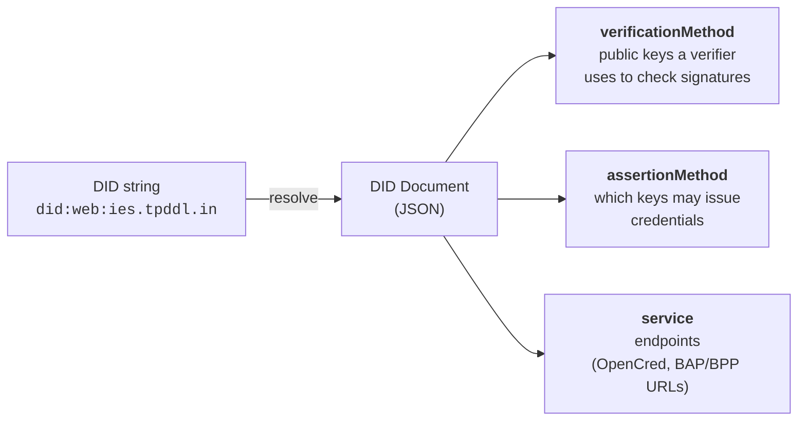

# Identifier Concepts

This page is the conceptual ground for [ID Patterns](./id-patterns.md), [Private Resolution](../registries/private_resolution.md), and [Resolution](../registries/resolution.md). If you already know DIDs and just need IES-specific addressing rules, skim this and jump ahead.

---

## What is a DID?

A **Decentralized Identifier (DID)** is a globally unique string that resolves to a **DID Document** — a JSON document describing public keys, service endpoints, and controller relationships for the identified subject. The DID standard is [W3C DID Core](https://www.w3.org/TR/did-core/).

```
did:<method>:<method-specific-identifier>
```

| Part | Meaning |
|---|---|
| `did` | Fixed scheme |
| `<method>` | How to resolve the rest of the string into a DID Document |
| `<method-specific-identifier>` | A value the method understands (a domain, a public key, a registry path) |

Examples in IES:

```
did:web:ies.tpddl.in
did:key:z6MkjVQ8r4f3rPuY7CG2D6Lf8WJxJBs5sjkR8d3v2Bv4nP4Z
did:web:did.cord.network:76EU9AJNL25X4LAxgb92rA8op4co7n892oeySAuEk9gAay2N28ctma
```

The string itself is the identifier; **resolution** is how a client turns the string into a DID Document and ultimately a public key.

### Identifiers as Names and Resolution Details

When working with identifiers on the IES, keep the following foundational rules in mind:

*   **An Identifier is a Name**: An identifier is simply a unique label or name. While IES provides recommended conventions and syntax rules (see [ID Patterns](./id-patterns.md)) to make these names structured and useful for developers, **no meaning should be derived from the name itself**. You must not write business logic that parses the identifier string to extract attributes or guess permissions.
*   **All Identifiers Resolve to a DID Document**: Every identifier must be resolved to obtain its corresponding DID Document, which is the authoritative source for public keys, verification methods, and service endpoints. Even identifiers stored in directories/registries must be resolved to retrieve this document (see [Resolution and Routing](../registries/resolution.md) for workflows).
*   **Context-Dependent Resolution**: The DID Document provides the verified details about the identifier. When using `did:web` or `did:dedi`, the same identifier could resolve to different details (a redacted public view vs. a full private PII view) depending on whether it is resolved by public or private accessors (see [Unification of Public vs. Private Resolution Details](../registries/resolution.md#unification-of-public-vs-private-resolution-details) and [Private Resolution](../registries/private_resolution.md)).

---

## What a DID Document contains

A DID string is *just* an identifier; what makes it useful is the DID Document it resolves to — the JSON that publishes the subject's public keys and service endpoints.



A minimal DID Document for an IES [DISCOM](../glossary.md#discom) looks like:

```json
{
  "@context": ["https://www.w3.org/ns/did/v1"],
  "id": "did:web:ies.tpddl.in",
  "verificationMethod": [{
    "id": "did:web:ies.tpddl.in#key-1",
    "type": "JsonWebKey2020",
    "controller": "did:web:ies.tpddl.in",
    "publicKeyJwk": {
      "kty": "EC",
      "crv": "P-256",
      "x": "f83OJ3D2xF1Bg8vub9tLe1gHMzV76e8Tus9uPHvRVEU",
      "y": "x_FEzRu9m36HLN_tue659LNpXW6pCyStikYjKIWI5a0"
    }
  }],
  "assertionMethod": ["did:web:ies.tpddl.in#key-1"],
  "service": [{
    "id": "did:web:ies.tpddl.in#opencred",
    "type": "OpenCredIssuer",
    "serviceEndpoint": "https://ies.tpddl.in/v1/credentials"
  }]
}
```

Three things matter for IES:

1. **`verificationMethod`** — the public key a verifier uses to check `proof` on a credential.
2. **`assertionMethod`** — which keys are authorised to issue credentials.
3. **`service`** — endpoints for routing: [OpenCred](../glossary.md#opencred) for credentials, [Beckn](../glossary.md#beckn) [BAP](../glossary.md#bap)/[BPP](../glossary.md#bpp) URLs for data exchange.

---

## DID methods used in IES

IES does not invent a new DID method. It composes existing standard methods with a registry-anchored trust layer.

### `did:web`

Resolution is just an HTTPS GET. For `did:web:ies.tpddl.in`:

```
https://ies.tpddl.in/.well-known/did.json
```

Path-suffixed forms add segments after the host:

```
did:web:example.gov.in:agency:branch
→  https://example.gov.in/agency/branch/did.json
```

**When IES uses it**

- DISCOM issuer identity (`issuer.id` on every credential).
- Regulator and aggregator identities.
- Namespace anchor for registries on [DeDi](../glossary.md#dedi) (the namespace owner publishes its public key under `did:web`).

**Strengths**

- Trust roots in the domain's TLS certificate, which is already validated by public CAs.
- Key rotation is one file replace.
- No new infrastructure needed beyond a static-file host.

**Limitations**

- Domain hijack = identity hijack. IES mitigates this by *also* registering the DISCOM in the DeDi reference registry — the registry is the network's curated allow-list of who counts as a DISCOM. A registered DISCOM that loses its domain can rotate to a new `did:web` via the registry; an unregistered `did:web` has no path to being trusted.
- Not suitable for consumers (most consumers don't own a domain).

### `did:key`

The public key *is* the identifier — the method-specific identifier is a multibase-encoded public key. No resolution call is needed; the verifier decodes the string directly.

**When IES uses it**

- Consumer holder DIDs, generated client-side by a wallet or [DigiLocker](../glossary.md#digilocker).
- DISCOM dev/test deployments before a domain is provisioned.
- Issuers anchoring in a CCA-issued Digital Signature Certificate (DSC) — the DID is derived from the certificate's public key.

**Strengths**

- Zero infrastructure. The string carries the key.
- Deterministic from a PEM, so re-deployment is reproducible.

**Limitations**

- No key rotation — rotating the key changes the DID. Not appropriate for long-lived institutional identities.
- No service endpoints, no metadata.

### `did:jwk`

A JWK encoded directly into the DID string. Functionally similar to `did:key`, used by some wallets. IES accepts it for holders.

### `did:dedi` (DeDi-anchored)

<a id="diddedi-standards-note"></a>
> [!IMPORTANT]
> **Non-Standard DID Method & Resolution Note**: `did:dedi` is currently **not** a W3C standard DID method. Resolving these identifiers requires utilizing `dedi.global` resolvers or a compliant Decentralised Directory API endpoint directly. For details on how the coordinate string maps to DeDi lookup API endpoints, see [Resolution and Routing](../registries/resolution.md#diddedi) and [Public vs Private Resolution of Identifiers via Registries](../registries/private_resolution.md).

> **Naming note.** "DeDi" in this stack is the Decentralised Data Infrastructure hosted at [`dedi.global`](https://dedi.global). The DeDi registry entries themselves are addressed by a URL path under a **namespace DID** (which is itself a `did:web` pointing at a CORD-network anchor). Throughout this section we use the term "DeDi-anchored identifier" or the shorthand `did:dedi:…` to mean **an identifier that resolves to a record inside a DeDi namespace** — whether that record is a DISCOM trust entry, a consumer profile, an asset, or a revocation entry.

**Anatomy of a DeDi-anchored identifier**

A record on DeDi lives under three coordinates:

```
<namespace>  /  <registry>  /  <record-id>
```

For the IES DISCOMs reference list:

```
india-energy-stack  /  ies-discoms-reference-registry  /  tpddl
```

The full resolvable URL is:

```
https://api.dedi.global/dedi/lookup/<namespace>/<registry>/<record-id>
```

Or, using the namespace DID form:

```
https://api.dedi.global/dedi/lookup/did%3Aweb%3Adid.cord.network%3A76EU9AJNL25X4LAxgb92rA8op4co7n892oeySAuEk9gAay2N28ctma/ies-discoms-reference-registry/tpddl
```

When we write `did:dedi:india-energy-stack:ies-discoms-reference-registry:tpddl` in this section, it is shorthand for that URL. Treat it as a deterministic mapping: the three coordinates uniquely determine the URL.

**When IES uses it**

- The **IES DISCOMs Reference Registry** — the network's trust anchor list (every credential's `issuer.idRef` points here).
- The **IES Regulators Reference Registry** — sibling list for DERCs / KERCs / CERC.
- Per-DISCOM **revocation registries** under each DISCOM's own namespace.
- Per-DISCOM **asset registries** (transformers, feeders, substations) when a DISCOM wants public addressability.
- (Internal-only) Private mirror registries inside a DISCOM that follow the same record schema.

**Strengths**

- Records can be updated (e.g. key rotation, address change) without changing the identifier.
- A namespace is governed by its owner's DID — only that DID's key can write to the namespace. This is what makes "DISCOMs cannot self-publish to the reference registry" enforceable: only the IES network operator's namespace key can write there.
- Same shape works for public network records and private internal mirrors.

**Limitations**

- Requires HTTPS reachability of `api.dedi.global` (or a private DeDi node) at resolution time.
- Network-level availability matters — mitigate with caching at verifiers.

---

## When to use which method

| Subject | Method | Reason |
|---|---|---|
| DISCOM (issuer) | `did:web` + DeDi registry entry | Domain anchors the key, registry anchors trust |
| Regulator | `did:web` + DeDi registry entry | Same |
| Consumer (holder) | `did:key` or `did:jwk` | Wallet-generated, no domain needed |
| Asset (transformer, meter, feeder) | `did:dedi` under DISCOM namespace | Records change over the asset's lifecycle; needs updateable form |
| Credential (revocation handle) | `did:dedi` under DISCOM revocation registry | Already the IES revocation model |
| Dataset (Beckn `DatasetItem`) | `did:dedi` under DISCOM dataset namespace, or `did:web` URL | Discoverable via Beckn registry |

---

## Identifier vs. record

Keep this distinction crisp — most confusion in DID systems comes from mixing the two.

| Identifier | Record |
|---|---|
| `did:web:ies.tpddl.in` | The DID Document at `https://ies.tpddl.in/.well-known/did.json` |
| `did:dedi:india-energy-stack:ies-discoms-reference-registry:tpddl` | The JSON record at `https://api.dedi.global/dedi/lookup/india-energy-stack/ies-discoms-reference-registry/tpddl` |
| `did:dedi:tpddl:consumers:TPDDL-2025-001234567` | The consumer profile / pseudonym record under TPDDL's `consumers` registry |

The identifier is what travels in a credential, a Beckn message, or a database row. The record is what a resolver returns and what trust decisions read.

---

## Where each ID lives

| ID | Where it appears |
|---|---|
| Issuer DID (`did:web`) | `issuer.id` on every credential; `verificationMethod` in proofs |
| Issuer trust entry (`did:dedi`) | `issuer.idRef.subjectId` on every credential |
| Holder DID (`did:key`) | `credentialSubject.id` on consumer credentials |
| Asset DID (`did:dedi`) | `credentialSubject.assets[].id`; Beckn `DatasetItem.subject` |
| Revocation handle (`did:dedi` URL) | `credentialStatus.id` on every credential |

The rest of this section ([ID Patterns](./id-patterns.md)) shows exactly how each is constructed.
