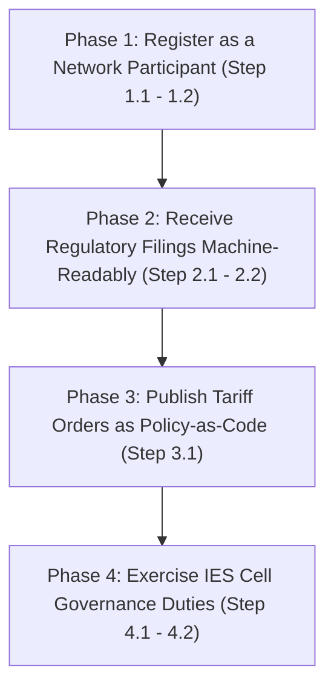

# Authority / Regulator Pathway: Step-by-Step IES Integration Roadmap

Welcome to the **Authority / Regulator Pathway** — a structured roadmap for the Ministry of Power, the Central Electricity Authority (CEA), the Central and State Electricity Regulatory Commissions (CERC/SERC), the Forum of Regulators, and State Governments / Union Territory Administrations to adopt the capabilities of the India Energy Stack (IES).

Technical specifications are referenced via hyperlinks rather than repeated. Expand any step for actionable guidelines, cross-team advice, and prework checkpoints.

---

## Roadmap Overview

---

## Prework & Pre-Alignment Matrix

Align these internal teams and offices before starting the pathway, to ensure a seamless deployment:

| Department / Role | System / Resource Involved | Purpose in Pathway |
|---|---|---|
| **IT / DNS Administrator** | Regulator's domain controller (e.g. `serc.example`) | Exposing a public `did:web` identity on the regulator's own domain |
| **Registry / Tariff Cell** | Existing tariff order and filing archives | Mapping historical ARR filings and tariff orders to the `ArrFiling` and (in-progress) tariff schemas |
| **Legal / Registrar** | Statutory filing rules, Electricity Act provisions | Confirming that machine-readable filings and policy-as-code publication do not alter existing statutory obligations |
| **IES Cell Nominee** | Representation on the IES Cell (under CEA) | Reviewing and accepting schema change proposals from across the sector |

---

## Phase 1: Register as a Network Participant (Identity & Addressing)

The regulator establishes its own institutional cryptographic identity on the network — the same mechanism a DISCOM uses — so DISCOMs and other participants can cite and resolve it directly.

<b>Step 1.1: Establish Your Institutional Identity ([did:web](../what-ies-provides/identifiers/README.md#a-org-identity-for-credentials-and-data-exchange-payloads))</b>

### 💡 Phase Advice
> A regulator's `did:web` works exactly like a DISCOM's. Coordinate with IT/DNS early — the worked example throughout the docs is `did:web:ies.serc.example`, hosted on the regulator's own domain.

### 📋 Prework Required
* Confirm that your IT/DNS office has write-access to a domain or subdomain (e.g. `ies.serc.example`) to host the verification path.

### Execution Guidance
A [`did:web`](../what-ies-provides/identifiers/README.md#a-org-identity-for-credentials-and-data-exchange-payloads) identifier publishes public keys via your existing DNS/SSL — the same "Org identity" flow DISCOMs use.
1. **Assign a Dedicated Domain**: e.g. `ies.serc.example`.
2. **Expose the DID Document**: serve a `did.json` over HTTPS at `https://ies.serc.example/.well-known/did.json`, per [Setup Register](../how-you-implement-ies/setup-register.md).
3. **This becomes your citable identity**: DISCOMs reference it (e.g. `issuer.idRef` in a credential, recipient in an `ArrFiling`), and it's what your tariff-policy signatures resolve back to.

### References & Anchors
* [Identifiers and Addressing — Org identity for credentials and data-exchange payloads](../what-ies-provides/identifiers/README.md#a-org-identity-for-credentials-and-data-exchange-payloads)
* [Identifiers and Addressing — ID patterns you'll use day one](../what-ies-provides/identifiers/README.md#id-patterns-youll-use-day-one) (`did:web:ies.serc.example` as the regulator pattern)
* [Setup Register — step-by-step identity walkthrough](../how-you-implement-ies/setup-register.md) (`did:web:ies.serc.example` worked example)
* [Register overview](../what-ies-provides/register.md)

<b>Step 1.2: Optionally Claim a DeDi Namespace</b>

### 💡 Phase Advice
> Claim a DeDi namespace only if the regulator will itself issue or verify records — e.g. vouching for licensed DISCOMs, or hosting its own subscriber registry for tariff/filing publication. Defer otherwise.

### Execution Guidance
Register a namespace anchored to your domain and verify it via a DNS TXT record.

### References & Anchors
* [Setup Register — Claim a DeDi namespace and verify your domain](../how-you-implement-ies/setup-register.md)
* [Registries and Directories](../what-ies-provides/registries/README.md)

---

## Phase 2: Receive Regulatory Filings Machine-Readably

Move from reading DISCOM regulatory filings as PDFs to monitoring them as signed, structured data. This is the [DISCOM Regulatory Filing](../use-cases/discom-regulatory-filing/README.md) use case from the regulator's side.

<b>Step 2.1: Understand the ArrFiling Schema</b>

### 💡 Phase Advice
> An `ArrFiling` arrives already signed, in one machine-readable format — no PDF or Excel to re-key. The task shifts from *reading a document* to *monitoring data*.

### Execution Guidance
1. **Filing identity fields**: `filingId`, `licensee`, `regulatoryCommission`, `filingType` (`MYT` / `ANNUAL` / `TRUE_UP` / `REVISED`), `controlPeriodStart`/`controlPeriodEnd`, `currency`, `unitScale`.
2. **`amountBasis`**: each fiscal year (`fiscalYears[]`) is tagged `AUDITED`, `APPROVED`, `PROPOSED`, or `TRUED_UP` — the stage of process each figure represents.
3. **Line items**: per-year `lineItems[]` carry `category` (`VARIABLE` / `FIXED` / `INCOME` / `SUB_TOTAL` / `ARR` / `ADJUSTMENT`), `subCategory`, `head`, `particulars`, `amount`, `formReference` — mapped to familiar form headings.
4. **Verify signature**: resolve the filer's `did:web` before ingesting.

### References & Anchors
* [DISCOM Regulatory Filing — implementation guide](../use-cases/discom-regulatory-filing/README.md)
* [DISCOM Regulatory Filing — What It Records / Covers](../use-cases-overview/discom-regulatory-filing.md#id-2.-what-it-records-covers)
* [DISCOM Regulatory Filing — How Each Item is Identified](../use-cases-overview/discom-regulatory-filing.md#id-3.-how-each-item-is-identified)
* [ArrFiling Schema Overview](../what-ies-provides/schemas-overview/arr-filing.md)
* [ArrFiling Schema Reference (v0.5)](https://india-energy-stack.gitbook.io/docs/schemas/arrfiling/v0.5)
* [ArrFiling Machine-Readable Example](https://india-energy-stack.github.io/ies-accelerator/schemas/ArrFiling/v0.5/examples/arr_filings.json)
* [Taxonomy — Schema map (ArrFiling entry)](../what-ies-provides/taxonomy.md#data-exchange-payloads)

<b>Step 2.2: Set Up Ingestion of Incoming Filings</b>

### 💡 Phase Advice
> A signed, structured filing turns cross-DISCOM analysis into a single query, not a re-keying exercise. Plan ingestion around that, not around parsing PDFs.

### 📋 Prework Required
* Complete [Register](../what-ies-provides/register.md) (Phase 1) so your `did:web` is resolvable, since DISCOMs will cite it as the filing's recipient.
* List your SERC in the [IES Regulators reference registry](../what-ies-provides/registries/README.md#reference-allow-lists-industry-coordination) so DISCOMs can resolve you for subscription and delivery.

### Execution Guidance
1. Confirm each filing's catalogue entry (`filingType`, `policyContext` — the tariff order it answers, `accessMethod`) resolves correctly.
2. Archive each signed envelope as a non-repudiable submission record.
3. Bilateral subscriptions skip the per-submission discovery step.

### References & Anchors
* [DISCOM Regulatory Filing — Setup: Register → Discover → Exchange](../use-cases/discom-regulatory-filing/README.md#setup-register-discover-exchange)
* [DISCOM Regulatory Filing — Value Unlock](../use-cases-overview/discom-regulatory-filing.md#value-unlock)
* [Registries — reference allow-lists](../what-ies-provides/registries/README.md#reference-allow-lists-industry-coordination)

---

## Phase 3: Publish Tariff Orders as Policy-as-Code

Move from issuing tariff orders as PDFs to publishing them as computable objects that DISCOM billing systems, consumer apps, and smart meters can consume directly. This is the [Tariff Intelligence](../use-cases/tariff-intelligence/README.md) use case, currently in progress.

<b>Step 3.1: Publish Tariff Structures as Signed, Machine-Readable Policy</b>

### 💡 Phase Advice
> Today every DISCOM manually transcribes slab rates, surcharges, and penalties from a PDF order, and every consumer app interprets it independently — drift and bugs are inevitable. Publish the order once as signed, structured data so every system ingests the identical object.

### ⚠️ Caution
> **Schema still in progress.** Tariff Intelligence is built on the `IES_Policy` family (tracked upstream at [`beckn/DEG ies-specs`](https://github.com/beckn/DEG/tree/ies-specs/specification/external/schema/ies/core)) while a first-class `Tariff` schema is finalised. Treat this as an early-adopter track — expect the schema location to move.

### Execution Guidance
1. **Author the policy**: slab billing as `energySlabs[]` (`start`/`end`/`price` tiers), time-of-day/deviation adjustments as `surchargeTariffs[]` (`recurrence`, `interval`, `value`, `unit`).
2. **Assign stable identifiers**: a stable `policyID` plus a per-version `id` URN; amendments publish a new `id` with the same `policyID` and a `replaces` link.
3. **Sign**: with your `did:web` from Phase 1, as a DISCOM signs an `ArrFiling`.
4. **Publish for discovery**: one catalogue entry per policy, so systems subscribe and ingest directly instead of parsing a PDF.
5. **Confirm parity**: regulatory affairs verifies the object matches the order's stated rates before publication.

### References & Anchors
* [Tariff Intelligence — implementation guide](../use-cases/tariff-intelligence/README.md)
* [Tariff Intelligence — What It Records / Covers](../use-cases-overview/tariff-intelligence.md#id-2.-what-it-records-covers)
* [Tariff Intelligence — How Each Item is Identified](../use-cases-overview/tariff-intelligence.md#id-3.-how-each-item-is-identified)
* [Tariff Intelligence — Setup: Register → Discover → Exchange](../use-cases/tariff-intelligence/README.md#setup-register-discover-exchange)
* [Tariff Intelligence — Value Unlock](../use-cases-overview/tariff-intelligence.md#value-unlock)
* [Taxonomy — Schema map (`IES_Policy`, in progress)](../what-ies-provides/taxonomy.md#data-exchange-payloads)

---

## Phase 4: Exercise IES Cell Governance Duties

Beyond network participation, the regulator side of the ecosystem — through the **IES Cell**, the governance body being constituted under the CEA with sector-wide representation — holds authority over the schemas themselves.

<b>Step 4.1: Review and Accept Schema Change Proposals</b>

### 💡 Phase Advice
> The IES Cell owns the specifications — it decides what's added or changed and publishes each version. Any participant (DISCOM, AMISP, another regulator) can propose a schema or change; the Cell reviews and accepts.

### Execution Guidance
Review checks:
1. **No existing overlap**: no schema (with optional extension) already covers the proposed object.
2. **Standards alignment**: follows precedence — **Bureau of Indian Standards (IS) → CEA Regulations / Indian Electricity Grid Code (IEGC) → International Electrotechnical Commission (IEC) → Institute of Electrical and Electronics Engineers (IEEE)** — and documents any gap where no Indian standard exists.
3. **Use-case fit**: grounded in a real use case, with example payloads.
4. **Acceptance**: publish `v0.1` (new) or a minor/major version (change), and update the schema map.

### References & Anchors
* [Taxonomy — Proposing a new schema (or a change)](../what-ies-provides/taxonomy.md#proposing-a-new-schema-or-a-change)
* [Taxonomy — Standards precedence](../what-ies-provides/taxonomy.md#standards-precedence)
* [Taxonomy — Schema map](../what-ies-provides/taxonomy.md#schema-map)

<b>Step 4.2: Steward the Published Schemas</b>

### 💡 Phase Advice
> IES doesn't change a regulator's relationship with DISCOMs or invent compliance obligations — it turns existing CEA/CERC rules into machine-readable form. Gaps found in practice are flagged to the regulator, who decides. Cell duties steward the *representation* of rules, not new regulatory authority.

### Execution Guidance
As steward, the IES Cell is responsible for:
1. **Source of truth** — this repository, under `schemas/`.
2. **Canonical hosting** — the schema map at `india-energy-stack.github.io/ies-accelerator/schemas/...`.
3. **Versioning** — semver-light (`v<major>.<minor>`); non-breaking changes absorbed within a minor version, breaking changes trigger a new one.
4. **Deprecation** — old versions stay queryable; schema map and canonical URL flag the active version.

### References & Anchors
* [Taxonomy — Stewardship](../what-ies-provides/taxonomy.md#stewardship)
* [Taxonomy — Versioning](../what-ies-provides/taxonomy.md#versioning)
* [Taxonomy — Where this fits](../what-ies-provides/taxonomy.md#where-this-fits)

