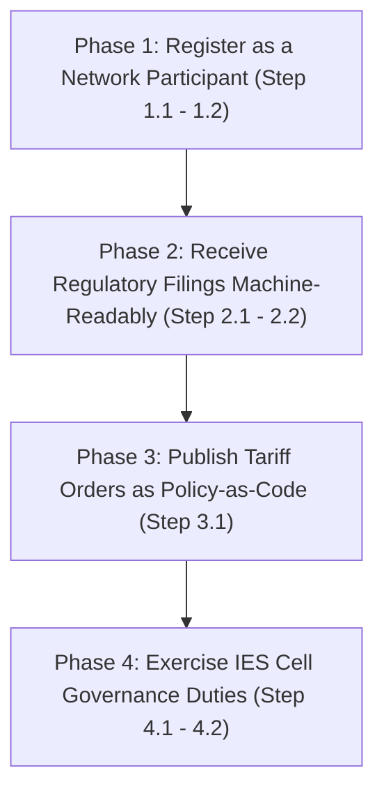

# Authority / Regulator Pathway: Step-by-Step IES Integration Roadmap

Welcome to the **Authority / Regulator Pathway**. This guide provides an actionable and structured roadmap for the Ministry of Power, the Central Electricity Authority (CEA), the Central and State Electricity Regulatory Commissions (CERC/SERC), the Forum of Regulators, and State Governments / Union Territory Administrations to adopt the capabilities of the India Energy Stack (IES).

To keep this guide extremely clean and focused on regulatory progress, technical specifications are referenced via hyperlinks rather than repeated. Expand any step to find actionable guidelines, cross-team advice, and prework checkpoints.

---

## Roadmap Overview

---

## Prework & Pre-Alignment Matrix

Before commencing the integration pathway, we recommend aligning the following internal teams and offices. Setting up these channels early ensures a seamless deployment experience:

| Department / Role | System / Resource Involved | Purpose in Pathway |
|---|---|---|
| **IT / DNS Administrator** | Regulator's domain controller (e.g. `serc.example`) | Exposing a public `did:web` identity on the regulator's own domain |
| **Registry / Tariff Cell** | Existing tariff order and filing archives | Mapping historical ARR filings and tariff orders to the `ArrFiling` and (in-progress) tariff schemas |
| **Legal / Registrar** | Statutory filing rules, Electricity Act provisions | Confirming that machine-readable filings and policy-as-code publication do not alter existing statutory obligations |
| **IES Cell Nominee** | Representation on the IES Cell (under CEA) | Reviewing and accepting schema change proposals from across the sector |

---

## Phase 1: Register as a Network Participant (Identity & Addressing)

In this phase, the regulator establishes its own institutional cryptographic identity on the network — the same mechanism a DISCOM uses, so that DISCOMs and other participants can cite and resolve the regulator directly.

<b>Step 1.1: Establish Your Institutional Identity ([did:web](../what-ies-provides/register.md#two-identities-youll-set-up-and-why))</b>

### 💡 Phase Advice
> A regulator sets up its `did:web` exactly like a DISCOM does — there is no separate identity mechanism for authorities. Coordinate with your IT/DNS office early; the worked example used throughout the IES documentation is `did:web:ies.serc.example`, a regulator identity hosted on the regulator's own domain.

### 📋 Prework Required
* Confirm that your IT/DNS office has write-access to a domain or subdomain (e.g. `ies.serc.example`) to host the verification path.

### Execution Guidance
A [`did:web`](../what-ies-provides/register.md#two-identities-youll-set-up-and-why) identifier leverages your existing DNS and SSL infrastructure to publish your public keys — the same "Org identity" flow documented for DISCOMs applies to regulators.
1. **Assign a Dedicated Domain**: Allocate an institutional subdomain, e.g. `ies.serc.example`.
2. **Expose the DID Document**: Host your verification keys in a standard `did.json` file served over HTTPS under the path `https://ies.serc.example/.well-known/did.json`, following the same steps a DISCOM follows in [Setup Register](../how-you-implement-ies/setup-register.md).
3. **This `did:web` becomes your citable identity**: once published, this is the identifier DISCOMs reference (e.g. as `issuer.idRef` in a credential, or as the recipient in an `ArrFiling`) and the identity your own signatures on published tariff policies resolve back to.

### References & Anchors
* [Identifiers and Addressing — Org identity for credentials and data-exchange payloads](../what-ies-provides/register.md#two-identities-youll-set-up-and-why)
* [Identifiers and Addressing — ID patterns you'll use day one](../what-ies-provides/register.md#identifier-patterns) (`did:web:ies.serc.example` as the regulator pattern)
* [Setup Register — step-by-step identity walkthrough](../how-you-implement-ies/setup-register.md) (`did:web:ies.serc.example` worked example)
* [Register overview](../what-ies-provides/register.md)

<b>Step 1.2: Optionally Claim a DeDi Namespace</b>

### 💡 Phase Advice
> Claim a DeDi namespace if the regulator will itself issue or verify records — for example, vouching for licensed DISCOMs, or later hosting its own subscriber registry for tariff or filing publication. If the regulator is only receiving filings in Phase 2, this step can be deferred.

### Execution Guidance
Follow the same namespace-claim procedure documented for network participants generally: register a namespace anchored to your domain and verify it via a DNS TXT record.

### References & Anchors
* [Setup Register — Claim a DeDi namespace and verify your domain](../how-you-implement-ies/setup-register.md)
* [Registries and Directories](../what-ies-provides/register.md#the-directory-dedi)

---

## Phase 2: Receive Regulatory Filings Machine-Readably

Move from reading DISCOM regulatory filings as PDFs to monitoring them directly as signed, structured data. This is the [DISCOM Regulatory Filing](../use-cases/discom-regulatory-filing/README.md) use case from the regulator's side of the exchange.

<b>Step 2.1: Understand the ArrFiling Schema</b>

### 💡 Phase Advice
> An `ArrFiling` arrives already signed by the DISCOM's `did:web`, in a single consistent machine-readable format — there is no PDF or Excel workbook to re-key. This changes the regulator's task from *reading a document* to *monitoring data*.

### Execution Guidance
1. **Review the filing identity fields**: every filing carries `filingId`, `licensee`, `regulatoryCommission`, `filingType` (`MYT` / `ANNUAL` / `TRUE_UP` / `REVISED`), `controlPeriodStart`/`controlPeriodEnd`, `currency`, and `unitScale`.
2. **Understand `amountBasis`**: each fiscal year inside a filing (`fiscalYears[]`) is tagged `AUDITED`, `APPROVED`, `PROPOSED`, or `TRUED_UP` — this tells your staff exactly what stage of the regulatory process each set of numbers represents.
3. **Understand line items**: per-year `lineItems[]` carry `category` (`VARIABLE` / `FIXED` / `INCOME` / `SUB_TOTAL` / `ARR` / `ADJUSTMENT`), `subCategory`, `head`, `particulars`, `amount`, and `formReference` — mapped to the same regulatory form headings your staff already work with.
4. **Verify the DISCOM's signature**: the filing is signed with the filer's `did:web`; resolve that DID to confirm the filing is authentic before ingesting it into your analysis pipeline.

### References & Anchors
* [DISCOM Regulatory Filing — use case overview](../use-cases/discom-regulatory-filing/README.md)
* [DISCOM Regulatory Filing — What It Records / Covers](../use-cases-overview/discom-regulatory-filing.md#id-2.-what-it-records-covers)
* [DISCOM Regulatory Filing — How Each Item is Identified](../use-cases-overview/discom-regulatory-filing.md#id-3.-how-each-item-is-identified)
* [ArrFiling family page](../schemas/ArrFiling/README.md)
* [ArrFiling Schema Reference (v0.5)](https://india-energy-stack.gitbook.io/docs/schemas/arrfiling/v0.5)
* [ArrFiling Machine-Readable Example](https://india-energy-stack.github.io/ies-accelerator/schemas/ArrFiling/v0.5/examples/arr_filings.json)
* [Taxonomy — Schema map (ArrFiling entry)](../schemas/README.md#data-exchange-payloads)

<b>Step 2.2: Set Up Ingestion of Incoming Filings</b>

### 💡 Phase Advice
> Because the filing is a signed, structured object rather than a document, comparable analysis across DISCOMs becomes a single query instead of a re-keying exercise. Plan your ingestion pipeline around that — not around parsing PDFs.

### 📋 Prework Required
* Complete [Register](../what-ies-provides/register.md) (Phase 1) so your `did:web` is resolvable, since DISCOMs will cite it as the filing's recipient.
* List your SERC in the [IES Regulators reference registry](../what-ies-provides/register.md#the-directory-dedi) so DISCOMs can resolve you for subscription and delivery.

### Execution Guidance
1. Confirm the DISCOM's catalogue entry for each filing (`filingType`, `policyContext` — the tariff order it answers, `accessMethod`) resolves correctly on your side.
2. Archive each incoming signed envelope as your non-repudiable record of submission.
3. Where a pre-agreed bilateral subscription exists, filings can be received directly without a separate discovery step per submission.

### References & Anchors
* [DISCOM Regulatory Filing — Setup: Register → Discover → Exchange](../use-cases/discom-regulatory-filing/README.md#setup-register-discover-exchange)
* [DISCOM Regulatory Filing — Value Unlock](../use-cases-overview/discom-regulatory-filing.md#value-unlock)
* [Registries — reference allow-lists](../what-ies-provides/register.md#the-directory-dedi)

---

## Phase 3: Publish Tariff Orders as Policy-as-Code

Move from issuing tariff orders as PDFs to publishing them as computable objects that DISCOM billing systems, consumer apps, and smart meters can consume directly. This is the [Tariff Intelligence](../use-cases/tariff-intelligence/README.md) use case, currently in progress.

<b>Step 3.1: Publish Tariff Structures as Signed, Machine-Readable Policy</b>

### 💡 Phase Advice
> Today, every DISCOM manually transcribes slab rates, time-of-day surcharges, and deviation penalties from a PDF tariff order into its own billing system, and every consumer-facing app interprets the same order independently — drift and bugs are inevitable. Publishing the order once as signed, structured data lets every downstream system ingest the identical object.

### ⚠️ Caution
> **Schema still in progress.** Tariff Intelligence is built on the `IES_Policy` family (tracked upstream at [`beckn/DEG ies-specs`](https://github.com/beckn/DEG/tree/ies-specs/specification/external/schema/ies/core)) while a first-class `Tariff` schema in this repository is being finalised. Treat this phase as an early-adopter track and expect the schema location to move.

### Execution Guidance
1. **Author the policy**: represent slab billing as `energySlabs[]` (progressive consumption tiers, each with `start`/`end`/`price`), and time-of-day or deviation adjustments as `surchargeTariffs[]` (`recurrence`, `interval`, `value`, `unit`).
2. **Assign stable identifiers**: give the policy a stable `policyID` (survives amendments) and a per-version `id` URN; amendments are published as a new `id` with the same `policyID` and an explicit `replaces` link back to the prior version.
3. **Sign the policy**: sign with your `did:web` from Phase 1, exactly as a DISCOM signs an `ArrFiling` or credential.
4. **Publish for discovery**: expose one catalogue entry per policy so DISCOMs, billing systems, and apps can subscribe and ingest directly rather than parsing a PDF order.
5. **Confirm parity with the underlying order**: have regulatory affairs staff confirm the published policy-as-code object matches the tariff order's stated rates before publication.

### References & Anchors
* [Tariff Intelligence — use case overview](../use-cases/tariff-intelligence/README.md)
* [Tariff Intelligence — What It Records / Covers](../use-cases-overview/tariff-intelligence.md#id-2.-what-it-records-covers)
* [Tariff Intelligence — How Each Item is Identified](../use-cases-overview/tariff-intelligence.md#id-3.-how-each-item-is-identified)
* [Tariff Intelligence — Setup: Register → Discover → Exchange](../use-cases/tariff-intelligence/README.md#setup-register-discover-exchange)
* [Tariff Intelligence — Value Unlock](../use-cases-overview/tariff-intelligence.md#value-unlock)
* [Taxonomy — Schema map (`IES_Policy`, in progress)](../schemas/README.md#data-exchange-payloads)

---

## Phase 4: Exercise IES Cell Governance Duties

Beyond participating in the network, the regulator side of the ecosystem — through the **IES Cell**, the governance body being constituted under the Central Electricity Authority with representation from across the sector — holds authority over the schemas themselves.

<b>Step 4.1: Review and Accept Schema Change Proposals</b>

### 💡 Phase Advice
> The IES Cell owns the specifications: it decides what is added or changed, and publishes each version. Any participant — a DISCOM, an AMISP, another regulator — can propose a new schema or a change to an existing one; the IES Cell's role is to review and accept it.

### Execution Guidance
When a proposal arrives, the review checks:
1. **No existing overlap**: confirm no existing schema (with optional extension) already covers the proposed domain object.
2. **Standards alignment**: confirm the proposal follows the IES standards precedence order — **Bureau of Indian Standards (IS) → CEA Regulations / Indian Electricity Grid Code (IEGC) → International Electrotechnical Commission (IEC) → Institute of Electrical and Electronics Engineers (IEEE)** — and that it documents any gap where no Indian standard yet exists.
3. **Use-case fit**: confirm the proposal is grounded in a real use case, with example payloads.
4. **Acceptance**: publish a versioned `v0.1` (new schema) or a new minor/major version (change to an existing schema), and add or update the entry in the schema map.

### References & Anchors
* [Taxonomy — Proposing a new schema (or a change)](../schemas/README.md#proposing-a-new-schema-or-a-change)
* [Taxonomy — Standards precedence](../schemas/README.md#standards-precedence)
* [Taxonomy — Schema map](../schemas/README.md#schema-map)

<b>Step 4.2: Steward the Published Schemas</b>

### 💡 Phase Advice
> IES does not change a regulator's relationship with DISCOMs or invent new compliance obligations. IES only turns existing CEA and CERC rules into a form software can read; if putting a rule into practice reveals a gap, IES points it out to the regulator, and only the regulator decides what to do about it. Governance duties under the IES Cell are about stewarding the *representation* of rules, not about creating new regulatory authority.

### Execution Guidance
As the schema steward, the IES Cell is operationally responsible for:
1. **Schema source of truth** — this repository, under `schemas/`.
2. **Canonical hosting** — the published schema map at `india-energy-stack.github.io/ies-accelerator/schemas/...`.
3. **Versioning policy** — semver-light (`v<major>.<minor>`), with non-breaking changes absorbed within a minor version and breaking changes triggering a new version.
4. **Deprecation** — old versions stay queryable; the schema map and canonical URL flag the currently active version.

### References & Anchors
* [Taxonomy — Stewardship](../schemas/README.md#stewardship)
* [Taxonomy — Versioning](../schemas/README.md#versioning)
* [Taxonomy — Where this fits](../schemas/README.md#where-this-fits)

