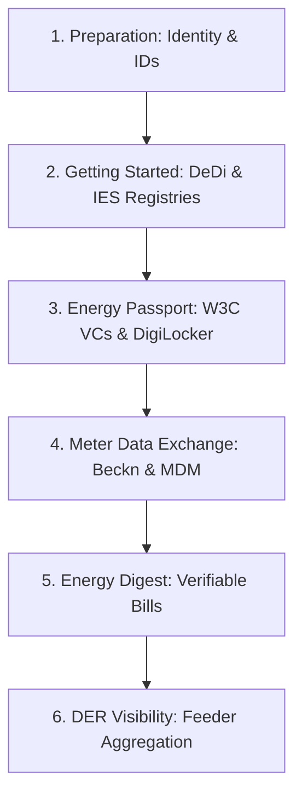
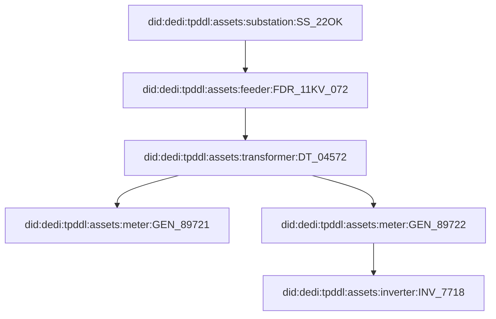

# DISCOM Pathway: Step-by-Step IES Integration Roadmap

Welcome to the **DISCOM Pathway**. This comprehensive guide provides a structured, step-by-step roadmap for a Distribution Company (Utility) to adopt the capabilities of the India Energy Stack (IES).

To keep the roadmap scannable and interactive, each phase and step is nested inside an expandable panel. Click to expand any step to view operational guidelines, command lines, code snippets, and links to relevant documentation chapters.

---

## Roadmap Overview



---

## Phase 1: Preparation (Identity & Addressing)

This phase focuses on establishing your cryptographic institutional identity and defining clear naming conventions for your customers, assets, meters, and grid connections.

<details>
<summary><b>Step 1: Establish Your Institutional Identity (did:web)</b></summary>

### Objective
Establish a globally unique, tamper-evident cryptographic identifier for your DISCOM (e.g., Tata Power Delhi Distribution Limited - `tpddl`) using the `did:web` standard.

### Execution Guidance
A `did:web` identifier leverages your existing DNS and SSL infrastructure to publish your public keys.
1. **Assign a Subdomain**: Allocate a dedicated subdomain for IES, such as `ies.tpddl.co.in` or `ies.tpddl.in`.
2. **Expose the DID Document**: Coordinate with your Web/DNS Administrator to host a standard `did.json` file securely over HTTPS at:
   `https://ies.tpddl.co.in/.well-known/did.json`
3. **Draft the did.json Document**:
   ```json
   {
     "@context": [
       "https://www.w3.org/ns/did/v1",
       "https://w3id.org/security/suites/jws-2020/v1"
     ],
     "id": "did:web:ies.tpddl.co.in",
     "verificationMethod": [
       {
         "id": "did:web:ies.tpddl.co.in#key-1",
         "type": "JsonWebKey2020",
         "controller": "did:web:ies.tpddl.co.in",
         "publicKeyJwk": {
           "kty": "EC",
           "crv": "P-256",
           "x": "f83OJ3D2xF1Bg8vub9tLe1gHMzV76e8Tus9uPHvRVEU",
           "y": "x_FEzRu9m36HLN_tue659LNpXW6pCyStikYjKIWI5a0"
         }
       }
     ],
     "assertionMethod": ["did:web:ies.tpddl.co.in#key-1"],
     "authentication": ["did:web:ies.tpddl.co.in#key-1"]
   }
   ```
4. **Alternatives**: If subdomain hosting is unavailable in early stages, you may temporarily utilize a `did:key` identifier (derived from a local key pair) or a `did:dedi` identifier anchored directly in the public registry.

### References
* [Identifiers & Addressing Overview](../identifiers/README.md)
* [Resolution & Routing Specification](../identifiers/resolution.md)
* [Basic Identifiers Checklist](../checklists/identifiers-basic-checklist.md)
</details>

<details>
<summary><b>Step 2: Define Your Naming Grammars (DEDI Identifiers)</b></summary>

### Objective
Adopt consistent, standard grammars to assign Decentralized Identifiers (DIDs) to your consumers, physical grid assets, smart meters, and service connections.

### Naming Standards
We suggest standard, DEDI-based naming grammars. Replace `<discom>` with your unique namespace (e.g., `tpddl`):

1. **Consumers**: Unique handle representing your customer relationship:
   * **Grammar**: `did:dedi:<discom>:consumers:<consumer number>`
   * **Example**: `did:dedi:tpddl:consumers:CN-89721345`
2. **Grid Assets**: Identifiers for transformers, substations, and feeders matching internal ERP/GIS codes:
   * **Grammar**: `did:dedi:<discom>:assets:<asset-class>:<internal id>`
   * **Example**: `did:dedi:tpddl:assets:transformer:DT-11KV-F02-452`
3. **Smart Meters**: Embedded manufacturer code + meter serial number to ensure global uniqueness:
   * **Grammar**: `did:dedi:<discom>:assets:meter:<manufacturer code>_<serial number>`
   * **Example**: `did:dedi:tpddl:assets:meter:GEN_12345678`
4. **Service Connections**: Identifiers for physical service/delivery points binding consumers and meters:
   * **Grammar**: `did:dedi:<discom>:connections:<connection id>`
   * **Example**: `did:dedi:tpddl:connections:CON-90234`

### Alternatives
* **Web-based identifiers (`did:web`)**: You can also represent connection resources directly under your subdomain path (e.g., `did:web:ies.tpddl.co.in:connections:CON-90234`).

### References
* [Identifier Patterns and Grammars](../identifiers/id-patterns.md)
* [Issuance Reference Document](../identifiers/issuance-reference.md)
</details>

---

## Phase 2: Getting Started (Registry Setup)

Establish your administrative namespaces on the public Decentralized Directory (DeDi) and register with the India Energy Stack network.

<details>
<summary><b>Step 3: Setup DeDi Namespace</b></summary>

### Objective
Create and verify your administrative namespace on the Decentralized Directory (DeDi).

### Execution Guidance
1. **Create an Account**: Register an institutional role-mailbox (e.g., `registry-admin@tpddl.co.in`) on the DeDi Portal.
2. **Establish Namespace**: Initialize a namespace corresponding to your DISCOM short-code (`<discom>`).
3. **Verify Domain**: Prove ownership of the namespace by adding a TXT DNS record containing your DeDi verification token to your institutional domain (`tpddl.co.in`).

### References
* [DeDi Primer](../registries/dedi-primer.md)
* [Registry Creation Guide](../registries/registry-creation.md)
* [Basic Registries Checklist](../checklists/registries-basic-checklist.md)
</details>

<details>
<summary><b>Step 4: Create Operational Registries</b></summary>

### Objective
Initialize separate registries under your namespace to hold public keys, credential revocation lists, and Beckn subscriber profiles.

### Suggestion
Maintain separate registries grouped by identifier type to ensure high operational isolation:
* `public-keys` (tag `public_key`): Contains versioned cryptographic keys.
* `vc-revocation-registry` (tag `revoke`): Houses real-time credential revocation lists.
* `subscribers-test` & `subscribers-prod` (tag `beckn_subscriber`): Configures your Beckn node credentials for sandbox and live environments.

### References
* [Required Registries Catalog](../registries/required-registries.md)
</details>

<details>
<summary><b>Step 5: Register with India Energy Stack</b></summary>

### Objective
Submit your DISCOM references to the IES Network Facilitator Office (NFO) to get added to the canonical global directories.

### Execution Guidance
You must get **referenced into** the authoritative global allow-lists so counterparties can discover and trust you.
1. **Compose Request**: Prepare your DISCOM short-code, legal name, service area list, endpoints (OpenCred/Beckn), and `did:web` verification JWK.
2. **Submit to the IES Secretariat**:
   * **Primary Email**: [IES.Secretariat@fsrglobal.org](mailto:IES.Secretariat@fsrglobal.org)
   * **Alternate Email**: [ies@recindia.com](mailto:ies@recindia.com)
3. **Verify Inclusion**: Once confirmed, perform a DeDi lookup against the authoritative path:
   `india-energy-stack/ies-discoms-reference-registry/<your-discom-id>`

### References
* [End-to-End Onboarding Checklist](../registries/required-registries.md#end-to-end-onboarding-checklist)
</details>

---

## Phase 3: Energy Passport (Verifiable Credentials)

Enable your customers to hold a tamper-evident digital passport of their connection, load, tariff, and asset parameters.

<details>
<summary><b>Step 6: Setup Credential Issuance (Energy Passport)</b></summary>

### Objective
Deploy the OpenCred issuing service and integrate it with your core backend systems.

### Sub-Steps
* **6.1 Identify CRM Systems to Integrate**: Determine which customer data repositories (e.g., SAP IS-U, Oracle CC&B, or a custom SQL/billing system) contain the consumer profile, tariff categories, and asset mappings.
* **6.2 User Input and Authentication**: Define the client-facing portals (e.g., consumer app or self-service web portal) where customers verify their identity (via OTP or Aadhaar) to authorize the credential generation.
* **6.3 Setup OpenCred**: Deploy the OpenCred service (Docker containerized) containing your P-256 signing private keys (custodied in AWS KMS, Azure Key Vault, or local HSM).
* **6.4 Save Credentials to CRM**: Determine where to log issuance metadata in your CRM database (e.g., transaction ID, date-time, and active credential UUID) to match against the revocation registry.
* **6.5 Define Credential Website (Optional)**: Stand up a lightweight consumer-facing page where users can click a "Get My Energy Passport" button.

### References
* [Energy Credentials Overview](../energy-credentials/README.md)
* [Energy Credentials Deployment Guide](../energy-credentials/onboarding.md)
* [Consumer Energy Passport Use Case](../use-cases/consumer-energy-passport/README.md)
* [Consumer Energy Passport Basic Checklist](../use-cases/consumer-energy-passport/basic-checklist.md)
* [Consumer Energy Passport Schema Reference](../energy-credentials/consumer-energy-passport.md)
</details>

<details>
<summary><b>Step 7: Register with DigiLocker</b></summary>

### Objective
Integrate your OpenCred issuance pipelines with DigiLocker (via API Setu) so citizens can pull their passports into the national wallet.

### Execution Guidance
1. **API Setu Registration**: Register your DISCOM as an official Issuer on [API Setu](https://apisetu.gov.in).
2. **Map Pull Schema**: Configure your OpenCred `/credentials/pull` endpoint to receive standard search parameters (e.g., Consumer Number + Aadhaar Name match) from DigiLocker.
3. **Testing**: Validate that a citizen can open DigiLocker, search for your DISCOM, search their connection ID, and pull the `ConsumerEnergyPassport` into their app.

### References
* [DigiLocker Integration Guide](../energy-credentials/digilocker-integration.md)
* [Issuing Credentials Checklist](../energy-credentials/issuance.md)
</details>

---

## Phase 4: Meter Data Exchange (Beckn Data Pipes)

Enable federated, policy-governed data sharing of smart meter telemetry and master data with authorized third parties.

<details>
<summary><b>Step 8: Setup Data Exchange Nodes (BECKN Network)</b></summary>

### Objective
Deploy the ONIX protocol adapter and register your BPP (Beckn Provider Platform) node on the IES test and production networks.

### Execution Guidance
1. **Deploy ONIX**: Setup the standard Docker-based Beckn ONIX container.
2. **Generate Node Keys**: Use the ONIX key generator script to create your Ed25519 node keypair.
3. **Publish Subscriber Record**: Publish your node configuration to your `subscribers-test` registry on DeDi.
4. **IES Network Registration**: Request the IES Secretariat to add your subscriber registry/record to the canonical network references (`indiaenergystack.in/test-ies-data-sharing-network`).

### References
* [Data Exchange Concepts](../data-exchange/concepts.md)
* [Data Exchange Quick Start](../data-exchange/quick-start.md)
* [ONIX Registry Setup](../data-exchange/registry-setup.md)
* [Basic Data Exchange Checklist](../checklists/data-exchange-basic-checklist.md)
</details>

<details>
<summary><b>Step 9: Establish MDM Integration for Telemetry</b></summary>

### Objective
Connect your BPP adapter to your core HES / MDMS (Meter Data Management System) to retrieve and package raw interval meter readings.

### Execution Guidance
Configure data connectors to map raw data from internal MDM databases into standard IES telemetry formats:
* Convert HES DLMS-COSEM or IEC 61968-9 interval reads into standard compact **IntervalProfile**, **DailyProfile**, **InstantaneousProfile**, and **EventProfile** JSON arrays.
* Resolve absolute GitHub `@context` schemas to allow ONIX adapters to auto-validate schemas on-the-fly.

### References
* [Smart Meter Data Exchange Use Case](../use-cases/smart-meter-data-exchange/README.md)
* [Smart Meter Data Model Guide](../use-cases/smart-meter-data-exchange/ies-data-model.md)
* [MeterData Schema Specification](../schemas/MeterData/v0.5/README.md)
</details>

<details>
<summary><b>Step 10: Integrate Customer Master Data</b></summary>

### Objective
Map customer master tables to standard IES customer structures.

### Schema Alignment
Integrate billing and CIS platforms to structure customer details conforming to the **CustomerProfile** schema (e.g., sanctioned load, billing profile, tariff category).

### References
* [MeterData Attributes & Customer Schema](../schemas/MeterData/v0.5/attributes.yaml)
</details>

<details>
<summary><b>Step 11: Establish Token & Credential Scoped Auth</b></summary>

### Objective
Define granular data authorization policies based on cryptographic verifiable credentials presented by consumers or authorized third parties.

### Suggestion
Enforce token/credential scoped access:
* When a BAP requests meter data via `confirm`, require the request to carry a valid consumer-signed consent token or a presentation of the consumer's **Consumer Energy Passport** mapping to that target meter DID.
* Scope the access duration and profiles exactly matching the permission list inside the credential metadata.

### References
* [Data Exchange Security & Auth](../data-exchange/concepts.md#context-invariants)
</details>

<details>
<summary><b>Step 12: Enable Meter Data Exchange Go-Live</b></summary>

### Objective
Open your Beckn endpoints to production counterparties and run pilot transaction exchanges.

### References
* [Detailed Data Exchange Checklist](../checklists/data-exchange-checklist-detailed.md)
</details>

---

## Phase 5: Energy Digest Credential (Verifiable Bills)

Move beyond static PDFs to compile and issue verifiable, machine-readable electricity bills.

<details>
<summary><b>Step 13: Create the Electricity Bill Verifiable Credential</b></summary>

### Objective
Build a processing pipeline that references smart meter telemetry, monthly billing summaries, and customer master files to output a verifiable billing digest.

### System Flow
1. **Query Telemetry & Billing**: Periodically extract the customer profile details, the active **BillingProfile** parameters (e.g., current cycle bill amount, due date, payment status), and last month's **IntervalProfile** blocks.
2. **Compile the VC**: Structure this composite dataset into a new W3C Verifiable Credential payload of type `EnergyDigestCredential`.
3. **Sign and Publish**: Sign the payload utilizing your OpenCred service. Add its status UUID to the `vc-revocation-registry`.

### References
* [Electricity Bills and Digest Use Case](../use-cases/consumer-meter-digest/README.md)
* [Consumer Meter Digest Checklist](../use-cases/consumer-meter-digest/basic-checklist.md)
</details>

<details>
<summary><b>Step 14: Link Bills to DigiLocker</b></summary>

### Objective
Enable citizens to pull their monthly verifiable bill credentials straight into their DigiLocker wallets.

### References
* [DigiLocker Issuer Setup](../energy-credentials/digilocker-integration.md)
</details>

---

## Phase 6: DER Visibility (Distributed Energy Resources)

Acquire real-time visibility into solar generation, battery storage, and feeder loading to balance the grid.

<details>
<summary><b>Step 15: Establish DER Sources</b></summary>

### Objective
Map all distributed generation and storage points in your network, including DISCOM-owned meters and third-party vendor APIs.

### Mapping Guidance
* Capture DER asset parameters (e.g., solar inverter rating, battery capacity) inside your internal DER database.
* Expose these assets with standard DID identifiers like `did:dedi:<discom>:assets:inverter:<inverter-serial-no>`.
</details>

<details>
<summary><b>Step 16: Start Receiving Data via Daily Profiles</b></summary>

### Objective
Ingest daily solar generation and storage logs from inverter gateways or vendor cloud APIs.

### Suggestion
Align generation telemetry with IES structures:
* Ingest daily totals and feed them into standard **DailyProfile** arrays.
* Leverage IES JSON Schema validation to filter out incorrect or corrupt data.
</details>

<details>
<summary><b>Step 17: Share Grid Topology Information</b></summary>

### Objective
Expose topological mappings to model the hierarchical relationship of substations, feeders, distribution transformers, smart meters, and DER assets.

### Implementation Pattern
Publish standard topology matrices mapping DIDs:

These relative structural maps are published under your local `assets` or `datasets` registries on DeDi.
</details>

<details>
<summary><b>Step 18: Build a Feeder-Level Aggregator</b></summary>

### Objective
Implement an internal processing engine that consumes fine-grained meter telemetry and computes aggregated loading profiles per feeder/transformer.

### Execution Guidance
1. **Consume Input Profiles**: Fetch telemetry profiles (`IntervalProfile` or `InstantaneousProfile`) for all consumer meters connected under a given feeder.
2. **Compute Aggregation**: Aggregate load and generation (active and reactive power) at regular intervals (e.g., hourly).
3. **Publish Aggregations**: Expose these feeder-level datasets via your Beckn BPP using standard B2B telemetry formats so that grid operators or planners can search and fetch them.
</details>

<details>
<summary><b>Step 19: Build a DER Visualiser Dashboard</b></summary>

### Objective
Build a central web dashboard (BAP) that queries feeder-level aggregations over Beckn and visualizes loading, peaks, and solar back-feeding in real time.

### Implementation
1. **Query Engine**: Connect your dashboard application to the Beckn network as a BAP.
2. **Dashboard Visuals**: Plot live timeseries graphs showing feeder active power loading, reverse power flows from high solar generation, and battery state-of-charge distributions.
</details>
