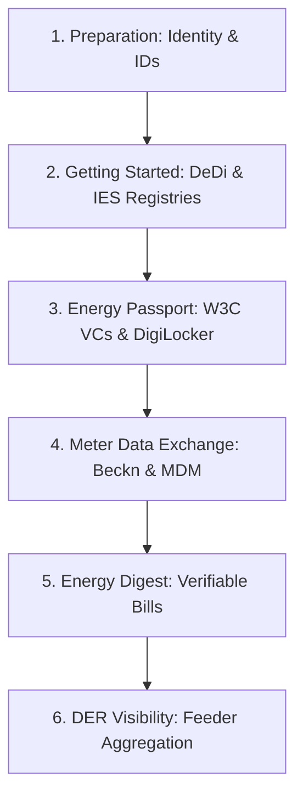

# DISCOM Pathway: Step-by-Step IES Integration Roadmap

Welcome to the **DISCOM Pathway**. This comprehensive guide provides a structured, step-by-step roadmap for a Distribution Company (Utility) to adopt the capabilities of the India Energy Stack (IES).

To keep this guide highly actionable and prevent redundancy, we have **eliminated repeated schemas and payloads**. Instead, each step highlights **current documentation gaps, implementation friction, and areas for improvement**, while pointing directly to the exact anchors in the core specifications for verification.

---

## Roadmap Overview

---

## Phase 1: Preparation (Identity & Addressing)

This phase establishes your cryptographic institutional identity and defines clear naming conventions for your customers, assets, meters, and grid connections.

<b>Step 1: Establish Your Institutional Identity (did:web)</b>

### Objective
Establish a globally unique, tamper-evident cryptographic identifier for your DISCOM (e.g., Tata Power Delhi Distribution Limited - `tpddl`) using the `did:web` standard.

### Execution Guidance
1. **Assign a Dedicated Domain**: Choose an institutional subdomain, e.g., `ies.tpddl.co.in`.
2. **DNS & Web Hosting Setup**: Coordinate with your Web/DNS Administrator to host your public keys inside a canonical `did.json` file served over HTTPS.
3. **Reference Verification**: Avoid writing the document from scratch. Refer to [Resolution & Routing § did:web](../identifiers/resolution.md#didweb) for the exact verification method structure and P-256 cryptographic representation.

> [!WARNING]
> **Friction Point (DNS/Web Admin Coordination)**: Establishing a `did:web` requires manual coordination with internal institutional security and domain administrators. This step often causes the longest onboarding delay.
> **Improvement Area**: IES currently lacks an automated validator utility to check if a hosted `did.json` is correctly configured and accessible before submitting it to the registry.

### References & Anchors
* [Identifiers & Addressing Overview](../identifiers/README.md)
* [Resolution & Routing Specification](../identifiers/resolution.md#didweb) (Target `did:web` resolution mechanics)
* [Basic Identifiers Checklist](../checklists/identifiers-basic-checklist.md#1-institutional-identity)

<b>Step 2: Define Your Naming Grammars (DEDI Identifiers)</b>

### Objective
Map your customers, physical grid assets, smart meters, and service connections to standard Decentralized Identifiers (DIDs).

### Naming Standards
Rather than repeating patterns in detail, we follow standard, DEDI-based naming grammars. Map your internal SAP/GIS codes to the exact syntax shown below:
1. **Consumers**: `did:dedi:<discom>:consumers:<consumer number>`
2. **Grid Assets**: `did:dedi:<discom>:assets:<asset-class>:<internal id>`
3. **Smart Meters**: `did:dedi:<discom>:assets:meter:<manufacturer code>_<serial number>`
4. **Service Connections**: `did:dedi:<discom>:connections:<connection id>`

> [!NOTE]
> **Gap (Manufacturer Code Registries)**: Meter identifiers rely on prepending a manufacturer code (e.g., `GEN_12345678`) to ensure global uniqueness. However, IES does not currently operate a centralized registry of recognized manufacturer prefixes, which can lead to namespace collisions.
> **Design Limitation**: Internal assets like substations or transformers can alternately use `did:web` paths, but doing so shifts the load of resolution from DeDi to the utility's web servers, creating single-points-of-failure.

### References & Anchors
* [Identifier Patterns and Grammars](../identifiers/id-patterns.md)
  * Refer to [Consumer Reference ID](../identifiers/id-patterns.md#consumer-reference-id)
  * Refer to [Asset Reference ID](../identifiers/id-patterns.md#asset-reference-id)
  * Refer to [Meter and Connection Reference DIDs](../identifiers/id-patterns.md#meter-and-connection-reference-dids)
* [Issuance Reference Document](../identifiers/issuance-reference.md)

---

## Phase 2: Getting Started (Registry Setup)

Establish your administrative namespaces on the public Decentralized Directory (DeDi) and register with the India Energy Stack network.

<b>Step 3: Setup DeDi Namespace</b>

### Objective
Create and verify your administrative namespace on the Decentralized Directory (DeDi) matching your short-code (`<discom>`).

### Execution Guidance
1. Register a secure role-mailbox (e.g., `registry-admin@tpddl.co.in`) on the DeDi Portal.
2. Verify ownership by adding a DNS TXT record to your domain. Refer to [Registry Creation § Step 3](../registries/registry-creation.md#step-3--verify-the-namespace-against-a-domain) for the exact TXT verification structure.

> [!IMPORTANT]
> **Operational Gap**: The domain verification step is currently manual and requires DNS propagation, which can take up to 24 hours. There is no automated fallback if DNS hosting is managed by a third-party vendor with slow turnaround times.

### References & Anchors
* [DeDi Primer](../registries/dedi-primer.md)
* [Registry Creation Guide](../registries/registry-creation.md#step-3--verify-the-namespace-against-a-domain)
* [Basic Registries Checklist](../checklists/registries-basic-checklist.md)

<b>Step 4: Create Operational Registries</b>

### Objective
Initialize separate registries under your namespace to hold public keys, credential revocation lists, and Beckn subscriber profiles.

### Suggestion
Ensure your operational registries are isolated:
* `public-keys` (tag `public_key`): Houses versioned signing keys.
* `vc-revocation-registry` (tag `revoke`): Manages VC real-time revocation statuses.
* `subscribers-test` & `subscribers-prod` (tag `beckn_subscriber`): Configures Beckn node credentials.

> [!WARNING]
> **Friction Point (Key Management)**: The public keys registry requires manual updates whenever keys are rotated. Failure to correctly set `validUntil` timestamps can invalidate previously issued historical credentials. Refer to [Required Registries § Public-keys registry](../registries/required-registries.md#public-keys-registry) for key rotation best practices.

### References & Anchors
* [Required Registries Catalog](../registries/required-registries.md)
  * Refer to [Public-keys registry](../registries/required-registries.md#public-keys-registry)
  * Refer to [Revocation registry](../registries/required-registries.md#revocation-registry)
  * Refer to [Beckn subscriber registry](../registries/required-registries.md#beckn-subscriber-registry)

<b>Step 5: Register with India Energy Stack</b>

### Objective
Submit your administrative references to the IES Network Facilitator Office (NFO) to be whitelisted in the canonical global reference directories.

### Execution Guidance
Email your registration payload containing your DISCOM credentials and Beckn endpoints directly to the IES Secretariat at:
* **Primary Email**: [IES.Secretariat@fsrglobal.org](mailto:IES.Secretariat@fsrglobal.org)
* **Alternate Email**: [ies@recindia.com](mailto:ies@recindia.com)

> [!IMPORTANT]
> **Onboarding Lags**: Registration with the NFO is currently a manual email-based workflow. Turnaround times depend on the Secretariat's auditing cycles, which can take several business days.
> **Improvement Area**: There is no self-service portal or automated smart-contract mechanism for immediate pre-production verification.

### References & Anchors
* [Required Registries § How to get added](../registries/required-registries.md#how-to-get-added)
* [End-to-End Onboarding Checklist](../registries/required-registries.md#end-to-end-onboarding-checklist)

---

## Phase 3: Energy Passport (Verifiable Credentials)

Enable your customers to hold a tamper-evident digital passport of their connection, load, tariff, and asset parameters.

<b>Step 6: Setup Credential Issuance (Energy Passport)</b>

### Objective
Deploy the OpenCred issuing service and integrate it with your core backend systems.

### Sub-Steps & Gaps
* **6.1 Identify CRM Systems**: Map data repositories (SAP IS-U, Oracle CC&B).
  > [!IMPORTANT]
  > **Integration Gap**: There are no standard API connectors or reference trigger configurations for popular utility CRM systems (like SAP IS-U). Every DISCOM must build custom database polling or event triggers from scratch to prompt credential re-issuance.
* **6.2 User Authentication**: Choose customer login gateways (OTP/Aadhaar reference).
* **6.3 Setup OpenCred**: Deploy the containerized OpenCred service.
* **6.4 CRM Sync**: Track active VC statuses in your internal database.
* **6.5 Customer Portal**: Design a web front-end to trigger passport pulls.

### References & Anchors
* [Energy Credentials Overview](../energy-credentials/README.md)
* [Energy Credentials Deployment Guide](../energy-credentials/onboarding.md)
* [Consumer Energy Passport Use Case](../use-cases/consumer-energy-passport/README.md)
  * Refer to [Map your CIS + DER systems](../use-cases/consumer-energy-passport/README.md#3-map-your-cis-der-systems-to-the-passport-sub-profiles)
* [Consumer Energy Passport Basic Checklist](../use-cases/consumer-energy-passport/basic-checklist.md)
* [Consumer Energy Passport Schema Reference](../energy-credentials/consumer-energy-passport.md)

<b>Step 7: Register with DigiLocker</b>

### Objective
Integrate your OpenCred issuance pipelines with DigiLocker (via API Setu) so citizens can pull their passports into the national wallet.

> [!WARNING]
> **API Setu Audit Friction**: Obtaining an active production Issuer ID on API Setu requires institutional compliance audits and legal approvals. Utilities must plan for a 2-4 week timeline for DigiLocker gateway clearance.

### References & Anchors
* [DigiLocker Integration Guide](../energy-credentials/digilocker-integration.md)
* [Issuing Credentials Checklist](../energy-credentials/issuance.md)

---

## Phase 4: Meter Data Exchange (Beckn Data Pipes)

Enable federated, policy-governed data sharing of smart meter telemetry and master data with authorized third parties.

<b>Step 8: Setup Data Exchange Nodes (BECKN Network)</b>

### Objective
Deploy the ONIX protocol adapter and register your BPP (Beckn Provider Platform) node on the IES networks.

### References & Anchors
* [Data Exchange Concepts](../data-exchange/concepts.md)
* [Data Exchange Quick Start](../data-exchange/quick-start.md)
  * Refer to [Onboarding Checklist](../data-exchange/quick-start.md#onboarding-checklist) for ONIX Docker configuration.
* [ONIX Registry Setup](../data-exchange/registry-setup.md)
* [Basic Data Exchange Checklist](../checklists/data-exchange-basic-checklist.md)

<b>Step 9: Establish MDM Integration for Telemetry</b>

### Objective
Connect your BPP adapter to your core HES / MDMS (Meter Data Management System) to retrieve and package raw interval meter readings.

> [!NOTE]
> **Implementation Gap (MDM API Lags)**: Real-time telemetry exchange requires high-performance APIs on the HES/MDMS side. However, legacy MDM databases are designed for batch processing and can introduce substantial latency, violating Beckn transaction response timeouts (usually 5 seconds).

### References & Anchors
* [Smart Meter Data Exchange Use Case](../use-cases/smart-meter-data-exchange/README.md)
  * Refer to [How It Works](../use-cases/smart-meter-data-exchange/README.md#how-it-works)
* [Smart Meter Data Model Guide](../use-cases/smart-meter-data-exchange/ies-data-model.md)
* [MeterData Schema Specification](../schemas/MeterData/v0.5/README.md)

<b>Step 10: Integrate Customer Master Data</b>

### Objective
Integrate billing and CIS platforms to structure customer details conforming to the **CustomerProfile** schema (e.g., sanctioned load, billing profile, tariff category).

### References & Anchors
* [MeterData Attributes & Customer Schema](../schemas/MeterData/v0.5/attributes.yaml) (Target `CustomerProfile` definitions)

<b>Step 11: Establish Token & Credential Scoped Auth</b>

### Objective
Define granular data authorization policies based on cryptographic verifiable credentials presented by consumers or authorized third parties.

> [!IMPORTANT]
> **Under-Specified Specification**: Standard authorization handshakes for B2B automated data exchange (where a third-party BAP requests data on behalf of a user) are currently under-specified. While conceptually relying on the Consumer Meter Digest, the exact runtime token-verification flow on BPP ONIX is not standardized out-of-the-box.

### References & Anchors
* [Data Exchange Security & Auth](../data-exchange/concepts.md#context-invariants) (Target encryption and signature verification guidelines)

<b>Step 12: Enable Meter Data Exchange Go-Live</b>

### Objective
Open your Beckn endpoints to production counterparties and run pilot transaction exchanges.

### References & Anchors
* [Detailed Data Exchange Checklist](../checklists/data-exchange-checklist-detailed.md)

---

## Phase 5: Energy Digest Credential (Verifiable Bills)

Move beyond static PDFs to compile and issue verifiable, machine-readable electricity bills.

<b>Step 13: Create the Electricity Bill Verifiable Credential</b>

### Objective
Build a processing pipeline that references smart meter telemetry, monthly billing summaries, and customer master files to output a verifiable billing digest.

> [!WARNING]
> **Major Architectural Gap**: There is currently **no standardized IES schema** for a verifiable electricity bill (e.g., `EnergyDigestCredential` or `ElectricityBillCredential`) in the core repository. While the concept is defined, implementing this step requires the DISCOM to draft a custom schema, which limits cross-verifier interoperability.

### References & Anchors
* [Electricity Bills and Digest Use Case](../use-cases/consumer-meter-digest/README.md)
  * Refer to [How It Works](../use-cases/consumer-meter-digest/README.md#how-it-works) for system data-flows.
* [Consumer Meter Digest Checklist](../use-cases/consumer-meter-digest/basic-checklist.md)

<b>Step 14: Link Bills to DigiLocker</b>

### Objective
Enable citizens to pull their monthly verifiable bill credentials straight into their DigiLocker wallets.

### References & Anchors
* [DigiLocker Issuer Setup](../energy-credentials/digilocker-integration.md)

---

## Phase 6: DER Visibility (Distributed Energy Resources)

Acquire real-time visibility into solar generation, battery storage, and feeder loading to balance the grid.

<b>Step 15: Establish DER Sources</b>

### Objective
Map all distributed generation and storage points in your network, including DISCOM-owned meters and third-party vendor APIs.

### Mapping Guidance
* Capture DER asset parameters (e.g., solar inverter rating, battery capacity) inside your internal DER database.
* Expose these assets with standard DID identifiers like `did:dedi:<discom>:assets:inverter:<inverter-serial-no>`.

<b>Step 16: Start Receiving Data via Daily Profiles</b>

### Objective
Ingest daily solar generation and storage logs from inverter gateways or vendor cloud APIs.

> [!NOTE]
> **Data Quality Challenge**: Ingesting telemetry from heterogenous inverter APIs (e.g., Sungrow, Solis, Fronius) introduces formatting discrepancies. The ingestion engine must normalize diverse vendor structures to comply with the standard IES DailyProfile schema.

<b>Step 17: Share Grid Topology Information</b>

### Objective
Expose topological mappings to model the hierarchical relationship of substations, feeders, distribution transformers, smart meters, and DER assets.

> [!IMPORTANT]
> **Specification Gap**: The India Energy Stack does **not** yet define a canonical schema for representing grid topology (`FeederTopology` or `GridMap`). Sharing this structure requires custom key-value metadata pairings, presenting an area for future standardization.

<b>Step 18: Build a Feeder-Level Aggregator</b>

### Objective
Implement an internal processing engine that consumes fine-grained meter telemetry and computes aggregated loading profiles per feeder/transformer.

> [!WARNING]
> **Verification Gap**: IES does not define standard validation rules for aggregated datasets. Computing aggregated values can hide faulty data points (e.g., zero-reading drops or missing periods) unless the aggregator implements robust data imputation standards internally.

<b>Step 19: Build a DER Visualiser Dashboard</b>

### Objective
Build a central web dashboard (BAP) that queries feeder-level aggregations over Beckn and visualizes loading, peaks, and solar back-feeding in real time.

