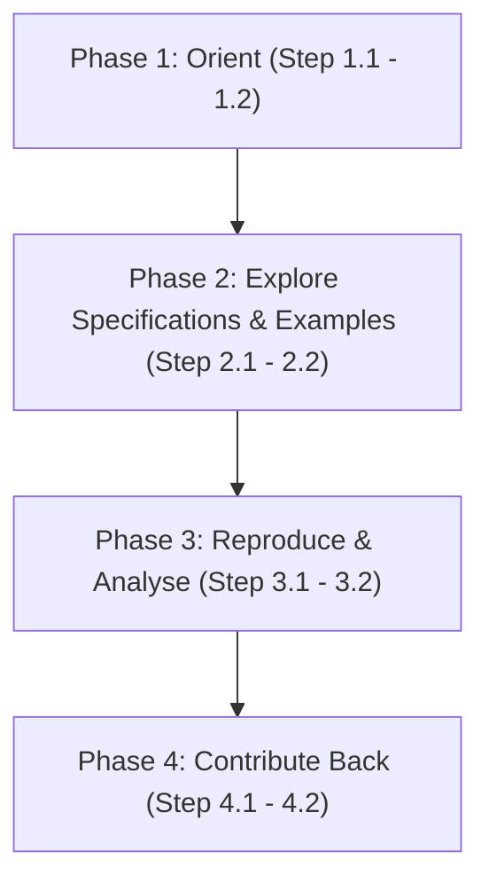

# Researcher / Analyst Pathway: Step-by-Step IES Study Roadmap

Welcome to the **Researcher / Analyst Pathway** — for academics, think-tank staff, policy researchers, journalists and students who want to study or analyse the India Energy Stack (IES) using its published, open artefacts.

This is not an operator pathway. Unlike the [Utility Pathway](utility.md) or [Secretariat Pathway](secretariat.md), you don't need a `did:web` identity, an adapter, or production credentials — everything you need to study IES (schemas, vocabularies, worked examples, pilot outcomes) is already public in this repository. The pathway is read-only: orient, explore, reproduce/analyse, and (if your work surfaces something worth contributing) close the loop back into the specification.

---

## Roadmap Overview



---

## Phase 1: Orient

Before reading a single schema file, get a correct mental model of what IES is (and isn't), and where its artefacts live. IES publishes open specifications with no licence fee and no platform to install — as a researcher, your entire "integration" is reading a public GitBook and, if you choose, cloning a public repository.

<details>
<summary><b>Step 1.1: Understand What IES Is (and Is Not)</b></summary>

### 💡 Phase Advice
> Read [What IES Is](../concepts/what-ies-is.md) first — it sets up the **Register → Discover → Exchange** spine every other page assumes you know.

### Execution Guidance
1. Read [What IES Is](../concepts/what-ies-is.md): the plain-language explanation and UPI-style analogy.
2. Note the spine: **Register** (verifiable digital identity), **Discover** (Beckn-protocol interaction), **Exchange** (schemas, taxonomy, verifiable credentials) — nearly every spec page falls under one of these three.
3. For research on what IES deliberately does **not** do, read the companion "What IES Is Not" page — it heads off a common misreading in policy commentary.

### References & Anchors
* [What IES Is](../concepts/what-ies-is.md)
* [What IES Provides — Register / Discover / Exchange overview](../what-ies-provides/README.md)
</details>

<details>
<summary><b>Step 1.2: Locate the GitBook and the Sandbox</b></summary>

### 💡 Phase Advice
> No account, no install. The specs are published on this GitBook, and the sandbox is live — both are just there to read (and, for the sandbox, observe).

### 📋 Prework Required
* None — bookmark the two entry points below.

### Execution Guidance
1. **The GitBook** — this repository (`ies-accelerator`) is the canonical spec set. Start from [What IES Provides](../what-ies-provides/README.md), which indexes Register, Discover, Exchange and the Taxonomy.
2. **The sandbox** — the pilot environment used by the four pilot DISCOMs for live use cases (see Phase 3 for outcomes).
3. Confirm you can navigate from [What IES Provides](../what-ies-provides/README.md) into a schema family folder (e.g. `schemas/MeterData/`) so Phase 2 is reading, not searching.

### References & Anchors
* [What IES Provides](../what-ies-provides/README.md)
* [What IES Is — Where it stands today](../concepts/what-ies-is.md#where-it-stands-today)
</details>

---

## Phase 2: Explore the Specifications & Examples

You don't need to run an adapter to read a schema. Every schema family ships its JSON Schema, JSON-LD context, RDF vocabulary, and worked example payloads directly in this repository — no separate SDK or credential required.

<details>
<summary><b>Step 2.1: Use the Taxonomy and Schemas Overview as Your Index</b></summary>

### 💡 Phase Advice
> Don't guess which schema covers your question by browsing folders. Start from [Taxonomy](../what-ies-provides/taxonomy.md) — its **schema map** lists every schema, domain, and combining use case in one place.

### Execution Guidance
1. Open [Taxonomy](../what-ies-provides/taxonomy.md) and read the **Schema map** — groups schemas into Verifiable Credentials, Data Exchange payloads, and External (DEG), with a one-line domain description and version each.
2. Cross-reference the [Schemas Overview](../what-ies-provides/schemas-overview/README.md) pages, a master index for browsing families without opening every folder.
3. Note **Standards precedence**: every schema records, per field, which standard governs it (Bureau of Indian Standards first, then CEA Regulations/IEGC, then IEC, then IEEE) — citable for standards-alignment analysis.

### References & Anchors
* [Taxonomy — Schema map](../what-ies-provides/taxonomy.md#schema-map)
* [Taxonomy — Standards precedence](../what-ies-provides/taxonomy.md#standards-precedence)
* [Schemas Overview](../what-ies-provides/schemas-overview/README.md)
</details>

<details>
<summary><b>Step 2.2: Read a Schema Without Running an Adapter</b></summary>

### 💡 Phase Advice
> Every schema family follows the same on-disk layout (Taxonomy's **Versioning** section): `attributes.yaml` (source of truth), `schema.json` (compiled JSON Schema), `context.jsonld`, `vocab.jsonld` (RDF, CIM-aligned), and `examples/`. Learn the pattern once, read any of the seven families the same way.

### Execution Guidance
1. Pick a schema family from the Taxonomy's schema map, e.g. `schemas/MeterData/v0.6/`.
2. Read `README.md` first — the auto-generated field reference, per the IES Documentation Template.
3. Open `examples/` (e.g. `schemas/MeterData/v0.6/examples/`) for realistic payloads — the fastest way to see a real exchange on the wire.
4. For the formal schema: `schema.json` (JSON Schema Draft 2020-12), or `context.jsonld`/`vocab.jsonld` for semantic-web analysis.

### References & Anchors
* [Taxonomy — Versioning](../what-ies-provides/taxonomy.md#versioning)
* [Taxonomy — Schema map](../what-ies-provides/taxonomy.md#schema-map)
* [Schemas Overview](../what-ies-provides/schemas-overview/README.md)
* [MeterData example payloads](https://github.com/India-Energy-Stack/ies-accelerator/tree/main/schemas/MeterData/v0.6/examples)
</details>

---

## Phase 3: Reproduce & Analyse

If your research makes a claim about how a schema behaves, verify it empirically rather than trusting the docs at face value. The repository ships its own validator scripts, and the Technical Note documents a citable outcome table from a real 30-day pilot challenge — both ready to reproduce or cite directly.

<details>
<summary><b>Step 3.1: Run the Repository's Own Validators Against Example Payloads</b></summary>

### 💡 Phase Advice
> To confirm a claim about a schema's constraints — required fields, valid enums, how cumulative readings are checked — run the validator against a shipped example rather than re-deriving the rule by eye.

### ⚠️ Caution
> Validator invocation differs by family: `MeterData` ships its own semantic validator under a `validation/` subfolder; other families use a shared script at the repository root.

### Execution Guidance
1. **For `MeterData` v0.6** — from its `validation/` directory, run:
   ```bash
   python validator.py <path-to-example.json>
   ```
   e.g. `python validator.py ../examples/DailyProfile.json`, run from `schemas/MeterData/v0.6/validation/`. Checks conformance against `schema.json` plus semantic rules (OBIS code resolution, profile-type restrictions, monotonicity of cumulative readings, and more — see the validator's README).
2. **For other families** — from the repository root, run:
   ```bash
   python scripts/validate_schema.py schemas/<Family>/<version>/schema.json schemas/<Family>/<version>/examples
   ```
   substituting the family/version (e.g. `ArrFiling`, `MeterDataRequestCredential`).
3. A failing validation is a data point: the example may be intentionally illustrative, or it may surface a genuine question (see Phase 4).

### References & Anchors
* [MeterData v0.6 validator README](https://india-energy-stack.gitbook.io/docs/schemas/meterdata/v0.6)
* [Taxonomy — Versioning](../what-ies-provides/taxonomy.md#versioning)
</details>

<details>
<summary><b>Step 3.2: Study the Documented Pilot Outcomes</b></summary>

### 💡 Phase Advice
> Don't rely on secondary summaries. [Pilots and Status](../concepts/pilots.md) is the primary, citable source: an outcomes table from the 30-day DISCOM Challenge (21 May – 21 June 2026), covering the four pilot DISCOMs and which use case each demonstrated.

### Execution Guidance
1. Read [Pilots and Status](../concepts/pilots.md) for the outcomes table: four pilot DISCOMs, across four States, that built IES adapters during the Challenge.
2. Cross-reference "Use cases demonstrated" against the four live capabilities: **DER Visibility**, **Consumer Energy Passport**, **Consumer Meter Digest**, **Smart Meter Data Exchange** — each row also states the "Before IES" baseline.
3. Note "What 'live in pilot' means", defining the evidentiary bar per demonstration (adapter running, `did:web` resolvable, subscriber record in the registry, issued credential or completed exchange, independently verified by a counterparty).

### References & Anchors
* [Pilots and Status](../concepts/pilots.md)
* [Pilots and Status — The 30-day DISCOM Challenge](../concepts/pilots.md#the-30-day-discom-challenge)
* [Pilots and Status — Use cases demonstrated](../concepts/pilots.md#use-cases-demonstrated)
</details>

---

## Phase 4: Contribute Back

Research sometimes surfaces something IES itself should know about: an unmodelled domain object, or an inconsistency in an existing schema. IES has a documented, public path for this, and your published work should cite the specifications precisely so other researchers can reproduce your reading.

<details>
<summary><b>Step 4.1: Propose a Schema Change or Extension</b></summary>

### 💡 Phase Advice
> If your analysis surfaces a genuine gap, don't just footnote it — the Taxonomy page documents a real proposal flow with a real review body, turning a research observation into a durable spec improvement.

### Execution Guidance
Follow [Taxonomy — Proposing a new schema (or a change)](../what-ies-provides/taxonomy.md#proposing-a-new-schema-or-a-change):
1. **Check the schema map first** — confirm no existing schema (with an optional extension) already covers it.
2. **Draft the schema** in `attributes.yaml` shape, per the IES Documentation Template.
3. **Open a PR**: scope statement, standards basis (IS → CEA → IEC → IEEE precedence), example payloads.
4. **Review by the IES Cell** — the CEA-constituted governance body — checks standards alignment, field overlap, use-case fit.
5. **Acceptance** publishes `v0.1` and adds the schema to the Taxonomy's schema map.

### References & Anchors
* [Taxonomy — Proposing a new schema (or a change)](../what-ies-provides/taxonomy.md#proposing-a-new-schema-or-a-change)
* [Taxonomy — Stewardship](../what-ies-provides/taxonomy.md#stewardship)
</details>

<details>
<summary><b>Step 4.2: Cite the Specifications in Published Work</b></summary>

### 💡 Phase Advice
> Cite a specific schema family and version (e.g. "IES MeterData v0.6"), not just "the India Energy Stack" — versioning keeps citations reproducible as new versions publish, since old versions stay reachable.

### Execution Guidance
1. Cite the canonical hosting path under [Taxonomy — Stewardship](../what-ies-provides/taxonomy.md#stewardship): the `schemas/` folder as source of truth, canonical URLs of the form `india-energy-stack.github.io/ies-accelerator/schemas/...`.
2. For pilot outcomes, cite [Pilots and Status](../concepts/pilots.md) directly, naming the specific DISCOM(s) and use case(s) — not "the IES pilots" generically.
3. For questions on citation or proposal review, the IES Secretariat is the documented contact point (see [Pilots and Status — Get in touch](../concepts/pilots.md#get-in-touch)).

### References & Anchors
* [Taxonomy — Stewardship](../what-ies-provides/taxonomy.md#stewardship)
* [Pilots and Status — Get in touch](../concepts/pilots.md#get-in-touch)
* [Taxonomy — Where this fits](../what-ies-provides/taxonomy.md#where-this-fits)
</details>
