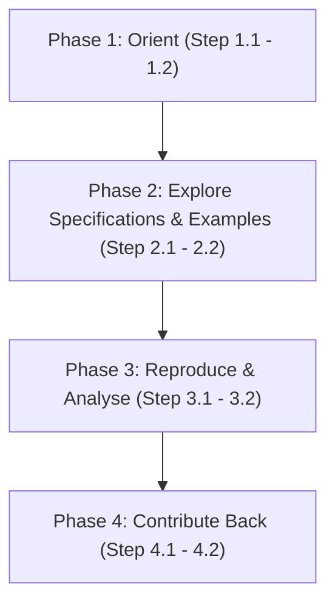

# Researcher / Analyst Pathway: Step-by-Step IES Study Roadmap

Welcome to the **Researcher / Analyst Pathway**. This guide is for academics, think-tank staff, policy researchers, journalists and students who want to study or analyse the India Energy Stack (IES) using its published, open artefacts.

This is not an operator pathway. Unlike the [Utility Pathway](utility.md) or [Secretariat Pathway](secretariat.md), you do not need a `did:web` identity, you do not need to run an adapter, and you do not need production credentials. Everything you need to study IES — schemas, vocabularies, worked examples, pilot outcomes — is already public in this one repository. This pathway is read-only in character: it walks you through orienting, exploring, reproducing/analysing, and (if your work surfaces something worth contributing) closing the loop back into the specification.

---

## Roadmap Overview



---

## Phase 1: Orient

Before reading a single schema file, get a correct mental model of what IES is (and is not), and where its published artefacts live. IES publishes open specifications with no licence fee and no central platform to install — as a researcher, your entire "integration" is reading a public GitBook and, if you choose, cloning a public repository.

<details>
<summary><b>Step 1.1: Understand What IES Is (and Is Not)</b></summary>

### 💡 Phase Advice
> Read [What IES Is](../concepts/what-ies-is.md) before anything else. It sets up the **Register → Discover → Exchange** spine that every other page in this GitBook assumes you already know. Skipping it makes the schema and taxonomy pages harder to parse later.

### Execution Guidance
1. Read [What IES Is](../concepts/what-ies-is.md) for the plain-language explanation of the problem IES solves and the UPI-style analogy it uses.
2. Note the three-step spine: **Register** (verifiable digital identity), **Discover** (Beckn-protocol interaction), **Exchange** (schemas, taxonomy, verifiable credentials). Nearly every specification page in this GitBook is filed under one of these three steps.
3. If your research concerns what IES deliberately does **not** do, also read the companion "What IES Is Not" page linked from the same section — this heads off a common category of misreading in policy commentary.

### References & Anchors
* [What IES Is](../concepts/what-ies-is.md)
* [What IES Provides — Register / Discover / Exchange overview](../what-ies-provides/README.md)
</details>

<details>
<summary><b>Step 1.2: Locate the GitBook and the Sandbox</b></summary>

### 💡 Phase Advice
> There is no account to create and no install step for reading. The specifications have been published on this GitBook, and the sandbox is working — both are simply there to read and, in the sandbox's case, to observe.

### 📋 Prework Required
* None. This step is purely orientation — bookmark the two entry points below.

### Execution Guidance
1. **The GitBook** — this repository itself (`ies-accelerator`) is the canonical, rendered specification set. Start from [What IES Provides](../what-ies-provides/README.md), which indexes Register, Discover, Exchange and the Taxonomy.
2. **The sandbox** — the pilot environment referenced throughout the concepts pages, used by the four pilot DISCOMs to demonstrate live use cases (see Phase 3 below for the documented outcomes).
3. Confirm you can navigate from [What IES Provides](../what-ies-provides/README.md) down into a schema family folder (e.g. `schemas/MeterData/`) so that Phase 2 is a matter of reading, not searching.

### References & Anchors
* [What IES Provides](../what-ies-provides/README.md)
* [What IES Is — Where it stands today](../concepts/what-ies-is.md#where-it-stands-today)
</details>

---

## Phase 2: Explore the Specifications & Examples

You do not need to run an adapter to read a schema. Every schema family in IES ships its JSON Schema, JSON-LD context, RDF vocabulary and worked example payloads directly in this repository — no separate SDK or credential is required to open and study them.

<details>
<summary><b>Step 2.1: Use the Taxonomy and Schemas Overview as Your Index</b></summary>

### 💡 Phase Advice
> Don't try to guess which schema covers your research question by browsing folders. Start from [Taxonomy](../what-ies-provides/taxonomy.md) — its **schema map** table lists every schema, the domain it covers, and which use case combines it, all in one place.

### Execution Guidance
1. Open [Taxonomy](../what-ies-provides/taxonomy.md) and read the **Schema map** section — it groups schemas into Verifiable Credentials, Data Exchange payloads, and External (DEG) schemas, with a one-line domain description and current version for each.
2. Cross-reference against the [Schemas Overview](../what-ies-provides/schemas-overview/README.md) pages, which give a master index for browsing schema families without needing to open every folder individually.
3. Note the **Standards precedence** section of the Taxonomy page: every schema records, per field, which standard governs it (Bureau of Indian Standards first, then CEA Regulations/IEGC, then IEC, then IEEE). This is directly citable if your analysis concerns standards alignment.

### References & Anchors
* [Taxonomy — Schema map](../what-ies-provides/taxonomy.md#schema-map)
* [Taxonomy — Standards precedence](../what-ies-provides/taxonomy.md#standards-precedence)
* [Schemas Overview](../what-ies-provides/schemas-overview/README.md)
</details>

<details>
<summary><b>Step 2.2: Read a Schema Without Running an Adapter</b></summary>

### 💡 Phase Advice
> Every schema family follows the exact same on-disk layout, described in the Taxonomy's **Versioning** section: `attributes.yaml` (hand-edited source of truth), `schema.json` (compiled JSON Schema), `context.jsonld` (JSON-LD context), `vocab.jsonld` (RDF vocabulary with CIM alignments), and an `examples/` folder of worked payloads. Once you know this pattern, you can read any of the seven schema families the same way.

### Execution Guidance
1. Pick a schema family from the Taxonomy's schema map, e.g. `schemas/MeterData/v0.6/`.
2. Read `README.md` in that folder first — it is the auto-generated field reference, following the IES Documentation Template.
3. Open the `examples/` subfolder (e.g. `schemas/MeterData/v0.6/examples/`) to see worked, realistic payloads rather than abstract field lists — these are the fastest way to understand what a real exchange looks like on the wire.
4. If your analysis needs the formal schema rather than the prose reference, open `schema.json` (JSON Schema Draft 2020-12) directly, or `context.jsonld` / `vocab.jsonld` if you are doing semantic-web or linked-data analysis.

### References & Anchors
* [Taxonomy — Versioning](../what-ies-provides/taxonomy.md#versioning)
* [Taxonomy — Schema map](../what-ies-provides/taxonomy.md#schema-map)
* [Schemas Overview](../what-ies-provides/schemas-overview/README.md)
* [MeterData example payloads](https://github.com/India-Energy-Stack/ies-accelerator/tree/main/schemas/MeterData/v0.6/examples)
</details>

---

## Phase 3: Reproduce & Analyse

If your research makes a claim about how a schema behaves, verify it empirically rather than taking the documentation at face value. The repository ships its own validator scripts, and the Technical Note documents a concrete, citable outcome table from a real 30-day pilot challenge — both are ready to reproduce or cite directly.

<details>
<summary><b>Step 3.1: Run the Repository's Own Validators Against Example Payloads</b></summary>

### 💡 Phase Advice
> If you want to confirm a claim about a schema's constraints — e.g. which fields are required, which enum values are valid, how cumulative readings are checked — run the validator against a shipped example rather than re-deriving the rule by eye. This is the fastest way to check your own reading of a schema is correct.

### ⚠️ Caution
> Validator invocation differs by schema family: `MeterData` ships its own semantic validator under a `validation/` subfolder, while other families are checked with a shared script at the repository root. Use the right command for the family you're studying.

### Execution Guidance
1. **For `MeterData` v0.6** — from its `validation/` directory, run:
   ```bash
   python validator.py <path-to-example.json>
   ```
   e.g. `python validator.py ../examples/DailyProfile.json`, run from `schemas/MeterData/v0.6/validation/`. This validator checks structural conformance against `schema.json` plus semantic rules (OBIS code resolution, profile-type restrictions, monotonicity of cumulative readings, and more — see the validator's own README for the full rule list).
2. **For other schema families** — from the repository root, run:
   ```bash
   python scripts/validate_schema.py schemas/<Family>/<version>/schema.json schemas/<Family>/<version>/examples
   ```
   substituting the family and version you are studying (e.g. `ArrFiling`, `MeterDataRequestCredential`).
3. Treat a failing validation as a data point: it may mean the example is intentionally illustrative rather than fully conformant, or it may surface a genuine question worth raising (see Phase 4).

### References & Anchors
* [MeterData v0.6 validator README](../schemas/MeterData/v0.6/validation/README.md)
* [Taxonomy — Versioning](../what-ies-provides/taxonomy.md#versioning)
</details>

<details>
<summary><b>Step 3.2: Study the Documented Pilot Outcomes</b></summary>

### 💡 Phase Advice
> Don't rely on secondary summaries of what the pilots demonstrated. [Pilots and Status](../concepts/pilots.md) is the primary, citable source: a concrete outcomes table from the 30-day DISCOM Challenge (21 May – 21 June 2026), naming the four pilot DISCOMs, their locations, and which use case each demonstrated.

### Execution Guidance
1. Read [Pilots and Status](../concepts/pilots.md) for the outcomes table covering **PVVNL** (Meerut, Uttar Pradesh), **APEPDCL** (Visakhapatnam, Andhra Pradesh), **DGVCL** (Surat, Gujarat), and **Tata Power** (Mumbai, Maharashtra).
2. Cross-reference the "Use cases demonstrated" table against the four capabilities shown live: **DER Visibility**, **Consumer Energy Passport**, **Consumer Meter Digest**, and **Smart Meter Data Exchange** — each row also states the "Before IES" baseline, useful if your analysis is a before/after comparison.
3. Note the "What 'live in pilot' means" section, which defines exactly what evidentiary bar each demonstration had to clear (adapter running, `did:web` identity resolvable, subscriber record in the network registry, issued credential or completed exchange, independently verified by a counterparty) — useful if you need to characterise the rigour of the pilot claims in your own writing.

### References & Anchors
* [Pilots and Status](../concepts/pilots.md)
* [Pilots and Status — The 30-day DISCOM Challenge](../concepts/pilots.md#the-30-day-discom-challenge)
* [Pilots and Status — Use cases demonstrated](../concepts/pilots.md#use-cases-demonstrated)
</details>

---

## Phase 4: Contribute Back

Research sometimes surfaces something IES itself should know about: a domain object that isn't modelled yet, or an inconsistency in an existing schema. IES has a documented, public path for exactly this, and your published work should cite the specifications precisely so other researchers can reproduce your reading.

<details>
<summary><b>Step 4.1: Propose a Schema Change or Extension</b></summary>

### 💡 Phase Advice
> If your analysis surfaces a genuine gap, don't just note it in a footnote — the Taxonomy page documents an actual proposal flow with a real review body. Following it turns a research observation into a durable specification improvement that other researchers benefit from too.

### Execution Guidance
Follow the flow documented in [Taxonomy — Proposing a new schema (or a change)](../what-ies-provides/taxonomy.md#proposing-a-new-schema-or-a-change):
1. **Check the schema map first** — confirm no existing schema (with an optional extension) already covers the object you think is missing.
2. **Draft the schema** in `attributes.yaml` shape, following the IES Documentation Template referenced from the Taxonomy page.
3. **Open a PR** against this repository, including a scope statement, the basis of standards used (in the IS → CEA → IEC → IEEE precedence order), and example payloads.
4. **Review by the IES Cell** — the CEA-constituted governance body — which checks standards alignment, field overlap with existing schemas, and use-case fit.
5. **Acceptance** publishes a versioned `v0.1` and adds the schema to the Taxonomy's schema map.

### References & Anchors
* [Taxonomy — Proposing a new schema (or a change)](../what-ies-provides/taxonomy.md#proposing-a-new-schema-or-a-change)
* [Taxonomy — Stewardship](../what-ies-provides/taxonomy.md#stewardship)
</details>

<details>
<summary><b>Step 4.2: Cite the Specifications in Published Work</b></summary>

### 💡 Phase Advice
> Cite a specific schema family and version (e.g. "IES MeterData v0.6"), not just "the India Energy Stack" in general — schemas are versioned precisely so that a citation stays reproducible even as later versions are published, since old versions stay reachable.

### Execution Guidance
1. Cite the canonical hosting path noted under [Taxonomy — Stewardship](../what-ies-provides/taxonomy.md#stewardship): the repository (`schemas/` folder) as source of truth, with canonical published URLs of the form `india-energy-stack.github.io/ies-accelerator/schemas/...`.
2. When citing pilot outcomes, cite [Pilots and Status](../concepts/pilots.md) directly and name the specific DISCOM(s) and use case(s) your analysis draws on, rather than "the IES pilots" generically.
3. For questions that arise during citation or proposal review, the IES Secretariat is the documented contact point (see [Pilots and Status — Get in touch](../concepts/pilots.md#get-in-touch)).

### References & Anchors
* [Taxonomy — Stewardship](../what-ies-provides/taxonomy.md#stewardship)
* [Pilots and Status — Get in touch](../concepts/pilots.md#get-in-touch)
* [Taxonomy — Where this fits](../what-ies-provides/taxonomy.md#where-this-fits)
</details>
