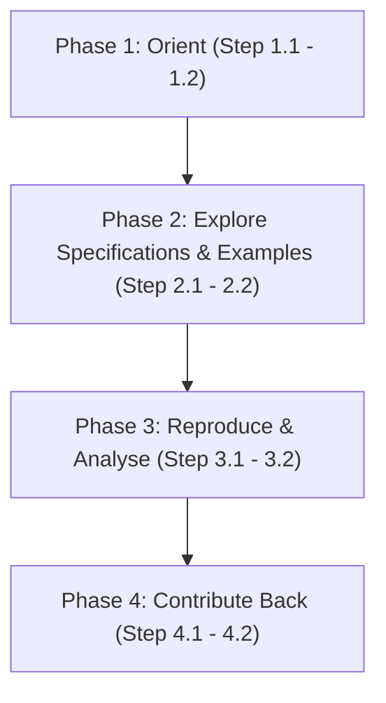

# Researcher / Analyst Pathway: Step-by-Step IES Study Roadmap

This guide is for academics, think-tank staff, policy researchers, journalists and students who want to study or analyse the India Energy Stack (IES) from its published, open artefacts.

This is not an operator pathway. Unlike the [Utility Pathway](utility.md) or [Secretariat Pathway](secretariat.md), you need no `did:web` identity, no adapter, and no credentials. Everything — schemas, vocabularies, worked examples, the pilot record — is public in this repository. The pathway is read-only: orient, explore, reproduce, and (if your work surfaces something worth contributing) close the loop back into the specification.

---

## Roadmap Overview


```mermaid
flowchart TD
    orient["Phase 1: Orient (Step 1.1 - 1.2)"] --> explore["Phase 2: Explore Specifications & Examples (Step 2.1 - 2.2)"]
    explore --> reproduce["Phase 3: Reproduce & Analyse (Step 3.1 - 3.2)"]
    reproduce --> contribute["Phase 4: Contribute Back (Step 4.1 - 4.2)"]
```

---

## Phase 1: Orient

Get a correct mental model of what IES is (and is not), and where its published artefacts live. IES publishes open specifications with no licence fee and no central platform to install — your entire "integration" is reading a public GitBook and, if you choose, cloning a public repository.

<details>
<summary><b>Step 1.1: Understand What IES Is (and Is Not)</b></summary>

### 💡 Phase Advice
> Read [Getting Started](../README.md) before anything else. It sets up the **Register → Discover → Exchange** spine that every other page assumes you already know.

### Execution Guidance
1. Read [Getting Started](../README.md) for the plain-language explanation of the problem IES solves and the UPI-style analogy it uses.
2. Note the three-step spine: **Register** (verifiable digital identity), **Discover** (Beckn-protocol interaction), **Exchange** (schemas and verifiable credentials). Nearly every specification page is filed under one of these three.
3. If your research concerns what IES deliberately does **not** do, note the boundary stated there: IES writes no new standards, and it is not a platform, a database, or a product — see [How IES works](../README.md#how-ies-works-register-discover-exchange). This heads off a common category of misreading in policy commentary.

### References & Anchors
* [Getting Started](../README.md)
* [Getting Started — How IES works: Register, Discover, Exchange](../README.md#how-ies-works-register-discover-exchange)
</details>

<details>
<summary><b>Step 1.2: Locate the Reference and the Pilot Record</b></summary>

### 💡 Phase Advice
> There is no account to create and no install step for reading. The specifications are published on this GitBook. Pilot activity — the 30-day DISCOM Challenge and its sandbox — is historical and completed; its documented outcomes are there to study, not a live environment to join.

### 📋 Prework Required
* None. This step is purely orientation — bookmark the two entry points below.

### Execution Guidance
1. **The GitBook** — this repository (`ies-accelerator`) is the canonical, rendered specification set. [Getting Started — What this GitBook is](../README.md#what-this-gitbook-is) indexes the schema catalog, use-case guides, and pathways.
2. **The pilot record** — [Getting Started — The full story](../README.md#the-full-story) summarises where things stand: four pilot DISCOMs completed the 30-day DISCOM Challenge (see Phase 3 below). The full narrative — architecture, adoption strategy, governance, pilot record — is the IES report at [indiaenergystack.in/report](https://indiaenergystack.in/report).
3. Confirm you can navigate from the [Schemas Overview](../what-ies-provides/schemas-overview/README.md) down into a schema family folder (e.g. `schemas/MeterData/`) so that Phase 2 is a matter of reading, not searching.

### References & Anchors
* [Getting Started — What this GitBook is](../README.md#what-this-gitbook-is)
* [Getting Started — The full story](../README.md#the-full-story)
</details>

---

## Phase 2: Explore the Specifications & Examples

You do not need to run an adapter to read a schema. Every schema family ships its JSON Schema, JSON-LD context, RDF vocabulary and worked example payloads directly in this repository — no separate SDK or credential is required.

<details>
<summary><b>Step 2.1: Use the Schema Catalog as Your Index</b></summary>

### 💡 Phase Advice
> Don't guess which schema covers your research question by browsing folders. Start from the [Schemas catalog](../schemas-ies/README.md) — every schema, its domain, and its current version in one place.

### Execution Guidance
1. Open the [Schemas catalog](../schemas-ies/README.md) — it groups the schemas into Verifiable Credentials, Data Exchange payloads, and External (DEG) schemas, with a one-line domain description and current version for each.
2. For the *why* before the *what*, read the matching [Schemas Overview](../what-ies-provides/schemas-overview/README.md) page — one plain-language page per schema (what it is, who issues it, what standards it follows, open questions).
3. Note that every schema overview page records its **Basis of Standards** in a fixed precedence order — Bureau of Indian Standards (IS) first, then CEA Regulations/IEGC, then IEC, then IEEE — directly citable if your analysis concerns standards alignment. See [how each page is organised](../what-ies-provides/schemas-overview/README.md#how-each-page-is-organised).

### References & Anchors
* [Schemas catalog](../schemas-ies/README.md)
* [Schemas Overview](../what-ies-provides/schemas-overview/README.md)
* [Schemas Overview — how each page is organised](../what-ies-provides/schemas-overview/README.md#how-each-page-is-organised)
</details>

<details>
<summary><b>Step 2.2: Read a Schema Without Running an Adapter</b></summary>

### 💡 Phase Advice
> Every schema family follows the same on-disk layout: `attributes.yaml` (source of truth), `schema.json` (compiled JSON Schema), `context.jsonld`, `vocab.jsonld` (RDF, CIM-aligned), an `examples/` folder, and an auto-generated `README.md` field reference. Learn this once and read any of the seven families the same way — see [How versions work](../schemas-ies/README.md#how-versions-work).

### Execution Guidance
1. Pick a schema family from the catalog, e.g. `schemas/MeterData/v0.6/`.
2. Read `README.md` in that folder first — the auto-generated, field-by-field reference.
3. Open the `examples/` subfolder (e.g. [`schemas/MeterData/v0.6/examples/`](https://github.com/India-Energy-Stack/ies-accelerator/tree/main/schemas/MeterData/v0.6/examples)) to see worked, realistic payloads — the fastest way to understand what a real exchange looks like on the wire.
4. If your analysis needs the formal schema rather than the prose reference, open `schema.json` (JSON Schema Draft 2020-12) directly, or `context.jsonld` / `vocab.jsonld` for semantic-web or linked-data analysis.

### References & Anchors
* [Schemas catalog — How versions work](../schemas-ies/README.md#how-versions-work)
* [MeterData v0.6 field reference](../schemas/MeterData/v0.6/README.md)
</details>

---

## Phase 3: Reproduce & Analyse

If your research makes a claim about how a schema behaves, verify it empirically. The repository ships its own validator scripts, and the pilot record is documented and citable.

<details>
<summary><b>Step 3.1: Run the Repository's Own Validators Against Example Payloads</b></summary>

### 💡 Phase Advice
> To confirm a claim about a schema's constraints — which fields are required, which enum values are valid, how cumulative readings are checked — run the validator against a shipped example rather than re-deriving the rule by eye.

### ⚠️ Caution
> Validator invocation differs by schema family: `MeterData` ships its own semantic validator under a `validation/` subfolder, while other families are checked with a shared script at the repository root. Use the right command for the family you're studying.

### Execution Guidance
1. **For `MeterData` v0.6** — from `schemas/MeterData/v0.6/validation/`, run:
   ```bash
   python validator.py <path-to-example.json>
   ```
   e.g. `python validator.py ../examples/DailyProfile.json`. This checks structural conformance against `schema.json` plus semantic rules (OBIS code resolution, profile-type restrictions, monotonicity of cumulative readings, and more — see the [validator's README](../schemas/MeterData/v0.6/validation/README.md) for the full rule list).
2. **For other schema families** — from the repository root, run:
   ```bash
   python scripts/validate_schema.py schemas/<Family>/<version>/schema.json schemas/<Family>/<version>/examples
   ```
   substituting the family and version you are studying (e.g. `ArrFiling`, `MeterDataRequestCredential`).
3. Treat a failing validation as a data point: it may mean the example is intentionally illustrative rather than fully conformant, or it may surface a genuine question worth raising (see Phase 4).

### References & Anchors
* [MeterData v0.6 validator README](../schemas/MeterData/v0.6/validation/README.md)
* [Schemas catalog — How versions work](../schemas-ies/README.md#how-versions-work)
</details>

<details>
<summary><b>Step 3.2: Study the Documented Pilot Outcomes</b></summary>

### 💡 Phase Advice
> Don't rely on secondary summaries. [Getting Started — The full story](../README.md#the-full-story) is this reference's own statement of where things stand; the full pilot record is in the IES report at [indiaenergystack.in/report](https://indiaenergystack.in/report). The Challenge is a completed, historical outcome — not a claim that any pilot is running today.

### Execution Guidance
1. Read [Getting Started — The full story](../README.md#the-full-story): four pilot DISCOMs — PVVNL (Uttar Pradesh), APEPDCL (Andhra Pradesh), DGVCL (Gujarat) and Tata Power (Maharashtra) — completed a 30-day DISCOM Challenge, each building an IES adapter against the specifications and the pilot sandbox.
2. The four use cases demonstrated were **DER Visibility**, **Consumer Energy Passport**, **Consumer Meter Digest**, and **Smart Meter Data Exchange**.
3. During the Challenge, "demonstrated" meant clearing a fixed evidentiary bar — adapter running, `did:web` identity resolvable, subscriber record present in the network registry, an issued credential or completed exchange, independently verified by a counterparty (recorded in the repository's STATUS.md file) — useful if you need to characterise the rigour of the pilot claims in your own writing. That bar describes what was verified during the dated Challenge, not anything running today.
4. When citing outcomes, name the specific DISCOM(s) and use case(s) your analysis draws on, rather than "the IES pilots" generically, and cite the IES report for the detailed record.

### References & Anchors
* [Getting Started — The full story](../README.md#the-full-story)
* [The IES report](https://indiaenergystack.in/report)
</details>

---

## Phase 4: Contribute Back

Research sometimes surfaces something IES itself should know about: a domain object that isn't modelled yet, or an inconsistency in an existing schema. There is a documented, public path for exactly this — and your published work should cite the specifications precisely so other researchers can reproduce your reading.

<details>
<summary><b>Step 4.1: Propose a Schema Change or Extension</b></summary>

### 💡 Phase Advice
> If your analysis surfaces a genuine gap, don't just note it in a footnote — the [Propose a Schema](../propose-a-schema.md) page carries an actual submission flow with a real review body. Following it turns a research observation into a durable specification improvement.

### Execution Guidance
1. **Check the catalog first** — confirm no existing schema (with an optional extension) already covers the object you think is missing.
2. **Draft the schema** in `attributes.yaml` shape, with example payloads and the standards it builds on (in the IS → CEA → IEC → IEEE precedence order).
3. **Submit it** via the [Propose a Schema](../propose-a-schema.md) form — a public tracking issue is created on the [GitHub issue tracker](https://github.com/India-Energy-Stack/ies-accelerator/issues) for community review; no GitHub account is required.
4. **Review by the IES Cell** — the governance body being constituted under the Central Electricity Authority — which checks standards alignment, field overlap with existing schemas, and use-case fit.
5. **Acceptance** publishes a versioned `v0.1` and adds the schema to the catalog.

### References & Anchors
* [Propose a Schema](../propose-a-schema.md)
* [Schemas catalog](../schemas-ies/README.md)
</details>

<details>
<summary><b>Step 4.2: Cite the Specifications in Published Work</b></summary>

### 💡 Phase Advice
> Cite a specific schema family and version (e.g. "IES MeterData v0.6"), not just "the India Energy Stack" — schemas are versioned precisely so a citation stays reproducible as later versions are published, since old versions stay reachable.

### Execution Guidance
1. Cite the canonical hosting path: the repository's `schemas/` folder is the source of truth, with canonical published URLs of the form `india-energy-stack.github.io/ies-accelerator/schemas/...` — see [How versions work](../schemas-ies/README.md#how-versions-work).
2. When citing pilot outcomes, follow Step 3.2: name the specific DISCOM(s) and use case(s), and cite the IES report for the detailed record.
3. For questions that arise during citation or proposal review, the IES Secretariat is the documented contact point — see [Getting Started — Get in touch](../README.md#get-in-touch).

### References & Anchors
* [Schemas catalog — How versions work](../schemas-ies/README.md#how-versions-work)
* [Getting Started — Get in touch](../README.md#get-in-touch)
</details>
