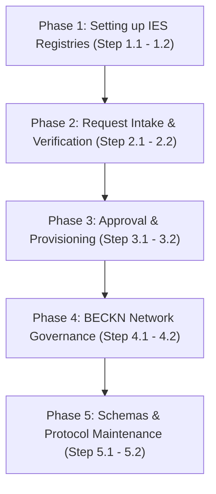

# IES Secretariat Pathway: Step-by-Step Registration Approval & Network Governance Roadmap

Welcome to the **Secretariat Pathway**. This guide provides an actionable, structured step-by-step checklist for the India Energy Stack (IES) Secretariat, Network Facilitator Organisation (NFO), or network operators to set up registries, process participant registration requests, govern the network, and manage schemas and protocols.

---

## Roadmap Overview



---

## Phase 1: Setting up IES-Specific Authoritative Registries

In this phase, the Secretariat establishes the core authoritative registries that govern identity, trust, and communication across the India Energy Stack network.

<details>
<summary><b>Step 1.1: Initialize the Core Authoritative Registries</b></summary>

### 💡 Phase Advice
> Set up the root authoritative namespace on the Decentralized Directory (DeDi) under a highly secured namespace key, since all other participant verifications depend on it.

### Execution Guidance
The IES operator operates the canonical DeDi namespace `india-energy-stack` (and `indiaenergystack.in` for Beckn network registries). Initialize the following registries under these namespaces:
1. **`ies-discoms-reference-registry`** (tag: `membership`): The authoritative allow-list of recognized electricity distribution utilities.
2. **`ies-regulators-reference-registry`** (tag: `membership`): The authoritative allow-list of recognized regulatory authorities (DERCs, KERCs, CERC, etc.).
3. **`ies-schemas`** (tag: `schema`): The directory of canonical, versioned IES semantic and credential schemas.
4. **`ies-data-sharing-network` & `test-ies-data-sharing-network`** (tag: `beckn_subscriber_reference`): Registry lists defining the official participant directories for production and pre-production Beckn networks.

### References & Anchors
* [Registries — IES networks and registries today](../registries/README.md#ies-networks-and-registries-today)
* [DeDi primer (Appendix A)](../registries/README.md#appendix-a--dedi-primer-just-enough-to-navigate)
</details>

<details>
<summary><b>Step 1.2: Establish Key Custody & Namespace DID</b></summary>

### 💡 Phase Advice
> Restrict write privileges to the authoritative namespace key. Set up multi-sig key validation or secure hardware storage (HSM) for the root namespace controller.

### Execution Guidance
1. Secure the namespace controller key for `india-energy-stack` (linked to `did:web:did.cord.network:76EU9AJNL25X4LAxgb92rA8op4co7n892oeySAuEk9gAay2N28ctma`).
2. Implement key access logs and administrative role assignments to prevent unauthorized writes to the membership registries.

### References & Anchors
* [Registries — Step-by-step (claim namespace + create registries)](../registries/README.md#step-by-step-claim-your-dedi-namespace-and-create-registries)
</details>

---

## Phase 2: Request Intake & Verification

In this phase, you receive onboarding requests from utilities or regulators and validate their operational and technical parameters.

<details>
<summary><b>Step 2.1: Onboarding Request Intake Checklist</b></summary>

### Execution Guidance
Upon receiving a registration package via the designated email channels ([IES.Secretariat@fsrglobal.org](mailto:IES.Secretariat@fsrglobal.org) or [ies@recindia.com](mailto:ies@recindia.com)), verify that it includes the following items:
* **Legal Name & Short Code**: e.g., `Tata Power Delhi Distribution Limited` (`tpddl`).
* **Issuer DID**: `did:web:<domain>` (production) or `did:key:<key>` (testbed).
* **Public Verification Key**: NIST P-256 public key in JWK format.
* **Service Areas**: List of state/regional codes (e.g. `["DL"]`).
* **Beckn & OpenCred Endpoints**: Target HTTPS service URLs for their integrations.
* **Digital Signature Certificate (DSC)**: (Optional) `x5c` certificate chain if they anchor in CSCA.

### References & Anchors
* [Registries — Checklist](../checklists/registries-checklist.md)
* [How to apply for an IES listing](../registries/README.md#how-to-apply-for-an-ies-listing)
</details>

<details>
<summary><b>Step 2.2: Technical Validation Checks</b></summary>

### ⚠️ Caution
> Ensure the utility's `did.json` does not expose private key parameters, and serves correctly over HTTPS without redirect loops or private-IP targets.

### Execution Guidance
1. **Validate domain ownership**: Confirm the requesting personnel control the submitted `did:web` domain.
2. **Resolve the public DID**: Run a resolution check to verify the W3C DID document resolves and hosts matching key parameters:
   ```bash
   curl -s https://<utility-domain>/.well-known/did.json
   ```
3. **Verify DeDi namespace registries**: Confirm the utility has successfully initialized their own required registries (`public-keys`, `vc-revocation-registry`, `subscribers-test`) under their private namespace.

### References & Anchors
* [Identifiers and Addressing — Publish your did:web (step-by-step)](../identifiers/README.md#step-by-step-publish-your-didweb-and-run-opencred-locally)
* [Registries — Verifying a credential end-to-end (Appendix B)](../registries/README.md#appendix-b--verifying-a-credential-end-to-end)
</details>

---

## Phase 3: Approval & Provisioning

In this phase, you whitelist the verified participant inside the authoritative network registries.

<details>
<summary><b>Step 3.1: Whitelist the Participant inside the Reference Registry</b></summary>

### Execution Guidance
Once verified, the Secretariat must append the participant's metadata to the canonical reference registry:
1. Compile the verified record payload matching the registry schema (specifying `id`, `did`, `legalName`, `publicKeys`, `serviceAreas`, `endpoints`, and `status: "active"`).
2. Using the network operator's namespace controller key, sign the record and write it to the reference registry:
   `india-energy-stack/ies-discoms-reference-registry/<discom-id>`
3. Run a lookup command to confirm the entry resolves publicly:
   ```bash
   curl https://api.dedi.global/dedi/lookup/did%3Aweb%3Adid.cord.network%3A76EU9AJNL25X4LAxgb92rA8op4co7n892oeySAuEk9gAay2N28ctma/ies-discoms-reference-registry/<discom-id>
   ```

### References & Anchors
* [Identifiers and Addressing — Register with the IES network](../registries/README.md#how-to-apply-for-an-ies-listing)
</details>

<details>
<summary><b>Step 3.2: Reference the Participant inside the Beckn Network Registry</b></summary>

### Execution Guidance
To authorize data exchange, you must link the participant's subscriber registry to the Beckn networks:
1. Obtain the DeDi lookup URL of the participant's `subscribers-test` or `subscribers-prod` registry.
2. Write a subscriber reference record (tag `beckn_subscriber_reference`) to `indiaenergystack.in/test-ies-data-sharing-network` or `indiaenergystack.in/ies-data-sharing-network`.
3. Confirm that the reference is active. This allows other network participants' ONIX adapters to automatically resolve the new participant's keys and endpoints.

### References & Anchors
* [How to apply for an IES listing](../registries/README.md#how-to-apply-for-an-ies-listing)
* [ONIX Registry Setup Guide](../data-exchange/README.md#swap-in-your-real-identity)
</details>

---

## Phase 4: BECKN Network Governance

In this phase, you monitor network activity, coordinate changes, and enforce network-wide policies.

<details>
<summary><b>Step 4.1: Manage Network Membership & Revocation</b></summary>

### 💡 Phase Advice
> Set up automated alerts to track signature verification failures or invalid certificates across BAP and BPP nodes to identify potential key compromises.

### Execution Guidance
1. **Handle Key Compromises**: If a participant reports a key compromise, immediately update or revoke their subscriber reference in `ies-data-sharing-network` to block their access.
2. **Handle Suspension**: In case of policy violations or service termination, mark the participant's reference status to `suspended` or `inactive` inside the authoritative reference registries.

### References & Anchors
* [Registries — As a DISCOM / issuer running OpenCred (revocation registry auto-created)](../registries/README.md#as-a-discom--issuer-running-opencred)
</details>

<details>
<summary><b>Step 4.2: Enforce Network-Wide Policies</b></summary>

### Execution Guidance
1. Define and enforce transport security baselines (such as requiring TLS 1.3 for all ONIX endpoints).
2. Establish guidelines for node timeout configurations (e.g. maximum 5-second Beckn timeouts) to prevent cascading database latency.

### References & Anchors
* [Data Exchange Security & Auth](../data-exchange/README.md#appendix-a--beckn-protocol-lifecycle)
</details>

---

## Phase 5: Schemas & Protocol Maintenance

In this phase, you manage the publication, versioning, and migration of canonical schemas.

<details>
<summary><b>Step 5.1: Publish and Version Schemas on `ies-schemas`</b></summary>

### Execution Guidance
1. When new telemetry shapes (such as `MeterData` v0.6) are approved, compile the Draft 2020-12 JSON Schema and JSON-LD contexts.
2. Publish these definitions to the canonical registry under:
   `india-energy-stack/ies-schemas/<domain>/<version>`
3. Maintain the mappings and documentation so that verifiers can resolve schemas in an anchored, tamper-proof manner.

### References & Anchors
* [Registries — Built-in schema tags](../registries/README.md#built-in-schema-tags-used-in-ies)
</details>

<details>
<summary><b>Step 5.2: Coordinate Schema Migrations</b></summary>

### ⚠️ Caution
> Schedule schema deprecations carefully. Give utilities and verifiers sufficient lead time before marking older schema versions as deprecated or unsupported.

### Execution Guidance
1. Release clear changelogs and before/after comparisons detailing structural changes (e.g. mapping Time-of-Use buckets or introducing compact representations).
2. Provide standardized migration scripts to help utilities map legacy data formats to newer versions without data loss.

### References & Anchors
* [MeterData v0.6 Changelog](../schemas/MeterData/v0.6/CHANGELOG.md)
</details>
