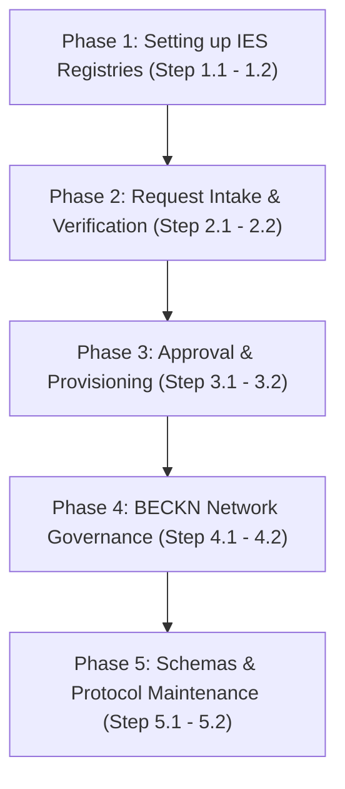

# IES Secretariat Pathway: Step-by-Step Registration Approval & Network Governance Roadmap

Welcome to the **Secretariat Pathway**. This guide provides an actionable, structured step-by-step checklist for the India Energy Stack (IES) Secretariat, Network Facilitator Organisation (NFO), or network operators to set up registries, process participant registration requests, govern the network, and manage schemas and protocols.

---

## Roadmap Overview



---

## Phase 1: Setting up IES-Specific Authoritative Registries

In this phase, the Secretariat establishes the core authoritative registries that govern identity, trust, and communication across the India Energy Stack network.

<details>
<summary><b>Step 1.1: Initialize the Core Authoritative Registries</b></summary>

### 💡 Phase Advice
> Secure the root DeDi namespace key — every verification depends on it.

### Execution Guidance
Under the canonical DeDi namespace `india-energy-stack` (`indiaenergystack.in` for Beckn), initialize:
1. **`ies-discoms-reference-registry`** (tag: `membership`): DISCOM allow-list.
2. **`ies-regulators-reference-registry`** (tag: `membership`): regulator allow-list (SERCs, CERC, etc.).
3. **`ies-schemas`** (tag: `schema`): canonical, versioned IES schemas.
4. **`ies-data-sharing-network` & `test-ies-data-sharing-network`** (tag: `beckn_subscriber_reference`): prod/pre-prod Beckn participant directories.

### References & Anchors
* [Register — The IES networks today](../what-ies-provides/register.md#the-ies-networks-today)
* [DeDi primer (Appendix A)](../what-ies-provides/register.md#the-directory-dedi)
</details>

<details>
<summary><b>Step 1.2: Establish Key Custody & Namespace DID</b></summary>

### 💡 Phase Advice
> Restrict namespace-key write access via multi-sig validation or HSM storage.

### Execution Guidance
1. Secure the namespace controller key for `india-energy-stack` (linked to `did:web:did.cord.network:76EU9AJNL25X4LAxgb92rA8op4co7n892oeySAuEk9gAay2N28ctma`).
2. Log key access and restrict admin roles.

### References & Anchors
* [Setup Register — claim a namespace and create registries](../how-you-implement-ies/setup-register.md)
</details>

---

## Phase 2: Request Intake & Verification

In this phase, you receive onboarding requests from utilities or regulators and validate their operational and technical parameters.

<details>
<summary><b>Step 2.1: Onboarding Request Intake Checklist</b></summary>

### Execution Guidance
When a registration package arrives via [IES.Secretariat@fsrglobal.org](mailto:IES.Secretariat@fsrglobal.org) or [ies@recindia.com](mailto:ies@recindia.com), verify it includes:
* **Legal Name & Short Code**: e.g., `Example Distribution Utility Limited` (`discom`).
* **Issuer DID**: `did:web:<domain>` (production) or `did:key:<key>` (testbed).
* **Public Verification Key**: NIST P-256 public key in JWK format.
* **Service Areas**: List of state/regional codes (e.g. `["DL"]`).
* **Beckn & OpenCred Endpoints**: Target HTTPS service URLs for their integrations.
* **Digital Signature Certificate (DSC)**: (Optional) `x5c` certificate chain if they anchor in CSCA.

### References & Anchors
* [How you implement IES — checklists](../how-you-implement-ies/README.md)
* [How to apply for an IES listing](../how-you-implement-ies/setup-register.md#id-1.7-beckn-participants-get-referenced-into-an-ies-network)
</details>

<details>
<summary><b>Step 2.2: Technical Validation Checks</b></summary>

### ⚠️ Caution
> Ensure `did.json` exposes no private keys and serves correctly over HTTPS, with no redirect loops or private-IP targets.

### Execution Guidance
1. **Validate domain ownership**: confirm the requester controls the `did:web` domain.
2. **Resolve the public DID**: verify it resolves and key parameters match:
   ```bash
   curl -s https://<utility-domain>/.well-known/did.json
   ```
3. **Verify DeDi namespace registries**: confirm `opencred-key-registry`, `vc-revocation-registry`, `subscribers-test` are initialized under their namespace.

### References & Anchors
* [Setup Register — keypair and did.json](../how-you-implement-ies/setup-register.md#id-1.2-generate-your-credential-signing-keypair)
* [Issue Credentials — Verify a credential you received](../how-you-implement-ies/issue-credentials.md#verify-a-credential-you-received-the-verifiers-walkthrough)
</details>

---

## Phase 3: Approval & Provisioning

In this phase, you whitelist the verified participant inside the authoritative network registries.

<details>
<summary><b>Step 3.1: Whitelist the Participant inside the Reference Registry</b></summary>

### Execution Guidance
Append the verified participant's metadata to the reference registry:
1. Compile the verified record payload per the registry schema (`id`, `did`, `legalName`, `publicKeys`, `serviceAreas`, `endpoints`, `status: "active"`).
2. Sign with the namespace controller key and write to:
   `india-energy-stack/ies-discoms-reference-registry/<discom-id>`
3. Confirm the entry resolves publicly:
   ```bash
   curl https://api.dedi.global/dedi/lookup/did%3Aweb%3Adid.cord.network%3A76EU9AJNL25X4LAxgb92rA8op4co7n892oeySAuEk9gAay2N28ctma/ies-discoms-reference-registry/<discom-id>
   ```

### References & Anchors
* [Setup Register — Get referenced into an IES network](../how-you-implement-ies/setup-register.md#id-1.7-beckn-participants-get-referenced-into-an-ies-network)
</details>

<details>
<summary><b>Step 3.2: Reference the Participant inside the Beckn Network Registry</b></summary>

### Execution Guidance
Link the participant's subscriber registry to the Beckn networks:
1. Obtain the DeDi lookup URL of their `subscribers-test` or `subscribers-prod` registry.
2. Write a subscriber reference record (tag `beckn_subscriber_reference`) to `indiaenergystack.in/test-ies-data-sharing-network` or `indiaenergystack.in/ies-data-sharing-network`.
3. Confirm it's active so ONIX adapters can resolve its keys and endpoints.

### References & Anchors
* [How to apply for an IES listing](../how-you-implement-ies/setup-register.md#id-1.7-beckn-participants-get-referenced-into-an-ies-network)
* [ONIX Registry Setup Guide](../how-you-implement-ies/setup-discovery.md#id-3.3-swap-in-your-real-identity)
</details>

---

## Phase 4: BECKN Network Governance

In this phase, you monitor network activity, coordinate changes, and enforce network-wide policies.

<details>
<summary><b>Step 4.1: Manage Network Membership & Revocation</b></summary>

### 💡 Phase Advice
> Alert on signature failures or invalid certificates across BAP/BPP nodes to catch key compromises early.

### Execution Guidance
1. **Handle Key Compromises**: on report, revoke the participant's subscriber reference in `ies-data-sharing-network`.
2. **Handle Suspension**: on violation or termination, mark the reference status `suspended` or `inactive`.

### References & Anchors
* [Register — The registries IES uses, by role](../what-ies-provides/register.md#the-registries-ies-uses-by-role)
</details>

<details>
<summary><b>Step 4.2: Enforce Network-Wide Policies</b></summary>

### Execution Guidance
1. Enforce transport security baselines (e.g. TLS 1.3 for ONIX endpoints).
2. Set node timeout guidelines (e.g. 5-second max) to prevent cascading latency.

### References & Anchors
* [Discover — The lifecycle at a glance](../what-ies-provides/discover.md#the-lifecycle-at-a-glance)
</details>

---

## Phase 5: Schemas & Protocol Maintenance

In this phase, you manage the publication, versioning, and migration of canonical schemas.

<details>
<summary><b>Step 5.1: Publish and Version Schemas on `ies-schemas`</b></summary>

### Execution Guidance
1. For approved telemetry shapes (e.g. `MeterData` v0.6), compile the Draft 2020-12 JSON Schema and JSON-LD contexts.
2. Publish to the canonical registry under:
   `india-energy-stack/ies-schemas/<domain>/<version>`
3. Maintain mappings and docs for anchored, tamper-proof schema resolution.

### References & Anchors
* [Register — The registries IES uses, by role](../what-ies-provides/register.md#the-registries-ies-uses-by-role)
</details>

<details>
<summary><b>Step 5.2: Coordinate Schema Migrations</b></summary>

### ⚠️ Caution
> Schedule deprecations with ample lead time before marking old versions unsupported.

### Execution Guidance
1. Release changelogs with before/after comparisons of structural changes (e.g. ToU bucket mapping, compact representations).
2. Provide migration scripts so utilities can map legacy formats to newer versions without data loss.

### References & Anchors
* [MeterData v0.6 Changelog](../schemas/MeterData/v0.6/CHANGELOG.md)
</details>
