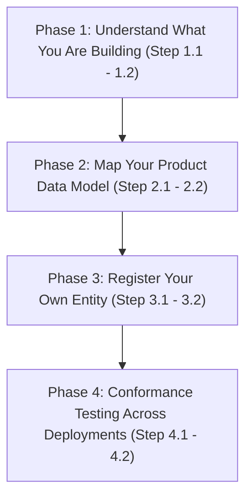

# Technology Service Provider Pathway: Step-by-Step IES Integration Roadmap

Welcome to the **Technology Service Provider (TSP) Pathway**. This guide is for **AMISPs (Advanced Metering Infrastructure Service Providers), meter / EV-charger / inverter OEMs, system integrators, and analytics vendors** — the organisations that typically **build the IES adapter on behalf of a DISCOM client**, or that build their own products and platforms which need to interoperate with many DISCOMs at once.

This is a materially different vantage point from the **[Utility Pathway](utility.md)**, which is written from the DISCOM's own point of view. As a TSP, you are usually the one doing the hands-on integration work — writing the mapping code, wiring the handler, testing the payload — often for a client who owns the identity but not the engineering effort. And if your product serves more than one DISCOM, you may need an identity of your own, distinct from any single client, for the parts of the flow where you act as the signer or the network participant in your own right.

To keep this guide focused on vendor decisions, technical specifications are referenced via hyperlinks rather than repeated. Expand any step to find actionable guidance, prework checkpoints, and the exact schema or spec you'll be mapping against.

---

## Roadmap Overview

---

## Prework & Pre-Alignment Matrix

Before commencing the integration pathway, align the following internal roles. Because a TSP typically serves several DISCOM clients rather than one, these roles are usually organised **per product line**, not per client engagement:

| Department / Role | System / Resource Involved | Purpose in Pathway |
|---|---|---|
| **Integration / Field Engineering** | HES, MDM, meter firmware, inverter/charger telemetry stack | Owns the Part-2 mapping — the only code a vendor actually writes |
| **Product / Platform Architecture** | Multi-tenant deployment topology | Decides whether the product needs its own `did:web` or configures inside each client's deployment |
| **IT & Security Admin** | Cloud KMS / HSM, Docker environments | Secures signing keypairs where the TSP itself signs credentials (e.g. `MeterDataCredential`) |
| **Client Success / Delivery** | DISCOM client contracts, SLAs | Coordinates which DISCOM-owned identifiers (their `did:web`, their DeDi namespace) the product configures against per deployment |

---

## Phase 1: Understand What You Are Building

Before writing any code, get clear on the shape of the system you are integrating with, and which part of it is actually your job to build.

<b>Step 1.1: Learn the Register / Discover / Exchange Spine</b>

### 💡 Phase Advice
> Read the three spine pages once, end to end, before opening any schema file. Almost every question a vendor engineering team asks in week one ("do I need my own DID?", "who runs the Beckn node?", "what do I actually sign?") is answered by knowing which of the three steps it belongs to.

### Execution Guidance
IES organises every interaction into three steps, and each has a corresponding action guide:
1. **[Register](../what-ies-provides/register.md)** — verifiable digital identity (`did:web`) and the shared directory (DeDi). See **[Setup Register](../how-you-implement-ies/setup-register.md)**.
2. **[Discover](../what-ies-provides/discover.md)** — Beckn-protocol interaction between systems. See **[Setup Discovery](../how-you-implement-ies/setup-discovery.md)**.
3. **[Exchange](../what-ies-provides/exchange.md)** — schemas, taxonomy, and verifiable credentials. See **[Build your Internal-facing Adapter](../how-you-implement-ies/build-adapter.md)**.

For most TSP engagements, Register and Discover belong to your DISCOM client (they already own the `did:web` and the DeDi namespace); **Exchange — specifically the Part-2 mapping — is where your engineering team's work concentrates.**

### References & Anchors
* [What IES Provides — overview](../what-ies-provides/README.md)
* [Register](../what-ies-provides/register.md)
* [Discover](../what-ies-provides/discover.md)
* [Exchange](../what-ies-provides/exchange.md)
* [How you implement IES — overview](../how-you-implement-ies/README.md)

<b>Step 1.2: Understand the Two-Part Adapter, and Which Part Is Yours</b>

### 💡 Phase Advice
> Say this back to your client in plain words before you scope the engagement: *"An organisation's own systems are not changed. A small piece of software, called the adapter, sits at the edge of each system. The adapter comes in two parts. The first part is ready-made and the same for everyone: it handles finding other systems and exchanging messages with them. This is the Beckn ONIX reference software, which the participant does not build. The second part is specific to each organisation: a small mapping that translates between its own data formats and the IES specs."* That second part is what you are being hired to build.

### 📋 Prework Required
* Confirm with your client which system(s) — HES, MDM, DERMS, billing — you will be reading from or writing to for the mapping.
* Confirm whether your client already has ONIX (Part 1) deployed, or whether that deployment is also in your scope.

### Execution Guidance
1. **Part 1 — ONIX (ready-made).** The Beckn ONIX reference implementation handles discovery, message exchange, signing, and routing. IES provides this as open software together with a working sample. You do not build this from scratch; you configure and deploy it.
2. **Part 2 — your mapping (what you build).** "An organisation's technology vendor configures it for its systems and adds the translation between its data format and the IES format. Vendors build to one published standard, not a fresh custom integration each time." This is the connector work: mapping your client's (or your own product's) data model into the IES schema shapes.
3. Scope your engagement explicitly around Part 2. If Part 1 (ONIX deployment) is also in scope, treat it as a one-time infrastructure task, not an ongoing integration cost.

### References & Anchors
* [What IES Provides — overview](../what-ies-provides/README.md)
* [How you implement IES — overview](../how-you-implement-ies/README.md)
* [Build your Internal-facing Adapter](../how-you-implement-ies/build-adapter.md)

---

## Phase 2: Map Your Product Data Model to the Relevant IES Schema

This is the core of the engagement: translating your product's native data model into the compact profile shapes or credential fields IES expects.

<b>Step 2.1: AMISPs — Map HES/MDM Output to MeterData v0.6</b>

### 💡 Phase Advice
> Work profile-by-profile, not field-by-field across the whole schema at once. Most AMISP integrations only need a subset of the eight compact profiles for a given use case — pull only what the requesting DISCOM's `MeterDataRequest` actually asks for.

### Execution Guidance
An AMISP integrating with IES typically maps its own head-end system (HES) / meter-data-management (MDM) output into the **MeterData v0.6 compact profiles**:

| Profile | What it carries |
|---|---|
| `CUSTOMER` | Slow-changing customer metadata, service points, meter installations |
| `INTERVAL` | Block load survey at high-resolution intervals (15 or 30 min) |
| `DAILY` | Daily accumulated load survey profiles |
| `MONTHLY` | Monthly billing resets — ToU buckets, MD, cumulative registers |
| `BILL_DETAILS` | Computed billing details — amount, due date, payment status |
| `INSTANTANEOUS` | Real-time snapshot of voltages, currents, powers |
| `EVENT` | IS 15959 diagnostic codes and tamper events |
| `ALARM` | Active alerts — tamper, low prepayment credit, voltage sag, overload |

1. **Map fields**: for each profile you support, identify the corresponding field in your HES/MDM export (DLMS-COSEM registers, IEC 61968-9 interval data, etc.) and write it down as a mapping table — this table *is* the spec for your Part-2 code.
2. **Respond to `MeterDataRequest`**: your BPP handler receives a `MeterDataRequest` naming which resources and which profiles are wanted, over which time window, and must return only the requested profile types.
3. **Sign, where required**: where the delivered payload needs a provenance attestation, wrap it in a **MeterDataCredential** rather than delivering the bare payload. This is described in Step 2.2's credential-signing note and in Phase 3.

### References & Anchors
* [Schemas Overview — MeterData v0.6](../what-ies-provides/schemas-overview/meter-data.md)
* [MeterData Schema Reference](../schemas/MeterData/README.md)
* [MeterData v0.6 Reference](https://india-energy-stack.gitbook.io/docs/schemas/meterdata/v0.6)
* [Build your Internal-facing Adapter](../how-you-implement-ies/build-adapter.md)

<b>Step 2.2: OEMs — Map Device Attributes into ElectricityCredential energyResources</b>

### 💡 Phase Advice
> Pick the *narrowest* correct `energyResources[]` kind for your device rather than overloading a generic one. A solar inverter is `EnergyResourceInverter`, not `EnergyResourceGenerator` — getting the discriminator right the first time avoids a schema migration later.

### Execution Guidance
A DER / EV-charger / inverter OEM typically populates the relevant kind inside `energyResources[]` in **ElectricityCredential v1.2** with its own device attributes:

| `energyResources[]` kind | Device types | Underlying standard |
|---|---|---|
| `EnergyResourceGenerator` | `SOLAR_PV`, `WIND`, `HYDRO`, `BIOGAS`, `CHP`, `FUEL_CELL` | `cim:GeneratingUnit` subtypes (IEC 61970-302) |
| `EnergyResourceStorage` | `BESS` | `cim:BatteryUnit` (IEC 61970-302) |
| `EnergyResourceEVCharger` | `EV_CHARGER`, `EV_V2G` | `cim:ElectricVehicleChargingStation` (CIM17+) |
| `EnergyResourceInverter` | `INVERTER` | `cim:PowerElectronicsConnection` (IEC 61970-302) |

1. Each entry in `energyResources[]` is discriminated by `type` into one of these typed kinds, each carrying a typed `attributes` bag specific to that device class.
2. All power and capacity fields use `QuantitativeValue { value, unit }` with short unit aliases (`kW`, `kWh`, `kVA`, `kVAR`, `kV`, `MW`, `MWh`, `MVA`, `MVAR`, `V`, `W`).
3. Compose the device's identifier as a `did:web` path under the **issuing DISCOM's** domain (e.g. `did:web:<discom-domain>:assets:meter:<manufacturer-code>_<serial-number>`) — your existing serial numbers are preserved verbatim, not replaced.
4. The credential itself is signed by the DISCOM (or, where you operate the signing infrastructure on their behalf, by whichever identity is the actual issuer — see Phase 3).

### References & Anchors
* [Schemas Overview — ElectricityCredential v1.2](../what-ies-provides/schemas-overview/electricity-credential.md)
* [ElectricityCredential Schema Reference](../schemas/ElectricityCredential/README.md)
* [ElectricityCredential v1.2 Reference](https://india-energy-stack.gitbook.io/docs/schemas/electricitycredential/v1.2)
* [Build your Internal-facing Adapter](../how-you-implement-ies/build-adapter.md)

---

## Phase 3: Register Your Own Entity if You Serve Multiple DISCOMs

If you operate a multi-DISCOM platform — for example, an AMISP running metering infrastructure for five different DISCOMs — you need to think about **two separate identity layers**, not one.

<b>Step 3.1: Decide Whether You Need Your Own did:web</b>

### 💡 Phase Advice
> Don't default to "every client gets its own fully separate deployment of my product with no shared identity." If your platform itself ever acts as the signer of a credential, or ever publishes a catalogue as a Beckn network participant, it needs its own identity — configuring inside each client's deployment alone is not enough.

### ⚠️ Caution
> Conflating your platform's identity with a client DISCOM's `did:web` breaks the trust chain. A verifier resolving a credential's `issuer.id` expects that DID to belong to whichever party actually signed the payload — if your product signs as "the DISCOM" without being that DISCOM, or signs as the DISCOM without being authorised to, verification and audit both break down.

### Execution Guidance
Each DISCOM client keeps its own `did:web` and issues its own credentials from its own identity — that does not change. But the TSP itself, if it operates as a **Beckn network participant in its own right** — for example, publishing a `MeterData` catalogue on a DISCOM's behalf, or being the actual signer of a `MeterDataCredential` as the **"provider"** per the schema — needs its **own `did:web` and Beckn subscriber registration**, separate from any one client.

The `MeterDataCredential` schema documentation names **"AMISP, MDM system"** explicitly as the typical issuer/provider role signing that credential, distinct from the DISCOM. If your organisation is the one signing `MeterDataCredential` payloads as that provider, you are the entity that needs the identity described below — not your client.

1. Pick a domain your organisation controls (not a client's domain).
2. Follow the same identity setup as any other participant: publish a `did.json`, generate a signing keypair, and claim your own DeDi namespace.
3. Keep this identity distinct per product line if you operate more than one — do not reuse one signing key across unrelated product lines.

### References & Anchors
* [Register](../what-ies-provides/register.md)
* [Registries and Directories — As a Beckn Network Participant](../what-ies-provides/registries/README.md#as-a-beckn-network-participant-bap-bpp-aggregator-amisp-trading-platform)
* [Schemas Overview — MeterDataCredential](../what-ies-provides/schemas-overview/meter-data-credential.md)

<b>Step 3.2: Set Up Your Own DeDi Namespace and Register with IES</b>

### 💡 Phase Advice
> Use an institutional role-mailbox for your namespace admin (not a named employee's personal account), the same way a DISCOM would — your platform's identity will outlive any one engineer's tenure on the account.

### Execution Guidance
1. Follow **[Setup Register](../how-you-implement-ies/setup-register.md)** to publish your `did.json`, generate your signing keypair, and claim a verified DeDi namespace under your own domain.
2. Create your own subscriber registries (`subscribers-test`, `subscribers-prod`) if you are participating directly on a Beckn network as a provider — see **[Registries — As a Beckn Network Participant](../what-ies-provides/registries/README.md#as-a-beckn-network-participant-bap-bpp-aggregator-amisp-trading-platform)**.
3. Apply for an IES listing the same way any participant does, sending your short identifier, verified DeDi namespace, and subscriber registry details to the IES Secretariat — see **[How to apply for an IES listing](../what-ies-provides/registries/README.md#how-to-apply-for-an-ies-listing)**.

### References & Anchors
* [Setup Register](../how-you-implement-ies/setup-register.md)
* [Registries and Directories](../what-ies-provides/registries/README.md)
* [How to apply for an IES listing](../what-ies-provides/registries/README.md#how-to-apply-for-an-ies-listing)

---

## Phase 4: Conformance Testing Across Deployments

The payoff of building to one published standard: test your mapping once per product line, and it works unmodified across every DISCOM client — rather than re-testing per client.

<b>Step 4.1: Test Once Per Product Line, Not Once Per Client</b>

### 💡 Phase Advice
> Resist the temptation to spin up a bespoke conformance pass for each new DISCOM client. Vendors build to one published standard, not a fresh custom integration each time — if your mapping is correct against the schema, it is correct for every client whose data maps to the same schema.

### Execution Guidance
1. Run the conformance checklist against your product's mapping using a sandbox or test counterparty — not against every individual client deployment.
2. Validate your mapped output against the canonical JSON Schema for whichever profile or credential you produce (`MeterData`, `MeterDataCredential`, `ElectricityCredential`).
3. Confirm signatures verify correctly end-to-end, using whichever identity is the actual signer for that payload (the client DISCOM's `did:web`, or your own, per the decision made in Phase 3).
4. Once your product line passes conformance, onboarding a new DISCOM client should only require configuration — pointing your Part-2 mapping at a new client's data source and identity — not new mapping code.

### References & Anchors
* [Conformance Checklist](../how-you-implement-ies/conformance.md)
* [Build your Internal-facing Adapter](../how-you-implement-ies/build-adapter.md)

<b>Step 4.2: Re-Verify Only What Changes Per Client</b>

### 💡 Phase Advice
> Keep a checklist of what is genuinely client-specific (their `did:web`, their DeDi namespace, their service area, their specific tariff/code lookups) versus what is universal to your product (the schema mapping itself). Only the first list needs a per-client re-check.

### Execution Guidance
Per new DISCOM client, re-confirm only:
1. The client's `did:web` resolves and their signing key is current.
2. The client's DeDi namespace and subscriber registry are correctly referenced in your deployment configuration.
3. Any client-specific code or tariff-category lookups are correctly wired into your Part-2 mapping's translation tables.
4. One realistic record exchanges end-to-end with that specific client's sandbox before going to production.

### References & Anchors
* [Conformance Checklist](../how-you-implement-ies/conformance.md)
* [Setup Register](../how-you-implement-ies/setup-register.md)

