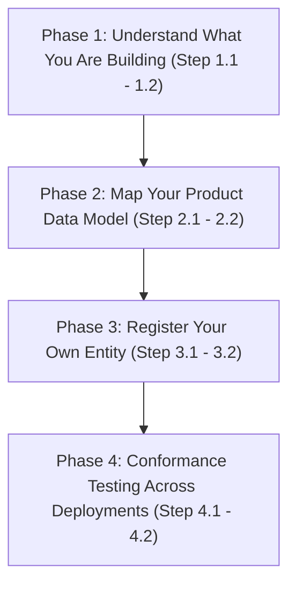

# Technology Service Provider Pathway: Step-by-Step IES Integration Roadmap

Welcome to the **Technology Service Provider (TSP) Pathway**. This guide is for **AMISPs (Advanced Metering Infrastructure Service Providers), meter / EV-charger / inverter OEMs, system integrators, and analytics vendors** — the organisations that typically **build the IES adapter on behalf of a DISCOM client**, or that build their own products and platforms which need to interoperate with many DISCOMs at once.

This is a materially different vantage point from the **[Utility Pathway](utility.md)**, which is written from the DISCOM's own point of view. As a TSP, you are usually the one doing the hands-on integration work — writing the mapping code, wiring the handler, testing the payload — often for a client who owns the identity but not the engineering effort. And if your product serves more than one DISCOM, you may need an identity of your own, distinct from any single client, for the parts of the flow where you act as the signer or the network participant in your own right.

To keep this guide focused on vendor decisions, technical specifications are referenced via hyperlinks rather than repeated. Expand any step to find actionable guidance, prework checkpoints, and the exact schema or spec you'll be mapping against.

---

## Roadmap Overview

---

## Prework & Pre-Alignment Matrix

Before commencing the integration pathway, align the following internal roles. Because a TSP typically serves several DISCOM clients rather than one, these roles are usually organised **per product line**, not per client engagement:

| Department / Role | System / Resource Involved | Purpose in Pathway |
|---|---|---|
| **Integration / Field Engineering** | HES, MDM, meter firmware, inverter/charger telemetry stack | Owns the Part-2 mapping — the only code a vendor actually writes |
| **Product / Platform Architecture** | Multi-tenant deployment topology | Decides whether the product needs its own `did:web` or configures inside each client's deployment |
| **IT & Security Admin** | Cloud KMS / HSM, Docker environments | Secures signing keypairs where the TSP itself signs credentials (e.g. `MeterDataCredential`) |
| **Client Success / Delivery** | DISCOM client contracts, SLAs | Coordinates which DISCOM-owned identifiers (their `did:web`, their DeDi namespace) the product configures against per deployment |

---

## Phase 1: Understand What You Are Building

Before writing any code, get clear on the shape of the system you are integrating with, and which part of it is actually your job to build.

<b>Step 1.1: Learn the Register / Discover / Exchange Spine</b>

### 💡 Phase Advice
> Read the three spine pages once before opening any schema — most week-one vendor questions map to one of the three.

### Execution Guidance
IES organises every interaction into three steps:
1. **[Register](../what-ies-provides/register.md)** — verifiable digital identity (`did:web`) and the shared directory (DeDi). See **[Setup Register](../how-you-implement-ies/setup-register.md)**.
2. **[Discover](../what-ies-provides/discover.md)** — Beckn-protocol interaction between systems. See **[Setup Discovery](../how-you-implement-ies/setup-discovery.md)**.
3. **[Exchange](../what-ies-provides/exchange.md)** — schemas, taxonomy, and verifiable credentials. See **[Build your Internal-facing Adapter](../how-you-implement-ies/build-adapter.md)**.

Register and Discover usually belong to your DISCOM client. **Exchange — the Part-2 mapping — is your team's work.**

### References & Anchors
* [What IES Provides — overview](../what-ies-provides/README.md)
* [Register](../what-ies-provides/register.md)
* [Discover](../what-ies-provides/discover.md)
* [Exchange](../what-ies-provides/exchange.md)
* [How you implement IES — overview](../how-you-implement-ies/README.md)

<b>Step 1.2: Understand the Two-Part Adapter, and Which Part Is Yours</b>

### 💡 Phase Advice
> Tell your client: *"Your systems don't change. A small adapter sits at each system's edge, in two parts: a ready-made part — Beckn ONIX — that finds other systems and exchanges messages, which you don't build; and a mapping between your data formats and the IES specs, which you do."* That second part is what you're hired to build.

### 📋 Prework Required
* Confirm with your client which system(s) — HES, MDM, DERMS, billing — you will be reading from or writing to for the mapping.
* Confirm whether your client already has ONIX (Part 1) deployed, or whether that deployment is also in your scope.

### Execution Guidance
1. **Part 1 — ONIX (ready-made).** Handles discovery, messaging, signing, and routing. You configure and deploy it, not build it.
2. **Part 2 — your mapping (what you build).** "An organisation's technology vendor configures it for its systems and adds the translation between its data format and the IES format. Vendors build to one published standard, not a fresh custom integration each time." This is the connector work: mapping your (or your client's) data model into IES schema shapes.
3. Scope your engagement around Part 2; treat Part 1 (if in scope) as a one-time infrastructure task, not ongoing cost.

### References & Anchors
* [What IES Provides — overview](../what-ies-provides/README.md)
* [How you implement IES — overview](../how-you-implement-ies/README.md)
* [Build your Internal-facing Adapter](../how-you-implement-ies/build-adapter.md)

---

## Phase 2: Map Your Product Data Model to the Relevant IES Schema

This is the core of the engagement: translating your product's native data model into the compact profile shapes or credential fields IES expects.

<b>Step 2.1: AMISPs — Map HES/MDM Output to MeterData v0.6</b>

### 💡 Phase Advice
> Work profile-by-profile. Most integrations need only a subset of the eight — pull what `MeterDataRequest` asks for.

### Execution Guidance
An AMISP typically maps its HES/MDM output into the **MeterData v0.6 compact profiles**:

| Profile | What it carries |
|---|---|
| `CUSTOMER` | Slow-changing customer metadata, service points, meter installations |
| `INTERVAL` | Block load survey at high-resolution intervals (15 or 30 min) |
| `DAILY` | Daily accumulated load survey profiles |
| `MONTHLY` | Monthly billing resets — ToU buckets, MD, cumulative registers |
| `BILL_DETAILS` | Computed billing details — amount, due date, payment status |
| `INSTANTANEOUS` | Real-time snapshot of voltages, currents, powers |
| `EVENT` | IS 15959 diagnostic codes and tamper events |
| `ALARM` | Active alerts — tamper, low prepayment credit, voltage sag, overload |

1. **Map fields**: map each profile to its HES/MDM export field (DLMS-COSEM registers, IEC 61968-9 interval data, etc.) — this table *is* your Part-2 spec.
2. **Respond to `MeterDataRequest`**: your BPP handler must return only the requested resources, profiles, and time window.
3. **Sign, where required**: wrap payloads needing provenance attestation in a **MeterDataCredential** rather than delivering them bare — see Step 2.2 and Phase 3.

### References & Anchors
* [Schemas Overview — MeterData v0.6](../what-ies-provides/schemas-overview/meter-data.md)
* [MeterData Schema Reference](https://india-energy-stack.gitbook.io/docs/schemas/meterdata/v0.6)
* [MeterData v0.6 Reference](https://india-energy-stack.gitbook.io/docs/schemas/meterdata/v0.6)
* [Build your Internal-facing Adapter](../how-you-implement-ies/build-adapter.md)

<b>Step 2.2: OEMs — Map Device Attributes into ElectricityCredential energyResources</b>

### 💡 Phase Advice
> Pick the narrowest correct `energyResources[]` kind for your device rather than a generic one — a solar inverter is `EnergyResourceInverter`, not `EnergyResourceGenerator`. Getting the discriminator right avoids a later schema migration.

### Execution Guidance
A DER/EV-charger/inverter OEM populates the relevant kind in `energyResources[]` in **ElectricityCredential v1.2**:

| `energyResources[]` kind | Device types | Underlying standard |
|---|---|---|
| `EnergyResourceGenerator` | `SOLAR_PV`, `WIND`, `HYDRO`, `BIOGAS`, `CHP`, `FUEL_CELL` | `cim:GeneratingUnit` subtypes (IEC 61970-302) |
| `EnergyResourceStorage` | `BESS` | `cim:BatteryUnit` (IEC 61970-302) |
| `EnergyResourceEVCharger` | `EV_CHARGER`, `EV_V2G` | `cim:ElectricVehicleChargingStation` (CIM17+) |
| `EnergyResourceInverter` | `INVERTER` | `cim:PowerElectronicsConnection` (IEC 61970-302) |

1. Each entry is discriminated by `type` into one of these kinds, with a typed `attributes` bag per device class.
2. Power/capacity fields use `QuantitativeValue { value, unit }` with short unit aliases (`kW`, `kWh`, `kVA`, `kVAR`, `kV`, `MW`, `MWh`, `MVA`, `MVAR`, `V`, `W`).
3. Compose the identifier as a `did:web` path under the **issuing DISCOM's** domain (e.g. `did:web:<discom-domain>:assets:meter:<manufacturer-code>_<serial-number>`), preserving serial numbers verbatim.
4. The credential is signed by the DISCOM, or by whoever is the actual issuer if you operate signing infrastructure on their behalf — see Phase 3.

### References & Anchors
* [Schemas Overview — ElectricityCredential v1.2](../what-ies-provides/schemas-overview/electricity-credential.md)
* [ElectricityCredential Schema Reference](https://india-energy-stack.gitbook.io/docs/schemas/electricitycredential/v1.2)
* [ElectricityCredential v1.2 Reference](https://india-energy-stack.gitbook.io/docs/schemas/electricitycredential/v1.2)
* [Build your Internal-facing Adapter](../how-you-implement-ies/build-adapter.md)

---

## Phase 3: Register Your Own Entity if You Serve Multiple DISCOMs

If you operate a multi-DISCOM platform — for example, an AMISP running metering infrastructure for five different DISCOMs — you need to think about **two separate identity layers**, not one.

<b>Step 3.1: Decide Whether You Need Your Own did:web</b>

### 💡 Phase Advice
> Don't assume a separate deployment per client is enough — if your platform ever signs a credential or publishes a catalogue as a Beckn participant, it needs its own identity.

### ⚠️ Caution
> Conflating your platform's identity with a client's `did:web` breaks the trust chain: `issuer.id` must resolve to whoever actually signed the payload, or verification and audit break down.

### Execution Guidance
Each DISCOM client keeps its own `did:web` and identity. But a TSP acting as a **Beckn network participant in its own right** — e.g. publishing a catalogue or signing a `MeterDataCredential` as the **"provider"** — needs its **own `did:web` and Beckn subscriber registration**.

The `MeterDataCredential` schema names **"AMISP, MDM system"** as the typical provider role, distinct from the DISCOM. If you sign as that provider, you — not your client — need the identity below.

1. Pick a domain your organisation controls (not a client's domain).
2. Follow the same identity setup as any other participant: publish a `did.json`, generate a signing keypair, and claim your own DeDi namespace.
3. Keep identities distinct per product line — don't reuse one signing key across unrelated product lines.

### References & Anchors
* [Register](../what-ies-provides/register.md)
* [Registries and Directories — As a Beckn Network Participant](../what-ies-provides/registries/README.md#as-a-beckn-network-participant-bap-bpp-aggregator-amisp-trading-platform)
* [Schemas Overview — MeterDataCredential](../what-ies-provides/schemas-overview/meter-data-credential.md)

<b>Step 3.2: Set Up Your Own DeDi Namespace and Register with IES</b>

### 💡 Phase Advice
> Use an institutional role-mailbox for your namespace admin, not a named employee's account — your platform's identity will outlive any one engineer.

### Execution Guidance
1. Follow **[Setup Register](../how-you-implement-ies/setup-register.md)** to publish `did.json`, generate a signing keypair, and claim a DeDi namespace.
2. Create your own subscriber registries (`subscribers-test`, `subscribers-prod`) if participating directly as a provider — see **[Registries — As a Beckn Network Participant](../what-ies-provides/registries/README.md#as-a-beckn-network-participant-bap-bpp-aggregator-amisp-trading-platform)**.
3. Apply for an IES listing like any participant: send your identifier, DeDi namespace, and subscriber registry details to the Secretariat — see **[How to apply for an IES listing](../what-ies-provides/registries/README.md#how-to-apply-for-an-ies-listing)**.

### References & Anchors
* [Setup Register](../how-you-implement-ies/setup-register.md)
* [Registries and Directories](../what-ies-provides/registries/README.md)
* [How to apply for an IES listing](../what-ies-provides/registries/README.md#how-to-apply-for-an-ies-listing)

---

## Phase 4: Conformance Testing Across Deployments

The payoff of building to one published standard: test your mapping once per product line, and it works unmodified across every DISCOM client — rather than re-testing per client.

<b>Step 4.1: Test Once Per Product Line, Not Once Per Client</b>

### 💡 Phase Advice
> Resist spinning up a bespoke conformance pass per new DISCOM client. Vendors build to one published standard — if your mapping is correct against the schema, it's correct for every client whose data maps to it.

### Execution Guidance
1. Run the conformance checklist against your product's mapping using a sandbox or test counterparty, not every client deployment.
2. Validate your mapped output against the canonical JSON Schema for whichever profile or credential you produce (`MeterData`, `MeterDataCredential`, `ElectricityCredential`).
3. Confirm signatures verify end-to-end, using whichever identity is the actual signer (the client DISCOM's `did:web`, or your own, per Phase 3).
4. Once your product line passes conformance, onboarding a new client should require only configuration — pointing Part-2 mapping at their data source and identity — not new code.

### References & Anchors
* [Conformance Checklist](../how-you-implement-ies/conformance.md)
* [Build your Internal-facing Adapter](../how-you-implement-ies/build-adapter.md)

<b>Step 4.2: Re-Verify Only What Changes Per Client</b>

### 💡 Phase Advice
> Keep a checklist of what's genuinely client-specific (`did:web`, DeDi namespace, service area, tariff/code lookups) versus what's universal to your product (the schema mapping). Only the first needs a per-client re-check.

### Execution Guidance
Per new DISCOM client, re-confirm only:
1. The client's `did:web` resolves and their signing key is current.
2. The client's DeDi namespace and subscriber registry are correctly referenced in your deployment config.
3. Any client-specific code or tariff-category lookups are correctly wired into your Part-2 mapping's translation tables.
4. One realistic record exchanges end-to-end with that specific client's sandbox before going to production.

### References & Anchors
* [Conformance Checklist](../how-you-implement-ies/conformance.md)
* [Setup Register](../how-you-implement-ies/setup-register.md)

