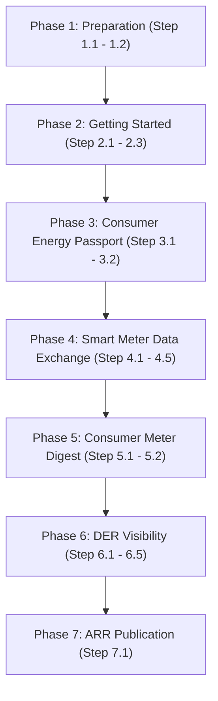

# Utility Pathway: Step-by-Step IES Integration Roadmap

Welcome to the **Utility Pathway**. This guide provides an actionable and structured roadmap for an electricity distribution utility to easily adopt the capabilities of the India Energy Stack (IES).

To keep this guide extremely clean and focus on utility progress, technical specifications are referenced via hyperlinks rather than repeated. Expand any step to find actionable guidelines, cross-team advice, and prework checkpoints.

---

## Roadmap Overview



---

## Prework & Pre-Alignment Matrix

Before commencing the integration pathway, we recommend aligning the following internal teams and core systems. Setting up these channels early ensures a seamless deployment experience:

| Department / Role | System / Resource Involved | Purpose in Pathway |
|---|---|---|
| **DNS & Web Master** | Utility domain controller (`discom.example`) | Exposing public `did:web` and verifying DeDi namespaces |
| **IT & Security Admin** | Cloud KMS / HSM, Docker Environments | Securing signing keypairs and deploying OpenCred/ONIX services |
| **Legal / Signatory** | Corporate credentials, API Setu | Submitting whitelists to IES Secretariat and registering on DigiLocker |
| **Billing & CRM Teams** | CIS, MDMS, Customer Databases | Mapping telemetry, tariff profiles, and triggering billing credentials |

---

## Phase 1: Preparation (Identity & Addressing)

In this phase, you will establish your institutional cryptographic identity and define clear naming grammars for your grid resources and consumers.

<details>
<summary><b>Step 1.1: Establish Your Institutional Identity ([did:web](../what-ies-provides/identifiers/README.md#did-web-the-one-your-discom-will-use))</b></summary>

### 💡 Phase Advice
> Set up a quick call with your DNS administrator as your very first step. Securing a dedicated subdomain takes only a few minutes but forms the foundation of your secure cryptographic brand.

### 📋 Prework Required
* Confirm that your web admin has write-access to your target domain (e.g., `ies.discom.example`) to host the verification path.

### Execution Guidance
A [`did:web`](../what-ies-provides/identifiers/README.md#did-web-the-one-your-discom-will-use) identifier leverages your existing DNS and SSL infrastructure to publish your public keys.
1. **Assign a Dedicated Domain**: Allocate an institutional subdomain, e.g., `ies.discom.example`.
2. **Expose the DID Document (First Step)**: Host your verification keys in a standard `did.json` file served over HTTPS under the path:
   `https://ies.discom.example/.well-known/did.json`
   Construct the `did.json` document according to the W3C DID Core specification, ensuring your public verification key is correctly mapped and referenced. Refer to [Step-by-step: publish your did:web](../what-ies-provides/energy-credentials/README.md#set-up-opencred-and-publish-your-did-web) for the structural checklist.

### References & Anchors
* [Identifiers & Addressing Overview](../what-ies-provides/identifiers/README.md)
* [Resolution & Routing Specification](../what-ies-provides/identifiers/README.md#did-web-the-one-your-discom-will-use) (Detailed resolution rules for `did:web` endpoints)
* [Step-by-step: publish your did:web](../what-ies-provides/energy-credentials/README.md#set-up-opencred-and-publish-your-did-web) (Document parameters)
* [Setup Register — Checklist](../how-you-implement-ies/setup-register.md#checklist)
</details>

<details>
<summary><b>Step 1.2: Define Your Naming Grammars ([Identifiers and Addressing](../what-ies-provides/identifiers/README.md#appendix-c-identifying-assets-meters-connections-datasets))</b></summary>

### 💡 Phase Advice
> Aligning your IES identifiers with your existing SAP, GIS, or CIS master codes avoids double-mapping. Wrap your existing internal serials rather than replacing them!

### Execution Guidance
Map your internal customer numbers, SAP codes, and meter serial numbers to the standard [`did:web` path-based naming grammars](../what-ies-provides/identifiers/README.md#appendix-c-identifying-assets-meters-connections-datasets). Before constructing your identifiers, internalise the rule that **an identifier is just a name** — it carries no inherent business meaning, and every identifier must resolve to a DID Document. See [Identifiers and Addressing → Appendix D](../what-ies-provides/identifiers/README.md#appendix-d-identifier-vs.-record).

The reference patterns (all `did:web` under your DISCOM's own domain):
1. **Consumers (holder DID)**: `did:key:<wallet-generated>` — generated by the wallet, not the DISCOM. The consumer's existing CIS number stays as the literal `customerNumber` string inside the credential.
2. **Grid Assets**: `did:web:<your-domain>:assets:<asset-class>:<internal id>`
   *(e.g., `did:web:ies.discom.example:assets:transformer:DT-11KV-F02-452`)*
3. **Smart Meters**: `did:web:<your-domain>:assets:meter:<manufacturer code>_<serial number>`
   *(e.g., `did:web:ies.discom.example:assets:meter:GEN_12345678`)*
4. **Service Connections**: `did:web:<your-domain>:connections:<connection id>`
   *(e.g., `did:web:ies.discom.example:connections:CON-90234`)*

> [!NOTE]
> All identifiers here use standard W3C `did:web`. There is no separate `did:dedi` method; when DeDi is used as the discovery layer for keys or DID documents, the method on the wire is still `did:web`. See [Identifiers and Addressing → Appendix A](../what-ies-provides/identifiers/README.md#appendix-a-how-dids-work-and-the-three-methods-ies-uses).

### References & Anchors
* [Identifiers and Addressing — How DIDs work, and the three methods IES uses](../what-ies-provides/identifiers/README.md#appendix-a-how-dids-work-and-the-three-methods-ies-uses)
* [Identifier vs. record](../what-ies-provides/identifiers/README.md#appendix-d-identifier-vs.-record)
* [Identifying assets, meters, connections, datasets](../what-ies-provides/identifiers/README.md#appendix-c-identifying-assets-meters-connections-datasets)
</details>

---

## Phase 2: Getting Started (Registry Setup)

Establish your administrative namespaces on the public [Decentralized Directory (DeDi)](../what-ies-provides/registries/README.md#why-dedi-and-the-three-questions-it-answers) and register your active endpoints with the network.

<details>
<summary><b>Step 2.1: Setup DeDi Namespace</b></summary>

### 💡 Phase Advice
> Using an institutional role-mailbox (e.g., `registry-admin@discom.example`) instead of a personal account ensures that namespace controls remain securely managed by your IT department across staff rotations.

### ⚠️ Caution
> **Namespace Domain Verification**: Domain ownership verification leverages your existing DNS TXT record or setup rather than requiring you to request a brand new record class from your network administrators, easing compliance boundaries.

### Execution Guidance
1. Register a secure role-mailbox on the DeDi Portal.
2. Establish a namespace matching your utility short-code (`<utility>`).
3. Expose the verification token in your DNS TXT records. Refer to [Setup Register — §1.4, claim a DeDi namespace and verify your domain](../how-you-implement-ies/setup-register.md) for formatting.

### References & Anchors
* [Why DeDi (and the three questions it answers)](../what-ies-provides/registries/README.md#why-dedi-and-the-three-questions-it-answers)
* [Setup Register — claim namespace + create registries](../how-you-implement-ies/setup-register.md)
* [Setup Register — Checklist](../how-you-implement-ies/setup-register.md#checklist)
</details>

<details>
<summary><b>Step 2.2: Create Operational Registries</b></summary>

### 💡 Phase Advice
> Maintain strict separation of duties! Use separate registries for your keys, revocation list, and Beckn profiles to keep access privileges isolated.

### Execution Guidance
Create and initialize the following registries under your namespace (OpenCred auto-creates several of these on first boot — see [Idempotency note for OpenCred users](../what-ies-provides/registries/README.md#opencred-auto-creates-four-registries)):
* `opencred-key-registry` (tag `public_key`): Versioned signing keys. **Auto-created by OpenCred.**
* `vc-revocation-registry` (tag `revocation`): Real-time verifiable credential revocation. **Auto-created by OpenCred.**
* `subscribers-test` & `subscribers-prod` (tag `beckn_subscriber`): Beckn participant identity records. **You create these manually** — see [As a Beckn Network Participant](../what-ies-provides/registries/README.md#as-a-beckn-network-participant-bap-bpp-aggregator-amisp-trading-platform).
* **Optional fallback: publish DID doc to DeDi.** Set `OPENCRED_DEDI_HOST_DID_DOC=true` (or call `/v1/keys/publish`) so the DID document is reachable via DeDi when your HTTPS endpoint is temporarily unreachable.

### References & Anchors
* [The registries you'll touch in IES (by role)](../what-ies-provides/registries/README.md#the-registries-youll-touch-in-ies-by-role)
* [As a DISCOM / issuer running OpenCred](../what-ies-provides/registries/README.md#as-a-discom-issuer-running-opencred)
* [As a Beckn Network Participant](../what-ies-provides/registries/README.md#as-a-beckn-network-participant-bap-bpp-aggregator-amisp-trading-platform)
* [OpenCred Key & DID Publishing Configuration](../what-ies-provides/energy-credentials/README.md#set-up-opencred-and-publish-your-did-web)
</details>

<details>
<summary><b>Step 2.3: Register with India Energy Stack</b></summary>

### 💡 Phase Advice
> Pre-verify your onboarding package! Double-checking that your URLs, service areas, and JWK keys are formatted correctly before emailing ensures immediate approval.

### 📋 Prework Required
* Stand up your subscriber registries (from Step 2.2) and prepare your endpoint URL payloads.

### Execution Guidance
Email your registration package (utility short-code, legal name, service area list, endpoints, and `did:web` JWK) to the IES Secretariat:
* **Primary Email**: [IES.Secretariat@fsrglobal.org](mailto:IES.Secretariat@fsrglobal.org)
* **Alternate Email**: [ies@recindia.com](mailto:ies@recindia.com)

The Secretariat will verify your credentials and register your endpoints inside the authoritative `ies-discoms-reference-registry` path.

### References & Anchors
* [How to apply for an IES listing](../what-ies-provides/registries/README.md#how-to-apply-for-an-ies-listing)
* [Setup Register — Checklist](../how-you-implement-ies/setup-register.md#checklist)
</details>

---

## Phase 3: Consumer Energy Passport (Verifiable Credentials)

Provide citizens with a secure, tamper-evident digital passport of their utility connection parameters, load limits, and registered assets.

<details>
<summary><b>Step 3.1: Setup Credential Issuance ([Consumer Energy Passport](../use-cases/consumer-energy-passport/README.md))</b></summary>

### 💡 Phase Advice
> Leverage your existing Customer Relationship Management (CRM) tables. Since the Passport is a composite of standard customer master data, you only need to expose your existing billing/CIS databases to OpenCred.

### Execution Guidance
1. **Connect CRM Systems**: Map customer master data (sanctioned load, tariff slabs, connection status) from your CRM (e.g., SAP IS-U) to OpenCred.
2. **Configure Authentication**: Setup OTP or Aadhaar reference authentication gateways on your client portal.
3. **Deploy OpenCred**: Deploy the containerized OpenCred service using your secured P-256 signing keys.
4. **CRM Status Logging & Issuance**: Store active credential UUIDs in your database to coordinate revocations. Format and trigger credential issuance via OpenCred's `/v1/credentials/issue` API using the `ElectricityCredential` JSON shape.
5. **Verify Revocation Handling**: Ensure the verifier's revocation check logic is active. Be mindful that a revoke can succeed while verifiers still see `not_revoked` if DeDi namespaces are misconfigured (see [Energy Credentials — Troubleshooting](../what-ies-provides/energy-credentials/README.md#troubleshooting)).
6. **Validate the Issued Credential**: Call the OpenCred verification endpoint (`/v1/credentials/verify`) using the issued VC to test the full verification cycle. This confirms that the verifier can successfully resolve the issuer's DID and validate the cryptographic signature. Note that if DeDi is disabled or the namespaces are not fully synchronized, the validation engine might exhibit specific resolve behaviors (refer to the [OpenCred Resolve Verification Check](../what-ies-provides/energy-credentials/README.md#id-5.-smoke-test)).

### References & Anchors
* [Energy Credentials Overview](../what-ies-provides/energy-credentials/README.md)
* [Energy Credentials Deployment Guide](../what-ies-provides/energy-credentials/README.md)
* [OpenCred Resolve Verification Check & Env Options](../what-ies-provides/energy-credentials/README.md#id-5.-smoke-test)
* [Energy Credentials — Troubleshooting (revocation caching)](../what-ies-provides/energy-credentials/README.md#troubleshooting)
* [Batch Issuance at Scale (Queue & Workers)](../what-ies-provides/energy-credentials/README.md#batch-issuance)
* [Consumer Energy Passport Use Case](../use-cases/consumer-energy-passport/README.md)
* [Consumer Energy Passport Schema (ElectricityCredential) Reference](../schemas/ElectricityCredential/v1.2/README.md)
</details>

<details>
<summary><b>Step 3.2: Register with [DigiLocker](../what-ies-provides/energy-credentials/digilocker.md)</b></summary>

### 💡 Phase Advice
> [API Setu](../what-ies-provides/energy-credentials/digilocker.md) compliance checks can take time. Start your legal and institutional registrations on API Setu early in Phase 3 so that production gateways are cleared by the time your code is ready.

### 📋 Prework Required
* Secure authorization letters and corporate certificates from your legal department for [API Setu](../what-ies-provides/energy-credentials/digilocker.md) access.

### References & Anchors
* [DigiLocker Integration Guide](../what-ies-provides/energy-credentials/digilocker.md)
* [Issuing Credentials Checklist](../what-ies-provides/energy-credentials/README.md#issue-your-first-credential)
</details>

---

## Phase 4: Smart Meter Data Exchange (Beckn Data Pipes)

*(See [Data Exchange — Core Concepts](../what-ies-provides/data-exchange/README.md#appendix-a-beckn-protocol-lifecycle) for the underlying Beckn primitives.)*

Enable federated, policy-governed data sharing of smart meter telemetry and master data with authorized third parties.

<details>
<summary><b>Step 4.1: Setup BPP Nodes ([BECKN Network](../what-ies-provides/data-exchange/README.md#quick-start-run-a-local-exchange-in-10-minutes))</b></summary>

### 💡 Phase Advice
> Deploying the ONIX adapter as a Docker service takes less than 10 minutes. Run the test sandbox local container first to easily verify your configurations before going to production.

### Execution Guidance
1. Deploy the standard Docker-based Beckn ONIX container.
2. Generate your Ed25519 node keypair.
3. Register your BPP credentials in DeDi [`subscribers-test`](../what-ies-provides/registries/README.md#as-a-beckn-network-participant-bap-bpp-aggregator-amisp-trading-platform).

### References & Anchors
* [Data Exchange Concepts](../what-ies-provides/data-exchange/README.md#appendix-a-beckn-protocol-lifecycle)
* [Data Exchange Quick Start](../what-ies-provides/data-exchange/README.md#quick-start-run-a-local-exchange-in-10-minutes)
* [ONIX Registry Setup](../what-ies-provides/data-exchange/README.md#swap-in-your-real-identity)
* [Setup Discovery — Checklist](../how-you-implement-ies/setup-discovery.md#checklist)
</details>

<details>
<summary><b>Step 4.2: Establish MDM Integration for Telemetry</b></summary>

### 💡 Phase Advice
> Protect your MDM database performance! Configure your MDMS adapter to write query results to a fast read-only caching replica or cache intermediate intervals to avoid overloading production transactional databases.

### ⚠️ Caution
> **Batch Telemetry Latency**: MDM database queries can be slow and can violate Beckn's transaction timeouts (usually 5 seconds). Ensure your telemetry API is highly optimized.

### Execution Guidance
Map HES DLMS-COSEM or IEC 61968-9 interval profiles to standard **[IntervalProfile](../schemas/MeterData/v0.6/README.md)**, **[DailyProfile](../schemas/MeterData/v0.6/README.md)**, **[InstantaneousProfile](../schemas/MeterData/v0.6/README.md)**, and **[EventProfile](../schemas/MeterData/v0.6/README.md)** formats.

### References & Anchors
* [Smart Meter Data Exchange Use Case](../use-cases/smart-meter-data-exchange/README.md)
  * [How It Fits Together](../use-cases/smart-meter-data-exchange/README.md#id-10.-how-it-fits-together)
* [IES Meter Data Model](../use-cases/smart-meter-data-exchange/ies-meter-data-model.md)
* [MeterData Schema Specification](../schemas/MeterData/v0.6/README.md)
</details>

<details>
<summary><b>Step 4.3: Integrate Customer Master Data</b></summary>

### 💡 Phase Advice
> Billing and customer profile files map directly to the **[CustomerProfile](https://india-energy-stack.github.io/ies-accelerator/schemas/MeterData/v0.6/attributes.yaml)** schema. Ensure your CRM export script correctly aligns the tariff category, connection status, and sanctioned load.

### References & Anchors
* [MeterData Attributes & Customer Schema](https://india-energy-stack.github.io/ies-accelerator/schemas/MeterData/v0.6/attributes.yaml)
</details>

<details>
<summary><b>Step 4.4: Establish Data Exchange Authorisation</b></summary>

### 💡 Phase Advice
> Leverage the **[MeterDataRequestCredential](../schemas/MeterDataRequestCredential/v0.1/README.md)** schema to formalise incoming B2B third-party data authorisations. The scope of the actual request for sharing can be a subset of the broader data authorised.

### Execution Guidance
While the technical authorisation logic is ultimately left to the utility, we suggest executing scoped access control by requiring the BAP to present a **[MeterDataRequestCredential](../schemas/MeterDataRequestCredential/v0.1/README.md)** (see [credential example](https://india-energy-stack.github.io/ies-accelerator/schemas/MeterDataRequestCredential/v0.1/examples/example.json)) OR a **[Consumer Energy Passport](../use-cases/consumer-energy-passport/README.md) with consent**. Your BPP ONIX adapter should verify these presented credentials at runtime before dispensing any interval profiles.

### ⚠️ Caution
> **Scoped Access Violations**: Never expose granular consumer interval data without verifying that the presented credential permits that specific access window and profile.

> [!WARNING]
> **Clarity Gap**: Standardized B2B automated token validation policies on BPP ONIX are currently under-specified in the core guidelines, requiring custom token validation structures for consumer-consented exchanges.

### References & Anchors
* [Data Exchange — Beckn protocol lifecycle](../what-ies-provides/data-exchange/README.md#appendix-a-beckn-protocol-lifecycle)
* [MeterDataRequestCredential Schema](../schemas/MeterDataRequestCredential/v0.1/README.md)
* [MeterDataRequestCredential Example](https://india-energy-stack.github.io/ies-accelerator/schemas/MeterDataRequestCredential/v0.1/examples/example.json)
</details>

<details>
<summary><b>Step 4.5: Enable Meter Data Exchange Go-Live</b></summary>

### 💡 Phase Advice
> Run a parallel pilot! Trade smart meter telemetry with a friendly test consumer or partner BAP to confirm that signing, encryption, and logging flows operate perfectly before live production exchange.

### References & Anchors
* [Setup Discovery — Checklist](../how-you-implement-ies/setup-discovery.md#checklist)
</details>

---

## Phase 5: Consumer Meter Digest (Electricity Bill)

*(See [Use cases → Consumer Meter Digest](../use-cases/consumer-meter-digest/README.md).)*

Move beyond static PDFs to compile and issue verifiable, machine-readable monthly electricity bills.

<details>
<summary><b>Step 5.1: Create the Consumer Meter Digest Verifiable Credential</b></summary>

### 💡 Phase Advice
> We suggest utilizing a credential that directly includes the **[MeterData](../schemas/MeterData/v0.6/README.md)** schema. When compiling the Digest for a billing cycle, the `CustomerProfile` and `BillingProfile` **must** be included. Additionally, an `IntervalProfile` containing intervals that span the entire billing period is strongly recommended to provide complete consumption transparency.

### Execution Guidance
1. **Request the Data**: Programmatically query your Data Exchange nodes with a `MeterDataRequest` spanning the billing duration and specifically targeting the required profiles.
   
   *Example `MeterDataRequest` for compiling a Digest:*
   ```json
   {
       "@context": "https://india-energy-stack.github.io/ies-accelerator/schemas/MeterDataRequest/v0.6/context.jsonld",
       "@type": "MeterDataRequest",
       "resources": [
           "did:dedi:ies:meter:IN-MH-MTR-89721"
       ],
       "scope": "ResourceOnly",
       "from": "2026-04-01T00:00:00Z",
       "duration": "P1M",
       "capabilitiesRequested": {
           "profiles": [
               { "profileType": "CustomerProfile" },
               { "profileType": "IntervalProfile" }
           ]
       }
   }
   ```

2. **Structure the Credential**: Package the resulting [`MeterData`](../schemas/MeterData/v0.6/README.md) payload inside the data subject of your verifiable credential envelope.
3. **Sign and Issue**: Sign and issue the verifiable credential utilizing your OpenCred service.


### References & Anchors
* [Electricity Bills and Digest Use Case](../use-cases/consumer-meter-digest/README.md)
  * [How It Fits Together](../use-cases/consumer-meter-digest/README.md#id-10.-how-it-fits-together)
</details>

<details>
<summary><b>Step 5.2: Link Bills to [DigiLocker](../what-ies-provides/energy-credentials/digilocker.md)</b></summary>

### 💡 Phase Advice
> Re-use your DigiLocker gateway! Since you cleared API Setu audits in Step 3.2, adding the verifiable bill credential is a simple path extension on your existing issuer record.

### References & Anchors
* [DigiLocker Issuer Setup](../what-ies-provides/energy-credentials/digilocker.md)
</details>

---

## Phase 6: DER Visibility (Distributed Energy Resources)

Acquire real-time visibility into solar generation, battery storage, and feeder loading to balance the grid.

<details>
<summary><b>Step 6.1: Establish DER Sources</b></summary>

### 💡 Phase Advice
> Onboard consumer generation assets dynamically. Capture DER parameters (solar inverter rating, battery capacities) and map them to standard DIDs (e.g. `did:web:<your-domain>:assets:inverter:<inverter-serial-no>`).
</details>

<details>
<summary><b>Step 6.2: Start Receiving Data via Daily Profiles</b></summary>

### 💡 Phase Advice
> Prioritize your own grid telemetry first! Start by ingesting and mapping the utility's own smart meter consumption and generation profiles. Once established, expand your integration as a next step to connect with independent generators and public EV charging stations.

### 📋 Prework Required
* Confirm that smart meter generation register reads are active and mapped to standard profiles.
</details>

<details>
<summary><b>Step 6.3: Grid Topology & Data Exchange</b></summary>

### 💡 Phase Advice
> Publish hierarchical relationships. By linking substations, feeders, distribution transformers, smart meters, and DER assets, grid operators can programmatically map downstream loading. Leveraging **Data Exchange** networks enables you to share these grid datasets securely.

### References & Anchors
* [Grid Identifiers & Hierarchy Guide](../what-ies-provides/identifiers/README.md#appendix-c-identifying-assets-meters-connections-datasets)
</details>

<details>
<summary><b>Step 6.4: Build a Feeder-Level Aggregator</b></summary>

### 💡 Phase Advice
> Keep fine-grained customer PII out of grid planning! By aggregating meter telemetry at the distribution transformer or feeder level, you can share real-time loading profiles without exposing individual customer details. These aggregated feeds are published securely via your **Data Exchange** nodes.

> **Leveraging Associations for Aggregation**: Use the optional `parentResources` property within the `CustomerProfile`'s `Association` block to trace every smart meter to its upstream parents (like feeder and Distribution Transformer). This deterministic linkage allows you to programmatically sum individual telemetry feeds into a single `AggregatedFeeder` payload!

### ⚠️ Caution
> **Imputation for Zero Readings**: Ensure your aggregator engine handles missing or zero readings securely (e.g., forward-fill or mean-imputation) to prevent aggregated peaks from showing artificial drops.

> Since the **MeterData** schema is used for telemetry exchange, we strongly suggest utilizing the `AccumulationBehaviour` property for annotating aggregation datasets. Ensure that aggregated datasets explicitly annotate `SUMMATION` as the `accumulationBehaviour`. Refer to this [Aggregated Feeder Example](https://india-energy-stack.github.io/ies-accelerator/schemas/MeterData/v0.6/examples/AggregatedFeeder.json) showing a feeder-related aggregated `IntervalProfile` for a day.
</details>

<details>
<summary><b>Step 6.5: Build a DER Visualiser Dashboard</b></summary>

### 💡 Phase Advice
> Keep it visual! Query feeder aggregations over your Beckn BAP node and plot live timeseries graphs showing feeder loading, battery state-of-charge, and reverse solar back-feeding.
</details>

---

## Phase 7: ARR Publication (Annual Revenue Requirement)

Publish your Annual Revenue Requirement data in a standardized, machine-readable format to enable programmatic tariff analysis and regulatory transparency.

<details>
<summary><b>Step 7.1: Map Existing Data to [ARR Schema](../schemas/ArrFiling/v0.5/README.md)</b></summary>

### 💡 Phase Advice
> Rather than building new reporting pipelines from scratch, we suggest using your existing regulatory data sets and mapping them directly to the provided [ARR schema](../schemas/ArrFiling/v0.5/README.md).

### Execution Guidance
1. Extract historical, current, and forecasted monetary data from your existing tariff orders and regulatory filings.
2. Focus strictly on providing **only machine-readable data related to monetary data**. Avoid embedding unstructured text or PDF blobs.
3. Map this extracted monetary data directly to the canonical [`ArrFiling`](../schemas/ArrFiling/v0.5/README.md) schema structure.
4. **Note your experiences**: Treat this as an iterative mapping exercise. Document your experiences, friction points, or any missing schema fields encountered during the data mapping process to help inform future specification refinements.

### References & Anchors
* [ARR Filing Schema Reference](../schemas/ArrFiling/v0.5/README.md)
* [ARR Filing Machine-Readable Example](https://india-energy-stack.github.io/ies-accelerator/schemas/ArrFiling/v0.5/examples/arr_filings.json)
</details>


