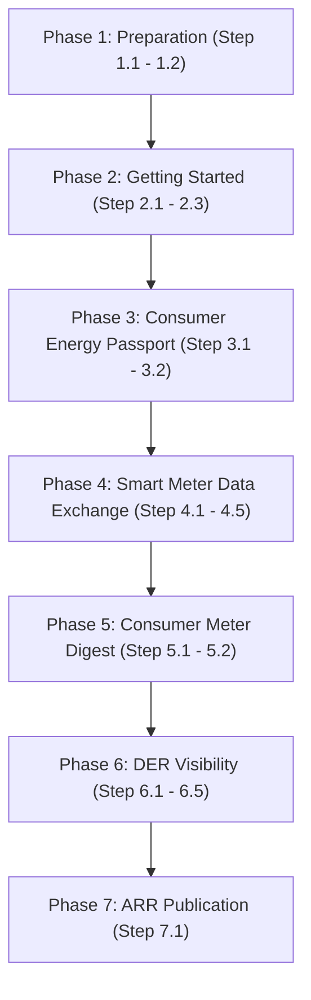

# Utility Pathway: Step-by-Step IES Integration Roadmap

Welcome to the **Utility Pathway**. This guide provides an actionable and structured roadmap for an electricity distribution utility to easily adopt the capabilities of the India Energy Stack (IES).

To keep this guide extremely clean and focus on utility progress, technical specifications are referenced via hyperlinks rather than repeated. Expand any step to find actionable guidelines, cross-team advice, and prework checkpoints.

---

## Roadmap Overview



---

## Prework & Pre-Alignment Matrix

Before commencing the integration pathway, we recommend aligning the following internal teams and core systems. Setting up these channels early ensures a seamless deployment experience:

| Department / Role | System / Resource Involved | Purpose in Pathway |
|---|---|---|
| **DNS & Web Master** | Utility domain controller (`discom.example`) | Exposing public `did:web` and verifying DeDi namespaces |
| **IT & Security Admin** | Cloud KMS / HSM, Docker Environments | Securing signing keypairs and deploying OpenCred/ONIX services |
| **Legal / Signatory** | Corporate credentials, API Setu | Submitting whitelists to IES Secretariat and registering on DigiLocker |
| **Billing & CRM Teams** | CIS, MDMS, Customer Databases | Mapping telemetry, tariff profiles, and triggering billing credentials |

---

## Phase 1: Preparation (Identity & Addressing)

In this phase, you will establish your institutional cryptographic identity and define clear naming grammars for your grid resources and consumers.

<details>
<summary><b>Step 1.1: Establish Your Institutional Identity ([did:web](../what-ies-provides/register.md))</b></summary>

### 💡 Phase Advice
> Call your DNS admin first — securing a subdomain takes minutes.

### 📋 Prework Required
* Confirm that your web admin has write-access to your target domain (e.g., `ies.discom.example`) to host the verification path.

### Execution Guidance
1. **Assign a Domain**: e.g., `ies.discom.example`.
2. **Publish the DID Document**: `did.json` (W3C DID Core spec) over HTTPS at `https://ies.discom.example/.well-known/did.json`. See [Step-by-step: publish your did:web](../how-you-implement-ies/setup-register.md#id-1.2-generate-your-credential-signing-keypair).

### References & Anchors
* [Identifiers & Addressing Overview](../what-ies-provides/register.md)
* [Resolution & Routing Specification](../what-ies-provides/register.md) (Detailed resolution rules for `did:web` endpoints)
* [Step-by-step: publish your did:web](../how-you-implement-ies/setup-register.md#id-1.2-generate-your-credential-signing-keypair) (Document parameters)
* [Setup Register — Checklist](../how-you-implement-ies/setup-register.md#checklist)
</details>

<details>
<summary><b>Step 1.2: Define Your Naming Grammars ([Identifiers and Addressing](../what-ies-provides/register.md#identifier-patterns))</b></summary>

### 💡 Phase Advice
> Align IES identifiers with existing SAP/GIS/CIS codes — wrap internal serials, don't replace them.

### Execution Guidance
Map internal customer numbers, SAP codes, and meter serials to the standard [`did:web` naming grammars](../what-ies-provides/register.md#identifier-patterns). Remember: **an identifier is just a name** with no inherent business meaning — it must resolve to a DID Document. See [Appendix D](../what-ies-provides/register.md#identifier-vs.-record).

The reference patterns (all `did:web` under your DISCOM's own domain):
1. **Consumers (holder DID)**: `did:key:<wallet-generated>` — generated by the wallet, not the DISCOM; the CIS number stays as `customerNumber` in the credential.
2. **Grid Assets**: `did:web:<your-domain>:assets:<asset-class>:<internal id>`
   *(e.g., `did:web:ies.discom.example:assets:transformer:DT-11KV-F02-452`)*
3. **Smart Meters**: `did:web:<your-domain>:assets:meter:<manufacturer code>_<serial number>`
   *(e.g., `did:web:ies.discom.example:assets:meter:GEN_12345678`)*
4. **Service Connections**: `did:web:<your-domain>:connections:<connection id>`
   *(e.g., `did:web:ies.discom.example:connections:CON-90234`)*

> [!NOTE]
> All identifiers use standard W3C `did:web` — there's no separate `did:dedi` method; even when DeDi is the discovery layer, the method on the wire is `did:web`. See [Appendix A](../what-ies-provides/register.md#the-did-methods-ies-uses).

### References & Anchors
* [Identifiers and Addressing — How DIDs work, and the three methods IES uses](../what-ies-provides/register.md#the-did-methods-ies-uses)
* [Identifier vs. record](../what-ies-provides/register.md#identifier-vs.-record)
* [Identifying assets, meters, connections, datasets](../what-ies-provides/register.md#identifier-patterns)
</details>

---

## Phase 2: Getting Started (Registry Setup)

Establish your administrative namespaces on the public [Decentralized Directory (DeDi)](../what-ies-provides/register.md#the-directory-dedi) and register your active endpoints with the network.

<details>
<summary><b>Step 2.1: Setup DeDi Namespace</b></summary>

### 💡 Phase Advice
> Use an institutional role-mailbox (e.g., `registry-admin@discom.example`), not a personal account, so IT retains control across staff rotations.

### ⚠️ Caution
> **Namespace Domain Verification**: Domain ownership verification leverages your existing DNS TXT record or setup rather than requiring you to request a brand new record class from your network administrators, easing compliance boundaries.

### Execution Guidance
1. Register a role-mailbox on the DeDi Portal and create a namespace matching your utility short-code (`<utility>`).
2. Expose the verification token in your DNS TXT records — see [Setup Register — §1.4](../how-you-implement-ies/setup-register.md) for formatting.

### References & Anchors
* [Why DeDi (and the three questions it answers)](../what-ies-provides/register.md#the-directory-dedi)
* [Setup Register — claim namespace + create registries](../how-you-implement-ies/setup-register.md)
* [Setup Register — Checklist](../how-you-implement-ies/setup-register.md#checklist)
</details>

<details>
<summary><b>Step 2.2: Create Operational Registries</b></summary>

### 💡 Phase Advice
> Maintain separation of duties — use separate registries for keys, revocation, and Beckn profiles.

### Execution Guidance
Create these registries under your namespace (OpenCred auto-creates several — see [Idempotency note for OpenCred users](../what-ies-provides/register.md#the-registries-ies-uses-by-role)):
* `opencred-key-registry` (tag `public_key`): Versioned signing keys. **Auto-created by OpenCred.**
* `vc-revocation-registry` (tag `revocation`): Real-time verifiable credential revocation. **Auto-created by OpenCred.**
* `subscribers-test` & `subscribers-prod` (tag `beckn_subscriber`): Beckn participant identity records. **You create these manually** — see [As a Beckn Network Participant](../what-ies-provides/register.md#the-directory-dedi).
* **Optional fallback**: Set `OPENCRED_DEDI_HOST_DID_DOC=true` (or call `/v1/keys/publish`) to keep the DID document reachable via DeDi if your HTTPS endpoint goes down.

### References & Anchors
* [The registries you'll touch in IES (by role)](../what-ies-provides/register.md#the-registries-ies-uses-by-role)
* [As a DISCOM / issuer running OpenCred](../what-ies-provides/register.md#the-directory-dedi)
* [As a Beckn Network Participant](../what-ies-provides/register.md#the-directory-dedi)
* [OpenCred Key & DID Publishing Configuration](../how-you-implement-ies/setup-register.md#id-1.2-generate-your-credential-signing-keypair)
</details>

<details>
<summary><b>Step 2.3: Register with India Energy Stack</b></summary>

### 💡 Phase Advice
> Pre-verify your package — double-check URLs, service areas, and JWK key formatting before emailing.

### 📋 Prework Required
* Stand up your subscriber registries (from Step 2.2) and prepare your endpoint URL payloads.

### Execution Guidance
Email your registration package (short-code, legal name, service areas, endpoints, `did:web` JWK) to the IES Secretariat:
* **Primary Email**: [IES.Secretariat@fsrglobal.org](mailto:IES.Secretariat@fsrglobal.org)
* **Alternate Email**: [ies@recindia.com](mailto:ies@recindia.com)

The Secretariat verifies and registers your endpoints in `ies-discoms-reference-registry`.

### References & Anchors
* [How to apply for an IES listing](../how-you-implement-ies/setup-register.md#id-1.7-beckn-participants-get-referenced-into-an-ies-network)
* [Setup Register — Checklist](../how-you-implement-ies/setup-register.md#checklist)
</details>

---

## Phase 3: Consumer Energy Passport (Verifiable Credentials)

Provide citizens with a secure, tamper-evident digital passport of their utility connection parameters, load limits, and registered assets.

<details>
<summary><b>Step 3.1: Setup Credential Issuance ([Consumer Energy Passport](../use-cases/consumer-energy-passport/README.md))</b></summary>

### 💡 Phase Advice
> Leverage existing CRM tables — the Passport is a composite of standard customer data, so just expose your billing/CIS databases to OpenCred.

### Execution Guidance
1. **Connect CRM Systems**: Map customer master data (sanctioned load, tariff slabs, connection status) from your CRM (e.g., SAP IS-U) to OpenCred.
2. **Configure Authentication**: Set up OTP or Aadhaar reference authentication gateways on your client portal.
3. **Deploy OpenCred**: Deploy the containerized service using your secured P-256 signing keys.
4. **CRM Status Logging & Issuance**: Store credential UUIDs to coordinate revocations, then issue via `/v1/credentials/issue` using the `ElectricityCredential` shape.
5. **Verify Revocation Handling**: Confirm revocation checks are active — misconfigured DeDi namespaces can leave verifiers seeing `not_revoked` after a revoke (see [Troubleshooting](../how-you-implement-ies/issue-credentials.md#troubleshooting)).
6. **Validate the Issued Credential**: Call `/v1/credentials/verify` on the issued VC to confirm the verifier resolves the DID and validates the signature (see [OpenCred Resolve Verification Check](../how-you-implement-ies/issue-credentials.md#id-2.9-smoke-test) for DeDi sync caveats).

### References & Anchors
* [Energy Credentials Overview](../how-you-implement-ies/energy-credentials/README.md)
* [Energy Credentials Deployment Guide](../how-you-implement-ies/energy-credentials/README.md)
* [OpenCred Resolve Verification Check & Env Options](../how-you-implement-ies/issue-credentials.md#id-2.9-smoke-test)
* [Energy Credentials — Troubleshooting (revocation caching)](../how-you-implement-ies/issue-credentials.md#troubleshooting)
* [Batch Issuance at Scale (Queue & Workers)](../how-you-implement-ies/issue-credentials.md#batch-issuance)
* [Consumer Energy Passport Use Case](../use-cases/consumer-energy-passport/README.md)
* [Consumer Energy Passport Schema (ElectricityCredential) Reference](https://india-energy-stack.gitbook.io/docs/schemas/electricitycredential/v1.2)
</details>

<details>
<summary><b>Step 3.2: Register with [DigiLocker](../how-you-implement-ies/energy-credentials/digilocker.md)</b></summary>

### 💡 Phase Advice
> [API Setu](../how-you-implement-ies/energy-credentials/digilocker.md) compliance checks take time — start legal registration early in Phase 3 so gateways clear before your code is ready.

### 📋 Prework Required
* Secure authorization letters and corporate certificates from your legal department for [API Setu](../how-you-implement-ies/energy-credentials/digilocker.md) access.

### References & Anchors
* [DigiLocker Integration Guide](../how-you-implement-ies/energy-credentials/digilocker.md)
* [Issuing Credentials Checklist](../how-you-implement-ies/issue-credentials.md#id-2.6-issue-your-first-credential)
</details>

---

## Phase 4: Smart Meter Data Exchange (Beckn Data Pipes)

*(See [Data Exchange — Core Concepts](../what-ies-provides/discover-exchange.md#the-lifecycle-at-a-glance) for the underlying Beckn primitives.)*

Enable federated, policy-governed data sharing of smart meter telemetry and master data with authorized third parties.

<details>
<summary><b>Step 4.1: Setup BPP Nodes ([BECKN Network](../how-you-implement-ies/setup-discovery-exchange.md#id-3.1-deploy-the-local-sandbox))</b></summary>

### 💡 Phase Advice
> Deploying the ONIX adapter as Docker takes under 10 minutes — run the local test sandbox first to verify configs before production.

### Execution Guidance
1. Deploy the standard Docker-based Beckn ONIX container.
2. Generate your Ed25519 node keypair.
3. Register your BPP credentials in DeDi [`subscribers-test`](../what-ies-provides/register.md#the-directory-dedi).

### References & Anchors
* [Data Exchange Concepts](../what-ies-provides/discover-exchange.md#the-lifecycle-at-a-glance)
* [Data Exchange Quick Start](../how-you-implement-ies/setup-discovery-exchange.md#id-3.1-deploy-the-local-sandbox)
* [ONIX Registry Setup](../how-you-implement-ies/setup-discovery-exchange.md#id-3.3-swap-in-your-real-identity)
* [Setup Discovery — Checklist](../how-you-implement-ies/setup-discovery-exchange.md#checklist)
</details>

<details>
<summary><b>Step 4.2: Establish MDM Integration for Telemetry</b></summary>

### 💡 Phase Advice
> Protect MDM performance — write query results to a read-only replica or cache intervals to avoid overloading production databases.

### ⚠️ Caution
> **Batch Telemetry Latency**: MDM database queries can be slow and can violate Beckn's transaction timeouts (usually 5 seconds). Ensure your telemetry API is highly optimized.

### Execution Guidance
Map HES DLMS-COSEM or IEC 61968-9 interval profiles to standard **[IntervalProfile](https://india-energy-stack.gitbook.io/docs/schemas/meterdata/v0.6)**, **[DailyProfile](https://india-energy-stack.gitbook.io/docs/schemas/meterdata/v0.6)**, **[InstantaneousProfile](https://india-energy-stack.gitbook.io/docs/schemas/meterdata/v0.6)**, and **[EventProfile](https://india-energy-stack.gitbook.io/docs/schemas/meterdata/v0.6)** formats.

### References & Anchors
* [Smart Meter Data Exchange — implementation guide](../use-cases/smart-meter-data-exchange/README.md)
  * [How It Fits Together](../use-cases-overview/smart-meter-data-exchange.md#id-10.-how-it-fits-together)
* [IES Meter Data Model](../use-cases/smart-meter-data-exchange/ies-meter-data-model.md)
* [MeterData Schema Specification](https://india-energy-stack.gitbook.io/docs/schemas/meterdata/v0.6)
</details>

<details>
<summary><b>Step 4.3: Integrate Customer Master Data</b></summary>

### 💡 Phase Advice
> Billing/customer files map directly to **[CustomerProfile](https://india-energy-stack.github.io/ies-accelerator/schemas/MeterData/v0.6/attributes.yaml)** — ensure your CRM export aligns tariff category, connection status, and sanctioned load.

### References & Anchors
* [MeterData Attributes & Customer Schema](https://india-energy-stack.github.io/ies-accelerator/schemas/MeterData/v0.6/attributes.yaml)
</details>

<details>
<summary><b>Step 4.4: Establish Data Exchange Authorisation</b></summary>

### 💡 Phase Advice
> Use **[MeterDataRequestCredential](https://india-energy-stack.gitbook.io/docs/schemas/meterdatarequestcredential/v0.1)** to formalise incoming B2B authorisations — the actual sharing request can be a subset of what's authorised.

### Execution Guidance
Authorisation logic is left to the utility; we suggest requiring the BAP present a **[MeterDataRequestCredential](https://india-energy-stack.gitbook.io/docs/schemas/meterdatarequestcredential/v0.1)** (see [example](https://india-energy-stack.github.io/ies-accelerator/schemas/MeterDataRequestCredential/v0.1/examples/example.json)) or **[Consumer Energy Passport](../use-cases/consumer-energy-passport/README.md) with consent**, verified by your BPP ONIX adapter before dispensing profiles.

### ⚠️ Caution
> **Scoped Access Violations**: Never expose granular consumer interval data without verifying that the presented credential permits that specific access window and profile.

> [!WARNING]
> **Clarity Gap**: Standardized B2B automated token validation policies on BPP ONIX are currently under-specified in the core guidelines, requiring custom token validation structures for consumer-consented exchanges.

### References & Anchors
* [Data Exchange — Beckn protocol lifecycle](../what-ies-provides/discover-exchange.md#the-lifecycle-at-a-glance)
* [MeterDataRequestCredential Schema](https://india-energy-stack.gitbook.io/docs/schemas/meterdatarequestcredential/v0.1)
* [MeterDataRequestCredential Example](https://india-energy-stack.github.io/ies-accelerator/schemas/MeterDataRequestCredential/v0.1/examples/example.json)
</details>

<details>
<summary><b>Step 4.5: Enable Meter Data Exchange Go-Live</b></summary>

### 💡 Phase Advice
> Run a parallel pilot — trade telemetry with a test consumer or partner BAP to confirm signing, encryption, and logging before going live.

### References & Anchors
* [Setup Discovery — Checklist](../how-you-implement-ies/setup-discovery-exchange.md#checklist)
</details>

---

## Phase 5: Consumer Meter Digest (Electricity Bill)

*(See [Use cases → Consumer Meter Digest](../use-cases/consumer-meter-digest/README.md).)*

Move beyond static PDFs to compile and issue verifiable, machine-readable monthly electricity bills.

<details>
<summary><b>Step 5.1: Create the Consumer Meter Digest Verifiable Credential</b></summary>

### 💡 Phase Advice
> Use a credential that includes the **[MeterData](https://india-energy-stack.gitbook.io/docs/schemas/meterdata/v0.6)** schema. `CustomerProfile` and `BillingProfile` **must** be included; a full-period `IntervalProfile` is recommended for consumption transparency.

### Execution Guidance
1. **Request the Data**: Query Data Exchange nodes with a `MeterDataRequest` spanning the billing duration.
   
   *Example `MeterDataRequest` for compiling a Digest:*
   ```json
   {
       "@context": "https://india-energy-stack.github.io/ies-accelerator/schemas/MeterDataRequest/v0.6/context.jsonld",
       "@type": "MeterDataRequest",
       "resources": [
           "did:web:ies.discom.example:meter:IN-MH-MTR-89721"
       ],
       "scope": "ResourceOnly",
       "from": "2026-04-01T00:00:00Z",
       "duration": "P1M",
       "capabilitiesRequested": {
           "profiles": [
               { "profileType": "CustomerProfile" },
               { "profileType": "IntervalProfile" }
           ]
       }
   }
   ```

2. **Structure the Credential**: Package the resulting [`MeterData`](https://india-energy-stack.gitbook.io/docs/schemas/meterdata/v0.6) payload as the data subject of your verifiable credential.
3. **Sign and Issue**: Sign and issue the credential via your OpenCred service.


### References & Anchors
* [Electricity Bills and Digest — implementation guide](../use-cases/consumer-meter-digest/README.md)
  * [How It Fits Together](../use-cases-overview/consumer-meter-digest.md#id-10.-how-it-fits-together)
</details>

<details>
<summary><b>Step 5.2: Link Bills to [DigiLocker](../how-you-implement-ies/energy-credentials/digilocker.md)</b></summary>

### 💡 Phase Advice
> Re-use your DigiLocker gateway — since you cleared API Setu in Step 3.2, adding the bill credential is a simple extension of your issuer record.

### References & Anchors
* [DigiLocker Issuer Setup](../how-you-implement-ies/energy-credentials/digilocker.md)
</details>

---

## Phase 6: DER Visibility (Distributed Energy Resources)

Acquire real-time visibility into solar generation, battery storage, and feeder loading to balance the grid.

<details>
<summary><b>Step 6.1: Establish DER Sources</b></summary>

### 💡 Phase Advice
> Onboard consumer generation assets dynamically — capture DER parameters (inverter rating, battery capacity) and map to standard DIDs (e.g. `did:web:<your-domain>:assets:inverter:<inverter-serial-no>`).
</details>

<details>
<summary><b>Step 6.2: Start Receiving Data via Daily Profiles</b></summary>

### 💡 Phase Advice
> Prioritize your own grid telemetry first — ingest the utility's smart meter consumption/generation profiles, then expand to independent generators and EV charging stations.

### 📋 Prework Required
* Confirm that smart meter generation register reads are active and mapped to standard profiles.
</details>

<details>
<summary><b>Step 6.3: Grid Topology & Data Exchange</b></summary>

### 💡 Phase Advice
> Publish hierarchical relationships — linking substations, feeders, transformers, meters, and DER assets lets operators map downstream loading, shared securely via **Data Exchange**.

### References & Anchors
* [Grid Identifiers & Hierarchy Guide](../what-ies-provides/register.md#identifier-patterns)
</details>

<details>
<summary><b>Step 6.4: Build a Feeder-Level Aggregator</b></summary>

### 💡 Phase Advice
> Keep customer PII out of grid planning — aggregate telemetry at the transformer or feeder level to share loading profiles without exposing individual details, published via your **Data Exchange** nodes.

> **Leveraging Associations for Aggregation**: Use the optional `parentResources` property in `CustomerProfile`'s `Association` block to trace each meter to its upstream feeder/transformer, letting you sum telemetry into a single `AggregatedFeeder` payload.

### ⚠️ Caution
> **Imputation for Zero Readings**: Ensure your aggregator engine handles missing or zero readings securely (e.g., forward-fill or mean-imputation) to prevent aggregated peaks from showing artificial drops.

> Annotate aggregation datasets with `AccumulationBehaviour`, set to `SUMMATION`. See this [Aggregated Feeder Example](https://india-energy-stack.github.io/ies-accelerator/schemas/MeterData/v0.6/examples/AggregatedFeeder.json) for a feeder-level `IntervalProfile`.
</details>

<details>
<summary><b>Step 6.5: Build a DER Visualiser Dashboard</b></summary>

### 💡 Phase Advice
> Keep it visual — query feeder aggregations over your BAP node and plot live timeseries of loading, battery state-of-charge, and reverse solar back-feeding.
</details>

---

## Phase 7: ARR Publication (Annual Revenue Requirement)

Publish your Annual Revenue Requirement data in a standardized, machine-readable format to enable programmatic tariff analysis and regulatory transparency.

<details>
<summary><b>Step 7.1: Map Existing Data to [ARR Schema](https://india-energy-stack.gitbook.io/docs/schemas/arrfiling/v0.5)</b></summary>

### 💡 Phase Advice
> Skip new reporting pipelines — map existing regulatory data sets directly to the provided [ARR schema](https://india-energy-stack.gitbook.io/docs/schemas/arrfiling/v0.5).

### Execution Guidance
1. Extract historical, current, and forecasted monetary data from tariff orders and filings.
2. Provide **only machine-readable monetary data** — avoid embedding unstructured text or PDF blobs.
3. Map the data to the canonical [`ArrFiling`](https://india-energy-stack.gitbook.io/docs/schemas/arrfiling/v0.5) schema structure.
4. **Note your experiences**: Treat this as iterative — document friction points or missing fields to inform future refinements.

### References & Anchors
* [ARR Filing Schema Reference](https://india-energy-stack.gitbook.io/docs/schemas/arrfiling/v0.5)
* [ARR Filing Machine-Readable Example](https://india-energy-stack.github.io/ies-accelerator/schemas/ArrFiling/v0.5/examples/arr_filings.json)
</details>


