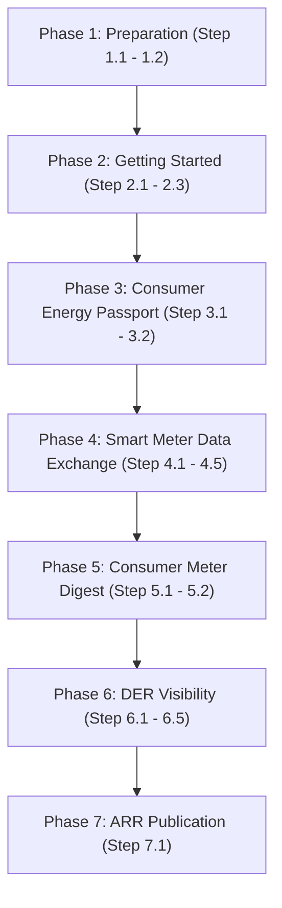

# Utility Pathway: Step-by-Step IES Integration Roadmap

A roadmap for an electricity distribution utility adopting the India Energy Stack (IES). Technical specifications are linked, not repeated — expand any step for guidance and prework checkpoints.

---

## Roadmap Overview


```mermaid
flowchart TD
    prep["Phase 1: Preparation (Step 1.1 - 1.2)"] --> init["Phase 2: Getting Started (Step 2.1 - 2.3)"]
    init --> passport["Phase 3: Consumer Energy Passport (Step 3.1 - 3.2)"]
    passport --> dex["Phase 4: Smart Meter Data Exchange (Step 4.1 - 4.5)"]
    dex --> bill["Phase 5: Consumer Meter Digest (Step 5.1 - 5.2)"]
    bill --> der["Phase 6: DER Visibility (Step 6.1 - 6.5)"]
    der --> arr["Phase 7: ARR Publication (Step 7.1)"]
```

---

## Prework & Pre-Alignment Matrix

Align these internal teams and core systems before starting:

| Department / Role | System / Resource Involved | Purpose in Pathway |
|---|---|---|
| **DNS & Web Master** | Utility domain controller (`discom.example`) | Exposing public `did:web` and verifying DeDi namespaces |
| **IT & Security Admin** | Cloud KMS / HSM, Docker Environments | Securing signing keypairs and deploying OpenCred/ONIX services |
| **Legal / Signatory** | Corporate credentials, API Setu | Submitting whitelists to IES Secretariat and registering on DigiLocker |
| **Billing & CRM Teams** | CIS, MDMS, Customer Databases | Mapping telemetry, tariff profiles, and triggering billing credentials |

---

## Phase 1: Preparation (Identity & Addressing)

In this phase, you will establish your institutional cryptographic identity and define clear naming grammars for your grid resources and consumers.

<details>
<summary><b>Step 1.1: Establish Your Institutional Identity ([did:web](../what-ies-provides/register.md))</b></summary>

### 💡 Phase Advice
> Call your DNS admin first — securing a subdomain takes minutes.

### 📋 Prework Required
* Confirm that your web admin has write-access to your target domain (e.g., `ies.discom.example`) to host the verification path.

### Execution Guidance
1. **Assign a Domain**: e.g., `ies.discom.example`.
2. **Generate the signing keypair**: EC P-256, stored in KMS/HSM where available — see [Setup Register §1.2](../how-you-implement-ies/setup-register.md#id-1.2-generate-your-credential-signing-keypair).
3. **Publish the DID Document**: `did.json` (W3C DID Core spec) over HTTPS at `https://ies.discom.example/.well-known/did.json` — see [Setup Register §1.3](../how-you-implement-ies/setup-register.md#id-1.3-generate-and-publish-did.json).

### References & Anchors
* [Register — Identifiers & Addressing overview](../what-ies-provides/register.md)
* [The DID methods IES uses](../what-ies-provides/register.md#the-did-methods-ies-uses) (resolution rules for `did:web`)
* [Setup Register — Checklist](../how-you-implement-ies/setup-register.md#checklist)
</details>

<details>
<summary><b>Step 1.2: Define Your Naming Grammars ([Identifiers and Addressing](../what-ies-provides/register.md#identifier-patterns))</b></summary>

### 💡 Phase Advice
> Align IES identifiers with existing SAP/GIS/CIS codes — wrap internal serials, don't replace them.

### Execution Guidance
Map internal customer numbers, SAP codes, and meter serials to the standard [`did:web` naming grammars](../what-ies-provides/register.md#identifier-patterns). Remember: **an identifier is just a name** with no inherent business meaning — it must resolve to a DID Document. See [Identifier patterns → Identifier vs. record](../what-ies-provides/register.md#identifier-vs.-record).

The reference patterns — all `did:web` under your DISCOM's own domain, except consumers, whose holder DID is wallet-generated:
1. **Consumers (holder DID)**: `did:key:<wallet-generated>` — generated by the wallet, not the DISCOM; the CIS number stays as `customerNumber` in the credential.
2. **Grid Assets**: `did:web:<your-domain>:assets:<asset-class>:<internal id>`
   *(e.g., `did:web:ies.discom.example:assets:transformer:DT-11KV-F02-452`)*
3. **Smart Meters**: `did:web:<your-domain>:assets:meter:<meter serial no>`
   *(e.g., `did:web:ies.discom.example:assets:meter:MET-IMPORT-001`)*
4. **Service Connections**: `did:web:<your-domain>:connections:<connection id>`
   *(e.g., `did:web:ies.discom.example:connections:CON-90234`)*

> [!NOTE]
> All identifiers use standard W3C `did:web` — there's no separate `did:dedi` method; even when DeDi is the discovery layer, the method on the wire is `did:web`. See [Appendix A](../what-ies-provides/register.md#the-did-methods-ies-uses).

### References & Anchors
* [Identifiers and Addressing — How DIDs work, and the three methods IES uses](../what-ies-provides/register.md#the-did-methods-ies-uses)
* [Identifier vs. record](../what-ies-provides/register.md#identifier-vs.-record)
* [Identifying assets, meters, connections, datasets](../what-ies-provides/register.md#identifier-patterns)
</details>

---

## Phase 2: Getting Started (Registry Setup)

Establish your administrative namespaces on the public [Decentralized Directory (DeDi)](../what-ies-provides/register.md#the-directory-dedi) and register your active endpoints with the network.

<details>
<summary><b>Step 2.1: Setup DeDi Namespace</b></summary>

### 💡 Phase Advice
> Use an institutional role-mailbox (e.g., `registry-admin@discom.example`), not a personal account, so IT retains control across staff rotations.

### ⚠️ Caution
> **Namespace Domain Verification**: DeDi verifies domain ownership with a standard DNS TXT record — DeDi issues the token, your DNS admin adds it to the existing zone. Propagation is usually about 15 minutes but can take up to 48 hours, so start this before you need the namespace.

### Execution Guidance
1. Register a role-mailbox on the DeDi Portal and create a namespace matching your utility short-code (`<utility>`).
2. Expose the verification token in your DNS TXT records — see [Setup Register §1.4](../how-you-implement-ies/setup-register.md#id-1.4-claim-a-dedi-namespace-and-verify-your-domain) for formatting.

### References & Anchors
* [Why DeDi (and the three questions it answers)](../what-ies-provides/register.md#the-directory-dedi)
* [Setup Register — claim namespace + create registries](../how-you-implement-ies/setup-register.md)
* [Setup Register — Checklist](../how-you-implement-ies/setup-register.md#checklist)
</details>

<details>
<summary><b>Step 2.2: Create Operational Registries</b></summary>

### 💡 Phase Advice
> Maintain separation of duties — use separate registries for keys, revocation, and Beckn profiles.

### Execution Guidance
Create these registries under your namespace (OpenCred auto-creates the credential-side ones — see [The registries IES uses, by role](../what-ies-provides/register.md#the-registries-ies-uses-by-role)):
* `opencred-key-registry` (tag `public_key`) and `vc-revocation-registry` (tag `revocation`): versioned signing keys and real-time credential revocation. **Auto-created by OpenCred on first boot**, along with `schema_registry` and `context_registry`.
* `subscribers-test` & `subscribers-prod` (tag `beckn_subscriber`): Beckn participant identity records. **You create these manually** — see [Setup Register §1.6](../how-you-implement-ies/setup-register.md#id-1.6-beckn-participants-publish-your-beckn-subscriber-record).
* **Optional fallback**: publish your key (and optionally a frozen `did.json` snapshot) into DeDi's key registry under your verified namespace, as a second discovery path if your HTTPS endpoint is unreachable — see [The DID methods IES uses](../what-ies-provides/register.md#the-did-methods-ies-uses).

### References & Anchors
* [The registries IES uses, by role](../what-ies-provides/register.md#the-registries-ies-uses-by-role)
* [Setup Register — claim namespace, subscriber registries](../how-you-implement-ies/setup-register.md#id-1.4-claim-a-dedi-namespace-and-verify-your-domain)
* [Issue Credentials — confirm OpenCred's auto-created registries](../how-you-implement-ies/issue-credentials.md#id-3.4-confirm-your-dedi-namespace-is-live)
</details>

<details>
<summary><b>Step 2.3: Register with India Energy Stack</b></summary>

### 💡 Phase Advice
> Pre-verify your package — double-check URLs, service areas, and JWK key formatting before emailing.

### 📋 Prework Required
* Stand up your subscriber registries (from Step 2.2) and prepare your endpoint URL payloads.

### Execution Guidance
Email your application (short identifier, verified DeDi namespace, subscriber-registry lookup URL, target network(s), role, service areas, point of contact — full list in [Setup Register §1.7](../how-you-implement-ies/setup-register.md#id-1.7-beckn-participants-get-referenced-into-an-ies-network)) to the IES Secretariat:
* **Primary Email**: [IES.Secretariat@fsrglobal.org](mailto:IES.Secretariat@fsrglobal.org)
* **Alternate Email**: [ies@recindia.com](mailto:ies@recindia.com)

The Secretariat validates your namespace, callback URL, and signing key, then writes a reference entry for your subscriber record into the IES network registry (e.g. `ies-data-sharing-network`, or its `test-` variant).

### References & Anchors
* [How to apply for an IES listing](../how-you-implement-ies/setup-register.md#id-1.7-beckn-participants-get-referenced-into-an-ies-network)
* [Setup Register — Checklist](../how-you-implement-ies/setup-register.md#checklist)
</details>

---

## Phase 3: Consumer Energy Passport (Verifiable Credentials)

Provide citizens with a secure, tamper-evident digital passport of their utility connection parameters, load limits, and registered assets.

<details>
<summary><b>Step 3.1: Setup Credential Issuance ([Consumer Energy Passport](../use-cases/consumer-energy-passport/README.md))</b></summary>

### 💡 Phase Advice
> Reuse existing CRM tables — the Passport is a composite of standard customer data, so expose your billing/CIS databases to OpenCred rather than building a new store.

### Execution Guidance
1. **Connect CRM Systems**: Map customer master data (sanctioned load, tariff slabs, connection status) from your CRM (e.g., SAP IS-U) to OpenCred.
2. **Configure Authentication**: Set up OTP or Aadhaar reference authentication gateways on your client portal.
3. **Deploy OpenCred**: Deploy the containerized service using your secured P-256 signing keys.
4. **CRM Status Logging & Issuance**: Store credential UUIDs to coordinate revocations, then issue via `/v1/credentials/issue` using the `ElectricityCredential` shape.
5. **Verify Revocation Handling**: Confirm revocation checks are active — DeDi and OpenCred caching can leave verifiers seeing `not_revoked` for several minutes after a revoke (see [Troubleshooting](../how-you-implement-ies/issue-credentials.md#troubleshooting)).
6. **Validate the Issued Credential**: Call `/v1/credentials/verify` on the issued VC to confirm the verifier resolves the DID and validates the signature (see the [smoke test](../how-you-implement-ies/issue-credentials.md#id-3.9-smoke-test) for DeDi sync caveats).

### References & Anchors
* [Verifiable Credentials in depth](../what-ies-provides/energy-credentials/README.md)
* [Issue Credentials — smoke test](../how-you-implement-ies/issue-credentials.md#id-3.9-smoke-test)
* [Issue Credentials — Troubleshooting (revocation caching)](../how-you-implement-ies/issue-credentials.md#troubleshooting)
* [Issue Credentials — Batch issuance](../how-you-implement-ies/issue-credentials.md#batch-issuance)
* [Consumer Energy Passport Use Case](../use-cases/consumer-energy-passport/README.md)
* [ElectricityCredential v1.2 Schema Reference](https://india-energy-stack.gitbook.io/docs/schemas/electricitycredential/v1.2)
</details>

<details>
<summary><b>Step 3.2: Register with [DigiLocker](../how-you-implement-ies/digilocker.md)</b></summary>

### 💡 Phase Advice
> [API Setu](../how-you-implement-ies/digilocker.md) compliance checks take time — start legal registration early in Phase 3 so gateways clear before your code is ready.

### 📋 Prework Required
* Secure authorization letters and corporate certificates from your legal department for [API Setu](../how-you-implement-ies/digilocker.md) access.

### References & Anchors
* [DigiLocker Integration Guide](../how-you-implement-ies/digilocker.md)
* [Issue Credentials — issue your first credential](../how-you-implement-ies/issue-credentials.md#id-3.6-issue-your-first-credential)
</details>

---

## Phase 4: Smart Meter Data Exchange (Beckn Data Pipes)

*(See [Discover — Core Concepts](../what-ies-provides/discover.md#the-lifecycle-at-a-glance) for the underlying Beckn primitives.)*

Enable federated, policy-governed data sharing of smart meter telemetry and master data with authorized third parties.

<details>
<summary><b>Step 4.1: Setup BPP Nodes ([BECKN Network](../how-you-implement-ies/setup-exchange.md#id-2.1-deploy-the-local-sandbox))</b></summary>

### 💡 Phase Advice
> Deploying the ONIX adapter as Docker takes under 10 minutes — run the local test sandbox first to verify configs before production.

### Execution Guidance
1. Deploy the standard Docker-based Beckn ONIX container.
2. Generate your Ed25519 node keypair.
3. Register your BPP credentials in DeDi [`subscribers-test`](../what-ies-provides/register.md#the-directory-dedi).

### References & Anchors
* [Discover Concepts](../what-ies-provides/discover.md#the-lifecycle-at-a-glance)
* [Data Exchange Quick Start](../how-you-implement-ies/setup-exchange.md#id-2.1-deploy-the-local-sandbox)
* [ONIX Registry Setup](../how-you-implement-ies/setup-exchange.md#id-2.3-swap-in-your-real-identity)
* [Setup Exchange — Checklist](../how-you-implement-ies/setup-exchange.md#checklist)
</details>

<details>
<summary><b>Step 4.2: Establish MDM Integration for Telemetry</b></summary>

### 💡 Phase Advice
> Protect MDM performance — write query results to a read-only replica or cache intervals to avoid overloading production databases.

### ⚠️ Caution
> **Batch Telemetry Latency**: MDM database queries can be slow and can violate your ONIX adapter's configured transaction timeout (the sandbox config defaults to 30 seconds). Budget your telemetry API's worst-case query time against that limit — pre-computed views or a read replica usually get you there.

### Execution Guidance
Map HES DLMS-COSEM or IEC 61968-9 interval profiles to the standard **`INTERVAL`**, **`DAILY`**, **`INSTANTANEOUS`**, and **`EVENT`** profile shapes of [MeterData v0.6](https://india-energy-stack.gitbook.io/docs/schemas/meterdata/v0.6).

### References & Anchors
* [Smart Meter Data Exchange — implementation guide](../use-cases/smart-meter-data-exchange/README.md)
  * [How It Fits Together](../use-cases-overview/smart-meter-data-exchange.md#id-10.-how-it-fits-together)
* [IES Meter Data Model](../use-cases/smart-meter-data-exchange/ies-meter-data-model.md)
* [MeterData Schema Specification](https://india-energy-stack.gitbook.io/docs/schemas/meterdata/v0.6)
</details>

<details>
<summary><b>Step 4.3: Integrate Customer Master Data</b></summary>

### 💡 Phase Advice
> Billing/customer files map directly to **[CustomerProfile](https://india-energy-stack.github.io/ies-accelerator/schemas/MeterData/v0.6/attributes.yaml)** — ensure your CRM export aligns tariff category, connection status, and sanctioned load.

### References & Anchors
* [MeterData Attributes & Customer Schema](https://india-energy-stack.github.io/ies-accelerator/schemas/MeterData/v0.6/attributes.yaml)
</details>

<details>
<summary><b>Step 4.4: Establish Data Exchange Authorisation</b></summary>

### 💡 Phase Advice
> Use **[MeterDataRequestCredential](https://india-energy-stack.gitbook.io/docs/schemas/meterdatarequestcredential/v0.6)** to formalise incoming B2B authorisations — the actual sharing request can be a subset of what's authorised.

### Execution Guidance
Authorisation logic is left to the utility; we suggest requiring the BAP present a **[MeterDataRequestCredential](https://india-energy-stack.gitbook.io/docs/schemas/meterdatarequestcredential/v0.6)** (see [example](https://india-energy-stack.github.io/ies-accelerator/schemas/MeterDataRequestCredential/v0.6/examples/example.json)) or **[Consumer Energy Passport](../use-cases/consumer-energy-passport/README.md) with consent**, verified by your BPP ONIX adapter before dispensing profiles.

### ⚠️ Caution
> **Scoped Access Violations**: Never expose granular consumer interval data without verifying that the presented credential permits that specific access window and profile.

> [!WARNING]
> **Clarity Gap**: The [MeterDataRequest](https://india-energy-stack.gitbook.io/docs/schemas/meterdatarequest/v0.6) `authorisation` object gives you a documented shape for carrying the grant, but how a BPP automatically validates consumer-consent tokens is not yet specified anywhere in this reference. Until it is, plan to design your own token-validation logic for consumer-consented exchanges.

### References & Anchors
* [Discover — Beckn protocol lifecycle](../what-ies-provides/discover.md#the-lifecycle-at-a-glance)
* [MeterDataRequestCredential Schema](https://india-energy-stack.gitbook.io/docs/schemas/meterdatarequestcredential/v0.6)
* [MeterDataRequestCredential Example](https://india-energy-stack.github.io/ies-accelerator/schemas/MeterDataRequestCredential/v0.6/examples/example.json)
</details>

<details>
<summary><b>Step 4.5: Enable Meter Data Exchange Go-Live</b></summary>

### 💡 Phase Advice
> Run a parallel pilot — trade telemetry with a test consumer or partner BAP to confirm signing, encryption, and logging before going live.

### References & Anchors
* [Setup Exchange — Checklist](../how-you-implement-ies/setup-exchange.md#checklist)
</details>

---

## Phase 5: Consumer Meter Digest (Electricity Bill)

*(See [Use cases → Consumer Meter Digest](../use-cases/consumer-meter-digest/README.md).)*

Move beyond static PDFs to compile and issue verifiable, machine-readable monthly electricity bills.

<details>
<summary><b>Step 5.1: Create the Consumer Meter Digest Verifiable Credential</b></summary>

### 💡 Phase Advice
> The Digest is a **[MeterDataCredential](https://india-energy-stack.gitbook.io/docs/schemas/meterdatacredential/v0.6)** wrapping a **[MeterData](https://india-energy-stack.gitbook.io/docs/schemas/meterdata/v0.6)** payload — the canonical Digest example carries one `MonthlyProfile` per billing month; a full-period `IntervalProfile` is recommended for consumption transparency.

### Execution Guidance
1. **Request the Data**: Query Data Exchange nodes with a `MeterDataRequest` spanning the billing duration.
   
   *Example `MeterDataRequest` for compiling a Digest:*
   ```json
   {
       "@context": "https://india-energy-stack.github.io/ies-accelerator/schemas/MeterDataRequest/v0.6/context.jsonld",
       "@type": "MeterDataRequest",
       "resources": [
           "did:web:ies.discom.example:assets:meter:MET-IMPORT-001"
       ],
       "scope": "ResourceOnly",
       "from": "2026-04-01T00:00:00Z",
       "duration": "P1M",
       "capabilitiesRequested": {
           "profiles": [
               { "profileType": "CustomerProfile" },
               { "profileType": "IntervalProfile" }
           ]
       }
   }
   ```

2. **Structure the Credential**: Package the resulting `MeterData` payload as the data subject of a `MeterDataCredential`.
3. **Sign and Issue**: Sign and issue the credential via your OpenCred service — see [MeterDataCredential v0.6 — telemetry signing](../how-you-implement-ies/issue-credentials.md#meterdatacredential-v0.6-telemetry-signing).


### References & Anchors
* [Electricity Bills and Digest — implementation guide](../use-cases/consumer-meter-digest/README.md)
  * [How It Fits Together](../use-cases-overview/consumer-meter-digest.md#id-10.-how-it-fits-together)
</details>

<details>
<summary><b>Step 5.2: Link Bills to [DigiLocker](../how-you-implement-ies/digilocker.md)</b></summary>

### 💡 Phase Advice
> Re-use your DigiLocker gateway — since you cleared API Setu in Step 3.2, adding the bill credential is a simple extension of your issuer record.

### References & Anchors
* [DigiLocker Issuer Setup](../how-you-implement-ies/digilocker.md)
</details>

---

## Phase 6: DER Visibility (Distributed Energy Resources)

Acquire real-time visibility into solar generation, battery storage, and feeder loading to balance the grid.

<details>
<summary><b>Step 6.1: Establish DER Sources</b></summary>

### 💡 Phase Advice
> Onboard consumer generation assets dynamically — capture DER parameters (inverter rating, battery capacity) and map to standard DIDs (e.g. `did:web:<your-domain>:assets:inverter:<inverter-serial-no>`).
</details>

<details>
<summary><b>Step 6.2: Start Receiving Data via Daily Profiles</b></summary>

### 💡 Phase Advice
> Prioritize your own grid telemetry first — ingest the utility's smart meter consumption/generation profiles, then expand to independent generators and EV charging stations.

### 📋 Prework Required
* Confirm that smart meter generation register reads are active and mapped to standard profiles.
</details>

<details>
<summary><b>Step 6.3: Grid Topology & Data Exchange</b></summary>

### 💡 Phase Advice
> Publish hierarchical relationships — linking substations, feeders, transformers, meters, and DER assets lets operators map downstream loading, shared securely via **Data Exchange**.

### References & Anchors
* [Identifier patterns — assets, meters, connections](../what-ies-provides/register.md#identifier-patterns)
</details>

<details>
<summary><b>Step 6.4: Build a Feeder-Level Aggregator</b></summary>

### 💡 Phase Advice
> Keep customer PII out of grid planning — aggregate telemetry at the transformer or feeder level to share loading profiles without exposing individual details, published via your **Data Exchange** nodes.

> **Associations trace the hierarchy**: Use the optional `parentResources` property in `CustomerProfile`'s `Association` block to trace each meter to its upstream feeder/transformer, letting you sum telemetry into a single `AggregatedFeeder` payload.

### ⚠️ Caution
> **Imputation for Zero Readings**: Decide explicitly how your aggregator handles missing or zero readings (e.g., forward-fill or mean-imputation) — otherwise aggregated peaks show artificial drops wherever one meter failed to report.

> Annotate aggregation datasets with `AccumulationBehaviour`, set to `SUMMATION`. See this [Aggregated Feeder Example](https://india-energy-stack.github.io/ies-accelerator/schemas/MeterData/v0.6/examples/AggregatedFeeder.json) for a feeder-level `IntervalProfile`.
</details>

<details>
<summary><b>Step 6.5: Build a DER Visualiser Dashboard</b></summary>

### 💡 Phase Advice
> Keep it visual — query feeder aggregations over your BAP node and plot live timeseries of loading, battery state-of-charge, and reverse solar back-feeding.
</details>

---

## Phase 7: ARR Publication (Annual Revenue Requirement)

Publish your Annual Revenue Requirement data in a standardized, machine-readable format to enable programmatic tariff analysis and regulatory transparency.

<details>
<summary><b>Step 7.1: Map Existing Data to [ARR Schema](https://india-energy-stack.gitbook.io/docs/schemas/arrfiling/v0.5)</b></summary>

### 💡 Phase Advice
> Skip new reporting pipelines — map existing regulatory data sets directly to the provided [ARR schema](https://india-energy-stack.gitbook.io/docs/schemas/arrfiling/v0.5).

### Execution Guidance
1. Extract historical, current, and forecasted monetary data from tariff orders and filings.
2. Provide **only machine-readable monetary data** — avoid embedding unstructured text or PDF blobs.
3. Map the data to the canonical [`ArrFiling`](https://india-energy-stack.gitbook.io/docs/schemas/arrfiling/v0.5) schema structure.
4. **Note your experiences**: Treat this as iterative — document friction points or missing fields to inform future refinements.

### References & Anchors
* [ARR Filing Schema Reference](https://india-energy-stack.gitbook.io/docs/schemas/arrfiling/v0.5)
* [ARR Filing Machine-Readable Example](https://india-energy-stack.github.io/ies-accelerator/schemas/ArrFiling/v0.5/examples/arr_filings.json)
</details>


