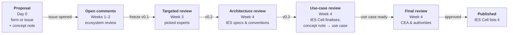

# Propose a Schema

A proposal travels a fixed **~4-week lifecycle** — from the form below to a published entry
in the [schema catalogue](schemas-ies/README.md). Your submission opens a public GitHub
issue, and that issue stays the single record for it through every stage. Include a
**concept note** built on the
[use-case overview template](https://github.com/India-Energy-Stack/ies-accelerator/blob/main/.github/templates/use-case-overview.md)
— after the architecture review, the IES Cell turns it into the use-case write-up that
goes for final sign-off.



| When | Stage | Output |
|---|---|---|
| Day 0 | Proposal — form below or a GitHub issue, **with a concept note** | Proposal issue |
| Weeks 1–2 | Open ecosystem comments | **v0.1** (frozen) |
| Week 3 | Targeted review by picked experts (1-week deadline) | **v0.2** |
| Week 4 | Architecture review — IES specs, schema conventions | **v0.3** |
| Week 4 | IES Cell finalises the schema; concept note → **use-case review** | Use case |
| Week 4 | CEA / authorities final review | Approved |
| End of Week 4 | IES Cell lists it in the schema catalogue | Published |

Revising an existing schema follows the same flow: non-breaking changes (new optional
fields or enum values) stay within the minor version; breaking changes get a new sibling
version, and the old one stays reachable.

---

The IES ecosystem grows through community-proposed schemas. If you're working on a data
model that a use case needs, propose it here — tell us who you are, which use case it
supports (existing or new), the schema itself, and the standards it builds on.

Fill in the form below. Your contact details (email and mobile) are kept
**private** — shared only with the IES secretariat. A public tracking issue is created
automatically for the proposal itself (schema, use case, standards) so the community can
review and discuss it. No GitHub account is required to submit.


Optionally include your GitHub username and we'll tag you on the tracking issue so you
can follow the discussion.



Two references worth keeping open as you fill this in:
the [IES term taxonomy](https://india-energy-stack.gitbook.io/docs/schemas/taxonomy) —
check your terms align with it — and the
[use-case overview template](https://github.com/India-Energy-Stack/ies-accelerator/blob/main/.github/templates/use-case-overview.md)
to structure your concept note. Share the concept note as a **public link** (a Google Doc
set to "anyone with the link", or a GitHub link).


```schema-proposal
```

If the form above doesn't load, [open it in a new tab](https://forms.gle/ESVk4PDcfEerPo6f7).

After submitting, your proposal is posted to the
[GitHub Issue Tracker](https://github.com/India-Energy-Stack/ies-accelerator/issues) —
you should see an issue populated with your request, where the community reviews and
discusses it.

Not sure which use case yours fits? Browse the use-case overviews first, starting with [Consumer Energy Passport](use-cases-overview/consumer-energy-passport.md).
