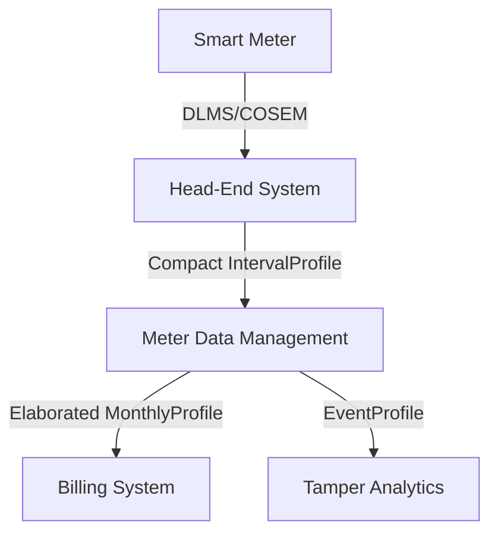
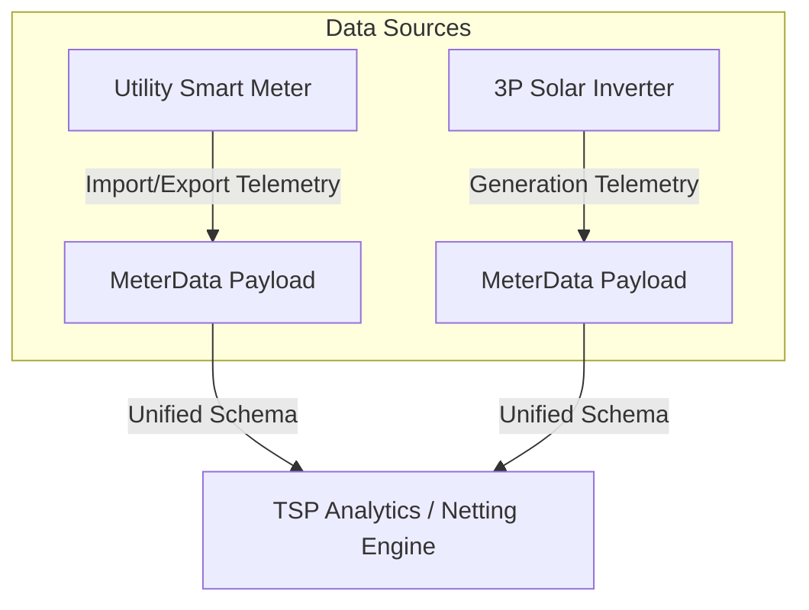
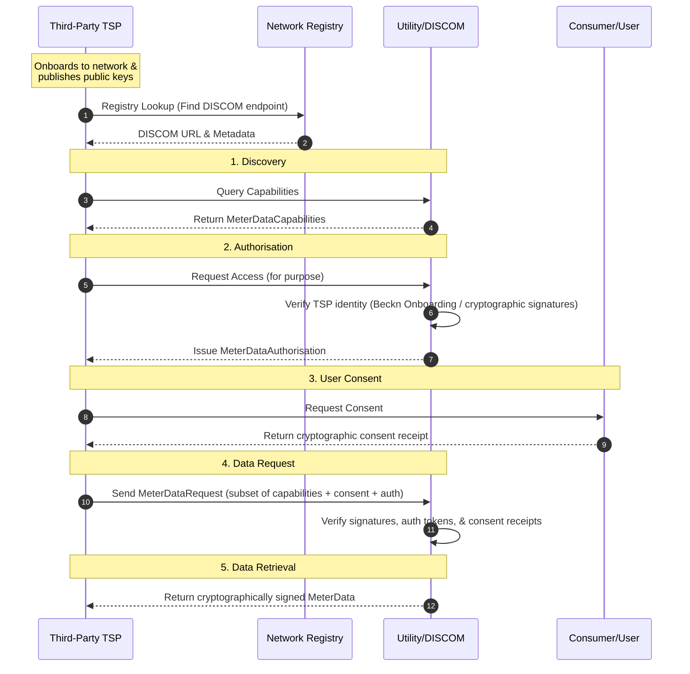
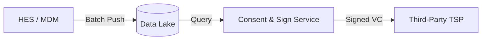

# MeterData User Guide

This user guide explains how to design, exchange, and process `MeterData` payloads within modern utility architectures, including Head-End Systems (HES), Meter Data Management (MDM) platforms, and Billing systems.

---

## 1. Architectural Roles & Telemetry Exchange

In standard smart metering infrastructure, data flows from the physical meters up to business applications. The `MeterData` schema maps to each interface:



### A. Head-End System (HES) to MDM
- **Use Case**: Periodic collection of daily load profiles or raw 15-minute load survey intervals.
- **Recommended Profile**: [`IntervalProfile`](./examples/IntervalProfile.json) or [`DailyProfile`](./examples/DailyProfile.json) using **Form B (Compact Matrix)**.
- **Why**: Head-End systems handle millions of meters. Emitting compact arrays of numbers with a single shared descriptor set minimises network ingress, compression overhead, and database insertion time.

### B. MDM to Billing System / CIS
- **Use Case**: Handing off the monthly billing determinants (active/apparent energy, peak demand, Time-of-Use buckets) to generate customer bills.
- **Recommended Profile**: [`MonthlyProfile`](./examples/MonthlyProfile.json) or [`MDM_MonthlyProfile`](./examples/MDM_MonthlyProfile.json) using **Form A (Elaborated)**.
- **Why**: Billing systems process records once a month per customer. Clarity, auditability, and validation state are critical. Utilizing Elaborated representations with explicit modes (`USAGE` mode for energy delta readings) and mathematical proofs (`openingValue` / `closingValue`) prevents billing errors and maintains an auditable trail.

### C. Billing / CIS to Consumer Applications
- **Use Case**: Presenting computed billing details, prepaid balances, and historical consumption summaries to customer portals or mobile apps.
- **Recommended Profile**: [`BillDetails`](./examples/BillDetails.json) (often referred to as commercial billing profile details) or [`CustomerBillingSummary`](./examples/CustomerBillingSummary.json).

---

## 2. Capability Advertisement with `MeterDataCapabilities`

To establish a contract of what telemetry data can be shared or requested, systems use the [`MeterDataCapabilities`](../../MeterDataRequest/v0.6/README.md) schema.

* **Capability Advertising**: A Data Provider (BPP, such as an MDM or HES) advertises the profile types, cadences, specific OBIS registers, scaling multipliers, and telemetry modes it supports by publishing query allowance templates.
  * For example, the BPP can publish a capability profile for billing determinants ([`Billing_Capabilities_Example.json`](../../MeterDataRequest/v0.6/examples/Billing_Capabilities_Example.json)) or operational load survey limits ([`MDM_Capabilities_Example.json`](../../MeterDataRequest/v0.6/examples/MDM_Capabilities_Example.json)).
* **Precise Scoping**: Data Consumers query BPP data exchange nodes with a matching request specifying target resources, parameters, and time ranges. This ensures access control is enforced based on consent policies.

---

## 3. Integration Guidelines and Key Scenarios

### Scenario A: Periodic Load Surveys (HES / MDM)
For high-frequency load surveys (e.g. 15-minute intervals), use [`IntervalProfile`](./examples/IntervalProfile.json) with block incremental codes:
- Map the code to `reportedMode: "USAGE"` in the compact sequence.
- Ensure that the intervals are sequential by validating their `id`.
- The duration (e.g., `PT30M`) is declared in `intervalPeriod.duration`.

### Scenario B: Monthly Billing Determinant Handoff (MDM to Billing)
When mapping a billing handoff:
1. Include the cumulative energy usage reading with `reportedMode: "USAGE"` in [`MonthlyProfile`](./examples/MonthlyProfile.json) and populate the `openingValue` and `closingValue` properties so billing calculators can verify the calculation.
2. For Maximum Demand registers, use `reportedMode: "USAGE"`, specify the `integrationPeriod` (typically `PT30M`), and provide the peak timestamp in `occurredAt`.
3. Highlight multiple resets or ad-hoc demand clears occurring within the same month using [`MonthlyProfile_MultipleResets.json`](./examples/MonthlyProfile_MultipleResets.json).

### Scenario C: Meter Swaps & Replacements Mid-Cycle
When a physical meter is changed during a billing period:
1. Generate two [`MonthlyProfile`](./examples/MonthlyProfile.json) records within the dataset – one containing the final readings of the old meter serial number, and one containing the initial readings of the new meter serial.
2. Link them together under the consumer account reference in a single payload.
3. *See the [`Billing_MeterChange.json`](./examples/Billing_MeterChange.json) example for structural implementation.*

### Scenario D: Tamper and Diagnostic Logs
Tamper and diagnostic events (e.g. cover open, magnetic influence) are reported using the [`EventProfile`](./examples/EventProfile.json).
- Use the standard IS 15959 event codes in `eventId`.
- Do not transmit empty telemetry blocks in an Event profile; the `events` array should only contain diagnosed instances with precise timestamps.

## 4. Technical Service Provider (TSP) Integration & Value-Added Services

Integrating third-party Technical Service Providers (TSPs) or internal analytical engines enables utilities to offer advanced Value-Added Services (VAS) and optimize grid operations. The `MeterData` schema supports these integrations through several distinct patterns:

### A. Near Real-Time Grid Performance & Planning
- **The Challenge**: Monitoring grid congestion, identifying transformer overloading, and managing load-generation balancing.
- **The Solution**: TSPs ingest near real-time active/reactive power intervals using `IntervalProfile` (Form B). By analyzing load survey trends, utilities can detect over-generation or excessive localized demand, triggering demand response events or planning infrastructure reinforcements.
- **Key Fields**: Use `IntervalProfile` with block energy or average power values, mapping parameters (e.g., `kW imp`, `kvarh Q1`) to index-based compact sequences.

### B. Rooftop Solar & Third-Party (3P) Integration
- **The Challenge**: Correlating utility meters with 3P rooftop solar generation systems to manage feed-in tariffs and grid stability.
- **The Solution**: Both utility meters and 3P solar inverters can publish telemetry using the same `MeterData` architecture. Whether the data originates from a utility revenue meter or a third-party solar monitoring gateway, it uses a unified descriptor-based schema. This provides a unified framework for TSPs to calculate net consumer contribution per interval.
- **Key Fields**: Define two separate descriptors under the same `PayloadDescriptorSet` – one for `flowDirection: IMPORT` and another for `flowDirection: EXPORT`.
- **Unified Ingestion Flow**:


### C. Theft & Incident Detection
- **The Challenge**: Detecting unauthorized meter bypasses, cover-open tampers, or phase failures to prevent revenue loss.
- **The Solution**: Combine diagnostic alerts in `EventProfile` (Form A) with electrical parameters in `InstantaneousProfile`. For example, a sudden drop in voltage on one phase (`V_R` in `InstantaneousProfile`) occurring concurrently with a `phase-failure` event in `EventProfile` indicates a service incident or potential tamper.
- **Key Fields**: `eventId` and `occurredAt` in `EventProfile` mapped to standard IS 15959 event groups.

### D. Analytics & Visualization Dashboards
- **The Challenge**: Powering customer portals or executive dashboards with consumption charts and generation profiles.
- **The Solution**: TSPs parse compact arrays from `IntervalProfile` or `DailyProfile` and project them into time-series databases to render load curves and energy usage charts.

### E. Multi-System Data Convergence
- **The Challenge**: Serving use cases that require data from different systems (e.g., connecting billing data from CIS with hourly telemetry from HES).
- **The Solution**: The `MeterData` envelope uses explicit metadata boundaries: `meterRefs` identifies the physical hardware, `serviceDeliveryPointRefs` identifies the grid connection node, and `customerRefs` (when permitted) links to the commercial account. TSPs can query the utility's DeDi registries to resolve these identifiers and correlate data across siloed utility databases.

### F. End-to-End TSP Data Access Flow

For a Technical Service Provider (TSP) to securely request and retrieve metering data, the India Energy Stack utilizes a structured, cryptographically signed handshake protocol:



#### 1. Discovery (Understanding Available Data)
The TSP queries the Utility's discovery endpoint to learn what profile types, OBIS registers, scaling multipliers, and telemetry modes are supported. The Utility responds with a [`MeterDataCapabilities`](../../MeterDataRequest/v0.6/examples/Capabilities_Example.json) document.

#### 2. Authorization (Obtaining Utility Approval)
The TSP requests authorization from the Utility for a specific business purpose. The authentication of the TSP is established via their network onboarding registry (e.g. Beckn subscriber registry), and the TSP signs all requests/data with their registered public key to verify identity. 
Once verified, the Utility issues a [`MeterDataAuthorisation`](../../MeterDataRequest/v0.6/examples/Authorisation_Example.json) credential specifying:
- Who is authorized (`grantee`) and by whom (`grantor`).
- Access period (`validFrom`/`validUntil`) and purpose.
- The granted `MeterDataCapabilities` subset.

#### 3. User Consent
Before accessing consumer-associated profiles (e.g. `CustomerProfile`, `BillDetails`, or granular hourly `IntervalProfile`), the TSP (or the Utility on the TSP's behalf) must obtain explicit consumer consent. This is represented by a cryptographic consent receipt or a signed consent DID reference.

#### 4. Data Request (Requesting a Subset)
The TSP formats a query using the [`MeterDataRequest`](../../MeterDataRequest/v0.6/examples/Request_Example.json) schema. The request defines:
- The specific query window (`from`, `duration`).
- References to the target `consumers` or `resources` (e.g. meter serials).
- The `consumerConsent` receipts.
- A pointer to the `authorisation` grant.
- A `capabilitiesRequested` object representing the exact subset of the authorized capabilities being queried.

#### 5. Data Retrieval (Obtaining Telemetry)
The Utility validates the signatures on the incoming request, checks that the query timeframe and registers fit within the bounds of the active `MeterDataAuthorisation` and `consumerConsent`, retrieves the data (potentially from a data lake), packages it, signs it, and returns the payload conforming to the `MeterData` v0.6 schemas.

### G. Anonymised Grid Topology Query & Telemetry Retrieval Flow

For TSPs to perform grid planning tasks—such as calculating net loading or import/export requirements for a substation or feeder (e.g. `FDR-11KV-BLR-04`)—without exposing customer PII, the workflow is structured into two main parts:

#### Part 1: Determine Downstream Resources (Topology Resolution)
Before requesting telemetry, the TSP must identify which physical meter IDs are installed under the target feeder or substation. This can be accomplished via two methods:

1. **Via `MeterData` (Anonymised Directory Lookup)**:
   - The TSP queries the utility's data exchange node for a redacted `CUSTOMER` profile mapping the feeder ID.
   - The utility returns a redacted `CUSTOMER` profile where customer name and PII are omitted, and consumers are referenced only via public DIDs.
   - In the `associations` block, the utility links each meter ID and service point ID to parent resources using `parentResources`.
   - The TSP parses this mapping to extract the downstream meter serials.
   - *Example payload*: See [`Anonymised_Topology_Example.json`](./examples/Anonymised_Topology_Example.json) for a PII-redacted customer profile mapping meters to parent grid resources.

2. **Via Standalone Topology Service / Registry**:
   - The TSP queries a dedicated grid topology registry or DeDi registry directly which maintains a mapping of physical electrical assets (feeders, transformers, meters) in the grid, bypassing the commercial/billing database entirely.

#### Part 2: Making the Access (Telemetry Retrieval & Ingestion)
Once the list of physical meter serials has been resolved, the TSP queries the telemetry data:

1. **Requesting Telemetry**:
   - The TSP formats a query using the `MeterDataRequest` schema.
   - The request specifies `scope: "ResourceOnly"`, listing the specific meter serial DIDs in the `resources` array, and requests capabilities for active energy import and export channels (`IntervalProfile` type).
   - *Example request*: See [`Anonymised_Telemetry_Request.json`](../../MeterDataRequest/v0.6/examples/Anonymised_Telemetry_Request.json) for a query targeting these specific meters.
2. **Retrieving Telemetry**:
   - The utility validates the request signatures, checks the TSP's authorization, and retrieves the telemetry profiles.
   - The utility returns a compact `IntervalProfile` containing import/export telemetry for the queried meters, omitting any customer references.
   - *Example response*: See [`Anonymised_Telemetry_Response.json`](./examples/Anonymised_Telemetry_Response.json) for the telemetry-only return payload.
3. **Ingestion & Aggregation**:
   - The TSP ingests the compact payload and sums the telemetry values across the meters to perform the load planning audit.

---

## 5. Energy Credentials: Energy Passport & Energy Digest

Utilities can package verified metering data into cryptographically signed W3C Verifiable Credentials to facilitate secure, consumer-permissioned sharing with third parties:

### A. Energy Passport (Identity & Reference)
- **Purpose**: Verifies that a consumer has an active, valid connection with the utility without sharing granular consumption data.
- **Content**: Contains account metadata, service delivery point (SDP) details, and meter serial numbers.
- **Typical Use Case**: Used for customer onboarding, KYC, or address verification for banking and public services.

### B. Energy Digest (Consumption & Billing Summary)
- **Purpose**: Attests to historical consumption, solar generation, and billing figures over a specific billing cycle.
- **Content**: Combines a simplified bill summary (amounts, tariffs) with block-load granularity telemetry (e.g., daily totals or 15-minute intervals).
- **Typical Use Case**: Used by corporate consumers for ESG carbon accounting, or by financial institutions for green lending audits.

---

## 6. Data Lakes and On-Demand Sharing Architecture


To prevent high-volume sharing requests from impacting operational databases (HES and MDM), utilities could consider a **data lake** architecture. The IES architecture fully supports offloading historical data to support on-demand queries.




1. **Analytical Offloading**: Operational systems push telemetry data to a scalable data lake (e.g., PostgreSQL, BigQuery, or Parquet stores) in the compact `MeterData` format.
2. **On-Demand Generation**: When a consumer grants consent to a TSP, the utility's consent service queries the data lake, packages the telemetry into the requested `MeterData` profile, signs it as a credential, and delivers it. This prevents analytical queries from degrading real-time metering operations.

---

## 7. Security, Privacy, and Safety Considerations

When exposing smart meter data, safeguarding consumer privacy and utility grid security is critical. Implement the following guidelines:

> [!IMPORTANT]
> **Data Minimization**
> Always restrict shared telemetry to the minimum granularity required. For example, if a third party only needs to verify monthly consumption, share a `MonthlyProfile` instead of an `IntervalProfile` containing hourly load surveys.

> [!WARNING]
> **PII Redaction & Naming Grammars**
> Never bundle personally identifiable information (PII) – such as customer names, phone numbers, or billing addresses – directly with high-frequency telemetry. Use public-key identifiers or standard DeDi naming grammars (e.g., `did:dedi:<discom>:consumers:CN-123`). Keep sensitive details in private registries that require explicit consumer authorization to resolve.

### Key Practices:
1. **Consent-Driven Routing**: Expose data exclusively via authenticated gateways (e.g., Beckn adapters or OpenCred portals) that validate a consumer's active cryptographic consent.
2. **Endpoint mTLS**: Secure internal API mirrors and data lake lookup routes using mutual TLS (mTLS) to prevent unauthorized internal leaks.
3. **Attribute Permissibility**: Restrict the attributes attached to readings (e.g., ensuring `openingValue` and `closingValue` are omitted from raw `READING` profiles to limit unnecessary data leakage).

---

## 8. Data Quality & Parameter Annotations

To ensure that downstream analytic and billing engines can interpret telemetry accurately, the schema provides direct mechanisms to annotate missing data, quality issues, scale, and physical precision.

### A. Missing, Estimated, or Manual Readings
For intervals or individual registers where data is absent or suspect, utilities must annotate reading states rather than transmitting raw fallback values (such as `0` or `-1`), which could corrupt load calculations:
- **`validationStatus`**: Allows tagging individual readings or overrides inside the compact interval blocks with an explicit status enum:
  - `VALID`: Verified normal reading.
  - `ESTIMATED`: Value calculated/imputed to fill a gap.
  - `MANUAL`: Digitally inputted by an inspector.
  - `SUSPECT`: Flagged as questionable or out of bounds.
  - `REJECTED`: Declared invalid due to tamper or hardware malfunction.
- **`overrides`**: In compact time-series arrays, quality overrides (like `validationStatus` or `failCode`) are injected positionally via the `overrides` array, keeping the main payload sequence dense and clean of nested structures.
- **`ReadingSource`**: Identifies where the telemetry originated (e.g. `METER`, `HES`, `MDM_COMPUTED`, `CIS_COMPUTED`).

### B. Multiplier & Accuracy Class
- **`multiplier`**: In the `PayloadDescriptor`, the `multiplier` property defines the decimal scaling factor (e.g., `0.001` to scale Wh to kWh, or `1000` for scaling). If omitted, the default is `1`.
- **`accuracy`**: The `accuracy` property declares the physical precision or accuracy class of the meter registers (e.g., `0.5` representing Class 0.5 meter, or `1.0`), informing consuming systems of the margin of error.

---

## 9. Schema & Semantic Compliance (The Validator)

Before ingesting datasets into database stores, payloads must be verified to conform to both the JSON schema syntax and structural semantic rules:

### A. Core Constraints
- **Envelope Compliance**: Ensures the payload conforms to the Draft 2020-12 JSON Schema (e.g. correct field typings, required parameters, and strict enum values).
- **Semantic Arity matching**: In compact profiles, the number of fields in each `payloads` interval must exactly match the number of descriptors defined in the active `compactSequences` array.
- **Register Modes restrictions**: Ensuring that parameters like `openingValue` and `closingValue` are only provided under `reportedMode: "USAGE"` and are strictly excluded under `READING` mode to protect data integrity.

### B. Using the Validator
The India Energy Stack provides a reference validator script located at `validation/validate_v06.py`. Developers and system administrators are strongly encouraged to integrate this tool into their CI/CD pipelines or as a pre-write database trigger.

To validate a JSON payload file:
```bash
python validation/validate_v06.py <path_to_payload.json>
```
