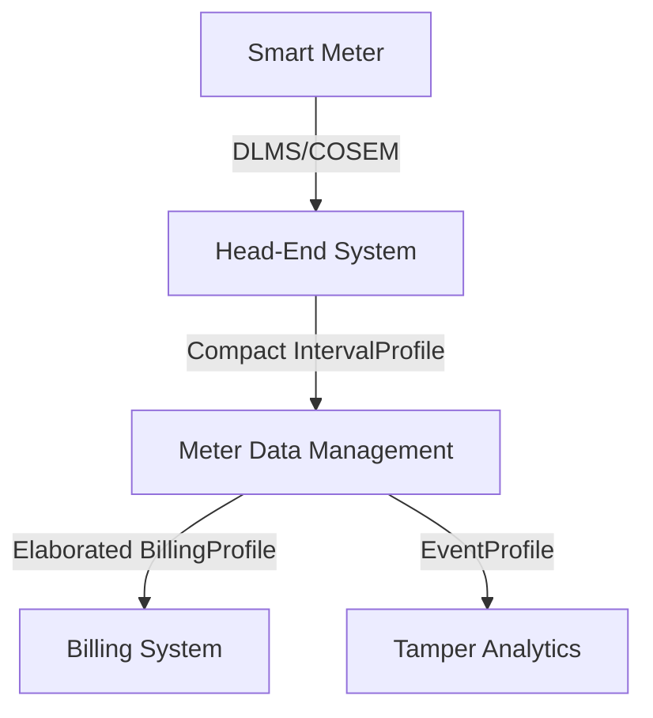

# MeterData v0.6 User Guide

This user guide explains how to design, exchange, and process `MeterData` v0.6 payloads within modern utility architectures, including Head-End Systems (HES), Meter Data Management (MDM) platforms, and Billing systems.

---

## 1. Architectural Roles & Telemetry Exchange

In standard smart metering infrastructure, data flows from the physical meters up to business applications. The `MeterData` schema maps cleanly to each interface:

### A. Head-End System (HES) to MDM
- **Use Case**: Periodic collection of daily load profiles or raw 15-minute load survey intervals.
- **Recommended Profile**: `IntervalProfile` or `DailyProfile` using **Form B (Compact Matrix)**.
- **Why**: Head-End systems handle millions of meters. Emitting compact arrays of numbers with a single shared descriptor set minimises server network ingress, compression overhead, and database insertion time.

### B. MDM to Billing System
- **Use Case**: Handing off the monthly billing determinants (active/apparent energy, peak demand, Time-of-Use buckets) to generate customer bills.
- **Recommended Profile**: `BillingProfile` using **Form A (Elaborated)**.
- **Why**: Billing systems process records sporadically (once a month per customer). Clarity, auditability, and validation state are paramount. Utilizing Elaborated representations with explicit modes (`READING` vs `USAGE`) and mathematical proofs (`openingValue` / `closingValue`) prevents billing errors and maintains an auditable trail.

---

## 2. Integration Guidelines by Profile Type

### A. Implementing Block Load Surveys (HES / MDM)
When representing high-frequency load surveys (e.g. 15-minute intervals), use `IntervalProfile` with block incremental codes (`1.0.1.29.0.255`):
- Map the code to `reportedMode: "USAGE"` in the compact sequence.
- Ensure that the intervals are sequential by validating their `id`.
- The duration (e.g., `PT15M`) must be declared in `intervalPeriod.duration`.

### B. Implementing Monthly Billing determinant handoffs
When mapping a billing handoff:
1. Include the cumulative energy reading at the start and end of the billing period in `readings` using `reportedMode: "READING"`.
2. Include the usage reading (total consumption delta) with `reportedMode: "USAGE"` and populate the `openingValue` and `closingValue` properties so billing calculators can verify the calculation.
3. For Maximum Demand registers, use `reportedMode: "USAGE"`, specify the `integrationPeriod` (typically `PT30M`), and provide the peak timestamp in `occurredAt`.

### C. Processing Tamper Events
 Tamper and diagnostic events (e.g. cover open, magnetic influence) must be reported using the `EventProfile`.
- Use the standard IS 15959 event codes in `eventId`.
- Do not transmit empty telemetry blocks in an Event profile; the `events` array should only contain diagnosed instances with precise timestamps.
