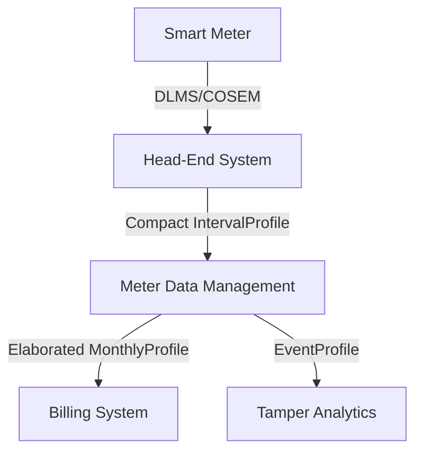

# MeterData v0.6 User Guide

This user guide explains how to design, exchange, and process `MeterData` v0.6 payloads within modern utility architectures, including Head-End Systems (HES), Meter Data Management (MDM) platforms, and Billing systems.

---

## 1. Architectural Roles & Telemetry Exchange

In standard smart metering infrastructure, data flows from the physical meters up to business applications. The `MeterData` schema maps to each interface:



### A. Head-End System (HES) to MDM
- **Use Case**: Periodic collection of daily load profiles or raw 15-minute load survey intervals.
- **Recommended Profile**: [`IntervalProfile`](./examples/IntervalProfile.json) or [`DailyProfile`](./examples/DailyProfile.json) using **Form B (Compact Matrix)**.
- **Why**: Head-End systems handle millions of meters. Emitting compact arrays of numbers with a single shared descriptor set minimises network ingress, compression overhead, and database insertion time.

### B. MDM to Billing System / CIS
- **Use Case**: Handing off the monthly billing determinants (active/apparent energy, peak demand, Time-of-Use buckets) to generate customer bills.
- **Recommended Profile**: [`MonthlyProfile`](./examples/MonthlyProfile.json) or [`MDM_MonthlyProfile`](./examples/MDM_MonthlyProfile.json) using **Form A (Elaborated)**.
- **Why**: Billing systems process records once a month per customer. Clarity, auditability, and validation state are critical. Utilizing Elaborated representations with explicit modes (`USAGE` mode for energy delta readings) and mathematical proofs (`openingValue` / `closingValue`) prevents billing errors and maintains an auditable trail.

### C. Billing / CIS to Consumer Applications
- **Use Case**: Presenting computed billing details, prepaid balances, and historical consumption summaries to customer portals or mobile apps.
- **Recommended Profile**: [`BillDetails`](./examples/BillDetails.json) (often referred to as commercial billing profile details) or [`CustomerBillingSummary`](./examples/CustomerBillingSummary.json).

---

## 2. Capability Advertisement with `MeterDataRequest`

To establish a contract of what telemetry data can be shared or requested, systems use the [`MeterDataRequest`](../../MeterDataRequest/v0.5/README.md) schema.

* **Capability Advertising**: A Data Provider (BPP, such as an MDM or HES) advertises the profile types, cadences, and OBIS registries it supports by publishing query allowance templates.
  * For example, the BPP can publish a capability profile for billing determinants ([`MeterDataRequest_Billing_Capability.json`](../../MeterDataRequest/v0.5/examples/MeterDataRequest_Billing_Capability.json)) or load survey limits ([`MeterDataRequest_MDM_Capability.json`](../../MeterDataRequest/v0.5/examples/MeterDataRequest_MDM_Capability.json)).
* **Precise Scoping**: Data Consumers query BPP data exchange nodes with a matching request specifying target meters, parameters, and time ranges. This ensures access control is enforced based on consent policies.

---

## 3. Integration Guidelines and Key Scenarios

### Scenario A: Periodic Load Surveys (HES / MDM)
For high-frequency load surveys (e.g. 15-minute intervals), use [`IntervalProfile`](./examples/IntervalProfile.json) with block incremental codes:
- Map the code to `reportedMode: "USAGE"` in the compact sequence.
- Ensure that the intervals are sequential by validating their `id`.
- The duration (e.g., `PT30M`) is declared in `intervalPeriod.duration`.

### Scenario B: Monthly Billing Determinant Handoff (MDM to Billing)
When mapping a billing handoff:
1. Include the cumulative energy usage reading with `reportedMode: "USAGE"` in [`MonthlyProfile`](./examples/MonthlyProfile.json) and populate the `openingValue` and `closingValue` properties so billing calculators can verify the calculation.
2. For Maximum Demand registers, use `reportedMode: "USAGE"`, specify the `integrationPeriod` (typically `PT30M`), and provide the peak timestamp in `occurredAt`.
3. Highlight multiple resets or ad-hoc demand clears occurring within the same month using [`MonthlyProfile_MultipleResets.json`](./examples/MonthlyProfile_MultipleResets.json).

### Scenario C: Meter Swaps & Replacements Mid-Cycle
When a physical meter is changed during a billing period:
1. Generate two [`MonthlyProfile`](./examples/MonthlyProfile.json) records within the dataset – one containing the final readings of the old meter serial number, and one containing the initial readings of the new meter serial.
2. Link them together under the consumer account reference in a single payload.
3. *See the [`Billing_MeterChange.json`](./examples/Billing_MeterChange.json) example for structural implementation.*

### Scenario D: Tamper and Diagnostic Logs
Tamper and diagnostic events (e.g. cover open, magnetic influence) are reported using the [`EventProfile`](./examples/EventProfile.json).
- Use the standard IS 15959 event codes in `eventId`.
- Do not transmit empty telemetry blocks in an Event profile; the `events` array should only contain diagnosed instances with precise timestamps.

---

## 4. Quality Indications & Validation

For all profile shapes, verifying data quality and formatting before ingestion is recommended.

### Encouraging the Validator
The India Energy Stack provides a validator tool located at `validation/validate_v06.py`. Developers and system administrators are encouraged to integrate this validator into their ingestion pipelines (e.g., as a CI step or pre-write database trigger) to assert both schema compliance and semantic constraints (e.g., validating usage calculation math and ensuring `openingValue`/`closingValue` are never attached to `READING` mode profiles).

Run the validator on your payload files:
```bash
python validation/validate_v06.py <path_to_payload.json>
```
