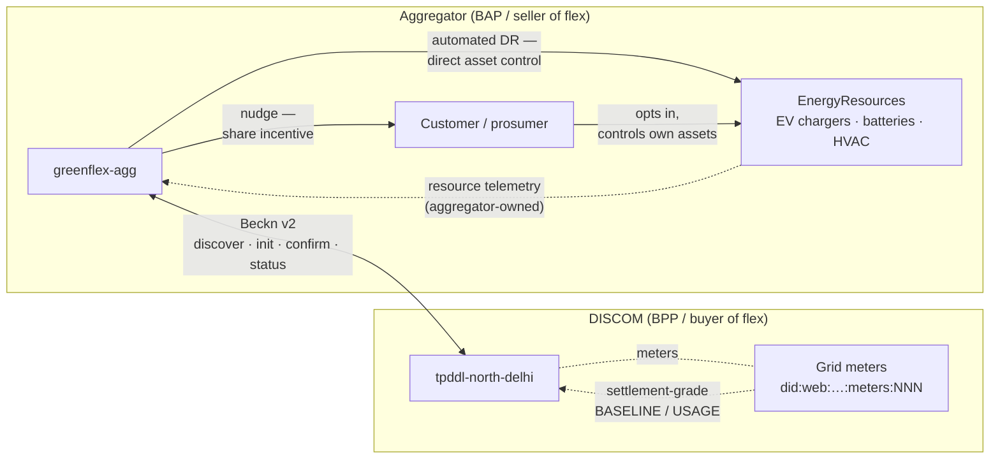
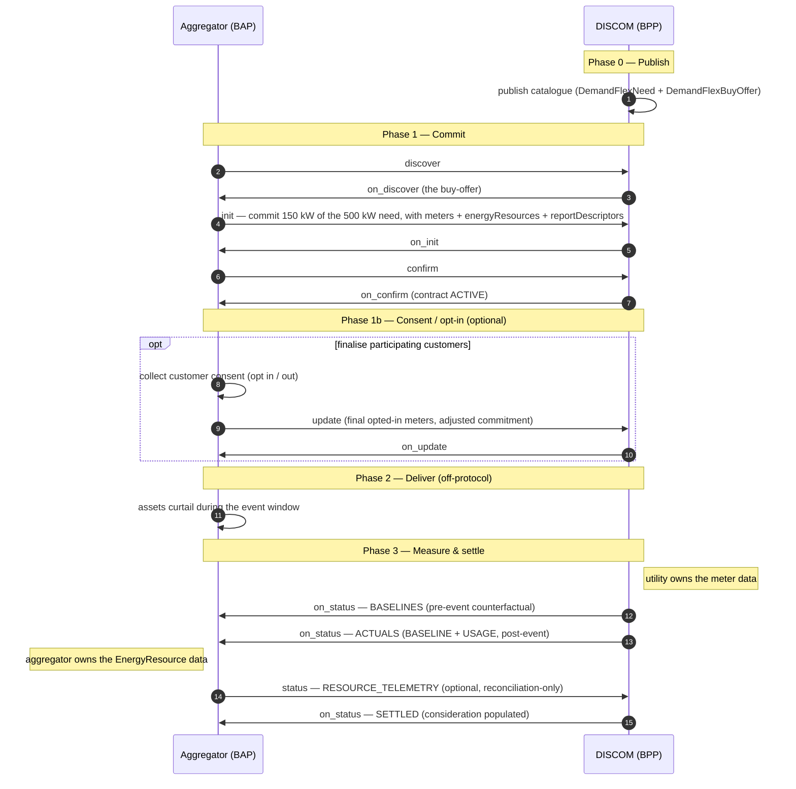

# Demand Flexibility

**In a hurry?** Jump to the [Checklist](#checklist).

> **Status — work in progress.** The `uc1` (fixed-incentive) flow is stable in the devkit and safe to integrate against. The `uc2` pay-as-clear auction variant and a few schema slots are still settling — see [Open items](#open-items).

**A distribution utility (DISCOM) needs to shave a peak. Instead of building more wires, it publishes a *flexibility need* — "give me 500 kW of curtailment between 2 and 4 pm" — and an aggregator commits a fleet of behind-the-meter assets (EV chargers, batteries, smart HVAC) to deliver it. After the event the utility measures what actually happened on its own grid meters, and a signed policy computes who gets paid. That whole conversation — publish, discover, commit, measure, settle — is one Beckn v2 transaction.**

Demand Flexibility is a **full Beckn transaction use case**, not a dataset push. It uses the complete lifecycle (`discover` → `init` → `confirm` → optional `update` → `status`), the ONIX adapter, DeDi registry-resolution, signing, and policy-as-code — the same stack as the rest of DEG. What is specific to this use case is a small **schema family** (a need, a buy-offer, a performance report) and **two signed Rego bundles** (one that validates telemetry shape on the wire, one that computes settlement). If you have any other DEG/IES Beckn flow working, you already have the transport; this page is the payload, the actors, and the settlement logic on top.

The reference implementation is the [`demand-flex` devkit](https://github.com/beckn/DEG/tree/main/devkits/demand-flex) in the DEG repo.

---

## A note on roles before you start

The single most common point of confusion: **the Beckn role and the commercial role are crossed.**

- The **utility (DISCOM)** is the **BPP / provider** — it publishes the catalogue. But commercially it is the **buyer of flexibility** (it pays for curtailment).
- The **aggregator** is the **BAP / consumer** — it discovers the offer. But commercially it is the **seller of flexibility** (it gets paid).

So the utility publishes a **`DemandFlexBuyOffer`** ("I will buy curtailment at ₹3.5/kWh"), and the aggregator "consumes" that offer by committing capacity. Keep `BAP/BPP` (wire direction) and `buyer/seller` (money direction) separate in your head and the rest follows.

---

## Scenario

**TPDDL** (Tata Power Delhi Distribution) publishes a 500 kW curtailment need for a peak window. **GreenFlex Aggregator** discovers it, enrols the grid meters it controls — each with one or more EnergyResources (EV chargers in the examples) sitting behind it — and commits **150 kW** of demand reduction. After the event TPDDL publishes per-meter baselines, the measured actuals, and (optionally) per-resource telemetry, then settles:

> 150 kWh delivered × ₹3.5/kWh = **₹525**.

Two principles hold the use case together:

- **Settlement is utility-only.** Revenue is computed *only* against the DISCOM's own grid-meter measurements (`BASELINE` and `USAGE` per interval). The aggregator's resource telemetry never feeds the money.
- **Resource telemetry is reconciliation-only.** The aggregator owns the EnergyResource data (fed from OEM / vendor APIs — Tata EVP Telematics, MG iMotion) and *may* push it to the utility via `status` as a *separate* performance record — per-asset proof-of-performance like EV state-of-charge and GPS. It lets anomalous meter readings be cross-checked after the fact, but the settlement Rego is hard-wired to ignore it. Note the ownership split: meter telemetry flows utility→aggregator (`on_status`); resource telemetry flows aggregator→utility (`status`).

---

## Actors and roles

| Beckn role | Commercial role | Who | participantId in the devkit |
|---|---|---|---|
| **BPP** (provider) | **Buyer** of flexibility | DISCOM / utility — publishes needs & buy-offers, measures, settles | `tpddl-north-delhi` (subscriber `bpp.example.com`) |
| **BAP** (consumer) | **Seller** of flexibility | Aggregator — discovers, commits a fleet, delivers, reports | `greenflex-agg` (subscriber `bap.example.com`) |
| referenced asset | — | **Grid meter** — DISCOM-metered point; the settlement measurement boundary | `did:web:tpddl.delhi.gov.in:meters:001` |
| referenced asset | — | **EnergyResource** — behind-the-meter flexible asset, attached to a meter via `parentResources[]` | `did:web:tatamotors.com:vin:VIN001` (Tata EV), `did:web:mgmotor.co.in:vin:VIN002` (MG EV) |

Meters and resources are not Beckn participants — they are `did:web` identifiers *referenced inside* the contract, the same convention used across IES (see [SMDX § the did:web convention](../smart-meter-data-exchange/README.md)).

---

## Block diagram



One BAP, one BPP, one Beckn conversation. The aggregator delivers the curtailment one of two ways: **automated demand response** — it controls the enrolled assets directly (e.g. throttling EV chargers over a vendor API) — or **customer-nudged** — it passes the incentive through to the customer, who chooses to opt in and curtails their own assets. The protocol is identical either way; the difference is only in how the kilowatts get shed behind the meter. The utility is the source of truth for settlement; the aggregator is the source of truth for resource-level reconciliation. The two never mix in the money.

---

## Building blocks used

| Block | Role in this use case |
|---|---|
| [Identifiers and Addressing](../../identifiers/README.md) | Both participants are `did:web` subscribers. Meters and EnergyResources are `did:web` identifiers referenced inside the contract (`did:web:tpddl.delhi.gov.in:meters:001`, `did:web:tatamotors.com:vin:VIN001`). |
| [Registries and Directories](../../registries/README.md) | The utility and aggregator resolve each other's keys through any DeDi runtime on the `nfh.global/testnet-deg` network. |
| [Data Exchange](../../data-exchange/README.md) | The same Beckn + ONIX wire. Demand Flexibility carries a `DEGContract` **inline** in `message.contract` — it does **not** use the DDM `DatasetItem` envelope or the `MeterData` schema. |
| [Energy Credentials](../../energy-credentials/README.md) | (Optional) the aggregator's enrolled meters and DER assets can be backed by an [`ElectricityCredential`](../../schemas/ElectricityCredential/README.md). |

---

## The payload: a need, an offer, a performance report

Everything rides inside the Beckn `message.contract` block. The use-case-specific schemas, all published at `schema.beckn.io`:

| Schema | Where it sits | What it carries |
|---|---|---|
| [`DemandFlexNeed`](https://schema.beckn.io/DemandFlexNeed/) | `commitments[].resources[].resourceAttributes` | The need: `direction` (`REDUCE`), `capacityType` (`CURTAILMENT`), `eventWindow` (start/end), `maxCapacityKw`. |
| [`DemandFlexBuyOffer`](https://schema.beckn.io/DemandFlexBuyOffer/) | `commitments[].offer.offerAttributes` | Two input blocks. **Buyer** (utility): `incentivePerKwh`, `baselineMethodology` (`bestOf`/`outOf`), `penaltyRate`. **Seller** (aggregator): `participatingMeters[]`, `energyResources[]`, `reportDescriptors[]`, `plannedDemandChange`. |
| [`EnergyResource`](https://schema.beckn.io/EnergyResource/) | inside the seller's `energyResources[]` | Technology-neutral asset: `resourceId`, `resourceType` (`EV_CHARGER`…), `make`, `model`, `ratedPowerKw`, `energyCapacityKwh`, `parentResources[]` (the meter it sits behind). Reusable across DEG. |
| [`BecknReportDescriptors`](https://schema.beckn.io/BecknReportDescriptors/) | seller's `reportDescriptors[]` | OpenADR3-aligned commitments of *what telemetry the seller will report*: `payloadType` + `cardinality` (`PER_INTERVAL` / `PER_EVENT`) + `units`. |
| [`DemandFlexPerformance`](https://schema.beckn.io/DemandFlexPerformance/) | `performance[].performanceAttributes` | The measurement & verification record: `eventId`, `methodology`, and `meters[]` each carrying a `BecknTimeSeries`. One record per report type (baselines, actuals, telemetry, settled). |
| [`BecknTimeSeries`](https://schema.beckn.io/BecknTimeSeries/) | inside each meter's `telemetry`, and (uc2) `commitmentAttributes` | `intervalPeriod` (start + ISO-8601 duration), `payloadDescriptors[]`, and `intervals[]` with `payloads[]` (`type` + `values[]`). |
| [`DEGContract`](https://schema.beckn.io/DEGContract/) | `contractAttributes` | The envelope: `roles[]` (`buyer` → utility, `seller` → aggregator), and the `policy` (`url` + `queryPath`) that computes settlement. |
| [`SettlementTerm`](https://schema.beckn.io/SettlementTerm/) | `consideration[].considerationAttributes` | The money: `amount`, `settlementStatus`, `paymentTrigger`, `payTo`. Populated when the contract reaches `SETTLED`. |

Optional, for scale: [`BecknPageInfo`](https://schema.beckn.io/BecknPageInfo/) (paginate `meters[]` across messages) and [`BecknResourceRef`](https://schema.beckn.io/BecknResourceRef/) (deliver a bulk meter cohort off-protocol, content-addressed by `sha256`). See [Going bigger](#going-bigger-thousands-of-meters).

---

## The lifecycle

The utility (BPP) publishes a catalogue of flexibility needs; the aggregator (BAP) discovers it and commits directly via `init` → `confirm`. The novel part is what happens *after* `confirm`: the contract is alive but unfulfilled, and measurement data arrives as a sequence of performance records — the utility pushing meter reports (`on_status`), the aggregator pushing its resource report (`status`).



### Consent and opt-in (optional)

`confirm` commits the contract, but the *final* set of participating customers is often not settled until the aggregator has asked them. Between `confirm` and the event, the aggregator can run a consent round — letting customers behind each meter opt in or out — and then reflect the outcome with a Beckn **`update`**. The update carries the finalised `participatingMeters[]` and an adjusted `plannedDemandChange`; the utility acknowledges with `on_update`. In the devkit's [`update-request-opt-in.json`](https://github.com/beckn/DEG/blob/main/devkits/demand-flex/uc1-bdr-w-baselining/examples/update-request-opt-in.json) the aggregator opts meter `003` in and revises the commitment to 120 kW. The default stance — whether silence means in or out — is governed by `optOutDefault` on the buy-offer. This step is optional: skip it and the contract proceeds with the meters named at `confirm`.

### The `on_status` report sequence

A single event produces **several** performance records, each distinguished by its `methodology` and status code. Three are utility-owned meter reports the BPP pushes to the BAP (`on_status`); one is the aggregator-owned resource report the BAP pushes to the BPP (`status`). Read them as a timeline:

| Order | Report | Direction | `methodology` | Payloads | What it means |
|---|---|---|---|---|---|
| 1 | **Baselines** | utility → aggregator (`on_status`) | `5of10` | `BASELINE` per meter/interval | The counterfactual — what these meters *would* have consumed absent the event. Utility-computed, pre-event. |
| 2 | **Actuals** | utility → aggregator (`on_status`) | `5of10` | `BASELINE` + `USAGE` | What actually happened on the grid meters after the window closed. The settlement input. |
| 3 | **Resource telemetry** | aggregator → utility (`status`) | `RESOURCE_TELEMETRY` | `USAGE`/`SOC_END` per interval, `GPS_LAT`/`GPS_LON` once | Per-asset proof-of-performance the aggregator owns (from OEM/vendor APIs). **Excluded from settlement.** Optional. |
| 4 | **Settled** | utility → aggregator (`on_status`) | `5of10` | same as actuals | Final. `consideration` carries the computed `SettlementTerm`. |

Delivered flexibility per interval is `max(0, BASELINE − USAGE)`; summed across meters and intervals and multiplied by `incentivePerKwh` it gives the payable amount.

> **Why the split matters.** The settlement Rego selects the first `performance` record whose `methodology` is **not** `RESOURCE_TELEMETRY`. If a payload somehow carries *only* resource telemetry, the Rego refuses to settle and raises an explicit violation rather than quietly paying out against unverified vendor data. Baselines are utility-only and never appear in resource telemetry at all.

---

## An incremental path to understanding

You do not need the whole thing at once. Each rung adds exactly one concept; the devkit ships fixtures for every step.

**Rung 1 — fixed-incentive, grid meters only.** Run `uc1` with the three example meters. Walk `discover → init → confirm`, then receive `baselines → actuals → settled`. You now understand the contract envelope, `DemandFlexNeed`/`BuyOffer`, and the `BASELINE − USAGE` settlement math. Nothing about resources yet.

**Rung 2 — add EnergyResources.** Put `energyResources[]` and `reportDescriptors[]` in your `confirm`, and consume the extra `RESOURCE_TELEMETRY` `on_status`. Confirm for yourself that settlement is byte-for-byte identical — the telemetry is decorative to the money. This is where `PER_INTERVAL` vs `PER_EVENT` cardinality (below) starts to matter.

**Rung 3 — go to scale.** Swap the three inline meters for a 12,000-meter cohort delivered via `participatingMetersRef`, and receive actuals paged across multiple `on_status` messages with `BecknPageInfo`. Learn that settlement only fires when `pageInfo.isLast` is true. (See [Going bigger](#going-bigger-thousands-of-meters).)

**Rung 4 — the auction (`uc2`, WIP).** Replace the fixed incentive with **pay-as-clear** price discovery: the aggregator submits a step-wise bid curve (`BID_PRICE`/`BID_POWER` pairs) at `confirm`, the utility clears at a published `clearingTime` and returns `CLEARED_POWER`/`CLEARING_PRICE` in `on_confirm`. Settlement becomes `min(delivered, cleared) × clearing_price`. Same lifecycle, richer offer and a second settlement Rego.

---

## Pay-as-clear in one paragraph (`uc2`)

`uc2-bid-curve-pac` keeps the entire `uc1` lifecycle and changes only the price mechanism. The utility's offer carries `clearingMethod: PAY-AS-CLEAR` and a `clearingTime` instead of a fixed `incentivePerKwh`. At `confirm` the aggregator attaches a `BecknTimeSeries` in `commitmentAttributes` with parallel `BID_PRICE` (INR/kWh) and `BID_POWER` (kW) arrays per interval — a step curve. The utility clears the market and returns the same series extended with `CLEARED_POWER` and `CLEARING_PRICE`. Worked example from the fixtures: bidding `[₹1.5@90kW, ₹2.5@70kW, ₹3.5@50kW, ₹5.0@30kW]` clears at ₹3.5 for 50 kW; over the two intervals the aggregator delivers 50 + 45 kWh and settles at `95 × ₹3.5 = ₹332.5`.

---

## Going bigger: thousands of meters

The example fixtures carry three meters; real DR programs span thousands. Pagination kicks in at two points, both optional and both backward-compatible (absence of the pagination fields means "this message is self-contained"):

| Where | Inline is fine up to | Above that |
|---|---|---|
| **Enrolment** (`participatingMeters[]` at confirm) | ~10k meters | Replace with `participatingMetersRef` ([`BecknResourceRef`](https://schema.beckn.io/BecknResourceRef/)) + a `sha256` digest so the cohort stays auditable after the URL expires. Offers are bound at confirm, so this can't span messages. |
| **Reporting** (`performanceAttributes.meters[]` on `on_status`) | ~10k meters | Either **page inline** — split across `on_status` messages, each carrying `pageInfo` ([`BecknPageInfo`](https://schema.beckn.io/BecknPageInfo/)); settle only on `isLast: true` — or ship `metersRef` off-protocol. Both **push** (BPP fires N pages) and **pull** (BAP requests pages by cursor) are supported. |

The network Rego validates each page in isolation; settlement runs against the assembled view.

---

## Policy-as-code (Rego / OPA)

Two distinct bundles, evaluable offline by any participant — see [Tariff Intelligence](../tariff-intelligence/README.md) for the general pattern of publishing signed Rego on DeDi.

### Network policy — does this telemetry even parse?

[`demand_flex_network.rego`](https://github.com/beckn/DEG/blob/main/devkits/demand-flex/policies/demand_flex_network.rego) runs in the ONIX `opapolicychecker` on every message and NACKs on any violation:

| Check | What it enforces |
|---|---|
| **Type-coverage** | Every `payloadType` used in `intervals[].payloads[].type` is declared in the meter's `payloadDescriptors`. (Catches `BASELIN` typos.) |
| **`PER_INTERVAL` cardinality** | Types like `BASELINE`/`USAGE`/`SOC_END` appear in **every** interval of any meter that declares them. |
| **`PER_EVENT` cardinality** | Types like `GPS_LAT`/`GPS_LON` appear in **exactly one** interval. |

It self-skips cleanly when there are no `reportDescriptors` on the wire (e.g. a baseline-only push), so plain traffic passes transparently.

### Settlement policy — who gets paid?

Referenced per-contract via `contractAttributes.policy.url` + `queryPath`:

- **`uc1`** — [`demand_flex_revenue.rego`](https://github.com/beckn/DEG/blob/main/specification/policies/demand_flex_revenue.rego), query `data.deg.contracts.demand_flex`. Computes `Σ max(0, BASELINE − USAGE) × incentivePerKwh` as a net-zero *buyer pays / seller receives* flow, **skipping** any `RESOURCE_TELEMETRY` record.
- **`uc2`** — `demand_flex_pac_revenue.rego`, query `data.deg.contracts.demand_flex_pac`. Caps delivered flex at `CLEARED_POWER` per interval and multiplies by the per-interval `CLEARING_PRICE`.

The result lands in `consideration[].considerationAttributes` as a signed `SettlementTerm`. Change the rule set by publishing a new signed bundle on DeDi and bumping the `policyUrl` on the next contract — no code redeploy.

---

## Setup steps

Assumes Docker and a clone of the DEG repo. The stack is the shared DEG devkit topology (one BAP-side ONIX + sandbox, one BPP-side ONIX + sandbox, bridged by a Caddy `beckn-router`); full background is the [DEG devkits README](https://github.com/beckn/DEG/tree/main/devkits).

### 1. Stand up the devkit

```bash
git clone https://github.com/beckn/DEG
cd DEG/devkits/demand-flex/install
docker compose up -d
```

This brings up `onix-bap` + `sandbox-bap`, `onix-bpp` + `sandbox-bpp`, two Redis caches, and the `beckn-router` (Caddy) on `:9000`. The BPP sandbox serves the `uc1` response fixtures by default; point `RESPONSES_DIR` at `../uc2-bid-curve-pac/responses` to run the pay-as-clear variant.

### 2. Drive the flow

**Postman** — import the role you are integrating from [`uc1-bdr-w-baselining/postman/`](https://github.com/beckn/DEG/tree/main/devkits/demand-flex/uc1-bdr-w-baselining/postman): `…BUYER-DEG…` is the utility, `…SELLER-DEG…` is the aggregator. Fire `discover → init → confirm → status`.

**Arazzo** — the end-to-end workflow is scripted:

```bash
export PUBLIC_URL=http://beckn-router:9000   # strictly-local mode
cd DEG/devkits/demand-flex/uc1-bdr-w-baselining/workflows
./run-arazzo.sh        # discover → init → confirm → baselines → actuals → telemetry → settled
```

### 3. Swap in your real identity

Register your utility or aggregator as a DeDi subscriber on the target network, point the ONIX `allowedNetworkIDs` / `networkParticipant` / `keyId` at it, and replace the sandbox container with your application. (The shipped fixtures use placeholder subscribers `bap.example.com` / `bpp.example.com`, so live flows NACK on lookup until you register real ones.)

### 4. Map your application to a role

| If you are a … | You implement | Talks to |
|---|---|---|
| **DISCOM / utility** | A BPP that publishes needs, computes baselines/actuals, and runs the settlement Rego | The aggregator (BAP) over `discover…status` |
| **Aggregator** | A BAP that discovers, commits a fleet, and (optionally) reports resource telemetry | The utility (BPP) |

---

## Operate

- **Watch the conversation** — `docker compose logs -f onix-bap onix-bpp` shows each leg; NACKs from the network Rego name the failing `payloadType` / cardinality rule.
- **Verify settlement** — the final `on_status` carries `consideration[].considerationAttributes.settlementStatus: SETTLED` and the computed `amount`. Re-run the settlement Rego locally with OPA against the assembled performance record to reproduce the number.
- **Regenerate Postman** after editing example payloads: `python3 scripts/generate_postman_collection.py --role BUYER|SELLER` (or `--all`).

---

## Open items

> Plan against the stable parts; these do not block `uc1` integration.

- **`uc2` pay-as-clear** — lifecycle and fixtures exist but the clearing semantics and `demand_flex_pac_revenue.rego` are still being finalised.
- **Live subscribers** — the devkit ships placeholder identities and borrowed signing keys; real `testnet-deg` registration is pending.
- **Penalty / premium flows** — `penaltyRate` and `premiumForGuaranteed` are carried on the offer but not yet wired into the settlement Rego.
- **Schema versions** — the `DemandFlex*` family is `v2.0` and the `Beckn*` time-series/report/page schemas `v1.0`; treat as current-draft until published as stable on `schema.beckn.io`.

---

## Checklist

> **Work in progress.** Role: ☐ DISCOM (BPP) ☐ Aggregator (BAP).

**1. Network identity** — reuse an existing Beckn identity or follow [Data Exchange → network identity](../../data-exchange/README.md).

- [ ] DeDi subscriber record on the right network namespace
- [ ] Signing key in a secrets manager, never in config

**2. Devkit running end-to-end** — prove the lifecycle before integrating real systems.

- [ ] `devkits/demand-flex/install` up and healthy
- [ ] Role Postman collection: `discover → init → confirm → status` completes
- [ ] All four `on_status` reports (baselines, actuals, telemetry, settled) received and parsed

**3. Schemas mapped** to the DEG family.

- [ ] [`DemandFlexNeed`](https://schema.beckn.io/DemandFlexNeed/) + [`DemandFlexBuyOffer`](https://schema.beckn.io/DemandFlexBuyOffer/) for your catalogue / commitment
- [ ] [`DemandFlexPerformance`](https://schema.beckn.io/DemandFlexPerformance/) + [`BecknTimeSeries`](https://schema.beckn.io/BecknTimeSeries/) for your meter telemetry
- [ ] (aggregator) [`EnergyResource`](https://schema.beckn.io/EnergyResource/) + [`BecknReportDescriptors`](https://schema.beckn.io/BecknReportDescriptors/) if you report resource telemetry

**4. Policy bundles resolved** — both evaluable offline.

- [ ] Network Rego rejects malformed telemetry (wrong cardinality, undeclared `payloadType`)
- [ ] Settlement Rego reproduces the payable amount from `BASELINE`/`USAGE`; `RESOURCE_TELEMETRY` confirmed excluded

**5. Scale (if applicable)** — pagination wired.

- [ ] `participatingMetersRef` + digest for large cohorts; `pageInfo` reassembly; settle only on `isLast`

**6. Production cut-over** — HTTPS live; keys in a secrets manager; one real event measured and settled; runbook for disputes and bundle upgrades.

**7. Team.** [ ] Grid-ops / DR-program SPOC · [ ] Settlement SPOC · [ ] Authorised Signatory

---

## References

- [DEG devkit — `demand-flex`](https://github.com/beckn/DEG/tree/main/devkits/demand-flex) — code, examples, Postman, Arazzo workflows
- [Demand Flexibility implementation guide](https://github.com/beckn/DEG/blob/main/docs/implementation-guides/v2/Demand_Flexibility/Demand_Flexibility.md) — detailed protocol flows and schema mappings
- [`demand_flex_network.rego`](https://github.com/beckn/DEG/blob/main/devkits/demand-flex/policies/demand_flex_network.rego) · [`demand_flex_revenue.rego`](https://github.com/beckn/DEG/blob/main/specification/policies/demand_flex_revenue.rego) — the two Rego bundles
- [Schemas on `schema.beckn.io`](https://schema.beckn.io/) — `DemandFlexNeed`, `DemandFlexBuyOffer`, `DemandFlexPerformance`, `EnergyResource`, `BecknTimeSeries`, `BecknReportDescriptors`, `BecknPageInfo`, `BecknResourceRef`, `DEGContract`, `SettlementTerm`
- [Data Exchange](../../data-exchange/README.md) — the shared Beckn + ONIX wire this use case builds on
