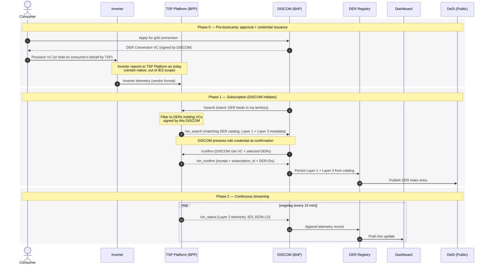

# DER Visibility

**A standard, credential-gated way for a DISCOM to discover the Distributed Energy Resources (DERs) connected on its network — rooftop solar, batteries, V2G chargers — and subscribe to a continuous, near-real-time stream of their grid-connection profile, operational telemetry, and grid-behavioural settings, sourced from the inverter or its Technology Service Provider (TSP) platform.**

---

## Scenario

India has 23+ GW of grid-connected rooftop solar and a fast-growing fleet of behind-the-meter batteries and V2G-capable EVs. **DISCOMs cannot see them.** Generation meters are absent from the vast majority of residential installations; the only practical source of generation data is the inverter or its vendor cloud (the "TSP platform"). DISCOMs receive a monthly net-export reading at the customer meter and nothing else: no real-time generation, no protection settings, no ride-through capability, no aggregate IBR behaviour by feeder.

This blind spot has two costs. **Commercial** — DISCOMs over-procure during solar hours, cannot enrol DERs in flexibility markets, cannot settle P2P or VPP transactions, and report DER statistics to SERCs by spreadsheet. **Operational / grid-safety** — without protection-setting and grid-support visibility, DISCOMs cannot model how the IBR fleet will behave during a frequency or voltage excursion. The April 2025 Iberian blackout — where individually-correct anti-islanding behaviour produced catastrophically wrong collective behaviour — is the precedent the Indian fleet is one disturbance away from repeating.

DER Visibility closes the gap by **leveraging the existing IES building blocks** rather than inventing a new vertical stack:

- The grid-connection approval the DISCOM already issues becomes a signed **DER Connection Credential** — the VC that authorises a TSP / inverter to publish telemetry for that DER.
- The DISCOM discovers DERs in its territory by **subscribing through the IES Data Exchange protocol** — `search` → `on_search` → `confirm` → `on_confirm`, with `on_status` carrying 15-minute telemetry. The TSP platform is the BPP; the DISCOM is the BAP. No new protocol surface.
- The DISCOM's federated **DER Registry** persists Layer 1 + Layer 3 records signed by the registering platform, publishes an anonymised index entry to the **DeDi public registry** for cross-DISCOM lookup, and pushes live Layer 2 updates to internal dashboards.

The architecture is consistent with the [DER Visibility Concept Note](../../README.md) six positions: dynamic registration via API, registration only on injection, both static and dynamic resources first-class, federated by design, profile-centric, and grid-safety data as a non-optional layer.

---

## Actors and Roles

| Role | Organisation (example) | What they do |
|---|---|---|
| **Consumer** | Rooftop solar / BESS / V2G owner | Applies for grid connection; authorises a TSP to operate / report for their DER; holds the DER Connection VC (typically in a wallet or held on their behalf by the TSP) |
| **Issuer** | DISCOM | Issues the **DER Connection Credential** after grid-connection approval; runs the federated **DER Registry**; acts as **BAP** for DER discovery and telemetry subscription |
| **BPP — data provider** | Inverter OEM / TSP platform (e.g. SolarEdge cloud, MNRE M2M aggregator, OEM cloud, third-party VPP) | Operates the inverter-side data plane; publishes a catalogue of DERs whose Connection VCs were signed by the requesting DISCOM; emits Layer 2 telemetry on `on_status` |
| **Optional BAP — secondary consumer** | SERC, MNRE, planner, aggregator, research org | Subscribes to the same `IES_DER` feeds for regulatory reporting, scheme verification, or flexibility-market enrolment, gated by the appropriate role credential |
| **Public index** | DeDi (`indiaenergystack.in` namespace) | Carries an **anonymised** DER index entry per registered connection — DER-ID, DISCOM-ID, resource type, capacity bucket, feeder reference — so any IES participant can answer "is there a DER here, and which DISCOM owns the record" without consumer identity leaking |

The protocol is symmetric — the same surface area supports TSP → DISCOM, DISCOM → SERC, DISCOM → MNRE, and DISCOM → consented aggregator flows.

---

## Building Blocks Used

| Block | Role in this use case |
|---|---|
| [Identifiers](../../identifiers/README.md) | Every DER, connection point, inverter, DT, feeder and substation is referenced by an IES identifier. The `connectionPointID` is the anchor for the connection profile; the `derID` is the anchor for the device-or-aggregate record. The TSP, DISCOM, and any secondary consumer each have a `did:web`. |
| [Registries](../../registries/README.md) | The DISCOM is resolved via the [IES DISCOMs Reference Registry](../../registries/required-registries.md#discoms-registry). The TSP is resolved via a new **IES TSP / DER Platform Registry** (see [Open Items](#open-items)). The **DER Registry** is the DISCOM-federated registry persisting Layer 1 + Layer 3; an anonymised public index lives in DeDi. |
| [Energy Credentials](../../energy-credentials/README.md) | The **DER Connection Credential** is a new credential type issued by the DISCOM at grid-connection approval, signed by the same OpenCred service the DISCOM already runs for `CustomerCredential` and the [Consumer Energy Passport](../consumer-energy-passport/README.md). It is the proof-of-right a TSP presents when registering a DER feed against a DISCOM, and the basis on which `on_search` filters its catalogue. |
| [Data Exchange](../../data-exchange/README.md) | The Beckn-based protocol carries the discovery (`search` / `on_search`), subscription (`confirm` / `on_confirm`), and 15-minute streaming (`on_status`) traffic from TSP to DISCOM. The dataset is `IES_DER` — a three-layer JSON-LD envelope. |

The DER Connection Credential reuses the [`generationProfiles[]`](../../energy-credentials/schemas.md) and `storageProfiles[]` shapes already defined for `CustomerCredential` — no new asset-attestation vocabulary. The IES `DERConnectionCredential` is, in spirit, a **scoped projection** of the Consumer Energy Passport down to one connection point and one or more DER assets, plus the explicit `exportLimitKW` and `connectionApprovalRef` fields that gate publication.

---

## The Three-Layer DER Data Model

The concept note's central architectural commitment is that DER data has three distinct layers, each with a different update cadence, different consent posture, and different downstream consumer. **IES standardises all three.**

| Layer | What it carries | Cadence | Where it lives | Where it flows |
|---|---|---|---|---|
| **Layer 1 — Grid Connection Profile** | `connectionPointID`, `consumerRef` (consent-bound, hashable), `sanctionedCapacityKVA`, `exportLimitKW`, `resourceTypes[]` (`SOLAR_PV`, `BESS`, `V2G`, ...), location (Open Location Code), metering arrangement (gross / net / net-billed / generation-meter), status (`active` / `inactive` / `decommissioned`) | At registration; on material change | DISCOM DER Registry (signed by registering platform); anonymised index in DeDi | Persisted at `on_confirm` time |
| **Layer 2 — Operational Telemetry** | `generationKW`, `exportKW`, `importKW`, voltage and frequency at PCC, `stateOfChargePct` (BESS), `dataQuality` flag, ISO-8601 timestamp aligned to 15-minute IST blocks. Carried inside an **OpenADR 3.1.0 REPORT** envelope, exactly as in [Smart Meter Data Exchange](../smart-meter-data-exchange/README.md). | 15 minutes (continuous for static DERs, event-driven for dynamic DERs) | Appended to DER Registry telemetry table; pushed to dashboards | `on_status` loop |
| **Layer 3 — Grid Behavioural Profile** | Anti-islanding settings, LVRT/HVRT thresholds, frequency trip settings, reconnection timer, grid-support functions (frequency-watt, volt-VAR, volt-watt), CEA connectivity-standard compliance flag, firmware version | At registration; on firmware update or setting change | DISCOM DER Registry (signed by registering platform) | Persisted at `on_confirm` time; refreshed via a `confirm` re-run after change |

Layer 1 is the **unit of registration** — a single grid-connection profile may aggregate multiple DERs at one connection point, or be disaggregated into one profile per device, depending on the registering platform (Position E in the concept note). Layer 3 is **operationally mandatory** above a capacity threshold to be aligned with the CEA connectivity standard (Position F).

> **Status — `IES_DER` schema is being drafted.** The JSON-LD `@context` and `@type` for Layer 1 / 2 / 3 will live alongside `IES_Report` in `India-Energy-Stack`. Layer 2 reuses the OpenADR 3 envelope wholesale (no IES additions); Layer 1 and Layer 3 are new JSON-LD shapes. Field names may move during the merge of `beckn/DEG:ies-specs` into `India-Energy-Stack`.

A minimal Layer 1 + Layer 3 catalogue entry looks like:

```json
{
  "@context": "https://schemas.indiaenergystack.in/ies/DERConnectionProfile/v0.1/context.jsonld",
  "@type": "DERConnectionProfile",
  "derID": "ies:der:bescom:KA-CONN-98765432-DER-01",
  "connectionPointID": "ies:conn:bescom:KA-CONN-98765432",
  "discomDID": "did:web:bescom.in",
  "tspDID": "did:web:tsp.solaredge.in",
  "layer1": {
    "consumerRef": { "type": "hash", "value": "blake2:..." },
    "resourceTypes": ["SOLAR_PV"],
    "sanctionedCapacityKVA": 6,
    "exportLimitKW": 5,
    "meteringArrangement": "NET",
    "location": { "openLocationCode": "7J4VPRG9+8X" },
    "status": "active",
    "connectionApprovalRef": "vc:DERConnectionCredential:..."
  },
  "layer3": {
    "antiIslandingSettings": { "trip": "IEEE_1547_2018", "reconnectTimerSeconds": 300 },
    "rideThrough": { "lvrt": "CEA-2019", "hvrt": "CEA-2019" },
    "frequencyTrip": { "underHz": 47.5, "overHz": 51.5 },
    "gridSupport": { "voltVAR": true, "voltWatt": true, "freqWatt": true },
    "ceaCompliance": "CEA-CONNECTIVITY-2019",
    "firmwareVersion": "5.4.1-2026Q1"
  }
}
```

A Layer 2 telemetry block reuses the OpenADR 3 `REPORT` already used by `IES_Report`:

```json
{
  "objectType": "REPORT",
  "reportID": "rep-bescom-der-KA-CONN-98765432-DER-01-2026-05-17T10:00",
  "programID": "ies-der-visibility-bescom-2026",
  "reportPayloadDescriptors": [
    { "payloadType": "GENERATION",   "readingType": "DIRECT_READ", "units": "KW" },
    { "payloadType": "EXPORT",       "readingType": "DIRECT_READ", "units": "KW" },
    { "payloadType": "VOLTAGE",      "readingType": "DIRECT_READ", "units": "V"  },
    { "payloadType": "DATA_QUALITY", "readingType": "DIRECT_READ", "units": "FLAG" }
  ],
  "resources": [{
    "resourceName": "ies:der:bescom:KA-CONN-98765432-DER-01",
    "intervalPeriod": { "start": "2026-05-17T10:00:00+05:30", "duration": "PT15M" },
    "intervals": [
      { "id": 0, "payloads": [
        { "type": "GENERATION", "values": [3.42] },
        { "type": "EXPORT",     "values": [2.15] },
        { "type": "VOLTAGE",    "values": [232.1] },
        { "type": "DATA_QUALITY","values": ["DIRECT"] }
      ]}
    ]
  }]
}
```

---

## End-to-End Architecture

The flow has three phases. They map 1-for-1 to the architecture sketch under discussion at the CA workshop (Phase 0 / Phase 1 / Phase 2).



### Phase 0 — DER Connection Credential issuance

The consumer applies for grid connection through the existing DISCOM process (no IES change). On approval, the DISCOM's OpenCred service issues a `DERConnectionCredential` whose `credentialSubject` references:

- the consumer's DID (or a one-time DID minted at first delivery),
- the `connectionPointID`,
- the approved `derID` (one per DER for disaggregated profiles, or one parent ID for an aggregated profile),
- the sanctioned capacity and export limit,
- the resource types approved,
- the date the approval is valid from.

The VC is delivered through the same two paths the [Consumer Energy Passport](../consumer-energy-passport/README.md) uses — DigiLocker Pull URI or direct DID push. At provisioning time the consumer (or their installer, with consent) shares a presentation of the VC with the TSP — either by entering it into a wallet flow at the TSP portal, or by uploading it to the inverter, depending on the TSP's enrolment UX. **The TSP stores a verifiable reference to the VC against its internal DER record.** That reference is what lets the TSP later answer the DISCOM's `search` with a filtered catalogue.

Vendor-native telemetry continues to flow inverter → TSP exactly as today (MQTT, proprietary REST, MNRE M2M). The IES contract begins at the TSP boundary.

### Phase 1 — DISCOM subscribes

The DISCOM (BAP) sends `search` to the TSP-network registry expressing the intent *"DER feeds in my territory"*. The TSP (BPP) — running the standard ONIX adapter against the IES Data Exchange protocol — receives the `search` and runs its filter: *which of my registered DER feeds hold a `DERConnectionCredential` issued by this DISCOM, with `status=active`?* Only those DERs appear in `on_search`.

The DISCOM presents its **role credential** (DISCOM `did:web` + membership in the IES DISCOMs Reference Registry) at `confirm`, plus the list of `derID`s it wants to subscribe to. The TSP returns `on_confirm` with a receipt and a `subscription_id`. The DISCOM persists Layer 1 + Layer 3 from the catalogue into its own DER Registry; the DER Registry publishes an **anonymised** index entry to DeDi (`derID`, `discomDID`, `resourceTypes`, `capacityBucket`, `feederRef` — *not* consumer identity).

### Phase 2 — Continuous streaming

For the lifetime of the subscription the TSP pushes Layer 2 telemetry to the DISCOM as `on_status` messages, every 15 minutes (or per the OpenADR `intervalPeriod` agreed at `confirm`). The DISCOM's adapter validates the JSON-LD against the published `IES_DER` schema, appends the record to the DER Registry's telemetry table, and pushes live updates to internal dashboards (DERMS, planning, operations). Static DERs stream continuously; dynamic DERs (V2G) stream only during an active injection session and emit a session-start / session-end event.

Layer 3 changes (firmware update, protection-setting revision) trigger a `confirm` re-run from the DISCOM — same envelope, refreshed `layer3` block. The DER Registry replaces the prior Layer 3 record atomically (records are atomic per concept-note Section 3.1).

---

## Building-Block Reuse and Gaps Filled

The architecture above leans heavily on the existing IES blocks. A few **gaps** in the sketch under discussion are explicitly addressed here so an implementer is not left guessing:

| Gap in the sketch | Resolution in this guide |
|---|---|
| **"How does the TSP know which DERs hold VCs signed by this DISCOM?"** — the filter at step 6 is asserted but not specified. | The TSP **persists a verifiable reference to the `DERConnectionCredential`** against every DER record at enrolment time (Phase 0, step 3). The filter is then a straightforward index lookup: `issuerDID == requestingDISCOM.did:web && status == active`. Credential validity is re-checked against the DeDi revocation registry on each `search`. |
| **TSP identity and signing.** The diagram shows the TSP signing Beckn messages, but no registry is identified. | A new **IES TSP / DER Platform Registry** (parallel to the AMISP registry pattern) is required. It binds the TSP's `did:web` to its operating entity, supported `resourceTypes`, and contact / NFO information. See [Open Items](#open-items). |
| **Consumer consent / DPDP basis.** The diagram is silent on the legal basis for the TSP publishing telemetry to the DISCOM. | Consent is captured at grid-connection application time (Phase 0, step 1) and **expressed materially** in the `DERConnectionCredential`'s scope. The VC is the artefact that proves the DISCOM is the authorised recipient. Layer 3 (grid-safety) data is non-optional as a condition of connection — consistent with Position F. |
| **DeDi public index — what is published?** The diagram shows "Publish DER index entry" without specifying fields. | The public DeDi index entry is **anonymised**: `derID`, `discomDID`, `resourceTypes`, `capacityBucket` (rounded to nearest band), `feederRef`. Consumer identity, exact location, and Layer 2/3 data **do not** appear in the public index. The DISCOM-owned DER Registry holds the full record under access control. |
| **Aggregated vs disaggregated profiles.** The sketch implies one VC per DER. | Both shapes are supported (Position E). For an aggregated profile (e.g. one rooftop + one BESS at the same connection point), the VC's `credentialSubject.assets[]` lists all DERs and a parent `derID` is used. For disaggregated profiles, one VC per DER, distinct `derID`s. The DISCOM chooses the granularity at issuance time based on the registering platform's reporting capability. |
| **Layer 3 update mechanics.** The sketch does not say how a firmware update propagates. | A Layer 3 change triggers the TSP to flag the DER's catalogue entry as `dirty`. On the next DISCOM `confirm` (or a TSP-initiated `update` if supported by the IES Data Exchange profile), the refreshed Layer 3 is persisted; the prior record is superseded atomically and the DeDi anonymised index is re-published. The change is auditable via DeDi proof history. |
| **Cross-DISCOM V2G.** Concept note Section 6 flags this as an open policy question. | The IES architecture **handles it technically**: a V2G session at a CPO in DISCOM-B by a vehicle whose home DER record is in DISCOM-A appears as a new dynamic DER profile in DISCOM-B, registered by the CPO's TSP, with a back-reference to the vehicle's home `derID`. The commercial settlement basis is out of scope for this use case. |
| **Secondary consumers (SERC, MNRE).** The sketch shows DISCOM only. | The protocol is symmetric. SERC / MNRE subscribe to the DISCOM's BPP (the DISCOM, in turn, can re-publish) using the same `search` / `confirm` / `on_status` lifecycle, gated by their own role credentials. Layer 1 + aggregated Layer 2 are the typical scope; Layer 3 access is governed by DISCOM policy. |

---

## Setup Steps

The order below takes an implementer from zero to a working TSP → DISCOM flow on the local devkit, then upgrades to a real-network deployment.

### 1. Register the participants

- **DISCOM** — [IES DISCOMs Reference Registry](../../registries/required-registries.md#discoms-registry), `india-energy-stack:<discom-short-code>` (e.g. `india-energy-stack:bescom`).
- **TSP / DER platform** — registered in the new **IES TSP Registry** (see [Open Items](#open-items)). Use the [Registry Creation](../../registries/registry-creation.md) guide if a TSP entry does not yet exist.
- **MNRE / SERC** (if downstream consumers) — [IES Regulators Reference Registry](../../registries/required-registries.md#regulators-registry).

Each registration pins a `did:web` and the public key used to sign Beckn messages and credentials issued by that participant.

### 2. Issue the DER Connection Credential

For each approved grid connection that includes one or more DERs, the DISCOM's OpenCred service signs a `DERConnectionCredential` carrying the Layer 1 facts. The integration service is the same one used for `CustomerCredential` and the Consumer Energy Passport — see [Issuing Credentials](../../energy-credentials/issuance.md). The credential is delivered to the consumer wallet (DigiLocker or DID push) and **provisioned** to the TSP through the TSP's onboarding UX.

### 3. Issue DER and connection identifiers

Every DER and connection point must resolve to a stable IES identifier. The DISCOM mints `connectionPointID` and `derID` values under the IES identifier patterns — see [ID Patterns](../../identifiers/id-patterns.md). DT, feeder, and substation IDs follow the same scheme and are referenced from connection attributes (`DT_ID`, `FEEDER_ID`, `SUBSTATION_ID`) so analytics consumers can correlate readings to physical assets without an out-of-band asset register handshake.

### 4. Stand up the TSP-side BPP and the DISCOM-side BAP

Both sides run an ONIX adapter against the Beckn protocol. The simplest start is the local sandbox:

```bash
git clone https://github.com/beckn/DEG.git
cd DEG/devkits/data-exchange/install
docker compose up -d
```

For production, follow [Registry Setup](../../data-exchange/registry-setup.md) — point the adapter at the IES registry endpoint, install your `did:web` keypair, and replace the sandbox routing config with your TSP / DISCOM hosts.

### 5. Configure the TSP's DER catalogue

The TSP publishes a catalogue entry per DER (or per aggregated profile) carrying Layer 1 + Layer 3 metadata, with `requiredCredential` set to `DERConnectionCredential` whose `issuer` matches the requesting DISCOM. The DISCOM uses `search` to discover its territory's catalogue, then `confirm` to subscribe.

The catalogue lives inside the BPP's ONIX config — see [Architecture § Generic Beckn Flow](../../data-exchange/architecture.md#generic-beckn-flow).

### 6. Stand up the DISCOM's DER Registry

The DER Registry is a DISCOM-operated store with three tables:

- **`der_profiles`** — Layer 1 + Layer 3, one row per DER, signed by the registering platform (TSP), updated atomically.
- **`der_telemetry`** — Layer 2, append-only, partitioned by `derID` + day.
- **`subscriptions`** — outstanding TSP subscription receipts (`subscription_id`, status, next-renewal).

Records on `der_profiles` are anchored to the **DeDi public index** at write time (`POST` an anonymised entry through the DISCOM's namespace) so cross-DISCOM lookups can resolve which DISCOM owns a given `derID`.

For long-tail DISCOMs that prefer not to operate a registry, a centrally-hosted deployment of the DER Registry is a valid option (Principle 4.4 — federation by design, not centralisation by default).

### 7. Exercise the flow

The minimal lifecycle is `search` → `on_search` → `confirm` → `on_confirm` → loop(`on_status`):

| Step | Sender | What happens |
|---|---|---|
| `search` | BAP (DISCOM) | Expresses the intent "DER feeds in my territory"; message signed with the DISCOM's `did:web` key |
| `on_search` | BPP (TSP) | Returns the catalogue of DERs whose VCs are issued by this DISCOM |
| `confirm` | BAP | Subscribes to a selected DER-ID list; presents DISCOM role VC |
| `on_confirm` | BPP | Returns receipt + `subscription_id`; DISCOM persists Layer 1 + Layer 3 |
| `on_status` (loop) | BPP | Pushes Layer 2 telemetry every 15 minutes for the lifetime of the subscription |

The catalogue and telemetry both ride inside `message.contract.commitments[].resources[].resourceAttributes`, qualified with the appropriate `@context` (`DERConnectionProfile/v0.1` for Layer 1 + Layer 3, OpenADR 3 `REPORT` for Layer 2).

### 8. (Optional) Enable secondary consumers

For SERC / MNRE / aggregator access, the DISCOM (now acting as BPP) publishes a second catalogue entry — typically Layer 1 + aggregated Layer 2 — gated on a role credential the secondary consumer presents at `confirm`. The credential-check hook is the same one used for [Smart Meter Data Exchange § Optional consented third-party access](../smart-meter-data-exchange/README.md#6-optional-enable-consented-third-party-access).

---

## Operate

Once the sandbox is up, a DISCOM operator can exercise the full flow in one shot:

```bash
cd DEG/devkits/data-exchange/uc-der-visibility/workflows
./run-arazzo.sh -w search-through-streaming -v
```

> The `uc-der-visibility` devkit module is in scope for the next devkit drop alongside `IES_DER` schema canonicalisation. Until then, the [Smart Meter Data Exchange devkit](https://github.com/beckn/DEG/tree/main/devkits/data-exchange/uc1-meter-data) is a useful template — the wire envelope is identical, only the payload `@context` differs.

Live operations to watch:

```bash
docker logs sandbox-bap 2>&1 | grep -E 'on_(search|confirm|status)' | tail -20
```

---

## Open Items

- **`IES_DER` schema canonicalisation.** Layer 1 / Layer 2 / Layer 3 JSON-LD contexts are being drafted alongside `IES_Report`. Layer 2 reuses the OpenADR 3 envelope unchanged; Layer 1 and Layer 3 are new shapes whose field names may move during the merge of `beckn/DEG:ies-specs` into `India-Energy-Stack`.
- **`DERConnectionCredential` schema.** A new credential type in the [Energy Credentials](../../energy-credentials/README.md) family; expected to land as a draft alongside the existing `ConsumerEnergyPassport` and `ConsumerMeterDigest` drafts. The shape is a scoped projection of the Passport's generation + storage profiles plus `connectionApprovalRef` and `exportLimitKW`.
- **IES TSP / DER Platform Registry.** The architecture requires a registry binding TSP `did:web` to operating entity and capability; the registry record shape, governance, and onboarding contact are being defined. The pattern mirrors the AMISP entry under [Required Registries](../../registries/required-registries.md).
- **Layer 3 mandatory capacity threshold.** Concept-note Section 6 flags this for CEA alignment. Until that lands, the recommended posture is "Layer 3 required for all new connections above the CEA connectivity-standard applicability cut-off" with a grandfathering window for the 23 GW already in the field.
- **Cross-DISCOM V2G commercial framework.** Technically handled (see [gap table](#building-block-reuse-and-gaps-filled) above). Commercial settlement basis is a policy item — April 2026 workshop.
- **Net-metering schema tier.** Whether to ship a minimal Layer 1 tier (sanctioned + actual injection only) for straightforward net metering and a full tier for flex-capable resources — open with CA.
- **Public-index granularity.** The anonymised DeDi index entry's `capacityBucket` bands and whether `feederRef` is always public are being agreed with REC and SERCs.
- **Aggregated-profile reporting contract.** For platforms that aggregate (e.g. an apartment-society VPP), the contract between aggregator and DISCOM around per-DER disclosure on dispute or audit is being drafted alongside the schema.

---

## References

- [Basic Checklist](./basic-checklist.md) — plain-English rollout checklist
- [DER Visibility Concept Note v1.3](https://github.com/India-Energy-Stack/ies-docs) — six architectural positions, scenario stress tests, open questions
- [DER Integration Requirements Catalogue](https://github.com/India-Energy-Stack/ies-docs) — meter-flow / flexibility / settlement swim lanes
- [Smart Meter Data Exchange](../smart-meter-data-exchange/README.md) — the M2M dual; same wire, different payload
- [Consumer Energy Passport](../consumer-energy-passport/README.md) — the Passport whose generation / storage profiles the `DERConnectionCredential` projects from
- [Energy Credentials → Issuance](../../energy-credentials/issuance.md)
- [Data Exchange — Architecture](../../data-exchange/architecture.md)
- [OpenADR 3.1.0 Specification](https://www.openadr.org) — Layer 2 envelope
- [CEA Technical Standards for Connectivity to the Grid (2019, as amended)](https://cea.nic.in) — Layer 3 reference
- [IEEE 1547-2018](https://standards.ieee.org/ieee/1547/5915/) — international precedent for grid-support functions
- [MNRE M2M Communication Protocol (2024)](https://mnre.gov.in) — supplementary data source for new installations
