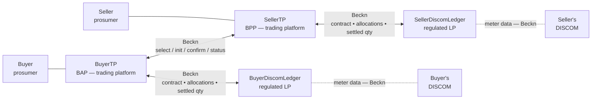
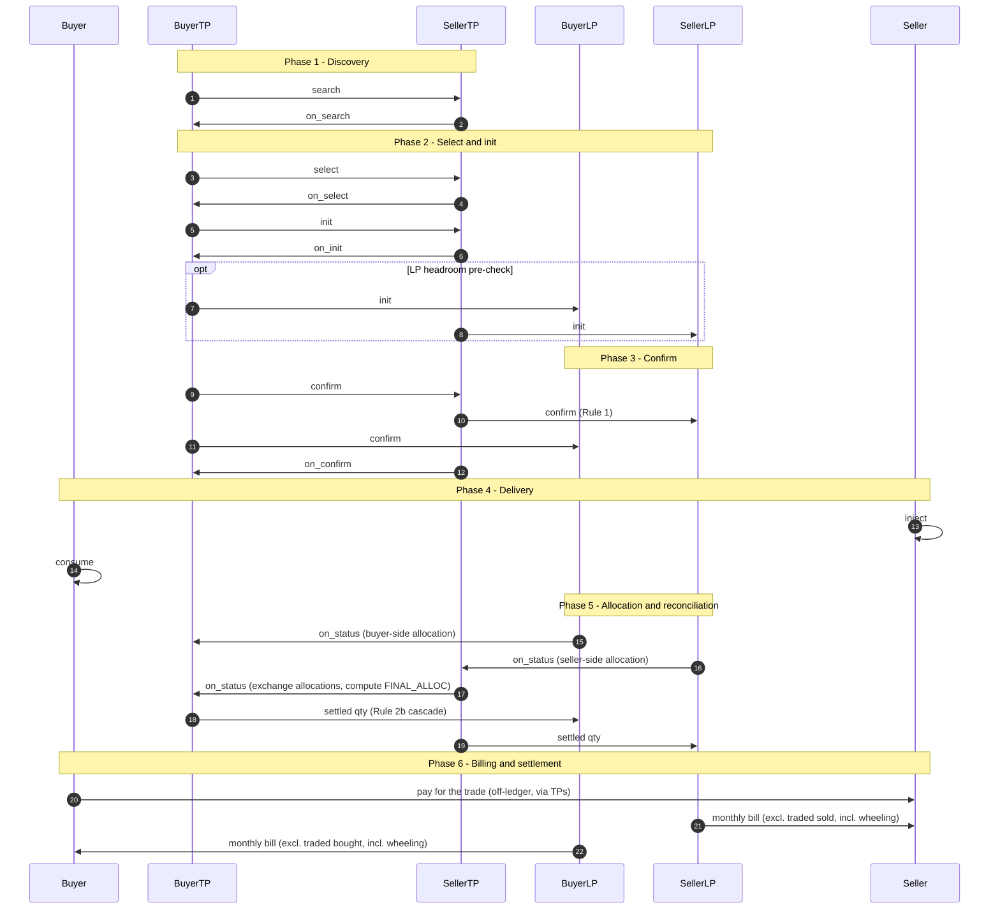

# Energy Trading

> **Status — work in progress.**

**Two prosumers on different discoms execute a direct, signed energy trade. Each discom is represented in the protocol by a regulated Ledger Provider. The same wire protocol that carries datasets in [Data Exchange](../../data-exchange/README.md) carries the trade — but the payload is a contract and its fulfillment, not a dataset.**

Energy Trading is a **variant of the Data Exchange building block**. The Beckn lifecycle (`search` → `select` → `init` → `confirm` → `status`), the ONIX adapter, registry-resolution, signing, and audit are reused unchanged. Every leg carries its payload inline inside the Beckn `message.contract` block as a `DEGContract`; what differs by leg is the `BecknTimeSeries` **payloadType vocabulary** the contract carries:

- **TP ↔ TP and TP ↔ LP — trade-negotiation legs.** PayloadTypes describe price, quantity, and allocations: `PRICE_PER_KWH`, `AVAILABLE_QTY`, `REQUESTED_QTY`, `BUYER_DISCOM_ALLOC`, `SELLER_DISCOM_ALLOC`, `FINAL_ALLOC`.
- **DISCOM ↔ LP — meter-data sub-transaction during reconciliation.** PayloadTypes describe actually injected / consumed quantities per interval, supplied by the DISCOM to its contracted LP as input to allocation. Same `message.contract` envelope, same `BecknTimeSeries` shape — just a different payloadType vocabulary. This is **not** Smart Meter Data Exchange and **does not use** the `MeterData` schema or the DDM `DatasetItem` envelope; the meter quantities ride inside the same contract block as everything else.

If you have [Data Exchange](../../data-exchange/README.md) working, you have the protocol; this page describes the payload, the four-actor topology, and the policy bundle on top.

---

## Actors and roles

| Role | Who | participantId convention in devkit |
|---|---|---|
| **Buyer** | Prosumer importing energy | `buyer` |
| **Seller** | Prosumer exporting energy | `seller` |
| **BuyerTP** (BAP) | Buyer's trading platform | `example.bap.com` |
| **SellerTP** (BPP) | Seller's trading platform | `example.bpp.com` |
| **BuyerDiscomLedger** | Regulated Ledger Provider on behalf of the buyer's discom | `buyer-discom-ledger` |
| **SellerDiscomLedger** | Regulated Ledger Provider on behalf of the seller's discom | `seller-discom-ledger` |

Network policy mandates that every discom operate through a regulated **Ledger Provider (LP)**. Each discom contracts exactly one LP; two discoms may share an LP or use different ones. When the buyer and seller share a discom the two LPs collapse into one — same protocol, fewer hops (covered in [`devkits/p2p-trading-ies-wave2`](https://github.com/beckn/DEG/tree/main/devkits/p2p-trading-ies-wave2)).

Customer PII and meter data stay with the customer's own discom and TP. Price stays between the two TPs only. Each ledger only sees the allocation and settled quantity for its own side and its counterparty.

---

## Block diagram



Two regulated ledger services in the protocol — one per discom — held by the discom's contracted Ledger Provider. No central exchange. The two ledgers never speak to each other directly; the two TPs are the only liaison between them. Each TP keeps its own internal book of trades, but that is application state, not a separate Beckn participant.

---

## Building blocks used

| Block | Role in this use case |
|---|---|
| [Identifiers and Addressing](../../identifiers/README.md) | Every actor (`buyer`, `seller`, two TPs, two LPs) is a `did:web` participant. Meters / DTs / feeders referenced in the trade reuse the existing IDs wrapped in `did:web` form (see [SMDX § Adopt the did:web convention](../smart-meter-data-exchange/README.md#7-optional-at-the-end-adopt-the-didweb-convention-for-meters-and-assets)). |
| [Registries and Directories](../../registries/README.md) | The four actors are subscribers referenced in [the IES network registries](../../registries/README.md#ies-networks-and-registries-today). Public keys resolve through any DeDi runtime. The LP↔discom mapping is recorded in `DiscomLedgerProvider.participantAttributes.utilityId` on each trade. |
| [Data Exchange](../../data-exchange/README.md) | The wire. The same Beckn + ONIX stack carries every leg — trade-negotiation and DISCOM↔LP meter-data alike — as `DEGContract` inside `message.contract`, with `BecknTimeSeries` payloads (`accessMethod: INLINE`). The DDM `DatasetItem` envelope is not used in this use case. |
| [Energy Credentials](../../energy-credentials/README.md) | The seller's [`ElectricityCredential`](../../schemas/ElectricityCredential/README.md) attests to the meter, sanctioned-load, and DER details that back the offer. |

The "Energy Trading" half of the work is a payload schema family and a policy bundle that sit on top of Data Exchange.

---

## The dataset is a contract — `P2PTrade`

The Beckn message body wraps six DEG schemas published at `schema.beckn.io`:

| Schema | What it carries | Source |
|---|---|---|
| [`P2PTrade`](https://schema.beckn.io/P2PTrade/) | The contract `@type`: agreed quantity, price, delivery window, the four roles, the policy URL | DEG |
| [`EnergyTradeOffer`](https://schema.beckn.io/EnergyTradeOffer/) | The seller's offer block: price per kWh, available quantity, validity window, source-type constraint (no GRID-sourced energy) | DEG |
| [`EnergyTradeDelivery`](https://schema.beckn.io/EnergyTradeDelivery/) | The performance block populated during reconciliation: per-interval `BUYER_DISCOM_ALLOC`, `SELLER_DISCOM_ALLOC`, and `FINAL_ALLOC` | DEG |
| [`DEGContract`](https://schema.beckn.io/DEGContract/) | The envelope: `roles[]` (buyer / seller / buyerDiscom / sellerDiscom → participantIds), the rego policy URL, computed `revenueFlows` | DEG |
| [`DiscomLedgerProvider`](https://schema.beckn.io/DiscomLedgerProvider/) | The LP↔discom binding (`utilityId`, `ledgerUrl`) | DEG |
| [`BecknTimeSeries`](https://schema.beckn.io/BecknTimeSeries/) | The `commitmentAttributes` carrier — declares `payloadDescriptors` (`PRICE_PER_KWH` in INR, `AVAILABLE_QTY` / `REQUESTED_QTY` / `*_ALLOC` in kWh) and per-interval `payloads[]` | DEG |

Trade contracts ride **inline** inside the Beckn `on_confirm` callback in `message.contract.commitments[].resources[].resourceAttributes`, qualified with the DEG `DEGContract` context. The DDM `DatasetItem` envelope is not used anywhere in this use case; the contract block carries every payload directly — trade-negotiation and DISCOM↔LP meter-quantity legs alike, both as `BecknTimeSeries` with the appropriate payloadType vocabulary.

---

## The six phases

This is the inter-discom flow. Intra-discom (buyer and seller behind the same discom) collapses Phase 2's optional limit check and Phase 5 into a single ledger.



The cascade choreography in Phases 3 and 5 — `Rule 1` (seller-side ledger record on `/confirm`), `Rule 2a` (peer-TP forward), `Rule 2b` (own-discom cascade) — is implemented by the [`degledgerrecorder`](https://github.com/beckn/DEG/tree/main/plugins/degledgerrecorder) ONIX plugin. You configure it; you do not write it. Full design and the loop-free proof live in the [DEG devkit README](https://github.com/beckn/DEG/blob/main/devkits/p2p-trading-ies-wave2/README.md).

The allocation logic on each LP can be as simple as **pro-rata across the customer's trades in the delivery window**. The same Phase-5 message flow supports multiple rounds — e.g., a provisional allocation, a final allocation after meter-data finalisation, or a deviation true-up — by repeating the `/status` round-trip with a fresh `BecknTimeSeries` payload. Iteration is a payload concern, not a protocol concern.

---

## Ledger interfaces

Each LP exposes the same Beckn endpoints any BPP exposes:

- `/bpp/receiver` — accepts `/confirm` (contract entry) and `/status` (meter-data sub-transactions).
- `/bap/receiver` — accepts `/on_confirm` and `/on_status` callbacks from the TPs.
- `/bap/caller` — emits `/on_status` callbacks (e.g. allocation updates) to the discom actor.

Authentication is the standard Beckn signing flow against the network registry. Every leg in the cascade rewrites `context.bapId` / `bappUri` / `bppId` / `bppUri` so each ledger leg is correctly identified end-to-end; nothing custom is required of the implementer beyond the ONIX config blocks the devkit ships.

---

## Setup steps

Mirrors the [Data Exchange Quick Start](../../data-exchange/README.md#quick-start--run-a-local-exchange-in-10-minutes). Everything below assumes you've already followed [Data Exchange — Onboarding Checklist](../../checklists/data-exchange-checklist.md) Stages 0–2 (devkit running, DeDi subscriber record, signing key).

### 1. Stand up the wave 2 devkit

```bash
git clone https://github.com/beckn/DEG.git
cd DEG/devkits/p2p-trading-ies-wave2/install
docker compose up -d
```

This starts the BAP-side (`onix-buyerapp`, `sandbox-buyerapp`, `onix-ledger-buyerdiscom`, `onix-buyerdiscom`) and BPP-side (`onix-sellerapp`, `sandbox-sellerapp`, `onix-ledger-sellerdiscom`, `onix-sellerdiscom`) stacks, bridged by one `beckn-router` (Caddy) on `:9000` resolving each actor by per-node hostname (e.g. `seller-discom-ledger.example.com`).

### 2. Drive the flow via Postman

Four collections sit under [`uc1/postman/`](https://github.com/beckn/DEG/tree/main/devkits/p2p-trading-ies-wave2/uc1/postman) — one per role (buyer TP, seller TP, buyer discom ledger, seller discom ledger). Import the role you are integrating, leave the defaults in place, and fire `/select` → `/init` → `/confirm` → `/status` from there. The full Phase 1–5 lifecycle is covered by the role-specific requests in those collections.

### 3. Swap in your real identity

Same procedure as Data Exchange: register your TP (or LP) as a DeDi subscriber under your namespace, point the ONIX adapter's `allowedNetworkIDs`, `networkParticipant`, and `keyId` at your real identity, and replace the sandbox containers with your TP / LP application. The full path is [Data Exchange → Registry Setup](../../data-exchange/README.md#swap-in-your-real-identity).

### 4. Map your application logic to the four roles

| If you are a … | You implement | Talks to |
|---|---|---|
| Trading-platform vendor (BAP or BPP) | Your matching engine + the ONIX BAP/BPP wiring | The peer TP (Beckn `/select`–`/status`) + your own LP (Beckn `/confirm`, `/status`) |
| LP for one or more discoms | Your ledger app behind a Beckn BPP+BAP | Both TPs you serve + the discom actor (meter-data sub-tx) |
| Discom (utility) | A thin Beckn BPP that emits meter data for your LPs | Your contracted LP only |

The DEG devkit ships sandbox implementations of all four — replace one at a time as your real component matures.

---

## Policy-as-code (Rego / OPA)

Every `DEGContract` carries a **`policyUrl`**. That URL points to a Rego policy bundle hosted on a DeDi runtime and digitally signed. **Two distinct rego bundles** apply, both enforceable offline by any participant.

The IES network mandates which policy bundles are in force on a given network and **publishes them as policy-as-code records on a DeDi runtime** (`dedi.global` or any DeDi-compatible host). DeDi serves the same role for policy that it does for keys: a trusted, verifiable, version-controlled source. A participant fetches the bundle, evaluates locally with OPA, and the answer is cryptographically attributable to the published version. There is no central policy server to call out to at trade time.

### Network policy

Enforces "is this a valid trade on this network at all?" Examples drawn from [`p2p-trading-ies-wave2_network.rego`](https://github.com/beckn/DEG/blob/main/devkits/p2p-trading-ies-wave2/policies/p2p-trading-ies-wave2_network.rego):

| Rule | What it checks |
|---|---|
| **Roles** | The four required roles (`buyer`, `seller`, `buyerDiscom`, `sellerDiscom`) are present and each maps to a known `utilityId`; buyer's discom ≠ seller's discom for inter-discom trades. |
| **No self-trade** | Buyer and seller meter IDs are different. |
| **Generation source** | Offer's `sourceType` is not `GRID` (network admits only DER-sourced energy). |
| **TimeSeries shape** | `PRICE_PER_KWH` is denominated in INR; `AVAILABLE_QTY` / `REQUESTED_QTY` in kWh; every `payloadType` used in `payloads[]` is declared in `payloadDescriptors`. |
| **Context alignment** | `context.bppId` / `context.bapId` match the participantIds the payload claims. |
| **Performance integrity** | `FINAL_ALLOC ≤ min(BUYER_DISCOM_ALLOC, SELLER_DISCOM_ALLOC)` per interval. |
| **TEST / PROD separation** | Test-network identifiers carry the `TEST_` prefix consistently; production networks check approved `utilityId`s only. |

A network operator can change the rule set without recompiling code — publish a new bundle on DeDi, bump the `policyUrl` on the next contract, every participant resolves the new bundle on first use.

### Settlement / invoicing policy

A second rego bundle ([`p2p_trading_ies_wave2_revenue.rego`](https://github.com/beckn/DEG/blob/main/specification/policies/p2p_trading_ies_wave2_revenue.rego)) computes the **`revenueFlows`** entry on each contract from the final allocation:

- Buyer pays `FINAL_ALLOC × PRICE_PER_KWH` (signed negative).
- Seller receives the same amount.
- BuyerDiscom and SellerDiscom collect wheeling charges (and any deviation penalty) — currently `0` placeholders pending the tariff rule plug-in.

The result lands in `message.contract.consideration[0].considerationAttributes` as a `RevenueFlow` JSON-LD object signed by the policy author. Settlement reconciliation reads from there.

Mandating the settlement bundle the same way as the network bundle keeps every participant computing the same answer from the same inputs. The wheeling charge a discom collects is no longer a bilateral spreadsheet — it is the output of a signed rego function over a signed contract.

---

## References

- [DEG devkit — `p2p-trading-ies-wave2`](https://github.com/beckn/DEG/tree/main/devkits/p2p-trading-ies-wave2) — code, examples, Postman collections
- [Inter-discom energy trading implementation guide](https://github.com/India-Energy-Stack/ies-docs/blob/main/implementation-guides/p2p_energy_exchange/%20Inter%20discom%20P2P%20trading.md)
- [Full inter-discom specification](https://github.com/beckn/DEG/blob/main/docs/implementation-guides/v2/P2P_Trading/Inter_energy_retailer_P2P_trading.md)
- [`degledgerrecorder` plugin](https://github.com/beckn/DEG/tree/main/plugins/degledgerrecorder) — the cascade engine
- [Schemas on `schema.beckn.io`](https://schema.beckn.io/) — `P2PTrade`, `DEGContract`, `EnergyTradeOffer`, `EnergyTradeDelivery`, `DiscomLedgerProvider`, `BecknTimeSeries`
- [Sample bill-calculation worksheet](https://docs.google.com/spreadsheets/d/104Qg0tBysjDqN3UKw-_mL5lwMnipwUO6h-1E8jDPw4Y/edit?gid=1170589686#gid=1170589686)
- [Checklist](./checklist.md) — rollout checklist for TP, LP, and discom teams
