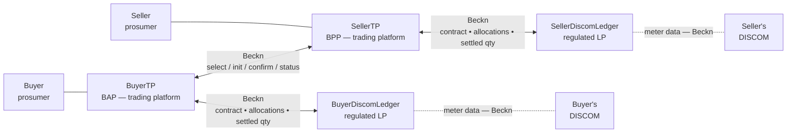

# P2P Energy Exchange

Two prosumers on different DISCOMs execute a direct, signed energy trade. Each DISCOM is represented in the protocol by a regulated **Ledger Provider**. The same wire that carries dataset exchanges in [IES Data Exchange](../../what-ies-provides/data-exchange/README.md) carries the trade — but the payload is a contract and its fulfilment, not a dataset.

| | |
|---|---|
| **Document** | IES/P2PEX-PROFILE/2.0 |
| **Status** | In progress (schema stable in DEG wave-2 devkit; pilot integrations being staged) |
| **Applicability** | Trading platforms, regulated Ledger Providers, DISCOMs |
| **This version** | Built on the DEG `P2PTrade` / `DEGContract` / `BecknTimeSeries` family (canonical at [schema.beckn.io](https://schema.beckn.io)) over Beckn, with a signed Rego bundle published on DeDi governing the network and settlement rules. Mirrored in [External Schemas — Energy Trading](../../schemas/external/README.md). |

---

## 1. Scope and Purpose

The **stakeholders** are two prosumers (buyer and seller) on potentially different DISCOMs, their respective trading platforms (TPs), and the regulated Ledger Provider (LP) contracted by each DISCOM. Today, peer-to-peer energy trade requires bespoke bilateral integrations, ad-hoc settlement spreadsheets, and a central exchange-style intermediary — none of which exist in the form Indian DISCOMs need.

This document defines **P2P Energy Exchange** — a one-to-many discovery, contracting and settlement pattern carried over the same Beckn wire that carries dataset exchanges. The contract is a `DEGContract` with a `P2PTrade` body. Allocation and reconciliation flow as `BecknTimeSeries` inside the same envelope. Network rules and revenue flows are enforced by **signed Rego bundles** published on DeDi — any participant evaluates locally, no central exchange.

A trading platform integrates once. The same pattern works inter-DISCOM (two LPs, one peer leg) and intra-DISCOM (one LP, the two LPs collapse).

## 2. What It Records / Covers

For one peer-to-peer trade the records carry:

- the **contract** — agreed quantity, price per kWh, delivery window, the four roles (buyer / seller / buyer's DISCOM / seller's DISCOM), the `policyUrl` for the Rego bundle in force;
- the **offer** — the seller's price, available quantity, validity window, source-type constraint (e.g. no GRID-sourced energy);
- per-interval **time series** — `PRICE_PER_KWH`, `AVAILABLE_QTY`, `REQUESTED_QTY`, `BUYER_DISCOM_ALLOC`, `SELLER_DISCOM_ALLOC`, `FINAL_ALLOC`;
- the **LP↔DISCOM binding** — each LP's `utilityId` and ledger endpoint;
- per-DISCOM **meter-data sub-transactions** delivered during reconciliation — actual injected / consumed quantities per interval, supplied by the DISCOM to its contracted LP as input to allocation (rides inside the same `message.contract` envelope as `BecknTimeSeries`; **not** a separate `MeterData` exchange);
- the **revenue flows** — computed by the settlement Rego bundle from the final allocation; signed and recorded inside the contract.

Customer PII and meter data stay with the customer's own DISCOM and TP. Price stays between the two TPs only. Each LP sees only its own side's allocation and the settled quantity for its counterparty.

## 3. How Each Item is Identified

| Subject | Identifier method | Example |
|---|---|---|
| Buyer / Seller (prosumer) | `did:web` under their TP's domain | `did:web:buyer.example.com` |
| Trading platform (BAP / BPP) | `did:web` on owned domain | `did:web:example.bpp.com` |
| Ledger Provider (LP) | `did:web` on owned domain, registered subscriber | `did:web:seller-discom-ledger.example.com` |
| DISCOM | `did:web` on owned domain | `did:web:ies.tpddl.in` |
| Meter / DT / feeder referenced in the trade | `did:web` reused from existing IDs (per [SMDX](../smart-meter-data-exchange/README.md#id-3.-how-each-item-is-identified)) | `did:web:ies.tpddl.in:assets:meter:NM-44091234` |
| Network policy bundle | DeDi-published Rego record URL (`policyUrl`) | `did:dedi:.../p2p-trading-ies-wave2_network.rego#v1.0` |
| Settlement policy bundle | DeDi-published Rego record URL | `did:dedi:.../p2p_trading_ies_wave2_revenue.rego#v0.3` |

No new identifier scheme. The four-actor topology reuses the same `did:web` and subscriber-registry machinery as every other IES use case.

## 4. Definitions

- **Prosumer** — a consumer who can both inject (sell) and consume (buy) energy.
- **TP** (Trading Platform) — the BAP or BPP that represents a prosumer on the network and runs the matching engine.
- **LP** (Ledger Provider) — a regulated service that holds each DISCOM's slice of the trade record. Each DISCOM contracts exactly one LP; two DISCOMs may share an LP.
- **Inter-DISCOM** — buyer and seller served by different DISCOMs; two LPs involved.
- **Intra-DISCOM** — buyer and seller served by the same DISCOM; the two LPs collapse into one.
- **`BecknTimeSeries`** — the per-interval payload carrier; declares `payloadDescriptors` (each column's `payloadType` and `insertedBy`) and per-interval `payloads[]`.
- **Cascade** — the choreography by which `confirm` and settled-quantity messages reach all four LPs in the right order; implemented by the `degledgerrecorder` ONIX plugin.
- **Policy-as-code** — the network and settlement rules as Rego bundles, signed and published on DeDi, evaluated locally with OPA.

## 5. Basis of Standards

IES order of preference: **IS → CEA → IEC → IEEE**. Indian standards do not yet exist for peer-to-peer energy trade as a protocol. The IES choices are:

- **Beckn Protocol v2** — the discovery / contracting / status lifecycle (`search` → `select` → `init` → `confirm` → `status`).
- **DEG schema family** — `P2PTrade`, `EnergyTradeOffer`, `EnergyTradeDelivery`, `DEGContract`, `DiscomLedgerProvider`, `BecknTimeSeries` — canonical at [schema.beckn.io](https://schema.beckn.io).
- **OPA / Rego** — the policy bundle format; standardised by CNCF.
- **W3C VC Data Model 2.0** / **W3C DID Core** — issuer key, signing.
- **JSON-LD 1.1** — wire format and semantic resolution.

Meter data referenced by the trade conforms to **IS 16444** and **IS 15959** — the same standards as the [Smart Meter Data Exchange](../smart-meter-data-exchange/README.md).

## 6. Where Indian Standards Do Not Yet Exist

The whole protocol — the four-actor topology, the `BecknTimeSeries` payload vocabulary for trade negotiation, the cascade choreography, the policy-as-code framework — is an IES choice with no Indian standard predating it. The CERC Innovation Sandbox order (2023) is the regulatory umbrella; CEA / CERC standards specific to peer-to-peer trade are expected and will inform future versions.

## 7. The Records

The P2P Energy Exchange flow produces three distinct kinds of signed artefact per trade:

1. The **contract** — `DEGContract` carrying a `P2PTrade` body. Recorded by both TPs and both LPs at `/confirm`.
2. The **per-interval allocation series** — `BecknTimeSeries` carrying buyer-DISCOM allocation, seller-DISCOM allocation, final allocation. Recorded by both LPs and both TPs as Phase 5 cascades.
3. The **revenue-flow record** — computed by the settlement Rego bundle from the final allocation; signed by the policy author and stored in `message.contract.consideration[0].considerationAttributes`.

Together they form a **complete, attributable audit trail** of the trade — from offer to settlement — with no central exchange.

If the use case needs a holder-bound credential — e.g. a prosumer carrying a credit-worthiness attestation in a wallet — that uses the [Consumer Energy Passport](../consumer-energy-passport/README.md) or [Consumer Meter Digest](../consumer-meter-digest/README.md) separately.

## 8. Schedule I — Static Fields of the Exchange

The full, authoritative field tables are in the schemas:

→ **[External Schemas — Energy Trading](../../schemas/external/README.md#energy-trading-p2p)**

Six tables: `P2PTrade`, `EnergyTradeOffer`, `EnergyCustomer`, `EnergyOrderItem`, `RevenueFlow`, `DEGContract` (+ the shared `BecknTimeSeries` and `DiscomLedgerProvider`).

For the underlying meter-data sub-transaction shape, see **[MeterData v0.6 — Field reference](../../schemas/MeterData/v0.6/README.md)** (referenced indirectly — the trade-side meter quantities ride as `BecknTimeSeries` payloadTypes, not as a `MeterData` profile).

## 9. Schedule II — Report Templates

Not applicable as a populated downstream template.

The closest analogues are the **per-DISCOM monthly bill** (which excludes the traded volume and includes wheeling charges) and the **TP-internal book of trades**. Both are derived from the signed contract + allocation records, not separate IES schemas.

## 10. How It Fits Together

Two regulated LPs in the protocol — one per DISCOM. No central exchange. The two LPs never speak to each other directly; the two TPs are the only liaison between them.

Six phases drive a trade:

1. **Discovery** — `BuyerTP /search`, `SellerTP /on_search`.
2. **Select and init** — quantity and price refined; optional LP headroom pre-check.
3. **Confirm** — contract written to both LPs via the `degledgerrecorder` cascade (Rule 1).
4. **Delivery** — seller injects, buyer consumes.
5. **Allocation and reconciliation** — each LP receives meter data from its DISCOM; computes its side's allocation; TPs exchange allocations to compute `FINAL_ALLOC`; settled quantity cascades back to LPs (Rule 2b).
6. **Billing and settlement** — buyer pays seller (off-ledger via TPs); DISCOM monthly bills are adjusted accordingly.

The cascade — Rules 1 / 2a / 2b — is implemented by the [`degledgerrecorder`](https://github.com/beckn/DEG/tree/main/plugins/degledgerrecorder) ONIX plugin. You configure it; you do not write it.

## 11. Points for Confirmation

1. **Wheeling and penalty rules** in the settlement bundle — currently `0` placeholders pending the tariff rule plug-in.
2. **Auto-`revenueFlows` middleware** in the wave-2 ONIX config — being aligned across LP implementations.
3. **TEST → PROD `utilityId` allow-list** — the network bundle's production rules check approved IDs only; the production allow-list is governance-pending.
4. **CERC sandbox graduation** — production-grade network policy bundle awaits CERC sign-off post-sandbox.
5. **Intra-DISCOM topology** — collapsing the two LPs into one is supported and lighter; the configuration convention is in the wave-2 devkit, being formalised.

---

## Schemas Used in This Use Case

| Schema | Role |
|---|---|
| **[P2PTrade](https://schema.beckn.io/P2PTrade/)** | The contract `@type` — agreed quantity, price, delivery window, the four roles, the policy URL |
| **[EnergyTradeOffer](https://schema.beckn.io/EnergyTradeOffer/)** | The seller's offer block |
| **[EnergyTradeDelivery](https://schema.beckn.io/EnergyTradeDelivery/)** | The performance block populated during reconciliation |
| **[DEGContract](https://schema.beckn.io/DEGContract/)** | The envelope — roles, the rego policy URL, computed revenue flows |
| **[DiscomLedgerProvider](https://schema.beckn.io/DiscomLedgerProvider/)** | The LP↔DISCOM binding (`utilityId`, `ledgerUrl`) |
| **[BecknTimeSeries](https://schema.beckn.io/BecknTimeSeries/)** | Per-interval payload carrier — declares `payloadDescriptors` and `payloads[]` |
| **[ElectricityCredential v1.2](../../schemas/ElectricityCredential/v1.2/README.md)** *(optional)* | Seller's attestation of meter / sanctioned-load / DER details backing the offer |

A consolidated field reference is in **[External Schemas — Energy Trading](../../schemas/external/README.md#energy-trading-p2p)**.

## Value Unlock

**For prosumers** — peer-to-peer trade becomes a real channel for distributed energy, with cryptographic settlement and no central exchange.

**For trading platforms** — one integration; same protocol intra- and inter-DISCOM; allocation and settlement done by signed Rego, not custom code.

**For DISCOMs** — wheeling charges and deviation penalties are the output of a signed function over a signed contract — not a bilateral spreadsheet. Visibility into peer-to-peer trade is a by-product, not a separate reporting effort.

**For regulators** — the network rules are themselves the regulation. A policy change is a new signed bundle on DeDi, picked up by every participant on next contract.

---

## Setup: Register → Discover → Exchange

Built on the four implementation steps in **[How you implement IES](../../how-you-implement-ies/README.md)**. Use-case-specific items only below.

### Register — four-actor network identity

- [ ] [Identity setup](../../how-you-implement-ies/setup-register.md) complete for your role (TP, LP, or DISCOM)
- [ ] DeDi subscriber record under the correct network namespace
- [ ] Signing key in a secrets manager
- [ ] (LP) `DiscomLedgerProvider` entry registered with the LP↔DISCOM `utilityId` binding

### Discover — wave-2 topology

- [ ] [Discovery setup](../../how-you-implement-ies/setup-discovery.md) complete
- [ ] Wave-2 devkit running end-to-end (proves four-actor topology + cascade before integrating real systems)
  - `git clone https://github.com/beckn/DEG.git && cd DEG/devkits/p2p-trading-ies-wave2/install && docker compose up -d`
- [ ] Role Postman collection: `/select` → `/init` → `/confirm` → `/status` completes
- [ ] (TP) Catalogue entry published — `EnergyTradeOffer` with `BecknTimeSeries` descriptors per `payloadType`

### Exchange — adapter, cascade, policy

- [ ] [Adapter built](../../how-you-implement-ies/build-adapter.md) mapping your application logic to your role (see role matrix below)
- [ ] `degledgerrecorder` ONIX plugin enabled (`ledgerUriSource: payload`, `ledgerApi: beckn`); cascade rules 1 / 2a / 2b verified on devkit, no loops
- [ ] Network policy bundle URL resolves and signature verifies; local OPA eval rejects rule-violating payloads
- [ ] Settlement policy bundle URL resolves and signature verifies; local OPA eval computes revenue flows
- [ ] (DISCOM) meter quantities published to your LP as `BecknTimeSeries` — **not** as `MeterData` / `DatasetItem`
- [ ] (LP) meter-quantity payloadTypes wired into the allocation function
- [ ] One real trade completed end-to-end and reconciled
- [ ] Runbook in place (key rotation, bundle upgrades, disputes)

| If you are a … | You implement | Talks to |
|---|---|---|
| Trading-platform vendor (BAP / BPP) | Your matching engine + the ONIX BAP/BPP wiring | The peer TP (Beckn `/select`–`/status`) + your own LP (Beckn `/confirm`, `/status`) |
| LP for one or more DISCOMs | Your ledger app behind a Beckn BPP+BAP | Both TPs you serve + the DISCOM actor (meter-data sub-tx) |
| DISCOM (utility) | A thin Beckn BPP that emits meter data for your LPs | Your contracted LP only |

### Team

- [ ] IT / data SPOC
- [ ] Commercial / settlement SPOC
- [ ] Authorised Signatory

---

## Dev kits and code

- **Devkit** — [`devkits/p2p-trading-ies-wave2`](https://github.com/beckn/DEG/tree/main/devkits/p2p-trading-ies-wave2) (code, examples, four role-specific Postman collections)
- **Cascade plugin** — [`plugins/degledgerrecorder`](https://github.com/beckn/DEG/tree/main/plugins/degledgerrecorder)
- **Network policy bundle** — [`p2p-trading-ies-wave2_network.rego`](https://github.com/beckn/DEG/blob/main/devkits/p2p-trading-ies-wave2/policies/p2p-trading-ies-wave2_network.rego)
- **Settlement policy bundle** — [`p2p_trading_ies_wave2_revenue.rego`](https://github.com/beckn/DEG/blob/main/specification/policies/p2p_trading_ies_wave2_revenue.rego)
- **Inter-DISCOM specification** — [Beckn DEG full spec](https://github.com/beckn/DEG/blob/main/docs/implementation-guides/v2/P2P_Trading/Inter_energy_retailer_P2P_trading.md)
- **IES architecture note** — [ies-docs inter-DISCOM P2P trading](https://github.com/India-Energy-Stack/ies-docs/blob/main/implementation-guides/p2p_energy_exchange/%20Inter%20discom%20P2P%20trading.md)
- **Sample bill worksheet** — [Google Sheet](https://docs.google.com/spreadsheets/d/104Qg0tBysjDqN3UKw-_mL5lwMnipwUO6h-1E8jDPw4Y/edit?gid=1170589686#gid=1170589686)

---

## Annexure A — Standards Referenced

| Standard | Scope |
|---|---|
| CERC Innovation Sandbox Order, 2023 | Regulatory umbrella for peer-to-peer trade pilots |
| Beckn Protocol v2 | Discovery, contracting, status, signed audit |
| DEG `P2PTrade` / `DEGContract` / `BecknTimeSeries` family | The payload schema family on the wire |
| OPA / Rego (CNCF) | Policy-as-code format for network and settlement bundles |
| IS 16444 (Parts 1, 2) | AC smart meter — specification (for trade-side meter quantities) |
| IS 15959 (Parts 1–3) | DLMS/COSEM data-exchange companion specification; OBIS codes |
| W3C VC Data Model 2.0; W3C DID Core | Issuer keys; signing |
| JSON-LD 1.1 | Wire format and semantic resolution |

## Annexure B — Example Payloads

The wave-2 devkit ships example payloads for every phase, per role:

→ **[`devkits/p2p-trading-ies-wave2/uc1/`](https://github.com/beckn/DEG/tree/main/devkits/p2p-trading-ies-wave2/uc1)**

## Annexure C — JSON Schema

Canonical references at **[schema.beckn.io](https://schema.beckn.io)**:

- **[P2PTrade/v2.0](https://schema.beckn.io/P2PTrade/v2.0)**
- **[DEGContract/v2.0](https://schema.beckn.io/DEGContract/v2.0)**
- **[EnergyTradeOffer/v2.0](https://schema.beckn.io/EnergyTradeOffer/v2.0)**
- **[EnergyTradeDelivery/v2.0](https://schema.beckn.io/EnergyTradeDelivery/v2.0)**
- **[DiscomLedgerProvider/v2.0](https://schema.beckn.io/DiscomLedgerProvider/v2.0)**
- **[BecknTimeSeries/v1.0](https://schema.beckn.io/BecknTimeSeries/v1.0)**

A consolidated field reference for all of the above is in **[External Schemas — Energy Trading](../../schemas/external/README.md#energy-trading-p2p)**.
