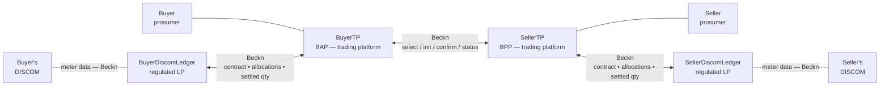
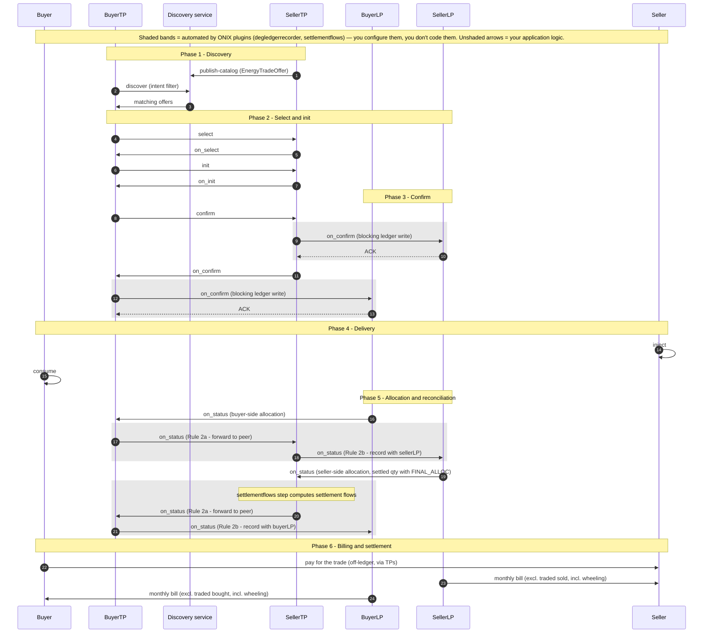

# P2P Energy Trading

Two prosumers on different DISCOMs execute a direct, signed energy trade. Each DISCOM is represented in the protocol by a regulated **Ledger Provider**. The same wire that carries dataset exchanges in [IES Data Exchange](../../what-ies-provides/data-exchange/README.md) carries the trade — but the payload is a contract and its fulfilment, not a dataset.

| | |
|---|---|
| **Document** | IES/P2PEX-PROFILE/2.0 |
| **Status** | In progress (schema stable in DEG wave-2 devkit; pilot integrations being staged) |
| **Applicability** | Trading platforms, regulated Ledger Providers, DISCOMs |
| **This version** | Built on the DEG `P2PTrade` / `DEGContract` / `BecknTimeSeries` family (canonical at [schema.beckn.io](https://schema.beckn.io)) over Beckn, with a signed Rego bundle published on DeDi governing the network and settlement rules. Mirrored in [External Schemas — Energy Trading](../../schemas/external/README.md). |

**In a hurry to prototype?** Jump to [Setup](#setup-register-discover-exchange) — a local four-actor network runs in one `docker compose up`.

| If you are a… | Start here |
|---|---|
| **Trading platform** (BAP / BPP) | [The six phases](#the-six-phases) — the unshaded arrows are yours · [Payload snapshots](#payload-snapshots) · [Setup](#setup-register-discover-exchange) (role matrix at the end) |
| **Ledger Provider** (LP) | [The cascade choreography](#the-cascade-choreography-rules-1-2a-2b) · [Ledger interfaces](#ledger-interfaces) · [Setup](#setup-register-discover-exchange) |
| **DISCOM** (utility) | [Payload snapshots](#payload-snapshots) — the allocation columns are yours · the DISCOM rows in [Setup → Exchange](#exchange-adapter-cascade-policy) |

---

## 1. Scope and Purpose

The **stakeholders** are two prosumers (buyer and seller) on potentially different DISCOMs, their respective trading platforms (TPs), and the regulated Ledger Provider (LP) contracted by each DISCOM. Today, peer-to-peer energy trade requires bespoke bilateral integrations, ad-hoc settlement spreadsheets, and a central exchange-style intermediary — none of which exist in the form Indian DISCOMs need.

This document defines **P2P Energy Trading** — a one-to-many discovery, contracting and settlement pattern carried over the same Beckn wire that carries dataset exchanges. The contract is a `DEGContract` with a `P2PTrade` body. Allocation and reconciliation flow as `BecknTimeSeries` inside the same envelope. Network rules and settlement flows are enforced by **signed Rego bundles** published on DeDi — any participant evaluates locally, no central exchange.

A trading platform integrates once. The same pattern works inter-DISCOM (two LPs, one peer leg) and intra-DISCOM (one LP, the two LPs collapse).

## 2. What It Records / Covers

For one peer-to-peer trade the records carry:

- the **contract** — agreed quantity, price per kWh, delivery window, the four roles (buyer / seller / buyer's DISCOM / seller's DISCOM), the `policyUrl` for the Rego bundle in force;
- the **offer** — the seller's price, available quantity, validity window, source-type constraint (e.g. no GRID-sourced energy);
- per-interval **time series** — `PRICE_PER_KWH`, `AVAILABLE_QTY`, `REQUESTED_QTY`, `BUYER_DISCOM_ALLOC`, `SELLER_DISCOM_ALLOC`, `FINAL_ALLOC`;
- the **LP↔DISCOM binding** — each LP's `utilityId` and ledger endpoint;
- per-DISCOM **meter-data sub-transactions** delivered during reconciliation — actual injected / consumed quantities per interval, supplied by the DISCOM to its contracted LP as input to allocation (rides inside the same `message.contract` envelope as `BecknTimeSeries`; **not** a separate `MeterData` exchange);
- the **settlement flows** — computed by the settlement Rego bundle from the final allocation; signed and recorded inside the contract. (The JSON-LD key on the wire is `revenueFlows`, of type `RevenueFlow` — the mechanism and the ONIX step that computes it are named *settlement flows*.)

Customer PII and raw meter data stay with the customer's own DISCOM and TP. Both LPs record the confirmed contract — including the agreed price — and the cascaded allocation and settled-quantity updates.

## 3. How Each Item is Identified

Participants are identified by their plain **network subscriber IDs** — the `participantId` under which they are registered in the network registry (DeDi). No `did:web` (or any other DID scheme) is required for participants; the subscriber ID is a hostname-style string and is what appears in `context.bapId` / `context.bppId` and in the contract's `roles[]`.

| Subject | Identifier method | Example |
|---|---|---|
| Trading platform (BAP / BPP) | Network subscriber ID | `buyerapp.example.com` |
| Ledger Provider (LP) | Network subscriber ID | `seller-discom-ledger.example.com` |
| DISCOM | Network subscriber ID; bound to its LP by `utilityId` in the `DiscomLedgerProvider` block | `buyerdiscom.example.com` (`utilityId: TEST_DISCOM_BUYER`) |
| Buyer / Seller (prosumer) | Represented by their TP — the contract's `roles[buyer/seller]` carry the TP's subscriber ID; the prosumer is pinned by their meter reference | `roles[buyer].participantId = buyerapp.example.com` |
| Meter / DT / feeder referenced in the trade | Existing utility asset IDs; optionally wrapped in the `did:web` convention (per [SMDX](../smart-meter-data-exchange/README.md#id-3.-how-each-item-is-identified)) — not required | `NM-44091234` |
| Network policy bundle | DeDi-published Rego record URL (`policyUrl`) | `https://api.dedi.global/dedi/lookup/…/p2p-trading-ies-wave2_network` |
| Settlement policy bundle | DeDi-published Rego record URL | `https://api.dedi.global/dedi/lookup/indiaenergystack.in/ies-policies/ies-p2p-network-settlement-rego-policy-v1` |

No new identifier scheme. The four-actor topology reuses the same subscriber-registry machinery as every other IES use case; public keys resolve from the same DeDi record the subscriber ID names.

## 4. Definitions

- **Prosumer** — a consumer who can both inject (sell) and consume (buy) energy.
- **TP** (Trading Platform) — the BAP or BPP that represents a prosumer on the network and runs the matching engine.
- **LP** (Ledger Provider) — a regulated service that holds each DISCOM's slice of the trade record. Each DISCOM contracts exactly one LP; two DISCOMs may share an LP.
- **Inter-DISCOM** — buyer and seller served by different DISCOMs; two LPs involved.
- **Intra-DISCOM** — buyer and seller served by the same DISCOM; the two LPs collapse into one.
- **Discovery service** — the network service that answers `discover` queries against catalogs that provider nodes have listed via `publish-catalog`.
- **`BecknTimeSeries`** — the per-interval payload carrier; declares `payloadDescriptors` (each column's `payloadType` and `insertedBy`) and per-interval `payloads[]`.
- **Cascade** — the choreography by which `confirm` and settled-quantity messages reach both TPs and both LPs in the right order; implemented by the `degledgerrecorder` ONIX plugin (see [The cascade choreography](#the-cascade-choreography-rules-1-2a-2b)).
- **Policy-as-code** — the network and settlement rules as Rego bundles, signed and published on DeDi, evaluated locally with OPA.

## 5. Basis of Standards

IES order of preference: **IS → CEA → IEC → IEEE**. Indian standards do not yet exist for peer-to-peer energy trade as a protocol. The IES choices are:

- **Beckn Protocol v2** — the discovery / contracting / status lifecycle (`discover` → `select` → `init` → `confirm` → `status`); providers list offers to the network's Catalog service via `publish-catalog`, and consumers query the Discovery service with `discover`.
- **DEG schema family** — `P2PTrade`, `EnergyTradeOffer`, `EnergyTradeDelivery`, `DEGContract`, `DiscomLedgerProvider`, `BecknTimeSeries` — canonical at [schema.beckn.io](https://schema.beckn.io).
- **OPA / Rego** — the policy bundle format; standardised by CNCF.
- **W3C VC Data Model 2.0** / **W3C DID Core** — issuer key, signing.
- **JSON-LD 1.1** — wire format and semantic resolution.

Meter data referenced by the trade conforms to **IS 16444** and **IS 15959** — the same standards as the [Smart Meter Data Exchange](../smart-meter-data-exchange/README.md).

## 6. Where Indian Standards Do Not Yet Exist

The whole protocol — the four-actor topology, the `BecknTimeSeries` payload vocabulary for trade negotiation, the cascade choreography, the policy-as-code framework — is an IES choice with no Indian standard predating it. The CERC Innovation Sandbox order (2023) is the regulatory umbrella; CEA / CERC standards specific to peer-to-peer trade are expected and will inform future versions.

## 7. The Records

The P2P Energy Trading flow produces three distinct kinds of signed artefact per trade:

1. The **contract** — `DEGContract` carrying a `P2PTrade` body. Recorded by both TPs and both LPs at confirm time (each LP receives it as a blocking `on_confirm` forward from its TP).
2. The **per-interval allocation series** — `BecknTimeSeries` carrying buyer-DISCOM allocation, seller-DISCOM allocation, final allocation. Recorded by both LPs and both TPs as Phase 5 cascades.
3. The **settlement-flow record** — computed by the settlement Rego bundle from the final allocation via the `settlementflows` ONIX step; signed by the policy author and stored in `message.contract.consideration[id=auto-settlement-flows].considerationAttributes` (wire key `revenueFlows`, type `RevenueFlow`).

Together they form a **complete, attributable audit trail** of the trade — from offer to settlement — with no central exchange.

If the use case needs a holder-bound credential — e.g. a prosumer carrying a credit-worthiness attestation in a wallet — that uses the [Consumer Energy Passport](../consumer-energy-passport/README.md) or [Consumer Meter Digest](../consumer-meter-digest/README.md) separately.

## 8. Schedule I — Static Fields of the Exchange

The full, authoritative field tables are in the schemas:

→ **[External Schemas — Energy Trading](../../schemas/external/README.md#energy-trading-p2p)**

Six tables: `P2PTrade`, `EnergyTradeOffer`, `EnergyCustomer`, `EnergyOrderItem`, `RevenueFlow`, `DEGContract` (+ the shared `BecknTimeSeries` and `EnergyResource`; `DiscomLedgerProvider` is defined only at schema.beckn.io).

For the underlying meter-data sub-transaction shape, see **[MeterData v0.6 — Field reference](https://india-energy-stack.gitbook.io/docs/schemas/meterdata/v0.6)** (referenced indirectly — the trade-side meter quantities ride as `BecknTimeSeries` payloadTypes, not as a `MeterData` profile).

## 9. Schedule II — Report Templates

Not applicable as a populated downstream template.

The closest analogues are the **per-DISCOM monthly bill** (which excludes the traded volume and includes wheeling charges) and the **TP-internal book of trades**. Both are derived from the signed contract + allocation records, not separate IES schemas.

## 10. How It Fits Together



Everything buyer-side sits on the left, everything seller-side mirrors it on the right, and the two TPs meet in the middle over the `select / init / confirm / status` leg. Two regulated LPs in the protocol — one per DISCOM. No central exchange. The two LPs never speak to each other directly; the two TPs are the only liaison between them. Discovery (not drawn) goes through the network's Discovery service: the SellerTP lists offers via `publish-catalog`, the BuyerTP queries with `discover`.

### The six phases

This is the inter-DISCOM flow. Intra-DISCOM (buyer and seller behind the same DISCOM) collapses Phase 2's optional limit check and Phase 5 into a single ledger.



The shaded legs ship with ONIX: the `degledgerrecorder` cascades and the `settlementflows` computation run inside the adapter from config alone. What is left for your application: the buyer TP drives `discover` → `select` → `init` → `confirm`; the seller TP publishes its catalog and answers `on_select` / `on_init` / `on_confirm`; each LP computes allocations and emits them as `on_status`; each DISCOM supplies meter data to its LP.

1. **Discovery** — SellerTP lists an `EnergyTradeOffer` catalog (`publish-catalog`); BuyerTP queries the Discovery service with `discover` and a JSONPath intent filter.
2. **Select and init** — quantity and price refined; optional LP headroom pre-check.
3. **Confirm** — the buyer's `confirm` is answered by the seller's `on_confirm`; as that `on_confirm` travels, each TP's `degledgerrecorder` forwards a rewritten copy to its own LP and **blocks until the LP ACKs** — seller-side before the `on_confirm` leaves for the buyer, buyer-side before the buyer app receives it. The LPs do not emit an `on_confirm` of their own; their sync ACK is the record receipt.
4. **Delivery** — seller injects, buyer consumes.
5. **Allocation and reconciliation** — each LP receives meter data from its DISCOM and computes its side's allocation. Every allocation and settled-quantity `on_status` then cascades **symmetrically** through the two TPs to the opposite LP (Rule 2a forward, Rule 2b record): buyer-side updates run `BuyerLP → BuyerTP → SellerTP → SellerLP`, seller-side updates run the mirror chain, so all four parties converge on `FINAL_ALLOC`. The `settlementflows` step computes the settlement flows as the settled `on_status` passes the seller TP.
6. **Billing and settlement** — buyer pays seller (off-ledger via TPs); DISCOM monthly bills are adjusted accordingly.

The allocation logic on each LP can be as simple as **pro-rata across the customer's trades in the delivery window**. The same Phase-5 message flow supports multiple rounds — a provisional allocation, a final allocation after meter-data finalisation, a deviation true-up — by repeating the `/status` round-trip with a fresh `BecknTimeSeries` payload. Iteration is a payload concern, not a protocol concern.

### The cascade choreography — Rules 1, 2a, 2b

The hard part of a four-actor topology is making sure every contract and every allocation update reaches both TPs **and** both LPs — without a central exchange, without the LPs talking to each other, and without loops. That choreography is three rules, implemented entirely by the [`degledgerrecorder`](https://github.com/beckn/DEG/tree/main/plugins/degledgerrecorder) ONIX plugin. **You configure it; you do not write it.**

| Rule | Trigger | What the plugin does |
|---|---|---|
| **Confirm record** — blocking ledger write | The seller TP emits `on_confirm` (at `/bpp/caller`); the buyer TP receives it (at `/bap/receiver`) | Each TP forwards a context-rewritten `on_confirm` to its **own** DISCOM's LP and **blocks until the LP ACKs**: the `on_confirm` leaves the seller only after the seller-side ledger has recorded it, and reaches the buyer app only after the buyer-side ledger has. A confirmed trade is by definition a recorded trade. The LPs answer with a synchronous ACK — they do not emit an `on_confirm` of their own. There is no cascade on the `/confirm` request itself. |
| **Rule 1** — record status with your own ledger | `/status` arrives at a TP's `/bpp/receiver` | Cascade a copy (async) to the TP's **own** DISCOM's LP. The LP endpoint is read from the payload itself — `participants[role=…Discom].participantAttributes.ledgerUrl` (`ledgerUriSource: payload`) — not from static config. |
| **Rule 2a** — own DISCOM spoke: forward to the peer | `/on_status` arrives at a TP's `/bap/receiver` **and** `context.bppId` equals the TP's own DISCOM's participantId | The TP's own LP has just computed its allocation. Forward the `on_status` to the **peer TP**, so the peer can record it and trigger its own DISCOM cascade. |
| **Rule 2b** — peer spoke: record with your own DISCOM | `/on_status` arrives at `/bap/receiver` from anyone **other than** the own DISCOM (i.e. the peer TP) | Push the payload to the TP's **own** LP so it records the full bilateral settlement. Skipped when the payload carries no performance data (a bare status-check ACK is not cascaded). |

Chained together they produce one linear path per update, and the choreography is **symmetric** — a seller-side update runs `SellerLP → SellerTP (Rule 2a) → BuyerTP (Rule 2b) → BuyerLP`, and a buyer-side update runs the mirror chain `BuyerLP → BuyerTP (Rule 2a) → SellerTP (Rule 2b) → SellerLP` — after which every party holds the same signed record.

**Why it cannot loop.** The chain always alternates *ledger → platform → ledger*; there is no ledger→ledger edge. LPs receive `on_status` at `/bap/receiver`, which routes to an ACK-only webhook and never re-cascades — every Rule 2a forward terminates in a Rule 2b write at an LP sink. Degenerate topologies collapse safely: if buyer and seller share one platform the self-forward is skipped and the cascade goes straight to the peer's DISCOM; if they share one DISCOM the single LP is written once.

**What the rules enable:**

- **No central exchange, full replication** — all four parties converge on the same contract and allocation state through pairwise Beckn legs only.
- **Zero choreography code for implementers** — a TP or LP enables the plugin and edits the `participants` block; the routes are read from the payload's participants, so inter-DISCOM, intra-DISCOM and single-platform-prosumer topologies all work from the same config.
- **A per-leg audit trail** — every cascade leg rewrites `context.bapId` / `bapUri` / `bppId` / `bppUri` for the sub-transaction and is separately signed, so each hop is independently attributable end-to-end.

If a cascade leg exhausts its retries, the plugin returns a best-effort error `on_status` to the original sender with `error.code = "DEG_ASYNC_ACK_TIMEOUT"`. The full design and the loop-free argument live in the [plugin README](https://github.com/beckn/DEG/tree/main/plugins/degledgerrecorder) and the [wave-2 devkit](https://github.com/beckn/DEG/tree/main/devkits/p2p-trading-ies-wave2).

### Ledger interfaces

Each LP runs both a BPP and a BAP face:

- `/bap/receiver` — accepts the blocking `on_confirm` forward (contract entry, answered with a synchronous ACK) and `on_status` callbacks (e.g. meter data from the DISCOM).
- `/bpp/receiver` — accepts the `/status` cascades from the TPs (Rule 1).
- `/bpp/caller` — emits `on_status` callbacks (allocations, settled quantities) toward the TPs.
- `/bap/caller` — emits `/status` requests (meter-data pulls) toward the DISCOM actor's `/bpp/receiver`.

Authentication is the standard Beckn signing flow against the network registry. Nothing custom is required of the implementer beyond the ONIX config blocks the devkit ships.

### Payload snapshots

One `BecknTimeSeries` envelope carries the whole trade; what changes between phases is only **which payloadType columns exist and who inserts them** (`insertedBy`). Three moments from the devkit's [uc1 examples](https://github.com/beckn/DEG/tree/main/devkits/p2p-trading-ies-wave2/uc1/examples), trimmed to one interval:

**1 — At confirm (trade negotiation).** The TPs have inserted the negotiation columns (`objectType: EVENT_PAYLOAD_DESCRIPTOR`); no allocation data exists yet:

```json
"commitmentAttributes": {
  "@context": "https://schema.beckn.io/BecknTimeSeries/v1.0/context.jsonld",
  "@type": "TimeSeries",
  "intervalPeriod": { "start": "2026-04-26T04:30:00Z", "duration": "PT1H" },
  "payloadDescriptors": [
    { "objectType": "EVENT_PAYLOAD_DESCRIPTOR", "payloadType": "PRICE_PER_KWH", "currency": "INR", "insertedBy": "sellerPlatform" },
    { "objectType": "EVENT_PAYLOAD_DESCRIPTOR", "payloadType": "REQUESTED_QTY", "units": "KWH", "insertedBy": "buyerPlatform" }
  ],
  "intervals": [
    { "id": 0, "payloads": [
      { "type": "PRICE_PER_KWH", "values": [12.5] },
      { "type": "REQUESTED_QTY", "values": [20.5] } ] }
  ]
}
```

**2 — During reconciliation (DISCOM allocation).** Same envelope, same intervals — the DISCOM sides have appended their allocation columns (`objectType: REPORT_PAYLOAD_DESCRIPTOR`). Note `FINAL_ALLOC ≤ min(BUYER_DISCOM_ALLOC, SELLER_DISCOM_ALLOC)` — the network policy enforces it per interval:

```json
"payloadDescriptors": [
  { "objectType": "EVENT_PAYLOAD_DESCRIPTOR",  "payloadType": "PRICE_PER_KWH", "currency": "INR", "insertedBy": "sellerPlatform" },
  { "objectType": "EVENT_PAYLOAD_DESCRIPTOR",  "payloadType": "REQUESTED_QTY", "units": "KWH", "insertedBy": "buyerPlatform" },
  { "objectType": "REPORT_PAYLOAD_DESCRIPTOR", "payloadType": "BUYER_DISCOM_ALLOC", "units": "KWH", "insertedBy": "buyerDiscom" },
  { "objectType": "REPORT_PAYLOAD_DESCRIPTOR", "payloadType": "SELLER_DISCOM_ALLOC", "units": "KWH", "insertedBy": "sellerDiscom" },
  { "objectType": "REPORT_PAYLOAD_DESCRIPTOR", "payloadType": "FINAL_ALLOC", "units": "KWH", "insertedBy": "sellerDiscom" }
],
"intervals": [
  { "id": 0, "payloads": [
    { "type": "PRICE_PER_KWH", "values": [12.5] },
    { "type": "REQUESTED_QTY", "values": [20.5] },
    { "type": "BUYER_DISCOM_ALLOC", "values": [18.5] },
    { "type": "SELLER_DISCOM_ALLOC", "values": [19.2] },
    { "type": "FINAL_ALLOC", "values": [18.5] } ] }
]
```

(The full example also carries `BUYER_DISCOM_STATUS` / `SELLER_DISCOM_STATUS` string columns — `COMPLETED` per interval.)

**3 — Settlement flows.** As the settled `on_status` passes the seller TP, the `settlementflows` step evaluates the DeDi-published rego and injects the result into the contract's `consideration` block — no application wrote this:

```json
"consideration": [
  { "id": "auto-settlement-flows",
    "considerationAttributes": {
      "@context": "https://schema.beckn.io/RevenueFlow/v2.0/context.jsonld",
      "@type": "RevenueFlow",
      "revenueFlows": [
        { "role": "buyerPlatform",  "value": -437.15, "currency": "INR", "description": "Energy purchase cost (18.5 kWh × ₹12.5 + 14.2 kWh × ₹14.5)" },
        { "role": "sellerPlatform", "value": 437.15,  "currency": "INR", "description": "Energy sale proceeds" },
        { "role": "buyerDiscom",    "value": 0, "currency": "INR", "description": "Buyer-side wheeling charge (placeholder — currently 0)" },
        { "role": "sellerDiscom",   "value": 0, "currency": "INR", "description": "Seller-side wheeling + penalty (placeholder — currently 0)" }
      ] } }
]
```

The flows sum to zero across the four roles. When real wheeling/penalty tariff rules land in the rego, the DISCOM rows take non-zero values — no payload or code change needed.

## 11. Points for Confirmation

1. **Wheeling and penalty rules** in the settlement bundle — currently `0` placeholders pending the tariff rule plug-in; the payload shape already carries them, so flipping to real expressions needs no schema change.
2. **`settlementflows` ONIX step** — ships in the wave-2 seller-TP config (computes settlement flows on `on_status` from the DeDi-resolved rego); being aligned across LP implementations.
3. **TEST → PROD `utilityId` allow-list** — the network bundle's production rules check approved IDs only; the production allow-list is governance-pending.
4. **CERC sandbox graduation** — production-grade network policy bundle awaits CERC sign-off post-sandbox.
5. **Intra-DISCOM topology** — collapsing the two LPs into one is supported and lighter; the configuration convention is in the wave-2 devkit, being formalised.

---

## Schemas Used in This Use Case

| Schema | Role |
|---|---|
| **[P2PTrade](https://schema.beckn.io/P2PTrade/)** | The contract `@type` — agreed quantity, price, delivery window, the four roles, the policy URL |
| **[EnergyTradeOffer](https://schema.beckn.io/EnergyTradeOffer/)** | The seller's offer block |
| **[EnergyTradeDelivery](https://schema.beckn.io/EnergyTradeDelivery/)** | The performance block populated during reconciliation |
| **[DEGContract](https://schema.beckn.io/DEGContract/)** | The envelope — roles, the rego policy URL, computed settlement flows |
| **[DiscomLedgerProvider](https://schema.beckn.io/DiscomLedgerProvider/)** | The LP↔DISCOM binding (`utilityId`, `ledgerUrl`) |
| **[BecknTimeSeries](https://schema.beckn.io/BecknTimeSeries/)** | Per-interval payload carrier — declares `payloadDescriptors` and `payloads[]` |
| **[ElectricityCredential v1.2](https://india-energy-stack.gitbook.io/docs/schemas/electricitycredential/v1.2)** *(optional)* | Seller's attestation of meter / sanctioned-load / DER details backing the offer |

A consolidated field reference is in **[External Schemas — Energy Trading](../../schemas/external/README.md#energy-trading-p2p)**.

## Policy-as-code (Rego / OPA)

Every `DEGContract` carries a **`policyUrl`**. That URL points to a Rego policy bundle hosted on a DeDi runtime and digitally signed. **Two distinct rego bundles** apply, both enforceable offline by any participant.

The IES network mandates which policy bundles are in force on a given network and **publishes them as policy-as-code records on a DeDi runtime**. DeDi serves the same role for policy that it does for keys: a trusted, verifiable, version-controlled source. A participant fetches the bundle, evaluates locally with OPA, and the answer is cryptographically attributable to the published version. There is no central policy server to call out to at trade time.

### Network policy

Enforces "is this a valid trade on this network at all?" Examples drawn from [`p2p-trading-ies-wave2_network.rego`](https://github.com/beckn/DEG/blob/main/devkits/p2p-trading-ies-wave2/policies/p2p-trading-ies-wave2_network.rego):

| Rule | What it checks |
|---|---|
| **Roles** | The four required roles (`buyer`, `seller`, `buyerDiscom`, `sellerDiscom`) are present and each maps to a known `utilityId`; buyer's DISCOM ≠ seller's DISCOM for inter-DISCOM trades. |
| **No self-trade** | Buyer and seller meter IDs are different. |
| **Generation source** | Offer's `sourceType` is not `GRID` (network admits only DER-sourced energy). |
| **TimeSeries shape** | `PRICE_PER_KWH` is denominated in INR; `AVAILABLE_QTY` / `REQUESTED_QTY` in kWh; every `payloadType` used in `payloads[]` is declared in `payloadDescriptors`. |
| **Context alignment** | `context.bppId` / `context.bapId` match the participantIds the payload claims. |
| **Performance integrity** | `FINAL_ALLOC ≤ min(BUYER_DISCOM_ALLOC, SELLER_DISCOM_ALLOC)` per interval. |
| **TEST / PROD separation** | Test-network identifiers carry the `TEST_` prefix consistently; production networks check approved `utilityId`s only. |

A network operator can change the rule set without recompiling code — publish a new bundle on DeDi, bump the `policyUrl` on the next contract, every participant resolves the new bundle on first use.

### Settlement policy

A second rego bundle ([`p2p_trading_ies_wave2_revenue.rego`](https://github.com/beckn/DEG/blob/main/specification/policies/p2p_trading_ies_wave2_revenue.rego), published on DeDi as `ies-p2p-network-settlement-rego-policy-v1`) computes the **settlement flows** on each contract from the final allocation:

- Buyer pays `FINAL_ALLOC × PRICE_PER_KWH` (signed negative).
- Seller receives the same amount.
- BuyerDiscom and SellerDiscom collect wheeling charges (and any deviation penalty) — currently `0` placeholders pending the tariff rule plug-in.

The flows sum to zero across the four roles. On the seller TP, the `settlementflows` ONIX pipeline step resolves the DeDi record on `on_status`, verifies its checksum, evaluates the rego locally, and writes the result to `message.contract.consideration[id=auto-settlement-flows].considerationAttributes` as a `RevenueFlow` JSON-LD object (wire key `revenueFlows`). Settlement reconciliation reads from there.

Mandating the settlement bundle the same way as the network bundle keeps every participant computing the same answer from the same inputs. The wheeling charge a DISCOM collects is no longer a bilateral spreadsheet — it is the output of a signed rego function over a signed contract.

## Value Unlock

**For prosumers** — peer-to-peer trade becomes a real channel for distributed energy, with cryptographic settlement and no central exchange.

**For trading platforms** — one integration; same protocol intra- and inter-DISCOM; allocation and settlement done by signed Rego, not custom code.

**For DISCOMs** — wheeling charges and deviation penalties are the output of a signed function over a signed contract — not a bilateral spreadsheet. Visibility into peer-to-peer trade is a by-product, not a separate reporting effort.

**For regulators** — the network rules are themselves the regulation. A policy change is a new signed bundle on DeDi, picked up by every participant on next contract.

---

## Setup: Register → Discover → Exchange

Built on the four implementation steps in **[How you implement IES](../../how-you-implement-ies/README.md)**. Prerequisites: Git, Docker + Docker Compose, and Postman — nothing else. If you have never run an IES exchange before, do the [Data Exchange quick start](../../what-ies-provides/data-exchange/README.md) first; this use case reuses that stack unchanged.

### Step 0 — See it run before you build (local devkit)

Prove the four-actor topology and the cascade on your laptop before touching real systems:

```bash
git clone https://github.com/beckn/DEG.git
cd DEG/devkits/p2p-trading-ies-wave2/install
docker compose up -d
```

This starts the buyer side (`onix-buyerapp`, `sandbox-buyerapp`, `onix-ledger-buyerdiscom`, `onix-buyerdiscom`), the seller side (`onix-sellerapp`, `sandbox-sellerapp`, `onix-ledger-sellerdiscom`, `onix-sellerdiscom`), and one `beckn-router` (Caddy) on `:9000` resolving each actor by per-node hostname (e.g. `seller-discom-ledger.example.com`). The sandbox containers stand in for your application; the ONIX containers are the adapters you will keep.

**Drive the flow from Postman.** Four collections sit under [`uc1/postman/`](https://github.com/beckn/DEG/tree/main/devkits/p2p-trading-ies-wave2/uc1/postman) — one per role (buyer TP, seller TP, buyer DISCOM ledger, seller DISCOM ledger). Import the role you are integrating, leave the defaults in place, and fire `publish-catalog` / `discover` (buyer TP) then `/select` → `/init` → `/confirm` → `/status`. The full Phase 1–5 lifecycle is covered by the role-specific requests.

### Register — four-actor network identity

- [ ] [Identity setup](../../how-you-implement-ies/setup-register.md) complete for your role (TP, LP, or DISCOM)
- [ ] DeDi subscriber record under the correct network namespace
- [ ] Signing key in a secrets manager
- [ ] (LP) `DiscomLedgerProvider` entry registered with the LP↔DISCOM `utilityId` binding

### Discover — catalog and offers

- [ ] [Discovery setup](../../how-you-implement-ies/setup-discovery.md) complete
- [ ] (Seller TP) Catalogue entry published via `publish-catalog` — `EnergyTradeOffer` with `BecknTimeSeries` descriptors per `payloadType`
- [ ] (Buyer TP) `discover` against the network's Discovery service returns your counterparty's offers

### Exchange — adapter, cascade, policy

- [ ] [Adapter built](../../how-you-implement-ies/build-adapter.md) mapping your application logic to your role (see role matrix below)
- [ ] `degledgerrecorder` ONIX plugin enabled (`ledgerUriSource: payload`, `ledgerApi: beckn`); cascade rules 1 / 2a / 2b verified on devkit, no loops
- [ ] Network policy bundle URL resolves and signature verifies; local OPA eval rejects rule-violating payloads
- [ ] Settlement policy bundle URL resolves; `settlementflows` step computes settlement flows on `on_status`
- [ ] (DISCOM) meter quantities published to your LP as `BecknTimeSeries` — **not** as `MeterData` / `DatasetItem`
- [ ] (LP) meter-quantity payloadTypes wired into the allocation function
- [ ] One real trade completed end-to-end and reconciled
- [ ] Runbook in place (key rotation, bundle upgrades, disputes)

| If you are a … | You implement | Talks to |
|---|---|---|
| Trading-platform vendor (BAP / BPP) | Your matching engine + the ONIX BAP/BPP wiring | The peer TP (Beckn `/select`–`/status`) + your own LP (Beckn `/confirm`, `/status`) |
| LP for one or more DISCOMs | Your ledger app behind a Beckn BPP+BAP | Both TPs you serve + the DISCOM actor (meter-data sub-tx) |
| DISCOM (utility) | A thin Beckn BPP that emits meter data for your LPs | Your contracted LP only |

The devkit ships sandbox implementations of all four roles — replace one at a time as your real component matures: swap the sandbox container for your application, then point the ONIX adapter's `allowedNetworkIDs`, `networkParticipant` and `keyId` at your real identity.

### Go live — join the production network

The production fabric is operated on NFH (Networks for Humanity). Its [Join the network](https://docs.nfh.global/build/join-the-network) instructions are the final mile, and map one-to-one onto what you just proved locally:

1. **Register an identity** — register your subscriber ID and publish your public key via the [Registry](https://docs.nfh.global/dedi) (the same DeDi machinery as your devkit subscriber record).
2. **Stand up a network adapter** — run [ONIX](https://docs.nfh.global/product-documentation/products/onix) inside your own infrastructure, with the signing, schema-validation, policy and audit plug-ins configured (your devkit ONIX config carries over).
3. **Publish, discover, or both** — list your offers via the Catalog service; query via the Discovery service — the production endpoints for the `publish-catalog` / `discover` calls you tested in Step 0.
4. **Transact** — the `select` → `init` → `confirm` → `status` lifecycle, now against real counterparties under the production policy bundles.

None of the four steps require permission from a platform owner. For a guided first run on the fabric, see [Getting started with Fabric](https://docs.nfh.global/build/getting-started-with-fabric).

### Team

- [ ] IT / data SPOC
- [ ] Commercial / settlement SPOC
- [ ] Authorised Signatory

---

## Dev kits and code

- **Devkit** — [`devkits/p2p-trading-ies-wave2`](https://github.com/beckn/DEG/tree/main/devkits/p2p-trading-ies-wave2) (code, examples, four role-specific Postman collections)
- **Scripted lifecycle** — [`uc1/workflows/p2p-trading-ies-wave2.arazzo.yaml`](https://github.com/beckn/DEG/blob/main/devkits/p2p-trading-ies-wave2/uc1/workflows/p2p-trading-ies-wave2.arazzo.yaml)
- **Cascade plugin** — [`plugins/degledgerrecorder`](https://github.com/beckn/DEG/tree/main/plugins/degledgerrecorder)
- **Settlement-flows plugin** — [`plugins/settlementflows`](https://github.com/beckn/DEG/tree/main/plugins/settlementflows)
- **Network policy bundle** — [`p2p-trading-ies-wave2_network.rego`](https://github.com/beckn/DEG/blob/main/devkits/p2p-trading-ies-wave2/policies/p2p-trading-ies-wave2_network.rego)
- **Settlement policy bundle** — [`p2p_trading_ies_wave2_revenue.rego`](https://github.com/beckn/DEG/blob/main/specification/policies/p2p_trading_ies_wave2_revenue.rego)
- **Inter-DISCOM specification** — [Beckn DEG full spec](https://github.com/beckn/DEG/blob/main/docs/implementation-guides/v2/P2P_Trading/Inter_energy_retailer_P2P_trading.md)
- **IES architecture note** — [ies-docs inter-DISCOM P2P trading](https://github.com/India-Energy-Stack/ies-docs/blob/main/implementation-guides/p2p_energy_exchange/%20Inter%20discom%20P2P%20trading.md)
- **NFH fabric onboarding** — [Join the network](https://docs.nfh.global/build/join-the-network) · [Getting started with Fabric](https://docs.nfh.global/build/getting-started-with-fabric)
- **Sample bill worksheet** — [Google Sheet](https://docs.google.com/spreadsheets/d/104Qg0tBysjDqN3UKw-_mL5lwMnipwUO6h-1E8jDPw4Y/edit?gid=1170589686#gid=1170589686)

---

## Annexure A — Standards Referenced

| Standard | Scope |
|---|---|
| CERC Innovation Sandbox Order, 2023 | Regulatory umbrella for peer-to-peer trade pilots |
| Beckn Protocol v2 | Discovery, contracting, status, signed audit |
| DEG `P2PTrade` / `DEGContract` / `BecknTimeSeries` family | The payload schema family on the wire |
| OPA / Rego (CNCF) | Policy-as-code format for network and settlement bundles |
| IS 16444 (Parts 1, 2) | AC smart meter — specification (for trade-side meter quantities) |
| IS 15959 (Parts 1–3) | DLMS/COSEM data-exchange companion specification; OBIS codes |
| W3C VC Data Model 2.0; W3C DID Core | Issuer keys; signing |
| JSON-LD 1.1 | Wire format and semantic resolution |

## Annexure B — Example Payloads

The wave-2 devkit ships example payloads for every phase, per role:

→ **[`devkits/p2p-trading-ies-wave2/uc1/`](https://github.com/beckn/DEG/tree/main/devkits/p2p-trading-ies-wave2/uc1)**

## Annexure C — JSON Schema

Canonical references at **[schema.beckn.io](https://schema.beckn.io)**:

- **[P2PTrade/v2.0](https://schema.beckn.io/P2PTrade/v2.0)**
- **[DEGContract/v2.0](https://schema.beckn.io/DEGContract/v2.0)**
- **[EnergyTradeOffer/v2.0](https://schema.beckn.io/EnergyTradeOffer/v2.0)**
- **[EnergyTradeDelivery/v2.0](https://schema.beckn.io/EnergyTradeDelivery/v2.0)**
- **[DiscomLedgerProvider/v2.0](https://schema.beckn.io/DiscomLedgerProvider/v2.0)**
- **[BecknTimeSeries/v1.0](https://schema.beckn.io/BecknTimeSeries/v1.0)**

A consolidated field reference for the trade schemas (except `DiscomLedgerProvider` and `EnergyTradeDelivery`, defined only at schema.beckn.io) is in **[External Schemas — Energy Trading](../../schemas/external/README.md#energy-trading-p2p)**.
