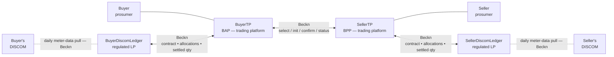
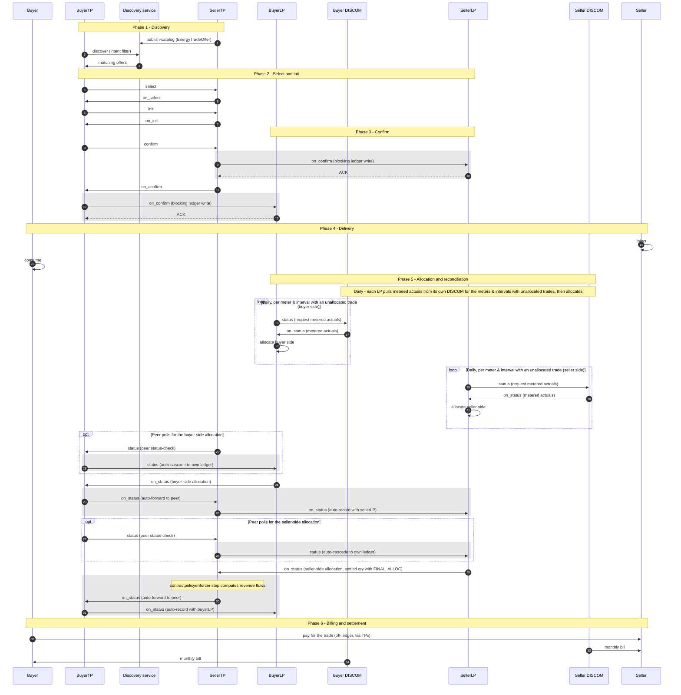

# P2P Energy Trading

**In a hurry?** Jump to the [Checklist](#checklist), or [See it run](#step-0-see-it-run-before-you-build-local-devkit) in one `docker compose up`. For the standards basis, the full field schedule and definitions, see the **[Overview](../../use-cases-overview/p2p-energy-trading.md)**.

**Two prosumers on different DISCOMs execute a direct, signed energy trade over the same Beckn wire that carries dataset exchanges. Each DISCOM is represented in the protocol by a regulated Ledger Provider; allocation and settlement are computed by signed Rego policy, with no central exchange.**

> **Current deployment.** The architecture supports one Ledger Provider per DISCOM, but to start with **all trading platforms connect to a single Ledger Provider**, hosted at `ies-p2p-energy-ledger.beckn.io` — the two LPs collapse into one (the intra-DISCOM topology; same protocol, fewer hops). The network namespaces are `indiaenergystack.in/test-ies-p2p-trading-network` (test) and `indiaenergystack.in/ies-p2p-trading-network` (production) — use them as the `networkId` in your ONIX adapter's configuration, described in [How you implement IES → Setup Exchange (ONIX)](../../how-you-implement-ies/setup-exchange.md).

| If you are a… | Start here |
|---|---|
| **Trading platform** (BAP / BPP) | [What each actor does, per phase](#what-each-actor-does-per-phase) — the unshaded arrows are yours · [Payload snapshots](#payload-snapshots) · [Setup](#setup-register-discover-exchange) |
| **Ledger Provider** (LP) | [What each actor does, per phase](#what-each-actor-does-per-phase) · [Auto-routing of contracts and allocations](#auto-routing-of-contracts-and-allocations) · [Ledger interfaces](#ledger-interfaces) · [Setup](#setup-register-discover-exchange) |
| **DISCOM** (utility) | [What each actor does, per phase](#what-each-actor-does-per-phase) — the daily meter-data pull is yours · [Payload snapshots](#payload-snapshots) — the allocation columns are yours · the DISCOM rows in [Setup → Exchange](#exchange-adapter-cascade-policy) |

---

## Scenario

A buyer prosumer and a seller prosumer — potentially on different DISCOMs — want a direct energy trade with cryptographic settlement and no central exchange. Each is represented by a trading platform (TP); each DISCOM contracts one regulated Ledger Provider (LP) that holds its slice of the record. The contract is a `DEGContract` with a `P2PTrade` body; per-interval negotiation, allocation and reconciliation ride as `BecknTimeSeries` inside the same envelope. Network rules and settlement terms are signed Rego bundles, evaluated locally by every participant.

The same integration works **inter-DISCOM** (two LPs, one peer leg) and **intra-DISCOM** (buyer and seller behind the same DISCOM — the two LPs collapse into one). You integrate once.

## Actors and Roles

| Role | Who | What they run | Talks to |
|---|---|---|---|
| **Trading platform (BAP)** | Buyer's platform | Matching engine + ONIX BAP wiring | The peer TP (Beckn `/select`–`/status`) + its own LP (Beckn `/confirm`, `/status`) |
| **Trading platform (BPP)** | Seller's platform | Catalogue + matching engine + ONIX BPP wiring | The peer TP + its own LP; hosts the `contractpolicyenforcer` step |
| **Ledger Provider (LP)** | One per DISCOM (may be shared) | Ledger app behind a Beckn BPP **and** BAP | Both TPs it serves + its own DISCOM (meter-data pull) |
| **DISCOM (utility)** | Buyer's / Seller's DISCOM | A thin Beckn BPP that answers meter-data pulls | Its contracted LP only |

Participants are identified by their plain **network subscriber IDs** (from the DeDi registry) — no `did:web` for participants. See [Overview §3](../../use-cases-overview/p2p-energy-trading.md#id-3.-how-each-item-is-identified).

## Building Blocks Used

| Block | Role in this use case |
|---|---|
| [Register](../../what-ies-provides/register.md) | Subscriber IDs for all four actors; the LP↔DISCOM `utilityId` binding in `DiscomLedgerProvider` |
| [Discover](../../what-ies-provides/discover.md) | Seller TP lists an `EnergyTradeOffer` catalog via `publish-catalog`; buyer TP queries with `discover` |
| [Exchange](../../what-ies-provides/exchange.md) | The `select` → `init` → `confirm` → `status` lifecycle, plus the `degledgerrecorder` and `contractpolicyenforcer` ONIX steps |

## Topology



Everything buyer-side sits on the left, everything seller-side mirrors it on the right, and the two TPs meet in the middle over the `select / init / confirm / status` leg. Two regulated LPs in the protocol — one per DISCOM. No central exchange. The two LPs never speak to each other directly; the two TPs are the only liaison between them. Each LP pulls metered actuals daily from its **own** DISCOM (dashed lines) as the input to its allocation. Discovery (not drawn) goes through the network's Discovery service: the SellerTP lists offers via `publish-catalog`, the BuyerTP queries with `discover`.

---

## What each actor does, per phase

The full wire sequence for the inter-DISCOM flow. **Shaded (grey) bands are automated by ONIX plugins** (`degledgerrecorder`, `contractpolicyenforcer`) — you configure them, you don't code them; **unshaded arrows are your application logic.** Intra-DISCOM (buyer and seller behind the same DISCOM) collapses Phase 2's optional limit check and Phase 5 into a single ledger.



The table below maps each phase to what every actor does:

| Phase | Buyer TP | Seller TP | Each LP | Each DISCOM |
|---|---|---|---|---|
| **1 · Discovery** | `discover` against the Discovery service with a JSONPath intent filter | `publish-catalog` an `EnergyTradeOffer` | — | — |
| **2 · Select & init** | `select`, then `init` — refine quantity and price | Answer `on_select`, `on_init`; optional LP headroom pre-check | *(optional)* answer a headroom pre-check | — |
| **3 · Confirm** | `confirm` | Answer `on_confirm` | **(auto)** record the blocking `on_confirm` forward and sync-ACK it | — |
| **4 · Delivery** | Buyer consumes | Seller injects | — | — |
| **5 · Allocation & reconciliation** | *(optional)* poll the seller side with `status` | *(optional)* poll the buyer side with `status`; the `contractpolicyenforcer` step computes revenue flows | **Daily**, `status`-pull metered actuals from your own DISCOM for meters/intervals with unallocated trades, allocate, emit `on_status`; **(auto)** cascade | **Daily**, answer your LP's `status` pull with an `on_status` carrying the metered actuals |
| **6 · Billing & settlement** | Buyer pays seller off-ledger via TPs | — | Adjust the monthly bill (excl. traded volume, incl. wheeling) | — |

**The three things you must build:**

1. **A trading platform** builds its matching engine and answers/drives the Beckn lifecycle. The cascade to ledgers is not your code — it is the `degledgerrecorder` plugin.
2. **A Ledger Provider** builds the **allocation function** (as simple as pro-rata across the customer's trades in the delivery window) and the **daily meter-data pull** from its DISCOM. Everything routing-related is the plugin.
3. **A DISCOM** builds a thin BPP that answers its LP's daily `status` pull with the metered actual injected / consumed quantities per interval — delivered as a `BecknTimeSeries` sub-transaction, **not** as a separate `MeterData` exchange.

Phase 5 supports multiple rounds — provisional allocation, final allocation after meter-data finalisation, deviation true-up — by repeating the `/status` round-trip with a fresh `BecknTimeSeries` payload. Iteration is a payload concern, not a protocol concern.

---

## Auto-routing of contracts and allocations

The hard part of a four-actor topology is making sure every contract and every allocation update reaches both TPs **and** both LPs — without a central exchange, without the LPs talking to each other, and without loops. That cascaded routing is a handful of behaviours, implemented entirely by the [`degledgerrecorder`](https://github.com/beckn/DEG/tree/main/plugins/degledgerrecorder) ONIX plugin. **You configure it; you do not write it.**

| Behaviour | Trigger | What the plugin does |
|---|---|---|
| **Record the contract** — blocking ledger write | The seller TP emits `on_confirm` (at `/bpp/caller`); the buyer TP receives it (at `/bap/receiver`) | Each TP forwards a context-rewritten `on_confirm` to its **own** DISCOM's LP and **blocks until the LP ACKs**: the `on_confirm` leaves the seller only after the seller-side ledger has recorded it, and reaches the buyer app only after the buyer-side ledger has. A confirmed trade is by definition a recorded trade. The LPs answer with a synchronous ACK — they do not emit an `on_confirm` of their own. There is no cascade on the `/confirm` request itself. |
| **Record status with your own ledger** | `/status` arrives at a TP's `/bpp/receiver` — including a **peer status-check poll** | Cascade a copy (async) to the TP's **own** DISCOM's LP. The LP endpoint is read from the payload itself — `participants[role=…Discom].participantAttributes.ledgerUrl` (`ledgerUriSource: payload`) — not from static config. This is how a peer's `status` poll reaches the polled side's ledger. |
| **Forward your DISCOM's update to the peer** | `/on_status` arrives at a TP's `/bap/receiver` **and** `context.bppId` equals the TP's own DISCOM's participantId | The TP's own LP has just computed its allocation. Forward the `on_status` to the **peer TP**, so the peer can record it and pass it down to its own LP. |
| **Record the peer's update with your DISCOM** | `/on_status` arrives at `/bap/receiver` from anyone **other than** the own DISCOM (i.e. the peer TP) | Push the payload to the TP's **own** LP so it records the full bilateral settlement. Skipped when the payload carries no performance data (a bare status-check ACK is not cascaded). |

Chained together they produce one linear path per update, and the routing is **symmetric** — a seller-side update runs `SellerLP → SellerTP → BuyerTP → BuyerLP`, and a buyer-side update runs the mirror chain `BuyerLP → BuyerTP → SellerTP → SellerLP` — after which every party holds the same signed record. (The plugin source, devkit configs and workflows label the last three behaviours *Rule 1*, *Rule 2a* and *Rule 2b* — you'll meet those names when reading the config comments.)

**Why it cannot loop.** The chain always alternates *ledger → platform → ledger*; there is no ledger→ledger edge. LPs receive `on_status` at `/bap/receiver`, which routes to an ACK-only webhook and never re-cascades — every peer-forward terminates in a ledger write at an LP sink. Degenerate topologies collapse safely: if buyer and seller share one platform the self-forward is skipped and the cascade goes straight to the peer's DISCOM; if they share one DISCOM the single LP is written once.

**What the rules enable:**

- **No central exchange, full replication** — all four parties converge on the same contract and allocation state through pairwise Beckn legs only.
- **Zero routing code for implementers** — a TP or LP enables the plugin and edits the `participants` block; the routes are read from the payload's participants, so inter-DISCOM, intra-DISCOM and single-platform-prosumer topologies all work from the same config.
- **A per-leg audit trail** — every cascade leg rewrites `context.bapId` / `bapUri` / `bppId` / `bppUri` for the sub-transaction and is separately signed, so each hop is independently attributable end-to-end.

If a cascade leg exhausts its retries, the plugin returns a best-effort error `on_status` to the original sender with `error.code = "DEG_ASYNC_ACK_TIMEOUT"`. The full design and the loop-free argument live in the [plugin README](https://github.com/beckn/DEG/tree/main/plugins/degledgerrecorder) and the [wave-2 devkit](https://github.com/beckn/DEG/tree/main/devkits/p2p-trading-ies-wave2).

## Ledger interfaces

Each LP runs both a BPP and a BAP face:

- `/bap/receiver` — accepts the blocking `on_confirm` forward (contract entry, answered with a synchronous ACK) and `on_status` callbacks (e.g. the daily meter-data actuals from the DISCOM).
- `/bpp/receiver` — accepts the `/status` cascades from the TPs (including peer status-check polls).
- `/bpp/caller` — emits `on_status` callbacks (allocations, settled quantities) toward the TPs.
- `/bap/caller` — emits the **daily** `/status` requests (meter-data pulls) toward the DISCOM actor's `/bpp/receiver`.

Authentication is the standard Beckn signing flow against the network registry. Nothing custom is required of the implementer beyond the ONIX config blocks the devkit ships.

## Payload snapshots

One `BecknTimeSeries` envelope carries the whole trade; what changes between phases is only **which payloadType columns exist and who inserts them** (`insertedBy`). Three moments from the devkit's [uc1 examples](https://github.com/beckn/DEG/tree/main/devkits/p2p-trading-ies-wave2/uc1/examples), trimmed to one interval:

**1 — At confirm (trade negotiation).** The TPs have inserted the negotiation columns (`objectType: EVENT_PAYLOAD_DESCRIPTOR`); no allocation data exists yet:

```json
"commitmentAttributes": {
  "@context": "https://schema.beckn.io/BecknTimeSeries/v1.0/context.jsonld",
  "@type": "TimeSeries",
  "intervalPeriod": { "start": "2026-04-26T04:30:00Z", "duration": "PT1H" },
  "payloadDescriptors": [
    { "objectType": "EVENT_PAYLOAD_DESCRIPTOR", "payloadType": "PRICE_PER_KWH", "currency": "INR", "insertedBy": "sellerPlatform" },
    { "objectType": "EVENT_PAYLOAD_DESCRIPTOR", "payloadType": "REQUESTED_QTY", "units": "KWH", "insertedBy": "buyerPlatform" }
  ],
  "intervals": [
    { "id": 0, "payloads": [
      { "type": "PRICE_PER_KWH", "values": [12.5] },
      { "type": "REQUESTED_QTY", "values": [20.5] } ] }
  ]
}
```

**2 — During reconciliation (DISCOM allocation).** Same envelope, same intervals — the DISCOM sides have appended their allocation columns (`objectType: REPORT_PAYLOAD_DESCRIPTOR`), populated from the daily meter-data pull. Note `FINAL_ALLOC ≤ min(BUYER_DISCOM_ALLOC, SELLER_DISCOM_ALLOC)` — the network policy enforces it per interval:

```json
"payloadDescriptors": [
  { "objectType": "EVENT_PAYLOAD_DESCRIPTOR",  "payloadType": "PRICE_PER_KWH", "currency": "INR", "insertedBy": "sellerPlatform" },
  { "objectType": "EVENT_PAYLOAD_DESCRIPTOR",  "payloadType": "REQUESTED_QTY", "units": "KWH", "insertedBy": "buyerPlatform" },
  { "objectType": "REPORT_PAYLOAD_DESCRIPTOR", "payloadType": "BUYER_DISCOM_ALLOC", "units": "KWH", "insertedBy": "buyerDiscom" },
  { "objectType": "REPORT_PAYLOAD_DESCRIPTOR", "payloadType": "SELLER_DISCOM_ALLOC", "units": "KWH", "insertedBy": "sellerDiscom" },
  { "objectType": "REPORT_PAYLOAD_DESCRIPTOR", "payloadType": "FINAL_ALLOC", "units": "KWH", "insertedBy": "sellerDiscom" }
],
"intervals": [
  { "id": 0, "payloads": [
    { "type": "PRICE_PER_KWH", "values": [12.5] },
    { "type": "REQUESTED_QTY", "values": [20.5] },
    { "type": "BUYER_DISCOM_ALLOC", "values": [18.5] },
    { "type": "SELLER_DISCOM_ALLOC", "values": [19.2] },
    { "type": "FINAL_ALLOC", "values": [18.5] } ] }
]
```

(The full example also carries `BUYER_DISCOM_STATUS` / `SELLER_DISCOM_STATUS` string columns — `COMPLETED` per interval.)

**3 — Revenue flows.** As the settled `on_status` passes the seller TP, the `contractpolicyenforcer` step resolves the DeDi-published contract policy, evaluates it locally and injects the result into the contract's `consideration` block — no application wrote this (illustrative values):

```json
"consideration": [
  { "id": "auto-settlement-flows",
    "considerationAttributes": {
      "@context": "https://schema.beckn.io/RevenueFlow/v2.0/context.jsonld",
      "@type": "RevenueFlow",
      "revenueFlows": [
        { "role": "buyerPlatform",  "value": -437.15, "currency": "INR", "description": "Energy purchase cost (18.5 kWh × ₹12.5 + 14.2 kWh × ₹14.5)" },
        { "role": "sellerPlatform", "value": 437.15,  "currency": "INR", "description": "Energy sale proceeds" },
        { "role": "buyerDiscom",    "value": 0, "currency": "INR", "description": "Buyer-side wheeling charge (rate per the published policy)" },
        { "role": "sellerDiscom",   "value": 0, "currency": "INR", "description": "Seller-side wheeling + shortfall penalty (rates per the published policy)" }
      ] } }
]
```

The energy legs net to zero between the two platforms; the DISCOM rows itemize whatever wheeling and shortfall-penalty charges the seller-DISCOM's published policy defines, alongside a disclosed platform-charge cap. A DISCOM sets its own rates by publishing a new policy version — no payload or code change needed.

---

## Policy-as-code (Rego / OPA)

Every `DEGContract` carries a **`policyUrl`**. That URL points to a Rego policy bundle hosted on a DeDi runtime and digitally signed. **Two distinct rego bundles** apply, both enforceable offline by any participant.

The IES network mandates which policy bundles are in force on a given network and **publishes them as policy-as-code records on a DeDi runtime**. DeDi serves the same role for policy that it does for keys: a trusted, verifiable, version-controlled source. A participant fetches the bundle, evaluates locally with OPA, and the answer is cryptographically attributable to the published version. There is no central policy server to call out to at trade time.

### Network policy

Enforces "is this a valid trade on this network at all?" Examples drawn from [`p2p-trading-ies-wave2-networkpolicy.rego`](https://github.com/beckn/DEG/blob/main/specification/policies/p2p-trading-ies-wave2-networkpolicy.rego):

| Rule | What it checks |
|---|---|
| **Roles** | The four required roles (`buyer`, `seller`, `buyerDiscom`, `sellerDiscom`) are present and each maps to a known `utilityId`; buyer's DISCOM ≠ seller's DISCOM for inter-DISCOM trades. |
| **No self-trade** | Buyer and seller meter IDs are different. |
| **Generation source** | Offer's `sourceType` is not `GRID` (network admits only DER-sourced energy). |
| **TimeSeries shape** | `PRICE_PER_KWH` is denominated in INR; `AVAILABLE_QTY` / `REQUESTED_QTY` in kWh; every `payloadType` used in `payloads[]` is declared in `payloadDescriptors`. |
| **Context alignment** | `context.bppId` / `context.bapId` match the participantIds the payload claims. |
| **Performance integrity** | `FINAL_ALLOC ≤ min(BUYER_DISCOM_ALLOC, SELLER_DISCOM_ALLOC)` per interval. |
| **TEST / PROD separation** | Test-network identifiers carry the `TEST_` prefix consistently; production networks check approved `utilityId`s only. |

A network operator can change the rule set without recompiling code — publish a new bundle on DeDi, bump the `policyUrl` on the next contract, every participant resolves the new bundle on first use.

### Contract policy (seller-DISCOM policy)

A second rego bundle ([`p2p-trading-ies-wave2-contractpolicy.rego`](https://github.com/beckn/DEG/blob/main/specification/policies/p2p-trading-ies-wave2-contractpolicy.rego), published on DeDi as `ies-p2p-network-settlement-rego-policy-v1`) is the policy of the *seller's* DISCOM, linked by the catalog publisher into every trade involving that DISCOM's prosumers. It computes the **revenue flows** on each contract from the final allocation:

- Buyer pays `FINAL_ALLOC × PRICE_PER_KWH` (signed negative); seller receives the same amount.
- BuyerDiscom and SellerDiscom collect wheeling charges and any delivery-shortfall penalty, with a disclosed platform-charge cap — all rates defined by the published policy version in force.

On the seller TP, the `contractpolicyenforcer` ONIX pipeline step resolves the DeDi record on `on_status` (accepting only URLs under the configured `allowedPolicyUrlPrefixes`), verifies its checksum, evaluates the rego locally with a ≥1-day cache, and writes the result to `message.contract.consideration[id=auto-settlement-flows].considerationAttributes` as a `RevenueFlow` JSON-LD object (wire key `revenueFlows`). Settlement reconciliation reads from there.

Mandating the contract policy the same way as the network policy keeps every participant computing the same answer from the same inputs. The wheeling charge a DISCOM collects is no longer a bilateral spreadsheet — it is the output of a signed rego function over a signed contract. DISCOMs author and publish their own via the [discom policy guide](https://github.com/beckn/DEG/tree/main/specification/policies/discom-policy-guide).

---

## Setup: Register → Discover → Exchange

Built on the four implementation steps in **[How you implement IES](../../how-you-implement-ies/README.md)**. Prerequisites: Git, Docker + Docker Compose, and Postman — nothing else. If you have never run an IES exchange before, do the [Data Exchange quick start](../../what-ies-provides/exchange.md) first; this use case reuses that stack unchanged.

### Step 0 — See it run before you build (local devkit)

Prove the four-actor topology and the cascade on your laptop before touching real systems:

```bash
git clone https://github.com/beckn/DEG.git
cd DEG/devkits/p2p-trading-ies-wave2/install
docker compose up -d
```

This starts the buyer side (`onix-buyerapp`, `sandbox-buyerapp`, `onix-ledger-buyerdiscom`, `onix-buyerdiscom`), the seller side (`onix-sellerapp`, `sandbox-sellerapp`, `onix-ledger-sellerdiscom`, `onix-sellerdiscom`), and one `beckn-router` (Caddy) on `:9000` resolving each actor by per-node hostname (e.g. `seller-discom-ledger.example.com`). The sandbox containers stand in for your application; the ONIX containers are the adapters you will keep.

**Drive the flow from Postman.** Four collections sit under [`uc1/postman/`](https://github.com/beckn/DEG/tree/main/devkits/p2p-trading-ies-wave2/uc1/postman) — one per role (buyer TP, seller TP, buyer DISCOM ledger, seller DISCOM ledger). Import the role you are integrating, leave the defaults in place, and fire `publish-catalog` / `discover` (buyer TP) then `/select` → `/init` → `/confirm` → `/status`. The full Phase 1–5 lifecycle is covered by the role-specific requests.

### Register — four-actor network identity

- [ ] [Identity setup](../../how-you-implement-ies/setup-register.md) complete for your role (TP, LP, or DISCOM)
- [ ] DeDi subscriber record under the correct network namespace — `indiaenergystack.in/test-ies-p2p-trading-network` (test), `indiaenergystack.in/ies-p2p-trading-network` (production)
- [ ] Signing key in a secrets manager
- [ ] (LP) `DiscomLedgerProvider` entry registered with the LP↔DISCOM `utilityId` binding

### Discover — catalog and offers

- [ ] [Discovery setup](../../how-you-implement-ies/setup-exchange.md) complete
- [ ] (Seller TP) Catalogue entry published via `publish-catalog` — `EnergyTradeOffer` with `BecknTimeSeries` descriptors per `payloadType`
- [ ] (Buyer TP) `discover` against the network's Discovery service returns your counterparty's offers

### Exchange — adapter, cascade, policy

- [ ] [Adapter built](../../how-you-implement-ies/build-adapter.md) mapping your application logic to your role (see role matrix below)
- [ ] `degledgerrecorder` ONIX plugin enabled (`ledgerUriSource: payload`, `ledgerApi: beckn`); [auto-routing](#auto-routing-of-contracts-and-allocations) verified on the devkit, no loops
- [ ] Network policy bundle URL resolves and signature verifies; local OPA eval rejects rule-violating payloads
- [ ] Contract policy record URL resolves; `contractpolicyenforcer` step computes revenue flows on `on_status`
- [ ] (DISCOM) daily meter-data pull answered — actual injected / consumed quantities published to your LP as `BecknTimeSeries`, **not** as `MeterData` / `DatasetItem`
- [ ] (LP) meter-quantity payloadTypes wired into the allocation function; daily pull over meters/intervals with unallocated trades scheduled
- [ ] One real trade completed end-to-end and reconciled
- [ ] Runbook in place (key rotation, bundle upgrades, disputes)

| If you are a … | You implement | Talks to |
|---|---|---|
| Trading-platform vendor (BAP / BPP) | Your matching engine + the ONIX BAP/BPP wiring | The peer TP (Beckn `/select`–`/status`) + your own LP (Beckn `/confirm`, `/status`) |
| LP for one or more DISCOMs | Your ledger app (allocation function + daily meter-data pull) behind a Beckn BPP+BAP | Both TPs you serve + the DISCOM actor (meter-data sub-tx) |
| DISCOM (utility) | A thin Beckn BPP that answers its LP's daily meter-data pull | Your contracted LP only |

The devkit ships sandbox implementations of all four roles — replace one at a time as your real component matures: swap the sandbox container for your application, then point the ONIX adapter's `allowedNetworkIDs`, `networkParticipant` and `keyId` at your real identity.

### Go live — join the production network

The production fabric is operated on NFH (Networks for Humanity). Its [Join the network](https://docs.nfh.global/build/join-the-network) instructions are the final mile, and map one-to-one onto what you just proved locally:

1. **Register an identity** — register your subscriber ID and publish your public key via the [Registry](https://docs.nfh.global/dedi) (the same DeDi machinery as your devkit subscriber record).
2. **Stand up a network adapter** — run [ONIX](https://docs.nfh.global/product-documentation/products/onix) inside your own infrastructure, with the signing, schema-validation, policy and audit plug-ins configured (your devkit ONIX config carries over).
3. **Publish, discover, or both** — list your offers via the Catalog service; query via the Discovery service — the production endpoints for the `publish-catalog` / `discover` calls you tested in Step 0.
4. **Transact** — the `select` → `init` → `confirm` → `status` lifecycle, now against real counterparties under the production policy bundles.

None of the four steps require permission from a platform owner. For a guided first run on the fabric, see [Getting started with Fabric](https://docs.nfh.global/build/getting-started-with-fabric).

---

## Checklist

- [ ] Subscriber record under the correct network namespace (test / production)
- [ ] Signing key in a secrets manager
- [ ] (LP) `DiscomLedgerProvider` entry registered with the `utilityId` binding
- [ ] (Seller TP) `EnergyTradeOffer` catalogue published via `publish-catalog`
- [ ] (Buyer TP) `discover` returns your counterparty's offers
- [ ] `degledgerrecorder` enabled (`ledgerUriSource: payload`, `ledgerApi: beckn`); cascade verified on the devkit, no loops
- [ ] Network policy bundle resolves and verifies; local OPA rejects rule-violating payloads
- [ ] Contract policy resolves; `contractpolicyenforcer` computes revenue flows on `on_status`
- [ ] (DISCOM) daily meter-data pull answered with `BecknTimeSeries` actuals — **not** a `MeterData` exchange
- [ ] (LP) allocation function wired to the meter-quantity payloadTypes; daily pull scheduled
- [ ] One real trade completed end-to-end and reconciled
- [ ] Runbook in place (key rotation, bundle upgrades, disputes)

**Team.** [ ] IT / data SPOC · [ ] Commercial / settlement SPOC · [ ] Authorised Signatory

---

## Open Items

1. **Wheeling / penalty tariff values** — the rates in force are whatever the seller-DISCOM's published contract policy defines; each DISCOM sets production values per its tariff order by publishing its own policy version.
2. **`contractpolicyenforcer` ONIX step** — ships in the wave-2 seller-TP config; being aligned across LP implementations.
3. **TEST → PROD `utilityId` allow-list** — production allow-list is governance-pending.
4. **CERC sandbox graduation** — production-grade network policy bundle awaits CERC sign-off post-sandbox.
5. **Intra-DISCOM topology** — collapsing the two LPs into one is supported and lighter; the configuration convention is in the wave-2 devkit, being formalised.
6. **Daily meter-data pull cadence** — the LP→DISCOM actuals pull is modelled as a daily job over meters/intervals with unallocated trades; the exact cadence and retry/true-up window are per-DISCOM and being formalised.

---

## Dev kits and code

- **Devkit** — [`devkits/p2p-trading-ies-wave2`](https://github.com/beckn/DEG/tree/main/devkits/p2p-trading-ies-wave2) (code, examples, four role-specific Postman collections)
- **Scripted lifecycle** — [`uc1/workflows/p2p-trading-ies-wave2.arazzo.yaml`](https://github.com/beckn/DEG/blob/main/devkits/p2p-trading-ies-wave2/uc1/workflows/p2p-trading-ies-wave2.arazzo.yaml)
- **Cascade plugin** — [`plugins/degledgerrecorder`](https://github.com/beckn/DEG/tree/main/plugins/degledgerrecorder)
- **Contract-policy plugin** — [`plugins/contractpolicyenforcer`](https://github.com/beckn/DEG/tree/main/plugins/contractpolicyenforcer)
- **Network policy** — [`p2p-trading-ies-wave2-networkpolicy.rego`](https://github.com/beckn/DEG/blob/main/specification/policies/p2p-trading-ies-wave2-networkpolicy.rego)
- **Contract policy** — [`p2p-trading-ies-wave2-contractpolicy.rego`](https://github.com/beckn/DEG/blob/main/specification/policies/p2p-trading-ies-wave2-contractpolicy.rego)
- **Inter-DISCOM specification** — [Beckn DEG full spec](https://github.com/beckn/DEG/blob/main/docs/implementation-guides/v2/P2P_Trading/Inter_energy_retailer_P2P_trading.md)
- **IES architecture note** — [ies-docs inter-DISCOM P2P trading](https://github.com/India-Energy-Stack/ies-docs/blob/main/implementation-guides/p2p_energy_exchange/%20Inter%20discom%20P2P%20trading.md)
- **NFH fabric onboarding** — [Join the network](https://docs.nfh.global/build/join-the-network) · [Getting started with Fabric](https://docs.nfh.global/build/getting-started-with-fabric)
- **Sample bill worksheet** — [Google Sheet](https://docs.google.com/spreadsheets/d/104Qg0tBysjDqN3UKw-_mL5lwMnipwUO6h-1E8jDPw4Y/edit?gid=1170589686#gid=1170589686)

---

## References

- **[Overview — P2P Energy Trading](../../use-cases-overview/p2p-energy-trading.md)** — standards basis, definitions, full field schedule, the six-phase walkthrough, and Points for Confirmation
- **[External Schemas — Energy Trading](../../schemas/external/README.md#energy-trading-p2p)** — consolidated field reference
- Canonical schemas at **[schema.beckn.io](https://schema.beckn.io)** — [P2PTrade/v2.0](https://schema.beckn.io/P2PTrade/v2.0) · [DEGContract/v2.0](https://schema.beckn.io/DEGContract/v2.0) · [EnergyTradeOffer/v2.0](https://schema.beckn.io/EnergyTradeOffer/v2.0) · [EnergyTradeDelivery/v2.0](https://schema.beckn.io/EnergyTradeDelivery/v2.0) · [DiscomLedgerProvider/v2.0](https://schema.beckn.io/DiscomLedgerProvider/v2.0) · [BecknTimeSeries/v1.0](https://schema.beckn.io/BecknTimeSeries/v1.0)
- **[ElectricityCredential v1.2](https://india-energy-stack.gitbook.io/docs/schemas/electricitycredential/v1.2)** *(optional)* — seller's attestation backing the offer
