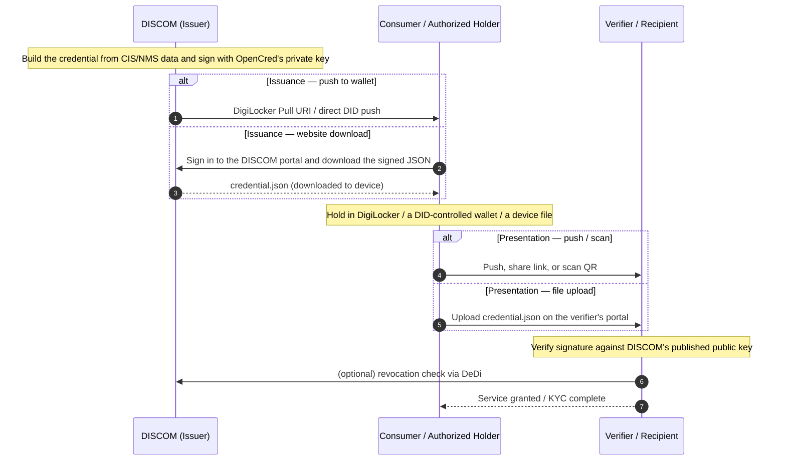

# Discover+Exchange

> **Steps 2 and 3 of the three IES steps.** *Discover*: before every exchange, both systems look each other up, confirm the other is genuine, and agree on what will be exchanged and on what terms — no one-off, pre-negotiated integration needed. *Exchange*: the data then moves using agreed field names and structure — the **Taxonomy** — and, where the use case needs a durable record, as a **verifiable credential** the holder keeps and can re-present anywhere.

Once participants are [Registered](register.md) (Step 1), IES gives them two ways to move data. They solve different problems, and a participant adopts whichever its use cases need.

---

## Two rails, two kinds of trust

| | **B2B data exchange** (this page) | **B2C credentials** ([Issue Credentials](../how-you-implement-ies/issue-credentials.md)) |
|---|---|---|
| **What moves** | Structured datasets — meter telemetry, regulatory filings, tariff data, trade offers | Signed attestations — a consumer's connection record, a meter digest |
| **Between whom** | Two **registered organisations** that know who they are transacting with | An issuer and **any third party** — a bank, a marketplace, a housing society — that the issuer has never met |
| **Trust layer** | **Bilateral, anchored in DeDi.** Each side resolves the other's subscriber record, verifies its message signature, and checks that both belong to the same curated network. The network operator (NFO) maintains that membership boundary. | **Unilateral, anchored in `did:web`.** The issuer signs once; any verifier, anywhere, fetches the issuer's published key over HTTPS and checks the signature — no membership, no prior relationship, no callback to the issuer. |
| **Channel** | Must ride a **trust-bounded open network** — IES uses [Beckn Protocol v2](https://github.com/beckn/protocol-specifications-v2) — because discovery, negotiation, consent and the signed audit trail are part of the exchange itself | **Any channel** — DigiLocker, a web portal, email, SMS, chat. The trust travels inside the credential, not the pipe. |
| **Typical use cases** | [Smart Meter Data Exchange](../use-cases/smart-meter-data-exchange/README.md), [Regulatory Filing](../use-cases/discom-regulatory-filing/README.md), [P2P Trading](../use-cases/p2p-energy-trading/README.md) | [Consumer Energy Passport](../use-cases/consumer-energy-passport/README.md), [Consumer Meter Digest](../use-cases/consumer-meter-digest/README.md) |

This page covers both: the **B2B rail** (the Beckn interaction) and the **Taxonomy** that both rails share come first, then the **B2C rail** — [Energy credentials](#energy-credentials-the-b2c-rail) — in depth. The hands-on issue/verify/revoke steps live in **[Issue Credentials](../how-you-implement-ies/issue-credentials.md)**.

---

## Discover — find, agree, and sign without a pre-negotiated integration

Energy data in India moves through bespoke point-to-point channels today — PDF filings, vendor-locked exports, one-off API integrations. A bespoke REST API per counterparty is exactly the n×m problem IES is solving. (Note: the *trust* here is still bilateral — each side verifies the other — but the wiring is not; you build to the protocol once, not to each partner.) Beckn is a single, open, **asynchronous and peer-to-peer** interaction protocol that any party builds to once and uses against every counterparty:

| Concern | What Beckn provides |
|---|---|
| Discovery | Either party can publish a catalogue of what it offers (datasets, credentials, dispatch programmes) and other parties can query it. |
| Negotiation | A standard `select` / `init` round-trip lets the two sides agree on quantity, price, SLA, delivery method. |
| Commitment | A signed `confirm` / `on_confirm` round-trip **is the contract**. The signed envelope is the non-repudiable record of agreement. |
| Status and delivery | `status` / `on_status` carry asynchronous fulfilment — including payload delivery, pagination, settlement updates. |
| Consent and audit | Every message is signed; every leg leaves a tamper-evident receipt. |

There is no central broker: the network operator curates the membership list, but every message flows directly between participants. The wire and the lifecycle are the same whether the payload is meter telemetry, a regulatory filing, a tariff order, or a peer-to-peer energy trade.

### The lifecycle at a glance

| Phase | BAP — the consumer side ([Beckn Application Platform](../glossary.md#bap)) calls | BPP — the provider side ([Beckn Provider Platform](../glossary.md#bpp)) responds | When you need it |
|---|---|---|---|
| Discovery | `discover` | `on_discover` | Consumer doesn't yet know which provider to contract with |
| Negotiation | `select` / `init` | `on_select` / `on_init` | Terms need agreeing before commitment |
| Commitment | `confirm` | `on_confirm` | **The minimal flow** — payload can be delivered inline here |
| Delivery | `status` | `on_status` | Payload prepared asynchronously, or paged across messages |
| Post-fulfilment | `update` | `on_update` | Amendments, credential rotation |

**Minimal viable exchange:** `confirm` → `on_confirm`, with the dataset embedded in the callback. Everything else is optional; each [use-case guide](../use-cases/README.md) lists which actions it actually exercises. Small datasets ride **inline** in the message (the IES default — end-to-end verifiable); large ones hand off to an established channel (signed URL, MQTT, Kafka, SFTP) agreed inside the same contract, so every exchange gets the same signed-audit story. Wire-level detail — message envelope, correlation rules, pagination, `accessMethod` values — is in the [Setup Discovery+Exchange appendices](../how-you-implement-ies/setup-discovery-exchange.md#appendices).

### The IES networks

IES currently operates three Beckn networks (each with a `test-` twin for onboarding and certification) under the `indiaenergystack.in` namespace: **data sharing**, **P2P trading**, and **DER integration**. Membership is per-network and per-environment; the adapter rejects messages from outside the configured boundary. The registry mechanics are in [Register — The directory: DeDi](register.md#the-directory-dedi); how to get listed is [Setup Register §1.7](../how-you-implement-ies/setup-register.md#id-1.7-beckn-participants-get-referenced-into-an-ies-network).

---

## Exchange — the Taxonomy

Whichever rail data moves on, it uses agreed field names and structure. IES calls that vocabulary the **[Taxonomy](taxonomy.md)** — every domain object, what it is for, which use cases combine it, how it evolves, and how to propose a new one. The shape of each object is one canonical **schema** (field names, types, units, optionality), published as JSON Schema + a JSON-LD context.

**IES does not write new standards.** It picks the right open standard for each domain — DLMS/COSEM for meter data, IEEE 2030.5 for solar and storage, OpenADR for demand response, CIM for grid models — and publishes a faithful schema on top. A schema is valid whether or not the payload ever travels over Beckn: the same `MeterData` object can ride a Beckn `on_confirm`, sit inside a signed `MeterDataCredential`, or be validated standalone.

Some objects are plain data payloads (they ride the Beckn wire); others are **W3C Verifiable Credentials** — the B2C rail, covered in depth just below.

**Don't hand-map schemas to use cases here** — that lives in one place: the [Taxonomy schema map](taxonomy.md#schema-map) (which schema, which use cases, current version) and the plain-language **[Schemas Overview](schemas-overview/README.md)** pages (the *why* before the field-level reference). The wire envelope itself accepts any JSON payload; validation is opt-in per object, driven by the payload's own `@context` / `@type` declaration.

---

## Energy credentials — the B2C rail

When a DISCOM hands a consumer a digital electricity attestation, or shares meter readings with a bank or a marketplace, the receiver needs to answer one question on its own: *"Is this really from the DISCOM, intact, and still valid?"* A **Verifiable Credential** answers it without a callback: a small JSON object the DISCOM signs with the private key behind its `did:web`. Anyone can fetch the DISCOM's `did.json` over HTTPS, check the signature, and consult a public revocation list. That is what makes credentials **B2C** — the verifier can be *anyone*, known to the issuer or not, and the credential travels over *any* channel (DigiLocker, a portal download, email, SMS, chat) because the trust is inside the object, not the pipe. No Beckn network is involved.

Three credentials cover almost everything IES does:

| Credential | What it attests | Who signs | Typical receiver |
|---|---|---|---|
| **[ElectricityCredential v1.2](https://india-energy-stack.gitbook.io/docs/schemas/electricitycredential/v1.2)** | A service connection — customer number, sanctioned load, tariff, meter info, energy resources (rooftop solar, BESS, EV chargers) | DISCOM | The consumer's wallet, or a verifier (bank, marketplace, regulator) the consumer shares it with |
| **[MeterDataCredential v0.6](https://india-energy-stack.gitbook.io/docs/schemas/meterdatacredential/v0.6)** | A signed meter-reading payload (raw `MeterData` profiles or derived summaries) for a period | AMISP, MDM, or DISCOM | DISCOM (B2B telemetry) or the consumer (their own readings) |
| **[MeterDataRequestCredential v0.1](https://india-energy-stack.gitbook.io/docs/schemas/meterdatarequestcredential/v0.1)** | A signed request for meter data — proves the requester has the right to ask | Seeker (typically a DISCOM) | Provider (typically an AMISP); the one credential that rides *inside* a Beckn `confirm` |

### Lifecycle

**Issued** (issuer signs and emits) ─► **Held** (wallet / DigiLocker / file) ─► **Presented** (shared raw or in a Verifiable Presentation) ─► **Verified** (signature + optional regulator `idRef` + revocation + validity window) ─► **Revoked** (issuer publishes a hash in the DeDi revocation registry) or **Expired** (`validUntil` passes; re-issue on material change rather than relying on long windows).

### Variants — same schemas, different issuance shapes

**No new VC `type` values are introduced** — each variant is an issuance configuration over an existing schema.

| Pattern | Schema | `credentialSubject.id` | `validUntil` | Issued by |
|---|---|---|---|---|
| Bearer ElectricityCredential | `ElectricityCredential/v1.2` | absent | years | DISCOM |
| Consumer Energy Passport | `ElectricityCredential/v1.2` | wallet `did:key` (+ `customerProfile.idRef`) | years | DISCOM |
| B2B MeterDataCredential | `MeterDataCredential/v0.6` | absent | hours to days | AMISP / MDM |
| Consumer Meter Digest | `MeterDataCredential/v0.6` | wallet `did:key` | hours to days | DISCOM (on consumer demand) |
| Meter-data request | `MeterDataRequestCredential/v0.1` | absent | minutes (per Beckn message) | Seeker (typically DISCOM) |

The **[Consumer Energy Passport](../use-cases/consumer-energy-passport/README.md)** and **[Consumer Meter Digest](../use-cases/consumer-meter-digest/README.md)** use cases are the holder-bound shapes of the first two.

### Trust model

A credential's trust chain has at most two legs, plus two freshness checks:

1. **Mandatory** — the issuer's `did:web` signature. The verifier resolves `issuer.id` over HTTPS to `did.json`, extracts the public key, and verifies `proof`. If this fails, stop.
2. **Optional** — the regulator's licensing assertion in `issuer.idRef`. When present, the verifier resolves the regulator's `did:web` and confirms it vouches for the DISCOM; when absent (pilots, non-regulated issuers), the verifier falls back to out-of-band recognition of the `did:web`.
3. **Revocation status** — the URL in `credentialStatus.id`, resolved against the issuer's DeDi revocation registry.
4. **Validity window** — `validFrom ≤ now ≤ validUntil`.

Holder-bound variants add a fifth check at presentation time: the wallet signs a Verifiable Presentation with the key matching `credentialSubject.id`, embedding a fresh `challenge` and `domain`. No IES-curated registry sits between the credential and the verifier — the IES network registries are the Beckn-side (B2B) trust boundary only ([Register — Two identities](register.md#two-identities-youll-set-up-and-why)).

**To issue, verify, revoke, and deliver credentials** — the operational walkthrough, holder-binding patterns, proof formats, and DigiLocker delivery — go to **[Issue Credentials](../how-you-implement-ies/issue-credentials.md)**.

---

## What you set up

For an IES participant, this page turns into three pieces of work, all in **[How you implement IES](../how-you-implement-ies/README.md)**:

1. **A Beckn adapter** — the ready-made [ONIX](../glossary.md#onix) reference software (the standard software every participant runs to speak Beckn), plus your subscriber identity and network membership: [Setup Discovery+Exchange](../how-you-implement-ies/setup-discovery-exchange.md) (network identity itself is part of [Setup Register §1.5–1.7](../how-you-implement-ies/setup-register.md#id-1.5-beckn-participants-generate-your-beckn-signing-keypair)).
2. **A credential engine**, if your use cases issue credentials — [Issue Credentials](../how-you-implement-ies/issue-credentials.md).
3. **An internal-facing mapping** — the small adapter layer that translates between your internal systems (CIS, MDM, billing, DERMS) and the IES schemas, feeding ONIX and/or OpenCred: [Build your Internal-facing Adapter](../how-you-implement-ies/build-adapter.md).

For how schemas evolve and how to propose a new one: **[Taxonomy](../schemas/README.md)**.

---

## Where this fits

| Step | Page |
|---|---|
| Step 1 — [Register](register.md) | Identity + directory |
| Steps 2+3 — Discover+Exchange *(this page)* | — |
