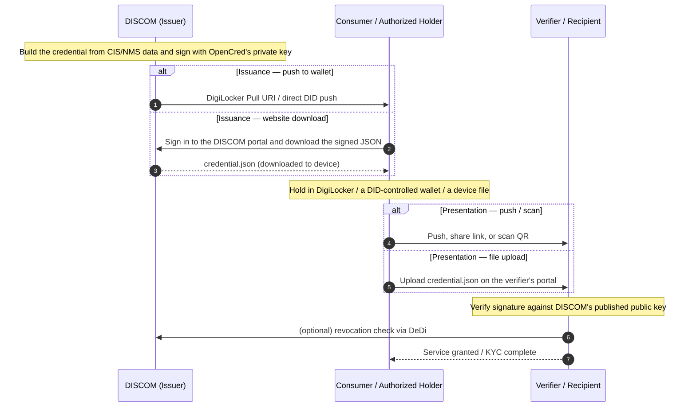

# Energy Credentials

The trust layer: W3C Verifiable Credentials, signed by a DISCOM's `did:web`, delivered via wallet (DigiLocker or DID-aware) or carried inline in a data exchange. Reference for the credential lifecycle, the variants IES uses (`ElectricityCredential`, `MeterDataCredential`, `MeterDataRequestCredential`), and the issue / verify / revoke commands with [OpenCred](../../glossary.md#opencred).

For first-time setup — OpenCred, `did.json`, a DeDi namespace — follow **[Setup Register](../../how-you-implement-ies/setup-register.md)** and **[Build your Internal-facing Adapter](../../how-you-implement-ies/build-adapter.md)** first.

> **About the walkthrough.** Commands below use **[OpenCred](../../glossary.md#opencred)** — see the glossary for what it is and its W3C/DeDi integration. Any W3C-compliant pipeline publishing the same `did.json` and VC-2.0 proofs is a drop-in replacement.

---

## Why credentials

When a DISCOM hands a consumer a digital attestation, or shares meter readings with a regulator or marketplace, the receiver must answer one question alone: *"Is this from the DISCOM, intact, and still valid?"* A system requiring a callback doesn't scale and isn't verifiable.

A **Verifiable Credential** is a small JSON object signed with the private key behind your `did:web`. Anyone — wallet, DISCOM, bank, regulator — fetches your `did.json` over HTTPS, checks the signature, and consults a public revocation list. No callback needed.

Three credentials cover almost everything IES does:

| Credential | What it attests | Who signs | Typical receiver |
|---|---|---|---|
| **[ElectricityCredential v1.2](https://india-energy-stack.gitbook.io/docs/schemas/electricitycredential/v1.2)** | A service connection — customer number, sanctioned load, tariff, meter info, energy resources (rooftop solar, BESS, EV chargers) | DISCOM | The consumer's wallet, or a verifier (bank, marketplace, regulator) the consumer shares it with |
| **[MeterDataCredential v0.6](https://india-energy-stack.gitbook.io/docs/schemas/meterdatacredential/v0.6)** | A signed meter-reading payload (raw `MeterData` profiles or derived summaries) for a specified period | AMISP, MDM, or DISCOM | DISCOM (B2B telemetry) or the consumer (their own readings) |
| **[MeterDataRequestCredential v0.1](https://india-energy-stack.gitbook.io/docs/schemas/meterdatarequestcredential/v0.1)** | A signed request for meter data — proves the requester has the right to ask | Seeker (typically a DISCOM) | Provider (typically an AMISP) at Beckn `confirm` time |

### Lifecycle at a glance



## Pick your role

| If you are… | Read | Then |
|---|---|---|
| **A DISCOM / issuer** (you sign and emit credentials) | [Prerequisites](#prerequisites) → [Issue your first credential](#issue-your-first-credential) → [Build your Internal-facing Adapter](../../how-you-implement-ies/build-adapter.md) | [Credential variants](#credential-variants), [Appendix B — Operational notes](#appendix-b-operational-notes) |
| **An AMISP / MDM / aggregator** (you sign telemetry) | [Prerequisites](#prerequisites) → [Issue your first credential](#issue-your-first-credential) using `MeterDataCredential` | [Smart Meter Data Exchange use case](../../use-cases/smart-meter-data-exchange/README.md) |
| **A holder / wallet** (you hold credentials on behalf of a consumer) | [Holder binding](#holder-binding) → [DigiLocker delivery](#digilocker-delivery) | [Identifiers — Appendix F](../identifiers/README.md#appendix-f-binding-the-credential-to-a-holder-identity) for binding patterns |
| **A verifier** (you receive and check credentials) | [Verify](#id-3.-verify), [Revocation check](#id-4.-revoke) → [Appendix A — Trust model](#appendix-a-trust-model) | [Registries — Verifying a credential](../registries/README.md#appendix-b-verifying-a-credential-end-to-end) for the resolution walk |

---

## Prerequisites

To issue, you need:

1. **A domain or subdomain you control**, able to host one small static file — the host portion of your `did:web`. See [Identifiers — (a) Org identity](../identifiers/README.md#a-org-identity-for-credentials-and-data-exchange-payloads).
2. **A DeDi namespace** under your verified domain. See [Setup Register](../../how-you-implement-ies/setup-register.md). OpenCred auto-creates the four registries it needs (`vc-revocation-registry`, `opencred-key-registry`, `schema_registry`, `context_registry`) on first boot.
3. **Docker 24+**, plus `curl`, `jq`, `openssl`, ~2 GB free disk. The container ships ready to issue.
4. *(Optional, recommended for licensed utilities)* **A regulator's licensing pointer** for `issuer.idRef` — the regulator's `did:web` and licence identifier for your DISCOM. Omit for pilots / non-regulated issuers.
5. **A signed payload schema in mind.** Default: [ElectricityCredential v1.2](https://india-energy-stack.gitbook.io/docs/schemas/electricitycredential/v1.2). For telemetry: [MeterDataCredential v0.6](https://india-energy-stack.gitbook.io/docs/schemas/meterdatacredential/v0.6).

> **No IES-side DISCOM-registry entry is required to issue credentials.** That registry is the inter-DISCOM data exchange network's trust boundary, not a credential prerequisite. See [Registries — IES networks today](../registries/README.md#ies-networks-and-registries-today).

---

## Set up OpenCred and publish your `did:web`

One JSON file on a web server you already run, plus the [OpenCred](../../glossary.md#opencred) container signing with the matching private key. Six steps, ~15 minutes end-to-end.

### 1. Pull the OpenCred image

```bash
docker pull ghcr.io/nfh-trust-labs/opencred/opencred-server:latest
docker tag  ghcr.io/nfh-trust-labs/opencred/opencred-server:latest opencred:bootcamp
```

### 2. Generate a signing key and API token

The same EC P-256 key works for both `did:web` and `did:key`; only the DID method OpenCred presents it as differs.

```bash
mkdir -p ~/opencred/keys
cd ~/opencred

openssl genpkey -algorithm EC -pkeyopt ec_paramgen_curve:P-256 \
  -out keys/issuer-key.pem
chmod 600 keys/issuer-key.pem

export OPENCRED_API_KEY="$(openssl rand -base64 32)"
echo "Save this: $OPENCRED_API_KEY"
```

Keep `issuer-key.pem` in your KMS in production, treated like a TLS private key.

### 3. Run OpenCred in `did:web` mode

```bash
docker run -d \
  --name opencred \
  -p 3100:3100 \
  -e OPENCRED_API_KEY="$OPENCRED_API_KEY" \
  -e OPENCRED_KEY_PATH=/secrets/issuer-key.pem \
  -e OPENCRED_ISSUER_DID_METHOD=web \
  -e OPENCRED_ISSUER_DOMAIN=ies.discom.example \
  -v "$HOME/opencred/keys/issuer-key.pem:/secrets/issuer-key.pem:ro" \
  --read-only --cap-drop ALL \
  opencred:bootcamp

curl -s http://localhost:3100/v1/health | jq
# expect "signingKeyLoaded": true
```

> **Want offline-verifiable identity instead?** Drop `OPENCRED_ISSUER_DID_METHOD` and `OPENCRED_ISSUER_DOMAIN` and OpenCred defaults to `did:key` mode — same key, same API, only the reported `did:` string changes. Good for early testing, demos, consumer wallets. See [Identifiers — `did:key`](../identifiers/README.md#did-key-what-wallets-give-consumers).

### 4. Assemble your `did.json` from the container

The DID document needs the **public JWK** of your signing key. The keys endpoint reports key metadata:

```bash
curl -s http://localhost:3100/v1/keys \
  -H "Authorization: Bearer $OPENCRED_API_KEY" | jq '.keys[0]'
```

OpenCred currently returns key *metadata* here (`id`, `algorithm`, `fingerprint`), not `x`/`y`. Derive the JWK from your key — the public half of what OpenCred signs with:

```bash
python3 - <<'PY'
import subprocess, base64, json
der = subprocess.run(["openssl", "pkey", "-in", "keys/issuer-key.pem", "-pubout", "-outform", "DER"],
                     capture_output=True, check=True).stdout
pt = der[-65:]                       # uncompressed EC point: 0x04 || X(32) || Y(32)
b64u = lambda b: base64.urlsafe_b64encode(b).rstrip(b"=").decode()
print(json.dumps({"kty": "EC", "crv": "P-256", "x": b64u(pt[1:33]), "y": b64u(pt[33:65])}))
PY
```

Drop that JWK into the standard DID document template:

```json
{
  "@context": [
    "https://www.w3.org/ns/did/v1",
    "https://w3id.org/security/suites/jws-2020/v1"
  ],
  "id": "did:web:ies.discom.example",
  "verificationMethod": [{
    "id": "did:web:ies.discom.example#key-0",
    "type": "JsonWebKey",
    "controller": "did:web:ies.discom.example",
    "publicKeyJwk": { "kty": "EC", "crv": "P-256", "x": "...", "y": "..." }
  }],
  "authentication":  ["did:web:ies.discom.example#key-0"],
  "assertionMethod": ["did:web:ies.discom.example#key-0"]
}
```

Three fields matter:

- **`verificationMethod`** — the public key verifiers use to check signatures.
- **`assertionMethod`** — which key may issue credentials.
- **`authentication`** — which key may sign requests on behalf of the DID.

Add a `service` array later once your Beckn BPP/OpenCred endpoints are publicly addressable — the DID is valid without it.

### 5. Publish the file

Upload it so this URL returns the JSON:

```
https://ies.discom.example/.well-known/did.json
```

`.well-known/` is the standard convention verifiers check. A normal TLS cert suffices — no redirect.

### 6. Verify it from the outside

```bash
curl -s https://ies.discom.example/.well-known/did.json | jq .id
# "did:web:ies.discom.example"
```

If that prints your DID, you're done — any participant can resolve `did:web:ies.discom.example` and verify credentials you sign. Move on to [Issue your first credential](#issue-your-first-credential).

---

## Issue your first credential

The bootcamp-aligned step-by-step: five steps from a running OpenCred to a signed, revocable ElectricityCredential v1.2.

### 1. Confirm the issuer DID OpenCred reports

```bash
export OPENCRED_API_KEY="…"   # from your secret manager
export ISSUER_DID="$(curl -s http://localhost:3100/v1/keys \
  -H "Authorization: Bearer $OPENCRED_API_KEY" | jq -r '.keys[0].id | split("#")[0]')"
echo "$ISSUER_DID"
# did:web:ies.discom.example
```

In `did:key` mode this prints `did:key:z…` instead — the rest of the flow is identical.

### 2. Issue

Default: **bearer-style** (no `credentialSubject.id`), mirroring the [OpenCred bootcamp](https://opencred.gitbook.io/docs/bootcamp/local-docker). For consumer-facing flows, bind to a holder identifier instead — see [Holder binding](#holder-binding).

```bash
curl -s http://localhost:3100/v1/credentials/issue \
  -H "Authorization: Bearer $OPENCRED_API_KEY" \
  -H "Content-Type: application/json" \
  -d "{
    \"schemaId\":    \"ies/electricity-credential/v1.2\",
    \"issuerDid\":   \"$ISSUER_DID\",
    \"proofFormat\": \"vc-jwt\",
    \"validFrom\":   \"2026-04-01T00:00:00+05:30\",
    \"validUntil\":  \"2031-04-01T00:00:00+05:30\",
    \"credentialSubject\": {
      \"customerProfile\": {
        \"customerNumber\": \"DISCOM-2025-00987654\",
        \"energyResources\": [{
          \"id\":   \"did:web:ies.discom.example:assets:meter:MET-IMPORT-001\",
          \"type\": \"METER\",
          \"attributes\": {\"meterCapability\": \"AMI\", \"energyDirection\": \"Forward\"}
        }],
        \"consumptionProfiles\": [{
          \"meterId\":            \"did:web:ies.discom.example:assets:meter:MET-IMPORT-001\",
          \"sanctionedLoad\":     {\"value\": 10, \"unit\": \"kW\"},
          \"tariffCategoryCode\": \"DS-I\",
          \"premisesType\":       \"Residential\",
          \"connectionType\":     \"Single-phase\"
        }]
      },
      \"customerDetails\": {
        \"fullName\":              \"Arjun Mehra\",
        \"installationAddress\": {
          \"geo\": {
            \"type\": \"Point\",
            \"coordinates\": [-122.4194, 37.7749]
          },
          \"address\": {
            \"streetAddress\": \"123 Energy Street, Unit 4\",
            \"addressLocality\": \"Metro City\",
            \"addressRegion\": \"Example State\",
            \"postalCode\": \"12345\",
            \"addressCountry\": \"US\"
          }
        },
        \"serviceConnectionDate\": \"2018-07-15T00:00:00+05:30\"
      }
    }
  }" | tee credential.json | jq .credential
```

Worth noting:

- **Asset IDs are `did:web` under your own domain**, colon-path segments (`did:web:ies.discom.example:assets:meter:<slno>`) — same pattern for transformers, feeders, substations, see [Identifiers — Asset patterns](../identifiers/README.md#appendix-c-identifying-assets-meters-connections-datasets). No per-asset `did.json` hosting needed.
- **`issuer.idRef` is optional.** OpenCred fills `issuer` with the DID string only; your integration service appends `name`/`idRef` on egress and re-signs if needed.
- **`credentialSubject.id` is absent** — the bearer-style default. Set it to a wallet `did:key` or `tel:+91...` URI for holder-bound issuance — see [Identifiers — Holder binding](../identifiers/README.md#appendix-f-binding-the-credential-to-a-holder-identity).

### 3. Verify

```bash
jq -n --arg c "$(jq -r '.credential.proof.jwt' credential.json)" '{credential: $c}' | \
  curl -s http://localhost:3100/v1/credentials/verify \
    -H "Authorization: Bearer $OPENCRED_API_KEY" \
    -H "Content-Type: application/json" \
    -d @- | jq
# expect "valid": true
```

For `vc-jwt`, verify takes the compact JWS string (`.credential.proof.jwt`), not the JSON envelope; for `data-integrity` proofs, send the full credential JSON. Full verification flow — issuer signature, regulator licensing assertion if cited, revocation status — in [Appendix A](#appendix-a-trust-model).

### 4. Revoke

OpenCred publishes revocation as a hash in your DeDi revocation registry; the verifier reads `credentialStatus` and looks up the hash. DeDi stores **only revoked** hashes — lookup returns `200` when revoked, `404` when not. For `credentialStatus` to appear, pass `revocationRegistryUrl` at issue (as the [MeterDataCredential](#meterdatacredential-v0.6-telemetry-signing) and [MeterDataRequestCredential](#meterdatarequestcredential-v0.1-proof-of-right-to-ask) examples do); the default issue above omits it.

```bash
# Compute the revocation hash
HASH=$(jq '{credential: .credential}' credential.json | \
  curl -s http://localhost:3100/v1/credentials/revocation-hash \
    -H "Authorization: Bearer $OPENCRED_API_KEY" \
    -H "Content-Type: application/json" -d @- | jq -r .revocationHash)

# Revoke
curl -s http://localhost:3100/v1/credentials/revoke \
  -H "Authorization: Bearer $OPENCRED_API_KEY" \
  -H "Content-Type: application/json" \
  -d "{\"hash\": \"$HASH\", \"reason\": \"connection-terminated\"}" | jq

# Check status
curl -s http://localhost:3100/v1/credentials/revocation-status \
  -H "Authorization: Bearer $OPENCRED_API_KEY" \
  -H "Content-Type: application/json" \
  -d "{\"hash\": \"$HASH\"}" | jq
```

Revocation requires the relevant `OPENCRED_DEDI_*` env vars on the container (`OPENCRED_DEDI_BASE_URL`, `OPENCRED_DEDI_AUTH_TYPE`, `OPENCRED_DEDI_API_KEY`, `OPENCRED_DEDI_NAMESPACE`). See [OpenCred Revocation](https://opencred.gitbook.io/docs/concepts/revocation) for the conceptual model.

### 5. Smoke test

A passing integration test should:

1. Issue a credential.
2. Resolve `issuer.id` (`did.json` over HTTPS) and confirm the public key matches the one that signed `proof`.
3. *(If `issuer.idRef` is present)* Resolve `issuer.idRef.issuedBy` and confirm the regulator vouches for your DISCOM.
4. `POST /v1/credentials/verify` — expect `valid: true`.
5. Check `revocation-status` — expect not revoked.
6. Revoke.
7. Re-check `revocation-status` — expect revoked.

Run on every release — it exercises every leg of the trust chain.

---

## Credential variants

Same schemas, several use cases. **No new VC `type` values** — variants are issuance configurations over the existing schemas.

### ElectricityCredential v1.2 — the default

A DISCOM-signed attestation about a service connection. Carries `customerProfile` (non-PII: customer number, energy resources, consumption profile), `customerDetails` (optional PII: name, address, service-connection date), and the issuer block.

Two common shapes:

**Bearer / counter-issued** (no `credentialSubject.id`) — anyone holding the JSON is treated as the subject. Used for paper-style attestations, demos, in-person verification. What the bootcamp walkthrough above produces.

**Holder-bound, consumer-presentable** — the **Consumer Energy Passport** pattern. Same schema, but:
- `credentialSubject.id` = the consumer's wallet `did:key` (or `did:jwk`).
- `customerProfile.idRef` carries a verifiable government-ID reference (Aadhaar offline KYC, DigiLocker pull, etc.) — **the reference**, never the raw number.
- At presentation, the verifier issues a challenge, the wallet signs a Verifiable Presentation, and the verifier confirms the presenter holds the matching private key. See [Identifiers — Pattern 1](../identifiers/README.md#pattern-1-wallet-did-cryptographic-recommended-where-a-wallet-exists).

The Consumer Energy Passport use case ([use-cases/consumer-energy-passport/](../../use-cases/consumer-energy-passport/README.md)) covers *who*, *when*, and *why*; the credential itself is an ElectricityCredential v1.2.

### MeterDataCredential v0.6 — telemetry signing

A signed VC wrapping a [MeterData v0.6](https://india-energy-stack.gitbook.io/docs/schemas/meterdata/v0.6) payload (raw `INTERVAL`/`DAILY`/`MONTHLY` profiles or derived summaries) for a specified period. Issued by the AMISP or MDM, typically B2B to a DISCOM, delivered over Beckn at [`on_status`](../data-exchange/README.md#what-you-can-exchange-schema-families). Schema: [MeterDataCredential v0.6](https://india-energy-stack.gitbook.io/docs/schemas/meterdatacredential/v0.6).

Same `POST /v1/credentials/issue` flow as above — `schemaId` is **`ies/meter-data-credential/v0.6`**, and `credentialSubject.meterData` carries the `MeterData` payload (profile object or array — see the [v0.6 examples](https://india-energy-stack.gitbook.io/docs/schemas/meterdata/v0.6)). Pass `revocationRegistryUrl` (your DeDi revocation registry, addressed by namespace DID **or** verified domain) so the credential carries a checkable `credentialStatus` (see [Revoke](#id-4.-revoke)):

```bash
curl -s http://localhost:3100/v1/credentials/issue \
  -H "Authorization: Bearer $OPENCRED_API_KEY" \
  -H "Content-Type: application/json" \
  -d "{
    \"schemaId\":     \"ies/meter-data-credential/v0.6\",
    \"issuerDid\":    \"$ISSUER_DID\",
    \"proofFormat\":  \"vc-jwt\",
    \"validFrom\":    \"2026-06-28T00:00:00+05:30\",
    \"validUntil\":   \"2026-07-05T00:00:00+05:30\",
    \"revocationRegistryUrl\": \"https://api.dedi.global/dedi/query/<your-namespace>/vc-revocation-registry\",
    \"credentialSubject\": {
      \"meterData\": { \"@type\": \"DailyProfile\", \"profileType\": \"DAILY\", \"…\": \"a MeterData v0.6 profile or array\" }
    }
  }" | tee credential.json | jq .credential
```

Two common shapes:

**B2B**, typically without `credentialSubject.id`. The AMISP signs; the DISCOM consumes the payload at Beckn `on_status`.

**Holder-bound, consumer-presentable** — the **Consumer Meter Digest** pattern. `credentialSubject.id` = the consumer's wallet DID, `validUntil` is short (hours to days), covering a period the consumer asked for. Delivered into the wallet / DigiLocker; verifiers check it without phoning the DISCOM. Use case: [use-cases/consumer-meter-digest/](../../use-cases/consumer-meter-digest/README.md).

### MeterDataRequestCredential v0.1 — proof of right-to-ask

A signed VC carried at Beckn [`confirm`](../data-exchange/README.md#id-3.-send-confirm) time by a seeker (typically a DISCOM) when an AMISP's offer policy requires it, proving the seeker is authorised to request the data. Schema: [MeterDataRequestCredential v0.1](https://india-energy-stack.gitbook.io/docs/schemas/meterdatarequestcredential/v0.1).

Not in OpenCred's built-in registry, so issue it with **`inlineSchema`** rather than `schemaId`: pass the JSON Schema in the request, and OpenCred validates `credentialSubject` against it, writes the `$id`, and signs. Here we reuse the published MeterDataRequest `$defs` to keep the inline schema canonical:

```bash
# pull the MeterDataRequest v0.6 $defs and wrap them as the credentialSubject schema
REQ_DEFS=$(curl -s https://india-energy-stack.github.io/ies-accelerator/schemas/MeterDataRequest/v0.6/schema.json | jq '.["$defs"]')

jq -n --argjson defs "$REQ_DEFS" --arg iss "$ISSUER_DID" '{
  inlineSchema: {
    "$id": "https://india-energy-stack.github.io/ies-accelerator/schemas/MeterDataRequestCredential/v0.1/schema.json",
    type: "object", required: ["meterDataRequest"],
    properties: {
      id: { type: "string", format: "uri" },
      meterDataRequest: { "$ref": "#/$defs/MeterDataRequestObject" }
    },
    "$defs": $defs
  },
  issuerDid: $iss,
  proofFormat: "vc-jwt",
  validFrom: "2026-06-28T00:00:00+05:30",
  validUntil: "2026-12-28T00:00:00+05:30",
  revocationRegistryUrl: "https://api.dedi.global/dedi/query/<your-namespace>/vc-revocation-registry",
  credentialSubject: {
    meterDataRequest: {
      "@context": "https://india-energy-stack.github.io/ies-accelerator/schemas/MeterDataRequest/v0.6/context.jsonld",
      "@type": "MeterDataRequest",
      scope: "ResourceOnly",
      from: "2026-06-04T00:00:00Z",
      duration: "P6M",
      maxRecordsShared: 10000,
      capabilitiesRequested: { profiles: [ { profileType: "CustomerProfile" }, { profileType: "IntervalProfile" } ] }
    }
  }
}' | curl -s http://localhost:3100/v1/credentials/issue \
  -H "Authorization: Bearer $OPENCRED_API_KEY" -H "Content-Type: application/json" -d @- | jq .credential
```

`scope` must be one of the `ScopeType` enum (`ResourceOnly`, `ResourceAndChildren`, `ChildrenOnly`). The seeker embeds the credential in the `confirm` message's receiver participant; the provider's adapter verifies it before fulfilling. Full did:web walkthrough plus ready-to-send `confirm` payloads: [DEG data-exchange devkit](https://github.com/beckn/DEG/tree/main/devkits/data-exchange/uc1-meter-data).

### Summary

| Pattern | Schema | `credentialSubject.id` | `validUntil` | Issued by |
|---|---|---|---|---|
| Bearer ElectricityCredential | `ElectricityCredential/v1.2` | absent | years | DISCOM |
| Consumer Energy Passport | `ElectricityCredential/v1.2` | wallet `did:key` (+ `customerProfile.idRef`) | years | DISCOM |
| B2B MeterDataCredential | `MeterDataCredential/v0.6` | absent | hours to days | AMISP / MDM |
| Consumer Meter Digest | `MeterDataCredential/v0.6` | wallet `did:key` | hours to days | DISCOM (on consumer demand) |
| Meter-data request | `MeterDataRequestCredential/v0.1` | absent | minutes (per Beckn message) | Seeker (typically DISCOM) |

---

## Holder binding

Holder binding turns a credential from a bearer token into something only the consumer's wallet can present. Choose a pattern (wallet DID, `tel:+91...` URI, or DigiLocker-mediated) per the consumer's situation. **Identity-proofing at issuance is mandatory** — verify the consumer controls the identifier before embedding it.

Full guidance: [Identifiers — Appendix F](../identifiers/README.md#appendix-f-binding-the-credential-to-a-holder-identity).

---

## DigiLocker delivery

DigiLocker is the dominant consumer wallet in India. An issued ElectricityCredential or MeterDataCredential can be delivered into a consumer's DigiLocker via a Pull URI; any verifier reading from DigiLocker inherits its Aadhaar-mediated identity binding.

Walkthrough (Pull URI shape, callback flow, signature pinning, common failure modes): [digilocker.md](digilocker.md).

---

## Setup checklist

The phased rollout from zero to production-issuing is in **[Build your Internal-facing Adapter](../../how-you-implement-ies/build-adapter.md)** and **[Conformance Checklist](../../how-you-implement-ies/conformance.md)**. Variant-specific operational items (holder binding, identity proofing, DigiLocker delivery) live in the per-use-case guide — **[Consumer Energy Passport](../../use-cases/consumer-energy-passport/README.md)**, **[Consumer Meter Digest](../../use-cases/consumer-meter-digest/README.md)**.

---

## Appendix A — Trust model

A credential's trust chain has at most two legs:

1. **Mandatory** — the issuer's `did:web` signature. The verifier resolves `issuer.id` over HTTPS to `did.json`, extracts the public key, and verifies `proof`. If this fails, stop: forged or corrupted.
2. **Optional** — the regulator's licensing assertion in `issuer.idRef`. When present, the verifier resolves `issuer.idRef.issuedBy` (the regulator's `did:web`) and confirms it vouches for the DISCOM under the cited `subjectId`. When absent (pilots, non-regulated issuers), the verifier falls back to out-of-band recognition of your `did:web`.

Plus a freshness check:

3. **Revocation status.** GET the URL in `credentialStatus.id` (typically `https://api.dedi.global/dedi/lookup/<discom>/vc-revocation-registry/<credential-id>`). Not-found / `not_revoked` ⇒ valid; `revoked` ⇒ reject.

And a validity-window check:

4. **`validFrom <= now <= validUntil`.**

Consumer Energy Passport and Consumer Meter Digest variants add a fifth, presentation-time check:

5. **Holder-binding proof.** The wallet signs a Verifiable Presentation with the private key matching `credentialSubject.id`, embedding a fresh `challenge` and `domain`; the verifier checks the VP signature against the public key in `credentialSubject.id`. See [Identifiers — Pattern 1](../identifiers/README.md#pattern-1-wallet-did-cryptographic-recommended-where-a-wallet-exists).

No IES-curated registry sits between credential and verifier. The IES DISCOMs Reference Registry is the **inter-DISCOM data exchange network**'s trust boundary (Beckn-side), not a credential prerequisite — see [Identifiers — Two identities](../identifiers/README.md#two-identities-youll-set-up-and-why).

### Signing-key sources

OpenCred loads exactly one signing key from one of:

| Source | Env var | When to use |
|---|---|---|
| Software file (PEM, JWK, PKCS#8, PFX) | `OPENCRED_KEY_PATH` | Dev, small DISCOMs |
| AWS KMS | `OPENCRED_KMS_PROVIDER=aws`, `OPENCRED_KMS_KEY_ARN` | Production on AWS |
| Azure Key Vault | `OPENCRED_KMS_PROVIDER=azure`, `OPENCRED_AZURE_*` | Production on Azure |
| GCP Cloud KMS | `OPENCRED_KMS_PROVIDER=gcp`, `OPENCRED_GCP_KMS_KEY_NAME` | Production on GCP |

The private key never leaves the container; in KMS modes it never leaves the HSM. No shared signing service, no key escrow.

### Proof formats

| Format | When to choose | Where it shines |
|---|---|---|
| `vc-jwt` (default) | Most flows | Compact wire form, easy to embed in headers, fast to verify |
| `data-integrity` | Custom-registered clean-context schemas | Linked-data-friendly, supports selective disclosure variants |
| `sd-jwt-vc` | Selective disclosure | The holder presents only chosen fields to each verifier |

---

## Appendix B — Operational notes

The bare minimum to run OpenCred in production.

### Key rotation

1. Generate a new signing key in your KMS.
2. Publish the new key in `did.json` (keep the old key listed for a transition window).
3. Restart OpenCred pointing at the new key.
4. After the transition window, remove the old key from `did.json`.

Existing credentials signed by the old key keep verifying as long as it remains in `did.json`. Once dropped, those credentials stop validating — schedule re-issuance first.

### Schema validation

Validate the body of every `POST /v1/credentials/issue` against the schema **before** sending it. OpenCred validates server-side too, but a client-side check catches bugs earlier and avoids logging PII into OpenCred's error trail. Use the JSON Schema at `schemas/ElectricityCredential/v1.2/schema.json` (or the matching version).

### Batch issuance

For high-volume flows (annual re-issue, bulk Passport rollout):

- Process in batches of 100–1000; respect `Retry-After` if OpenCred returns 429.
- Sign in-process; do not externalise to a queue that buffers credentials in the clear.
- Persist `(credentialId, customerNumber, status)` after each successful issue so retries are idempotent.
- Run integration tests against `test-` networks before flipping the prod flag.

OpenCred's [API reference](https://opencred.gitbook.io/docs/docker-image/api-reference) covers concurrency, rate limits, and error shapes.

### Reverse proxy + TLS

Never expose OpenCred's `:3100` directly. Terminate TLS at nginx / Envoy / your existing edge and forward to OpenCred over an internal network. `OPENCRED_API_KEY` is the only auth — leaking it gives the bearer full issuance powers.

### Troubleshooting

| Symptom | Likely cause | Action |
|---|---|---|
| `/v1/health` returns `signingKeyLoaded: false` | Key path wrong, key file permission denied, or KMS creds missing | Check the container logs; verify the mount and the env vars |
| `POST /v1/credentials/issue` returns `400 schema_validation_error` | Body doesn't match the schema for the declared `schemaId` | Diff against `schemas/<Credential>/<version>/schema.json` |
| `POST /v1/credentials/verify` returns `valid: false` for a freshly issued credential | You sent the JSON envelope instead of the compact JWS for a `vc-jwt` proof | Send `.credential.proof.jwt`, not the whole envelope |
| `/v1/keys/publish` fails with a validation error | A pre-existing DeDi registry has an incompatible schema | Either let OpenCred recreate, or align the registry schema; see [OpenCred Deployment](https://opencred.gitbook.io/docs/docker-image/deployment) |
| `revoke` succeeds but verifiers still see `not_revoked` | DeDi cache; OpenCred's local cache | Wait 5–10 minutes; verify the registry directly via `curl https://api.dedi.global/dedi/lookup/<ns>/vc-revocation-registry/<hash>` |

---

## Appendix C — Core concepts

For readers new to verifiable credentials. Skip if you're mid-deployment.

### What's a Verifiable Credential

A **Verifiable Credential (VC)** is a JSON object with three properties:

- Who made the statement (`issuer`).
- The statement itself (`credentialSubject`).
- A cryptographic proof (`proof`) so anyone can verify the issuer signed it.

The IES profile uses the [W3C VC Data Model 2.0](https://www.w3.org/TR/vc-data-model-2.0/). Required top-level fields: `@context`, `id`, `type`, `issuer`, `validFrom`, `credentialSubject`. Optional: `validUntil`, `credentialStatus`, `evidence`, `name`, `description`. `proof` is added by the signing step.

### What's a DID

A **Decentralized Identifier (DID)** is a globally unique string resolving to a DID document — a small JSON object listing the subject's current public keys. IES uses three standard W3C methods:

- `did:web` — backed by an HTTPS-hosted `did.json` on the issuer's domain (used for DISCOMs, regulators, AMISPs).
- `did:key` — the public key is encoded in the DID string itself (offline-resolvable; used for consumer wallets).
- `did:jwk` — same idea as `did:key`, JWK-encoded.

There is no `did:dedi` method; DeDi is a key-discovery and registry layer over `did:web`. Full treatment: [Identifiers — Appendix A](../identifiers/README.md#appendix-a-how-dids-work-and-the-three-methods-ies-uses).

### Identifier vs. record

A DID is a stable identifier resolving to a record (the DID document, or any DeDi registry record). Records change — keys rotate, addresses update — without the identifier changing. See [Identifiers — Appendix D](../identifiers/README.md#appendix-d-identifier-vs.-record) for the licence-plate analogy.

### Credential lifecycle

```
Issued ─► Held / presented ─► Verified ─► (eventually) Revoked or expired
```

- **Issued**: the issuer signs and emits the credential JSON.
- **Held**: a wallet or DigiLocker stores it.
- **Presented**: the holder shares it (raw or in a Verifiable Presentation) with a verifier.
- **Verified**: the verifier checks the issuer's signature, the regulator's `idRef` if present, revocation status, and the validity window.
- **Revoked**: the issuer publishes a hash in the DeDi revocation registry; verifiers reject revoked credentials.
- **Expired**: `validUntil` passes and verifiers reject the credential. Issue a fresh one on material change (rate revision, meter swap, ownership transfer) rather than relying on long expiry windows.

---

## References

- [Identifiers and Addressing](../identifiers/README.md) — `did:web` setup, asset IDs, holder binding
- [Registries and Directories](../registries/README.md) — DeDi namespace, revocation registry, IES networks
- [Schemas](../../schemas/README.md) — canonical schema mirrors for ElectricityCredential, MeterData(Credential), MeterDataRequest(Credential)
- [DigiLocker delivery](digilocker.md) — Pull URI, callback, signature pinning
- [Use cases — Consumer Energy Passport](../../use-cases/consumer-energy-passport/README.md)
- [Use cases — Consumer Meter Digest](../../use-cases/consumer-meter-digest/README.md)
- [Use cases — Smart Meter Data Exchange](../../use-cases/smart-meter-data-exchange/README.md)
- [OpenCred upstream documentation](https://opencred.gitbook.io/docs)
