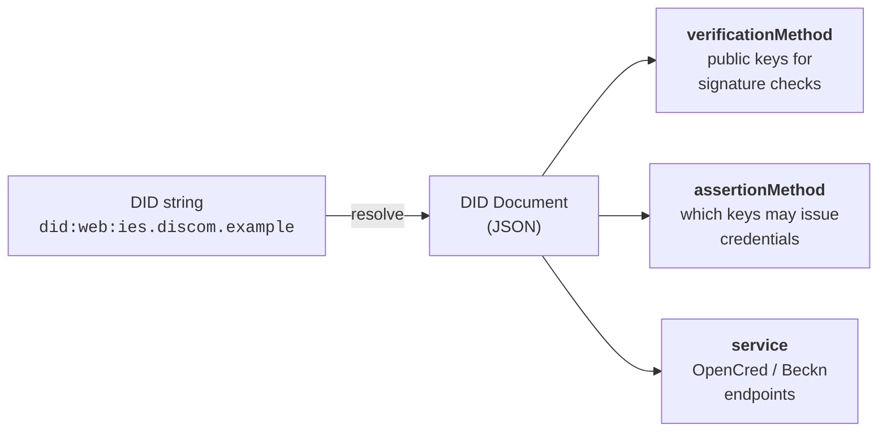

# Identifiers and Addressing

The identity foundation. Every IES participant — DISCOM, regulator, consumer, asset, dataset — gets a verifiable digital identifier (DID). This page is the **reference** for IES's identifier patterns; for hands-on setup see **[Setup Register](../../how-you-implement-ies/setup-register.md)**.

> **About the walkthroughs.** Commands below use **[OpenCred](../../glossary.md#opencred)** — see the glossary for details. Any W3C-compliant signing pipeline publishing the same `did.json` and VC-2.0 proofs is a drop-in replacement.

---

## Why this matters

When your DISCOM hands a consumer a digital electricity credential, or shares meter data with a regulator, the recipient must answer *"Is this really from the DISCOM?"* on their own — not by calling you or trusting a screenshot.

Digital-public-infrastructure stacks solve this with **Decentralized Identifiers (DIDs)**: you publish a small JSON file on a web address you control, listing the public key you sign with. Anyone — a wallet, another DISCOM, a regulator — fetches that file over plain HTTPS and checks signatures independently. No central authority, no API key.

You need two things: **a domain you own** and **a key your IT team can generate**. The rest of this page shows what goes where.

### Pick your role

Four roles are covered here — skim the row that matches you.

| If you are… | Read | Then |
|---|---|---|
| **A DISCOM / issuer** (you sign and emit ElectricityCredentials) | [§(a) Org identity](#a-org-identity-for-credentials-and-data-exchange-payloads) → [Energy Credentials — Set up OpenCred and publish your did:web](../energy-credentials/README.md#set-up-opencred-and-publish-your-did-web) | [Energy Credentials — Issue your first credential](../energy-credentials/README.md#issue-your-first-credential), [Appendix C](#appendix-c-identifying-assets-meters-connections-datasets) (asset IDs) |
| **A Beckn participant** (BAP / BPP, aggregator, AMISP, trading platform) | [§(b) Beckn network identity](#b-beckn-network-identity-for-participating-on-a-beckn-network) → [Appendix E](#appendix-e-joining-a-beckn-network-subscriber-registry-on-the-beckn-fabric) | [Registries — by role](../registries/README.md#the-registries-youll-touch-in-ies-by-role) for the registry mechanics |
| **A regulator** (you license DISCOMs and may sign credentials yourself) | [§(a) Org identity](#a-org-identity-for-credentials-and-data-exchange-payloads) — same `did:web` flow as a DISCOM | Note that your `did:web` is what DISCOMs cite as `issuer.idRef.issuedBy`; see [Where each ID goes in a credential](#where-each-id-goes-in-a-credential) |
| **A verifier or wallet** (you receive and check credentials) | [Appendix A](#appendix-a-how-dids-work-and-the-three-methods-ies-uses) (DID methods) → [Energy Credentials — Verify](../energy-credentials/README.md#id-3.-verify) → [Appendix F](#appendix-f-binding-the-credential-to-a-holder-identity) (holder binding at presentation time) | [Registries — Verifying a credential](../registries/README.md#appendix-b-verifying-a-credential-end-to-end) for the end-to-end resolution walk |

---

## Two identities you'll set up (and why)

A DISCOM on IES needs **two** identifier setups, using **different keys** (credential-issuance is an EC P-256 key from OpenCred; the Beckn key is an Ed25519 keypair from the [NFH onboarding procedure](https://docs.nfh.global/beckn/creating-an-open-network/onboarding-network-participants#step-4-publish-your-subscriber-record)) in different registries, sharing only your domain as root.

### (a) Org identity — for credentials and data-exchange payloads

This is your DISCOM's `did:web` — the issuer string on every ElectricityCredential you sign, and the root that meter, transformer, and connection DIDs extend via path segments. Credential verifiers resolve only this one DID; asset DIDs ride inside the signed payload as stable references.

| Who | Identifier method | What it looks like |
|---|---|---|
| **Your DISCOM (the issuer)** | `did:web` on a domain you own | `did:web:ies.discom.example` |
| **A regulator** | Same — `did:web` on their own domain | `did:web:ies.serc.example` |
| **A consumer holding a credential** *(optional)* | A holder identifier — `did:key` (wallet) or `tel:+91...` ([RFC 3966](https://datatracker.ietf.org/doc/html/rfc3966)) — set when you want presentation-time proof of subject. See [Appendix F](#appendix-f-binding-the-credential-to-a-holder-identity). | `did:key:z6Mkj...` or `tel:+919876543210` |
| **Your meter / transformer / feeder** | `did:web` under your domain | `did:web:ies.discom.example:assets:meter:MET-001` |

Two steps get you here:

1. **Pick a domain or subdomain you control.** Most DISCOMs use a dedicated subdomain (e.g. `ies.discom.example`) to keep this separate from the marketing site, but a bare apex domain works too. The host becomes the host portion of your `did:web`; you'll publish one small JSON file under it — `did.json` — declaring your public key.

    > **About path segments.** `did:web` lets you encode a sub-path with colons. If you don't want to host at `.well-known/`, host the document at any path and reflect it in the DID via the colon hierarchy:
    >
    > | DID string | DID document URL |
    > |---|---|
    > | `did:web:ies.discom.example` | `https://ies.discom.example/.well-known/did.json` |
    > | `did:web:discom.example:ies` | `https://discom.example/ies/did.json` |
    > | `did:web:discom.example:ies:issuer` | `https://discom.example/ies/issuer/did.json` |
    > | `did:web:discom.example%3A8443` | `https://discom.example:8443/.well-known/did.json` (port encoded as `%3A`) |
    >
    > Same identifier system covers your DISCOM's own identity *and* every asset ID you reference inside payloads (meters, transformers, datasets) — see [Appendix C](#appendix-c-identifying-assets-meters-connections-datasets).

2. **Generate a key pair and publish `did.json`.** The concrete commands — install OpenCred, generate the signing key, assemble `did.json`, publish, and verify — live in **[Energy Credentials → Set up OpenCred and publish your did:web](../energy-credentials/README.md#set-up-opencred-and-publish-your-did-web)**.

That's everything credential issuance requires. **You do not need to be listed in any IES-side DISCOM registry to issue credentials** — verifiers fetch your `did.json` and check the signature, the only mandatory trust leg. If a regulator (SERC, etc.) can vouch for your licence, set `issuer.idRef` to point at them; verifiers then treat the credential as licence-anchored. `issuer.idRef` is optional in both the [v1.2 schema](https://india-energy-stack.gitbook.io/docs/schemas/electricitycredential/v1.2) and [W3C VC Data Model 2.0](https://www.w3.org/TR/vc-data-model-2.0/#issuer); only `issuer.id` and `issuer.name` are required. The IES DISCOMs reference registry is a separate, **Beckn-side** concern — see (b) below.

Internal consumer numbers, meter SLNOs, and asset codes do **not** need to change — they ride inside credentials signed with this DID. The simplest first credential carries no holder identifier; bind to a wallet DID or `tel:` URI when the verifier needs presentation-time proof — see [Appendix F](#appendix-f-binding-the-credential-to-a-holder-identity).

### (b) Beckn network identity — for participating on a Beckn network

To send and receive Beckn messages (search, select, init, confirm, on_status…), your `did:web` isn't enough alone. Beckn is a **trust-bounded network**: the [Network Facilitator Organisation (NFO)](../../glossary.md#nfo) curates membership, and counterparties verify each message against it. Two registries enforce this:

- **Your own Beckn subscriber registry** under your verified DeDi namespace — declares your callback URL, role (BAP / BPP), and Ed25519 signing public key. Other nodes look this up to verify your signatures and route to you.
- **The NFO's network reference registry** — a curated allow-list of member subscribers, and where a "DISCOM" is recognised as a network participant. The NFO writes a reference entry pointing at your subscriber record.

Different key (Ed25519, not P-256), different registries, different consumer (other Beckn nodes, not credential verifiers) — independent of the credential-issuance flow.

The end-to-end practical flow is in [Appendix E — Joining a Beckn network](#appendix-e-joining-a-beckn-network-subscriber-registry-on-the-beckn-fabric).

---

## Publish your `did:web`

The end-to-end walkthrough — pick a domain, generate the signing key, assemble `did.json`, publish it, and verify it resolves from outside — is in **[Setup Register](../../how-you-implement-ies/setup-register.md)**.

---

## ID patterns you'll use day one

You only need two or three identifier shapes to start issuing credentials, collected here in one table.

| Subject | Identifier | Example |
|---|---|---|
| Your DISCOM (issuer) | `did:web:<your-domain>` | `did:web:ies.discom.example` |
| A regulator | `did:web:<their-domain>` | `did:web:ies.serc.example` |
| A consumer (holder identifier, optional) | `did:key:...` (wallet) **or** `tel:+91XXXXXXXXXX` ([RFC 3966](https://datatracker.ietf.org/doc/html/rfc3966)) | `did:key:z6MkjVQ8r4f3rPuY...` |
| The consumer's existing CIS account number | Plain string, kept as-is | `DISCOM-2025-00987654` |

A few things worth knowing before you start:

- **Your CIS consumer numbers stay exactly as they are** — they go into `customerProfile.customerNumber`, same human-readable form as your call centre and billing letters.
- **The holder identifier is optional and deferrable.** See [Appendix F](#appendix-f-binding-the-credential-to-a-holder-identity) for the bearer-vs-bound trade-off.
- **You do not assign wallet DIDs.** The consumer's wallet (or DigiLocker) generates the `did:key` and sends it to you; you verify control (Appendix F), then include it verbatim in `credentialSubject.id`. You never store the private key.

For identifiers covering assets (meters, transformers, feeders), service connections, and datasets, see [Appendix C](#appendix-c-identifying-assets-meters-connections-datasets) — these are not needed for your first credential.

---

## Where each ID goes in a credential

One filled-in ElectricityCredential v1.2 showing every identifier in one place. Everything in **bold** is something you control.

```json
{
  "@context": [
    "https://www.w3.org/ns/credentials/v2",
    "https://schema.beckn.io/ElectricityCredential/v1.2/context.jsonld"
  ],
  "id": "urn:uuid:b2c3d4e5-0000-0000-0000-aabbccdd0001",
  "type": ["VerifiableCredential", "ElectricityCredential"],

  "issuer": {
    "id":   "did:web:ies.discom.example",
    "name": "Example State Distribution Company Limited",
    "idRef": {
      "_comment":  "optional — include only when citing a regulator",
      "issuedBy":  "did:web:ies.serc.example",
      "subjectId": "serc.example:DISCOM-REG-0042"
    }
  },

  "validFrom":  "2025-03-01T00:00:00+05:30",
  "validUntil": "2026-03-01T00:00:00+05:30",

  "credentialSubject": {
    "customerProfile": {
      "customerNumber": "DISCOM-2025-00987654",
      "energyResources": [{
        "id":   "did:web:ies.discom.example:assets:meter:MET-IMPORT-001",
        "type": "METER",
        "attributes": {"meterCapability": "AMI", "energyDirection": "Forward"}
      }]
    },
    "customerDetails": {
      "fullName": "Arjun Mehra"
    }
  },

  "proof": {
    "type": "Ed25519Signature2020",
    "verificationMethod": "did:web:ies.discom.example#key-1",
    "proofPurpose": "assertionMethod",
    "proofValue": "z58DAdFfa9SkqZMVPxAQpic7ndTaXoT..."
  }
}
```

| Field | What it carries | Set by |
|---|---|---|
| `issuer.id` | Your `did:web` | You |
| `issuer.idRef` *(optional)* | A pointer the regulator gave you that confirms you are a licensed DISCOM in their service area. Include when you have a regulator to cite; omit otherwise — `issuer.idRef` is optional per both the v1.2 schema and W3C VC 2.0. | Regulator + you |
| `customerProfile.customerNumber` | Your existing CIS number, unchanged | You |
| `energyResources[].id` | A `did:web` for each meter / asset, built from your domain plus a path segment | You |
| `proof.verificationMethod` | A pointer back into your `did.json` saying which key did the signing | OpenCred / your signing pipeline |
| `credentialSubject.id` *(optional)* | A holder identifier — a wallet `did:key` or a `tel:` URI — set when you want presentation-time proof that the presenter is the legitimate subject | Set by you, after verifying the consumer controls it. See [Appendix F](#appendix-f-binding-the-credential-to-a-holder-identity). |

Notice what's *not* required: no central registry of consumers, no national ID, no separate identifier system competing with your CIS. Everything cross-references your DID document plus the regulator's — both just static files on websites you control.

---

## Setup

The hands-on setup — pick a domain, generate keys, publish `did.json`, claim your DeDi namespace, decide identifier conventions — is **[Setup Register](../../how-you-implement-ies/setup-register.md)** (organisation identity) and **[Setup Discovery](../../how-you-implement-ies/setup-discovery.md)** (Beckn subscriber record).

---

## Appendix A — How DIDs work, and the three methods IES uses

Read this if a colleague asks "but how does this actually work?" Skip it if you're mid-deployment.

### What's in a DID document

A DID string alone is just a name. The useful part is the **DID document** it resolves to — the JSON object published above, carrying the public keys a verifier needs and optionally the service endpoints where the network can reach you.



Two rules avoid most confusion in DID systems:

- **An identifier is just a name.** Never parse it to extract meaning ("if the string contains `discom`, treat it as that DISCOM's credential" is a bug waiting to happen). Resolve first; read the document; decide from that.
- **The identifier and the record it resolves to are different things.** The DID travels in a credential or Beckn message. The record is what a verifier fetches to make a trust decision.

### The three DID methods IES uses

IES uses three standard W3C DID methods, all listed in the [W3C DID Spec Registries](https://www.w3.org/TR/did-spec-registries/), so any standards-compliant verifier already knows how to resolve them. **There is no separate `did:dedi` method** — DeDi acts as a key-discovery layer for `did:web` (or `did:key`), not a new DID method.

For underlying theory see [OpenCred → DIDs](https://opencred.gitbook.io/docs/concepts/dids); this section is the IES-flavoured summary.

#### `did:web` — the one your DISCOM will use

The DID is a URL in disguise: `did:web:ies.discom.example` resolves to `https://ies.discom.example/.well-known/did.json`. Path segments after the host become URL path segments:

```
did:web:example.com:students
→  https://example.com/students/did.json
```

A port becomes `%3A` (so `did:web:localhost%3A8443` is `https://localhost:8443/.well-known/did.json`).

Two ways `did:web` shows up in IES:

- **Self-hosted.** You serve `did.json` on your own domain, as Step 3 above shows. Any verifier can resolve it — the default, right starting point for every DISCOM, regulator, and aggregator with a public web presence.
- **Anchored on DeDi.** Same `did:web:<your-domain>` identifier. In addition to (or instead of) self-hosting, you publish your public key — and optionally a frozen `did.json` snapshot — into DeDi's key registry under your verified namespace, so DeDi-aware verifiers can fetch it via its API. Useful as a fallback when your domain is unreachable, or when the network wants a curated allow-list. The method is still `did:web`; DeDi is just a second discovery path. A DeDi-only document isn't served at `.well-known/did.json`, so only DeDi-aware tooling sees it.

Strengths of `did:web` for an institutional issuer: it trust-roots in your existing TLS certificate (already validated by public CAs), rotation is one file replace, and it needs no infrastructure beyond a static-file host.

Main limitation: domain hijack means issuer-key hijack. Citing a regulator in `issuer.idRef` mitigates this — a hijacker can't forge the regulator's vouching record without also compromising the regulator's key. Without `issuer.idRef`, verifiers fall back to out-of-band recognition. For the inter-DISCOM network, the NFO's curated reference registry adds a separate mitigation by gating network membership.

#### `did:key` — what wallets give consumers

For `did:key`, the public key *is* the identifier — the verifier decodes it directly, no network call needed. Ideal for consumers, who don't own domains:

```
did:key:z6MkjVQ8r4f3rPuY7CG2D6Lf8WJxJBs5sjkR8d3v2Bv4nP4Z
```

IES uses `did:key` for:

- Consumer holder DIDs, generated client-side by a wallet or DigiLocker.
- DISCOM dev/test deployments before a real subdomain is provisioned.
- Demos and field deployments where there is no domain.

The price: you cannot rotate the key — rotating means a new DID. So `did:key` suits short-lived or device-bound identities, but not long-lived institutional issuers (which is why DISCOMs use `did:web`).

#### `did:jwk` — same shape as `did:key`, JWK-encoded

`did:jwk` encodes the public key as a JSON Web Key inside the DID string. Functionally similar to `did:key` (offline-resolvable, no rotation, no service endpoints), but interoperates with JWK-based tooling — useful for RSA keys, where `did:key` is awkward. IES accepts `did:jwk` for holders; default to `did:key` unless you have a specific reason otherwise.

### Quick reference

| Subject | Method | Why |
|---|---|---|
| DISCOM (issuer) | `did:web` | Domain anchors the key, regulator's registry anchors trust |
| Regulator | `did:web` | Same |
| Consumer (holder) | `did:key` or `did:jwk` | Wallet-generated, no domain needed, verifies offline |

---

## Appendix B — Issuing credentials (moved)

The end-to-end walkthrough for issuing, verifying, and revoking an ElectricityCredential v1.2 now lives in **[Energy Credentials](../energy-credentials/README.md)**. Pick up there once your `did:web` is published (Step-by-step above).

---

## Appendix C — Identifying assets, meters, connections, datasets

You'll eventually want stable identifiers for the things you operate (meters, transformers, feeders, service connections) and the data you publish (telemetry, tariff schedules). Use the same `did:web` you already own and add path segments — no new DID method needed.

> **Asset DIDs are stable identifiers, not necessarily resolvable documents.** Most ride inside credentials your DISCOM signs; trust comes from the issuer's signature, not asset-level resolution. See [Appendix D — Asset-DID resolution patterns](#asset-did-resolution-patterns-pragmatic-programmatic-per-asset) for when to promote an asset DID to a resolvable document.

### Conventions

| Symbol | Meaning |
|---|---|
| `<discom-domain>` | The domain hosting your `did.json` — e.g. `ies.discom.example` |
| `<internal-id>` | Your existing internal ID, used verbatim as the last path segment |
| URL-safe | Replace any characters outside `[A-Za-z0-9._-]` with `%xx` percent-encoding |

### Meter

```
did:web:<discom-domain>:assets:meter:<meter-slno>

→ did:web:ies.discom.example:assets:meter:MET-IMPORT-001
```

This is the identifier that goes in `energyResources[].id` for METER entries on an [ElectricityCredential v1.2](https://india-energy-stack.gitbook.io/docs/schemas/electricitycredential/v1.2).

### Other assets — transformer, feeder, substation, solar, BESS, EV charger

```
did:web:<discom-domain>:assets:<class>:<internal-id>

→ did:web:ies.discom.example:assets:transformer:DT-NDL-11KV-04572
→ did:web:ies.discom.example:assets:feeder:FDR-11KV-NDL-072
→ did:web:ies.discom.example:assets:substation:SS-22OK-NJP-001
→ did:web:ies.discom.example:assets:solar-plant:ROOFTOP-SOLAR-001
```

`<class>` values used in IES today: `feeder`, `transformer`, `substation`, `solar-plant`, `wind-farm`, `bess`, `ev-charger`, `meter` — use kebab-case.

### Service connection

The connection binds a consumer, a meter, and a feeder:

```
did:web:<discom-domain>:connections:<connection-id>

→ did:web:ies.discom.example:connections:CONN-DISCOM-2025-001234567
```

`<connection-id>` is whatever your CIS already uses — often the same string as the consumer number.

### Dataset (Beckn `DatasetItem`)

For data-exchange resources (meter telemetry, ARR filings, tariff schedules):

```
did:web:<discom-domain>:datasets:<class>:<id>

→ did:web:ies.discom.example:datasets:meter-telemetry:2026-01
→ did:web:ies.serc.example:datasets:tariff-orders:2025-26-domestic
```

The DID resolves to a `DatasetItem` record (DDM schema) carrying the Beckn BPP endpoint that serves the actual data.

### Summary

| Subject | Pattern | Internal ID becomes |
|---|---|---|
| DISCOM | `did:web:<domain>` | The domain itself |
| Regulator | `did:web:<domain>` | Same |
| Consumer (holder) | `did:key:…` (wallet-generated) | Not derived from anything internal |
| Consumer (CIS reference) | Kept as the literal `customerNumber` string | CIS number, verbatim |
| Meter | `did:web:<domain>:assets:meter:<slno>` | Meter SLNO |
| Other asset | `did:web:<domain>:assets:<class>:<id>` | SAP / GIS code |
| Connection | `did:web:<domain>:connections:<id>` | SC number |
| Dataset | `did:web:<domain>:datasets:<class>:<id>` | Dataset key |

---

## Appendix D — Identifier vs. record

Think of a DID like a **vehicle's licence plate**: the plate (`KA-01-MN-1234`) stays fixed, but the RTO record it resolves to — owner, insurance status, address — can change. A cop reading your plate queries the RTO for the *current* record rather than guessing from the digits.

A DID works the same way:

| Identifier (stable, travels in payloads) | Record (current, can change over time) |
|---|---|
| `did:web:ies.discom.example` | The `did.json` at `https://ies.discom.example/.well-known/did.json` — the DISCOM's current public keys and endpoints |
| `did:web:ies.discom.example:assets:meter:MET-IMPORT-001` | The asset record under that path — current make, model, geo, commissioning date |

Two rules follow:

- **Don't parse the identifier for business logic.** Resolve it and read the record's fields. A path that looks predictable today (`...:consumers:DISCOM-2025-...`) may need percent-encoding or restructuring tomorrow; structured fields in the record won't.
- **Records can update without re-issuing identifiers.** Key rotation, meter replacement, address correction — change the record, the identifier stays.

### Five places this matters in IES

1. **DISCOM signing-key rotation.** `did:web:ies.discom.example` doesn't change when the DISCOM rotates its key; the new key is added to `did.json`. Every ElectricityCredential ever issued keeps verifying.
2. **Meter replacement.** `did:web:ies.discom.example:assets:meter:MET-001` stays the same when a meter is swapped; the record gets a new `make`, `model`, `commissioningDate`. No credential rewrites.
3. **Beckn subscriber key rotation.** A BPP rotates its Ed25519 key; the DeDi subscriber record updates. `subscriber_id` keeps working — ONIX re-resolves per message.
4. **Audit / historical lookup.** `GET .../<record>?as_on=2025-01-01` returns the record live on that date — useful for "what was the public key when this credential was signed?".
5. **Anti-pattern: parsing the DID string.** Code reading `did:web:ies.discom.example:consumers:<n>` to route a request breaks the day a character needs percent-encoding or the hierarchy is restructured. Always resolve, then read.

### Asset-DID resolution patterns (pragmatic / programmatic / per-asset)

Strictly per W3C `did:web`, every DID should resolve to a document at the corresponding URL. In IES practice, trust on an asset DID comes from the **issuer's** signature — the issuer's `did:web` is what verifiers must resolve; asset DIDs ride along as stable references.

Three patterns are in active use — pick the one matching your operational constraints:

| Pattern | What you host | When to use |
|---|---|---|
| **Pragmatic — no per-asset document** | Only your DISCOM's top-level `did.json`. Asset DIDs are stable identifiers carried inside signed credentials and Beckn payloads; verification is via the issuer's signature, not asset-level resolution. | Most internal asset IDs (meters, feeders) that only appear inside credentials your DISCOM signs. |
| **Programmatic — one endpoint, many DIDs** | A small service under your domain that synthesises a DID document for any `assets/<class>/<id>` path on demand. | When you want strict `did:web` compliance without operating a static file per asset. |
| **Per-asset documents** | A separate `did.json` for each asset (e.g. `https://ies.discom.example/assets/meter/MET-001/did.json`). | High-value, public-facing assets (substations, large DERs) that other networks may resolve independently. |

Start pragmatic; promote individual assets to programmatic or per-asset documents only when an external verifier actually needs to resolve them.

---

## Appendix E — Joining a Beckn network (subscriber registry on the Beckn fabric)

Your DISCOM's `did:web` proves who issued a credential. It does **not** put you on a Beckn network. To send and receive Beckn messages (search, select, init, confirm, on_status…), other nodes need to discover your callback URL and signing key through a **subscriber registry** published on the Beckn fabric.

Upstream docs: [Onboarding Network Participants](https://docs.nfh.global/beckn/creating-an-open-network/onboarding-network-participants). The steps below are the practical summary for IES.

### Step 1 — Set up a DeDi account and verify your namespace

Follow [Setup Register → 1.4 Claim a DeDi namespace and verify your domain](../../how-you-implement-ies/setup-register.md) for the account, namespace, and DNS-TXT steps. Use your DISCOM short code or FQDN as the namespace name (e.g. `discom`, `np.example.com`). Once verified, the namespace is your root of trust on the Beckn fabric.

### Step 2 — Generate your Beckn signing keypair

Beckn signing uses **Ed25519** keys — different from your OpenCred P-256 issuer key; the two identities intentionally use separate keys.

**Prerequisite:** Go 1.24+ — see [the official Go install guide](https://go.dev/doc/install). Beckn ONIX ships its keypair tool as a small Go program.

Clone the repo and run [`tools/sign`](https://github.com/beckn/beckn-onix/tree/main/tools/sign):

```bash
git clone https://github.com/beckn/beckn-onix.git
cd beckn-onix/tools/sign
go run . gen-key --priv beckn_private.key --pub beckn_public_key.pem
# keypair generated
#   public key  → beckn_public_key.pem  (publish in the subscriber record)
#   private key → beckn_private.key     (store in your CI secret manager, never commit)
```

The tool writes:

- **Private key** (`beckn_private.key`): raw 32-byte Ed25519 seed, Base64-encoded — what ONIX loads to sign outgoing messages.
- **Public key** (`beckn_public_key.pem`): PKIX-encoded PEM. Extract the raw 32-byte public key and Base64-encode it (no header/footer) for `signing_public_key` in Step 4.

Any other Ed25519 keypair generator works if it produces those two artefacts in the same encoding.

### Step 3 — Create a Beckn subscriber registry under your namespace

Under your verified namespace, create a registry with the built-in `beckn_subscriber` tag — see [Registries → built-in tags](../registries/README.md#built-in-schema-tags-used-in-ies). It holds one record per role you take per Beckn network (separate `subscribers-test` and `subscribers-prod` is conventional).

### Step 4 — Publish your subscriber record

Add a record with the following fields:

| Field | What to fill | Example |
|---|---|---|
| `subscriber_id` | Your unique identifier, typically your domain | `ies.discom.example` |
| `subscriber_url` | Your Beckn ONIX receiver endpoint | `https://ies.discom.example/bpp/beckn` |
| `type` | Your role on the network | `BAP` or `BPP` |
| `signing_public_key` | Your Ed25519 public key, Base64-encoded, no header/footer | `eyAeqGFtAuks...` |
| `encryption_public_key` | (Optional) encryption public key | `lCI84I0Q0U0w...` |
| `countries` | Countries where you operate | `["IND"]` |

If you operate multiple roles (e.g. both BAP and BPP on the same network), publish a separate record per role.

Once published, note the **record ID** — the key ID you'll configure in your ONIX instance.

### Step 5 — Verify your key lookup

Other nodes resolve your subscriber details through the Beckn fabric lookup URL:

```
https://fabric.nfh.global/registry/dedi/lookup/<your_subscriber_id>/subscribers.beckn.one/<your_record_id>
```

Allow 5–10 minutes for the cache to update, then `curl` the URL and confirm it returns your published record.

### Step 6 — Get added to the NFO's network registry

Apply via the IES Secretariat per [Registries → How to apply for an IES listing](../registries/README.md#how-to-apply-for-an-ies-listing) — that page lists every field the NFO needs and which networks are available. The NFO does **not** copy your record; it writes a small reference entry pointing at your DeDi-published subscriber record (or your whole registry, if every record belongs to the network), keeping your identity self-owned.

What the NFO checks before approving: subscriber details published under your own verified namespace; a correct, reachable callback URL; a valid signing/verification public key; role and participant details matching the network's expectations; and the correct environment-specific registry (test, prod, etc.).

Once the NFO writes the reference entry, your DISCOM is part of the curated network and other nodes can route to you.

### How other Beckn nodes consume your identity

When a counterparty BAP or BPP receives a Beckn message claiming to come from `ies.discom.example`:

1. It calls `https://fabric.nfh.global/registry/dedi/lookup/ies.discom.example/subscribers.beckn.one/<record_id>` (or the equivalent NFO-side lookup) to retrieve your subscriber record.
2. It uses `signing_public_key` from that record to verify the Ed25519 signature on the incoming Beckn header.
3. It uses `subscriber_url` to route its callback.

You do the symmetric thing for messages you receive. ONIX handles all of this once configured with your subscriber ID, record ID, and Ed25519 private key.

### Step 7 — Configure your ONIX to accept the right networks (`allowedNetworkIDs`)

A subscriber record on DeDi carries a `network_memberships[]` field listing every network the subscriber has been referenced into (e.g. `["indiaenergystack.in/ies-data-sharing-network"]`). Each entry is a `network_id` — the canonical `<nfo-domain>/<registry-name>` string — written by the NFO in Step 6 and read by every receiving ONIX instance during signature validation.

To accept only signed messages from subscribers in the IES networks you've joined, configure the [`dediregistry`](https://github.com/beckn/beckn-onix/tree/main/pkg/plugin/implementation/dediregistry) plugin in your ONIX module. The relevant key is **`allowedNetworkIDs`**:

```yaml
modules:
  - name: bppTxnReceiver
    handler:
      plugins:
        registry:
          id: dediregistry
          config:
            url: "https://fabric.nfh.global/registry/dedi"
            allowedNetworkIDs: "indiaenergystack.in/ies-data-sharing-network,indiaenergystack.in/test-ies-data-sharing-network"
            timeout: 30
            retry_max: 3
      steps:
        - validateSign
        - addRoute
```

`allowedNetworkIDs` is a comma-separated list of full network IDs. The plugin intersects an incoming subscriber's `data.network_memberships` with this list; if it matches none, ONIX rejects the message with `registry entry with subscriber_id '...' does not belong to any configured networks (registry.config.allowedNetworkIDs)`.

Practical rules of thumb:

- **One ONIX instance per environment.** Prod-network IDs on the prod instance, `test-` IDs on test — mixing them lets test traffic into prod.
- **Use full network IDs**, not bare registry names — `indiaenergystack.in/ies-data-sharing-network`, not `ies-data-sharing-network`.
- **Leaving `allowedNetworkIDs` unset accepts everything.** Fine for a discovery / catalogue node; never for a transactional BAP / BPP.
- The older config key `allowedParentNamespaces` is **deprecated**; the plugin errors until you migrate to `allowedNetworkIDs`.

### Why the two-identity model

Your `did:web` identity proves *"this credential was issued by the DISCOM"* to anyone fetching your `did.json`. Your subscriber-registry identity proves *"this Beckn message was sent by the DISCOM"* to other nodes — content-level trust versus transport-level trust. They share an organisational root (your domain) but use different keys on different rails, so compromising one doesn't compromise the other.

---

## Appendix F — Binding the credential to a holder identity

A credential proves *who issued it*, not *who is allowed to present it*. Without holder binding, it's a **bearer token** — whoever has the JSON is the subject. Fine for paper-style issuance and demos, but consumer-facing flows (Consumer Energy Passport, Consumer Meter Digest, anything a bank or marketplace reads) usually need presentation-time proof the presenter is the person it was issued to.

The W3C [VC Data Model 2.0 § Presentations](https://www.w3.org/TR/vc-data-model-2.0/#presentations) handles this through `credentialSubject.id`: set it to an identifier the subject controls, and require proof-of-control at presentation time. The v1.2 schema makes it optional, so you can pick the pattern fitting the consumer's situation.

Two patterns are practical in IES today, plus the no-binding default.

### Before you bind anything: identity-proofing at issuance

Easy to miss: the holder identifier lands inside `credentialSubject.id` because **you put it there**. Copy it verbatim from an unauthenticated request and an attacker can submit their own DID or phone, and you'll happily bind a Passport to it. Holder binding only works if you verify, **at issue time**, that the consumer controls the identifier you're about to embed.

So before any `POST /v1/credentials/issue` call that sets `credentialSubject.id`:

| Holder identifier | What to verify at issue time |
|---|---|
| `did:key:...` (wallet) | The wallet signs a fresh nonce you send it; you verify the signature against the public key in the DID. This proves the requester holds the wallet's private key. |
| `tel:+91XXXXXXXXXX` | You confirm the number is the one already on file for that `customerNumber` in your CIS, **and** you send a fresh OTP to that number and confirm the requester reads it back. |
| DigiLocker-mediated | DigiLocker has already done the Aadhaar-backed identity check before issuing the access grant; you can rely on that for the identity binding, and just record DigiLocker as the binding channel. |

Without that check, holder binding adds zero security; with it, the wallet/phone/DigiLocker identifier becomes a real second factor at presentation time.

### Pattern 1 — Wallet DID (cryptographic, recommended where a wallet exists)

Set `credentialSubject.id` to a DID the consumer's wallet controls — typically `did:key`, sometimes `did:jwk`. Both are offline-resolvable (the public key is encoded in the DID string), so the verifier needs no network call.

```json
"credentialSubject": {
  "id": "did:key:z6MkjVQ8r4f3rPuY7CG2D6Lf8WJxJBs5sjkR8d3v2Bv4nP4Z",
  "customerProfile": { "customerNumber": "DISCOM-2025-00987654", ... },
  "customerDetails": { ... }
}
```

**The presentation-time flow.** When the consumer presents the credential to a verifier (a bank, a marketplace, a housing society):

1. The verifier asks the wallet for the credential.
2. The wallet wraps it in a **Verifiable Presentation (VP)** — a JSON envelope carrying one or more credentials plus a fresh signature from the holder.
3. The verifier sends a **challenge** (a random nonce, often a UUID) and a **domain** (its own identifier, e.g. `bank.example.com`) — these go into `proof.challenge` and `proof.domain` on the VP.
4. The wallet signs the VP with the private key matching `credentialSubject.id`, embedding the challenge and domain.
5. The verifier: resolves `credentialSubject.id` (for `did:key`, decoding the multibase public key from the DID string — no network call); verifies the VP's `proof.signature` against that key; confirms `proof.challenge` matches the nonce it sent (rules out replays); confirms `proof.domain` matches its own identifier (rules out a presentation captured from another verifier); and separately verifies the embedded credential's `proof` against the issuer DISCOM's `did:web` key.
6. If all checks pass, the presenter has demonstrated control of the wallet's private key — they are the subject the credential was issued to.

A stolen credential JSON fails step 5: the attacker lacks the wallet's private key, so can't produce a matching VP signature.

This is the model OpenID for Verifiable Presentations (OID4VP), DIDComm, and most W3C wallet ecosystems implement.

**Wallet rotation.** A wallet `did:key` cannot rotate (rotating means a new DID). If a consumer's wallet is lost or compromised, they generate a new `did:key` and you re-issue the credential bound to it. The old one is revoked through your DeDi revocation registry (see [Energy Credentials — Revoke](../energy-credentials/README.md#id-4.-revoke)).

### Pattern 2 — Phone-number URI (out-of-band, when there is no wallet)

If the consumer doesn't have a wallet — and many Indian consumers won't, at least initially — you can still bind the credential to a channel they control: a phone number. Use the [RFC 3966](https://datatracker.ietf.org/doc/html/rfc3966) `tel:` URI scheme so the identifier is a proper URI, not a bare string:

```json
"credentialSubject": {
  "id": "tel:+919876543210",
  "customerProfile": { "customerNumber": "DISCOM-2025-00987654", ... },
  "customerDetails": { ... }
}
```

The URI form is strict: **`tel:` + full E.164** (country code + national number, no spaces, hyphens, parentheses, or leading zeros). For India that's `tel:+91` followed by the ten-digit mobile number — the only form a verifier can compare unambiguously across systems.

**The presentation-time flow.**

1. The consumer presents the credential to a verifier (QR scan, email attachment, or DigiLocker share).
2. The verifier reads `credentialSubject.id` and extracts the phone number.
3. The verifier sends a fresh OTP via SMS, IVR, or a push notification (DigiLocker, its own app, an aggregator).
4. The presenter reads the OTP back.
5. If the OTP matches and is unexpired, the presenter has demonstrated control of the number.
6. The verifier independently verifies the credential's `proof` against the issuer's `did:web` key.

Weaker than Pattern 1: numbers can be ported, SIM-swapped, or shared, and OTP channels can be phished. It's also slower, but the right pragmatic choice when the consumer has no wallet and the verifier already runs phone-OTP plumbing.

**Phone-number changes.** Phone numbers change far more often than wallet DIDs. Either keep `validUntil` short (e.g. annual re-issue) so a stale number doesn't outlive its accuracy, or re-issue the credential whenever the consumer updates their number in your CIS.

### Pattern 3 — DigiLocker-mediated (Indian-context shortcut)

For consumers who already use DigiLocker, identity binding is largely solved before the credential arrives: DigiLocker performs an Aadhaar-backed identity check before granting access, and delivers the credential into the consumer's vault. A verifier consuming it from DigiLocker can rely on that access-control rather than a presentation-time challenge.

You may issue the credential without a `credentialSubject.id` (bearer style) and document DigiLocker as the binding channel, **or** set `credentialSubject.id` to the consumer's DigiLocker-resident `did:key` if exposed. The first is simpler; the second future-proofs re-presentation outside DigiLocker.

### Where does the contact identifier live in the schema?

The `customerDetails` block in [ElectricityCredential v1.2](https://india-energy-stack.gitbook.io/docs/schemas/electricitycredential/v1.2) (referencing the shared [`CustomerDetails/v1.0`](https://schema.beckn.io/CustomerDetails/v1.0) shape) currently carries **`fullName`, `installationAddress`, and `serviceConnectionDate`** — there's **no telephone field**. So if you choose Pattern 2 today, the `tel:` URI lives in `credentialSubject.id`, not in `customerDetails`. If a future schema revision adds a `telephone` field, its canonical URI form should be `tel:+<E.164>` so the two locations agree.

### Picking a pattern

| Consumer situation | Pattern | `credentialSubject.id` value |
|---|---|---|
| Has a digital wallet (DID-capable) | **Pattern 1** — wallet DID | `did:key:z6Mkj...` |
| Has only a phone number on record | **Pattern 2** — `tel:` URI | `tel:+919876543210` |
| Uses DigiLocker, no separate wallet | **Pattern 3** — DigiLocker-mediated | *Omit, or use DigiLocker's `did:key` if exposed* |
| Paper / counter issuance, presented in person | None — bearer | *Omit* |

Patterns aren't exclusive — issue two credentials sharing the same `customerProfile.customerNumber`, one bound to a wallet DID, one to a phone URI. They share the same revocation handle.

### Quick consistency checklist for adopters

- [ ] Issuer-side identity proof in place before any `credentialSubject.id` is set (challenge-sign for wallet DIDs, OTP for phones, DigiLocker grant otherwise).
- [ ] `tel:` URIs use full E.164 — `tel:+91` + ten digits — no spaces, hyphens, parentheses, or leading zeros.
- [ ] Verifier flow documented: how the verifier will challenge the holder at presentation time (VP-with-challenge for Pattern 1, OTP for Pattern 2, DigiLocker grant for Pattern 3).
- [ ] Revocation tested: revoking a credential invalidates **all** presentations of it, regardless of which binding pattern is in use.
- [ ] `validUntil` set with the binding's churn rate in mind (years for wallet DIDs, months-to-a-year for phone bindings).
