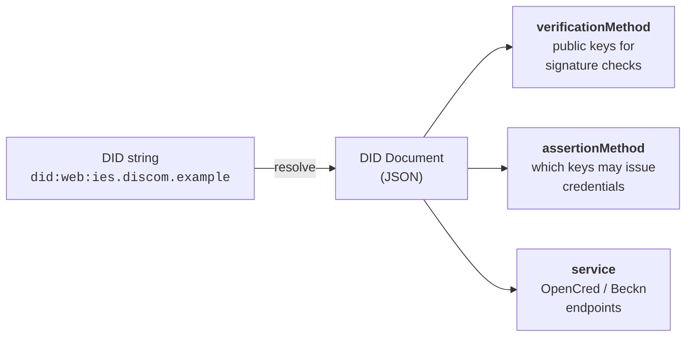

# Register

> **Step 1 of the three IES steps.** Verifiable digital identity. Every participant gets a digital identity and is listed in a shared directory. *Done once.*

Register is the foundation. Before any two systems can exchange data — and before any third party can trust a credential — both sides must be able to **name** each other and **prove** they are who they claim to be. IES does this with two cooperating pieces:

| Piece | What it is | Standard |
|---|---|---|
| **Identifier** | A cryptographic name for an organisation, a regulator, a meter, a consumer, an asset, a credential or a dataset. | [W3C Decentralised Identifiers (DIDs)](https://www.w3.org/TR/did-core/) |
| **Directory** | A public registry that lists records that go with those identifiers — signing keys, callback URLs, revocation status, network membership. | [DeDi](../glossary.md#dedi) (Decentralised Directory Protocol) |

Anyone can resolve an IES identifier in milliseconds, with no callback to the publisher, and check that a signature matches the registered key.

**Hands-on setup:** [Setup Register](../how-you-implement-ies/setup-register.md) — domain, keys, `did.json`, DeDi namespace, and (for Beckn participants) subscriber records, as numbered copy-pasteable steps.

---

## Why a verifiable identity, not a username

When a DISCOM hands a consumer a digital electricity credential, or shares meter data with a regulator, the recipient needs to answer one question on their own: *"Is this really from the DISCOM?"* If they have to call you, email your IT team, or trust a screenshot, the system does not scale and it is not really verifiable.

A username on a central platform is only as trustworthy as the platform — and IES has no central platform. Instead, every IES participant publishes a small JSON file on a web address it controls, listing the public key it signs things with. Anyone — a wallet, another DISCOM, a regulator, a bank — can fetch that file over plain HTTPS and check signatures on their own. No central authority, no API key, no special middleware. You need two things: **a domain you own** and **a key your IT team can generate**.

The same model covers the organisation (`did:web` on its domain), the consumer (`did:key` in a wallet), the asset (a `did:web` path that reuses the existing meter serial), and the dataset. One method family, one resolution flow, every actor.

---

## Two identities you'll set up (and why)

An organisation on IES needs up to **two** identifier setups. They exist for different reasons, use **different keys** generated by different procedures, live in different registries, and serve different verifiers. They share only the organisational root — your domain.

| | (a) Org identity | (b) Beckn network identity |
|---|---|---|
| **Proves** | *"This credential / payload was issued by us"* — content-level trust | *"This Beckn message was sent by us, and we belong to this network"* — transport-level trust |
| **Identifier** | `did:web:<your-domain>` | Your `subscriber_id` (typically your domain) in a DeDi subscriber record |
| **Key** | EC P-256 (credential signing) | Ed25519 (Beckn message signing) |
| **Published in** | `did.json` at `https://<your-domain>/.well-known/did.json` | Your DeDi namespace (`beckn_subscriber` registry), plus an NFO-side network reference |
| **Verified by** | Credential verifiers — banks, regulators, marketplaces, wallets | Other Beckn nodes on the network |
| **Who needs it** | Anyone issuing credentials or signing payloads | Anyone joining a Beckn network (data exchange, P2P trading) |

The (a) identity is the issuer string on every credential you sign, and the root that all the IDs you reference inside payloads — meter DIDs, transformer DIDs, connection DIDs — extend by adding path segments. Verifiers resolve only this one DID to check your signature; the asset DIDs ride inside the signed payload as stable references. **You do not need to be listed in any IES-side registry to issue credentials** — verifiers fetch your `did.json` directly; that is the only mandatory leg of the trust chain. If a regulator can vouch for your licence, cite them in the optional `issuer.idRef` and verifiers gain a second, licence-anchored leg.

The (b) identity exists because Beckn is a **trust-bounded network**: a [Network Facilitator Organisation (NFO)](../glossary.md#nfo) curates who is on the network, and counterparties verify every message against that membership boundary — your own subscriber record (callback URL, role, Ed25519 public key) plus the NFO's reference entry that marks you in-network.

Separate keys mean a compromise of one identity does not automatically compromise the other.

---

## The DID methods IES uses

A DID string by itself is just a name. The useful part is the **DID document** it resolves to — a small JSON object carrying the public keys a verifier needs, and optionally the service endpoints where the network can reach you.



IES uses three standard W3C DID methods, all listed in the [W3C DID Spec Registries](https://www.w3.org/TR/did-spec-registries/), so any standards-compliant verifier already knows how to resolve them. **There is no separate `did:dedi` method** — where DeDi appears, it is a key-discovery and registry layer over `did:web`, not a new method.

| Subject | Method | Why |
|---|---|---|
| DISCOM / regulator / [AMISP](../glossary.md#amisp) (issuer) | `did:web` | Trust roots in the domain and its existing TLS certificate; key rotation is one file replace; no new infrastructure beyond a static-file host |
| Consumer (holder) | `did:key` (or `did:jwk`) | Wallet-generated, no domain needed, verifies offline — the public key *is* the identifier |

**`did:web`** is a URL in disguise: `did:web:ies.discom.example` resolves to `https://ies.discom.example/.well-known/did.json`, and path segments encode with colons:

| DID string | DID document URL |
|---|---|
| `did:web:ies.discom.example` | `https://ies.discom.example/.well-known/did.json` |
| `did:web:discom.example:ies` | `https://discom.example/ies/did.json` |
| `did:web:discom.example:ies:issuer` | `https://discom.example/ies/issuer/did.json` |
| `did:web:discom.example%3A8443` | `https://discom.example:8443/.well-known/did.json` (port encoded as `%3A`) |

Its main limitation: domain hijack would mean issuer-key hijack. Mitigations layer on top — the regulator's `issuer.idRef` licensing assertion on credentials (an attacker cannot forge the regulator's vouching record), and, on the Beckn side, the NFO's curated network registry. In addition to self-hosting `did.json`, an issuer can publish its key (and optionally a frozen `did.json` snapshot) into DeDi's key registry under its verified namespace — a second discovery path for the same key, useful as a fallback when the domain is unreachable. The method is still `did:web`.

**`did:key`** encodes the public key in the DID string itself — no network call, no website. Exactly right for consumers, who don't own domains; also handy for dev/test before a real subdomain exists. The price: the key cannot rotate (rotating means a new DID), so it is inappropriate for long-lived institutional issuers. **`did:jwk`** is the same idea with JWK encoding — IES accepts it for holders; default to `did:key` unless you have a reason.

### Identifier vs. record

Think of a DID like a **vehicle's licence plate**. The plate stays the same for the life of the registration; the RTO record it resolves to — owner, insurance, address — changes over time. A cop reads the plate and queries the RTO for the *current* record; they never try to guess the owner from the digits. Likewise:

- **Don't parse a DID for business logic.** Resolve it and read the record's fields. Code that routes on substrings of a DID breaks the day a character needs percent-encoding or an asset hierarchy is restructured.
- **Records update without re-issuing identifiers.** Key rotation, meter replacement, address correction — the record changes, the identifier stays, and everything ever signed against that identifier keeps verifying (verifiers fetch the current document). DeDi additionally keeps full version history, so `?as_on=<date>` answers "what was the public key when this was signed?".

---

## Identifier patterns

Internal numbering — CIS account numbers, meter SLNOs, SAP codes — is preserved verbatim as the tail of the DID. Nothing renames.

| Subject | Pattern | Example |
|---|---|---|
| Your organisation (issuer) | `did:web:<domain>` | `did:web:ies.discom.example` |
| A regulator | `did:web:<their-domain>` | `did:web:ies.serc.example` |
| A consumer (holder, optional) | `did:key:…` (wallet-generated) or `tel:+91…` ([RFC 3966](https://datatracker.ietf.org/doc/html/rfc3966)) | `did:key:z6MkjVQ8r4f3rPuY…` |
| A consumer (DISCOM-assigned stable DID, when no wallet) | `did:web:<domain>:consumers:<consumer-number>` | `did:web:ies.discom.example:consumers:DISCOM-2025-00987654` |
| The consumer's CIS account number | Plain string, kept verbatim in the credential | `DISCOM-2025-00987654` |
| Meter | `did:web:<domain>:assets:meter:<slno>` | `did:web:ies.discom.example:assets:meter:MET-IMPORT-001` |
| Other asset (transformer, feeder, substation, solar-plant, wind-farm, bess, ev-charger) | `did:web:<domain>:assets:<class>:<id>` (kebab-case class) | `did:web:ies.discom.example:assets:feeder:FDR-11KV-NDL-072` |
| Service connection | `did:web:<domain>:connections:<id>` | `did:web:ies.discom.example:connections:CONN-2025-001234567` |
| Dataset (Beckn `DatasetItem`) | `did:web:<domain>:datasets:<class>:<id>` | `did:web:ies.discom.example:datasets:meter-telemetry:2026-01` |

Three notes that head off most confusion:

- **You do not assign wallet DIDs.** The consumer's wallet (or DigiLocker) generates the `did:key` and sends it to you; you verify the consumer controls it, then include it verbatim. Binding patterns and the identity-proofing that must precede them: [Issue Credentials — Holder binding](../how-you-implement-ies/issue-credentials.md#appendix-binding-the-credential-to-a-holder-identity).
- **Asset DIDs are stable identifiers, not necessarily resolvable documents.** Trust on an asset DID inside a credential comes from the *issuer's* signature; the asset DID rides inside the signed payload as a stable reference. Three hosting patterns exist, in increasing effort: **pragmatic** (host only your top-level `did.json` — right for most internal assets), **programmatic** (one small service synthesises DID documents for any `assets/<class>/<id>` path — strict `did:web` compliance without per-asset files), **per-asset documents** (for high-value public assets other networks resolve independently). Start pragmatic.
- **Replace any characters outside `[A-Za-z0-9._-]`** in path segments with `%xx` percent-encoding.

### Where each ID goes in a credential

One filled-in ElectricityCredential v1.2 showing every identifier in place:

```json
{
  "@context": [
    "https://www.w3.org/ns/credentials/v2",
    "https://schema.beckn.io/ElectricityCredential/v1.2/context.jsonld"
  ],
  "id": "urn:uuid:b2c3d4e5-0000-0000-0000-aabbccdd0001",
  "type": ["VerifiableCredential", "ElectricityCredential"],

  "issuer": {
    "id":   "did:web:ies.discom.example",
    "name": "Example State Distribution Company Limited",
    "idRef": {
      "_comment":  "optional — include only when citing a regulator",
      "issuedBy":  "did:web:ies.serc.example",
      "subjectId": "serc.example:DISCOM-REG-0042"
    }
  },

  "validFrom":  "2025-03-01T00:00:00+05:30",
  "validUntil": "2026-03-01T00:00:00+05:30",

  "credentialSubject": {
    "customerProfile": {
      "customerNumber": "DISCOM-2025-00987654",
      "energyResources": [{
        "id":   "did:web:ies.discom.example:assets:meter:MET-IMPORT-001",
        "type": "METER",
        "attributes": {"meterCapability": "AMI", "energyDirection": "Forward"}
      }]
    },
    "customerDetails": {
      "fullName": "Arjun Mehra"
    }
  },

  "proof": {
    "type": "JsonWebSignature2020",
    "verificationMethod": "did:web:ies.discom.example#key-0",
    "proofPurpose": "assertionMethod",
    "jws": "eyJhbGciOiJFUzI1NiJ9..UAF...g"
  }
}
```

| Field | What it carries | Set by |
|---|---|---|
| `issuer.id` | Your `did:web` | You |
| `issuer.idRef` *(optional)* | A pointer the regulator gave you confirming you are a licensed DISCOM in their area. Optional per both the v1.2 schema and W3C VC 2.0. | Regulator + you |
| `customerProfile.customerNumber` | Your existing CIS number, unchanged | You |
| `energyResources[].id` | A `did:web` per meter / asset, built from your domain plus a path segment | You |
| `proof.verificationMethod` | A pointer back into your `did.json` saying which key did the signing | Your signing pipeline |
| `credentialSubject.id` *(optional)* | A holder identifier (wallet `did:key` or `tel:` URI) — set when you want presentation-time proof that the presenter is the legitimate subject | You, after verifying the consumer controls it |

Notice what is *not* required: no central registry of consumers, no national ID, no identifier system competing with your CIS. Everything cross-references your DID document plus (optionally) the regulator's — static files on websites you each control.

---

## The directory: DeDi

DeDi is the open registry runtime IES uses to anchor namespaces, publish subscriber records, and check credential revocation. When two organisations exchange data without a central middleman, the receiver needs to answer three questions — and DeDi answers all three through cryptography rather than calls to the publisher:

| Question | What DeDi gives you |
|---|---|
| **Integrity** — has this data changed since publication? | Every record carries a BLAKE2 H256 digest anchored on the CORD blockchain. Recompute, compare, done — tampering is detectable. |
| **Validity** — is this data still current? | Version history per record, optional `valid_till`, a `state` field (`live` / `inactive` / `draft`), and revocation registries with `as_on=<date>` time-travel. |
| **Authenticity** — is the publisher who they claim to be? | A namespace is bound to a domain via a DNS TXT-record proof. Only the namespace controller can write under it. |

DeDi is open-source ([Linux Foundation Decentralized Trust labs](https://github.com/LF-Decentralized-Trust-labs/decentralized-directory-protocol)); the hosted runtime IES uses is dedi.global — you publish at [publish.dedi.global](https://publish.dedi.global), the public read API is `api.dedi.global`, and verified namespaces are browsable at [explore.dedi.global](https://explore.dedi.global). Upstream docs: [docs.nfh.global](https://docs.nfh.global/).

### The three-coordinate model

```
api.dedi.global
└── <namespace>              ← owned by one verified domain; only the controller can write
    └── <registry>           ← a typed collection of records (schema = built-in tag or custom)
        └── <record-id>      ← a specific record — the resolvable end-point
```

**Namespace + registry + record-id** uniquely address any record. The namespace is the unit of governance; the registry is the unit of schema; the record is the unit of data. Any record resolves over a public read API, and records never disappear silently — every update creates a version (queryable at a point in time), and registries and records carry explicit `live` / `inactive` / `draft` states. The exact endpoints and how to publish are in [Setup Register](../how-you-implement-ies/setup-register.md).

### The registries IES uses, by role

| Role | Registries you operate | Registries operated for you |
|---|---|---|
| **DISCOM / issuer running [OpenCred](../glossary.md#opencred)** *(the reference credential-issuance service)* | `vc-revocation-registry`, `opencred-key-registry`, `schema_registry`, `context_registry` — all four **auto-created by OpenCred on first boot** (tags `revocation`, `public_key`, custom ×2). That's everything credential issuance needs. | — |
| **Beckn network participant** (BAP / BPP, aggregator, AMISP, trading platform) | `subscribers-test` and `subscribers-prod` (tag `beckn_subscriber`) — your identity + Ed25519 key + callback URL per environment | The NFO writes a **reference entry** (tag `beckn_subscriber_reference`) marking you in-network |
| **NFO** (network operator) | One `beckn_subscriber_reference` registry per network you facilitate — reference records pointing at participant-owned subscriber records; nothing copied | — |
| **Verifier / wallet** | Nothing — read-only. Resolve the issuer's `did:web` for the key; check the issuer's `vc-revocation-registry` for revocation. | — |

You do not create these four by hand — [Issue Credentials](../how-you-implement-ies/issue-credentials.md) covers running OpenCred and confirming the registries appeared.

### The IES networks today

The IES network operator publishes its registries under the namespace `indiaenergystack.in` — anyone can list them through the public DeDi read API. They fall into two groups:

| Group | Registries | Purpose |
|---|---|---|
| **Beckn networks** (NFO-curated, prod + `test-` variants) | `ies-data-sharing-network`, `ies-p2p-trading-network`, `ies-der-integration-network` | The membership boundary for each IES Beckn network — energy data sharing, P2P trading, DER integration |
| **Reference allow-lists** (industry coordination) | `ies-discoms-reference-registry`, `ies-regulators-reference-registry`, `ies-service-providers-reference-registry` | Curated lists of recognised DISCOMs, regulators (SERCs, CERC), and service providers, referenced into network registries to enforce a trust boundary |

Membership in a test network does not imply membership in prod — each is referenced separately. Credential issuance requires **no entry in any of these** — they are the Beckn-side trust boundary only. How to apply for a listing (what to email the IES Secretariat, what they validate): **[Setup Register §1.7](../how-you-implement-ies/setup-register.md#id-1.7-beckn-participants-get-referenced-into-an-ies-network)**.

---

## Setup

Everything on this page turns into action in **[Setup Register](../how-you-implement-ies/setup-register.md)**: domain → keypair → `did.json` → DeDi namespace (§1.1–1.4 for everyone), then subscriber records and network references for Beckn participants (§1.5–1.7) and network registries for NFOs (§1.8). From there: **[Issue Credentials](../how-you-implement-ies/issue-credentials.md)** (B2C rail) or **[Setup Discovery+Exchange](../how-you-implement-ies/setup-discovery-exchange.md)** (B2B rail).

---

## Where this fits

| Step | Page |
|---|---|
| Step 1 — Register *(this page)* | — |
| Steps 2+3 — [Discover+Exchange](discover-exchange.md) | Beckn-protocol interaction, the Taxonomy, and verifiable credentials |
